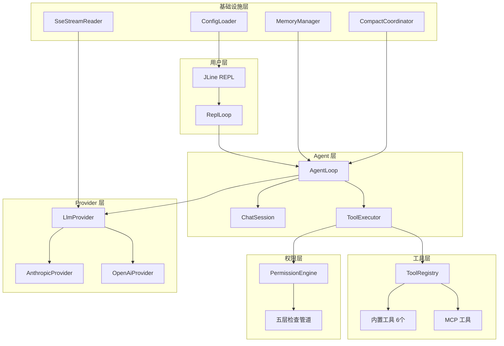
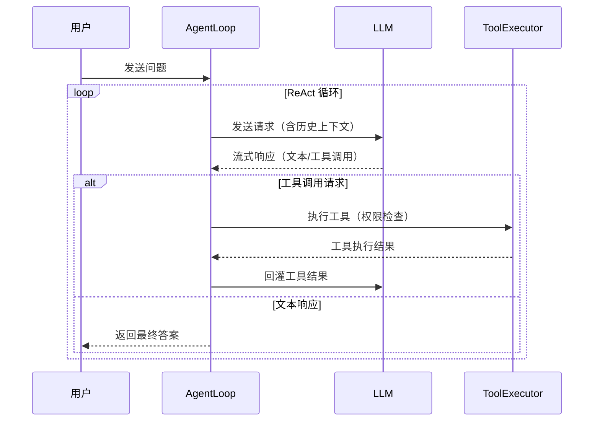
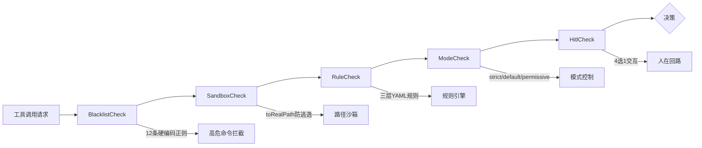
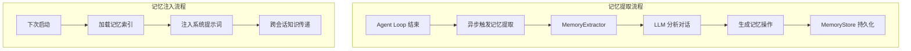

MapleCode 是一个极简的 Java 21 命令行 AI 对话工具，通过 SSE（Server-Sent Events）流式转发 Anthropic Claude 或 OpenAI Chat Completions 的响应。该项目在保持代码简洁性的同时，实现了完整的 AI Agent 能力，包括多轮对话记忆、工具调用、Agent Loop（模型自主循环调工具）以及企业级的安全权限系统。

## 核心价值主张

MapleCode 的核心价值在于**极简架构与强大功能的平衡**。作为一个单模块 Java 项目，它通过精心设计的抽象层实现了以下关键能力：

1. **多 Provider 统一接口**：通过 `LlmProvider` 接口抽象，支持 Anthropic Claude 和 OpenAI 两种主流 LLM 服务，切换仅需修改配置文件
2. **流式实时交互**：基于 SSE 的流式响应，提供类似 IDE 的实时交互体验
3. **智能 Agent 能力**：支持模型自主调用工具、分析结果、调整策略的完整 ReAct 循环
4. **企业级安全**：五层权限防御管道，从硬编码黑名单到人在回路（HITL）机制
5. **长期记忆系统**：跨会话的知识积累，自动分析对话并提取有价值信息

## 技术架构概览

MapleCode 采用**启动时一次性装配的单向数据流**架构，确保系统状态的可预测性和可测试性。整个系统围绕几个核心抽象构建：



### 核心抽象接口

系统的核心抽象定义在几个关键接口中：

| 接口 | 职责 | 设计特点 |
|------|------|----------|
| **LlmProvider** | LLM 服务统一接口 | 单一方法 `void stream(ChatRequest, Consumer<StreamChunk>)`，同步推送，无回调/future |
| **Tool** | 工具定义接口 | 非 sealed，支持测试 mock；定义 `name()`、`description()`、`inputSchema()`、`execute()` |
| **StreamChunk** | 流式响应块 | sealed 接口，8 种变体，保证新增 chunk 时所有 switch 必须更新 |
| **ContentBlock** | 消息内容块 | sealed 接口，支持文本、工具调用、工具结果三种内容类型 |

Sources: [LlmProvider.java](src/main/java/com/maplecode/provider/LlmProvider.java#L1-L12), [Tool.java](src/main/java/com/maplecode/tool/Tool.java#L1-L33)

## 技术栈与依赖

MapleCode 选择了一套**轻量级但功能完整**的技术栈，确保项目的可维护性和可移植性：

| 维度 | 选型 | 版本 | 设计理由 |
|------|------|------|----------|
| **Java** | OpenJDK | 21 LTS | 长期支持版本，支持虚拟线程等现代特性 |
| **构建** | Maven | 3.9+ | 单模块项目，依赖管理简单 |
| **TUI** | JLine | 3.27.0 | 成熟的 Java 终端交互库，支持行编辑、补全 |
| **HTTP** | JDK HttpClient | 内置 | 无需额外依赖，支持 HTTP/2 和异步流式响应 |
| **JSON** | Jackson | 2.17.2 | 高性能 JSON 处理，支持流式解析 |
| **YAML** | SnakeYAML | 2.3 | 配置文件解析，支持复杂嵌套结构 |
| **测试** | JUnit 5 | 5.11.3 | 现代测试框架，支持参数化测试、嵌套测试 |
| **Mock** | Mockito | 5.20.0 | 测试隔离，支持接口 mock |

**依赖精简策略**：项目仅包含 6 个直接依赖（4 个运行时 + 2 个测试），总 jar 包大小约 5MB，启动时间 < 1 秒。这种极简依赖策略降低了安全风险和维护成本。

Sources: [pom.xml](pom.xml#L1-L106)

## 核心功能特性

### 1. 多 Provider 支持

MapleCode 通过 `ProviderRegistry` 实现 Provider 的动态创建，支持两种主流 LLM 服务：

| Provider | 模型示例 | 特性支持 | 配置示例 |
|----------|----------|----------|----------|
| **Anthropic** | Claude Sonnet 4.6, Opus 4.7 | Extended Thinking, 自适应推理 | `protocol: anthropic` |
| **OpenAI** | GPT-4o | 标准流式响应 | `protocol: openai` |

**扩展性设计**：新增 Provider 只需实现 `LlmProvider` 接口并在 `ProviderRegistry.factories` 注册工厂，无需修改现有代码。当前架构已为未来的 Google Gemini、Mistral 等 Provider 预留了扩展点。

Sources: [AnthropicProvider.java](src/main/java/com/maplecode/provider/anthropic/AnthropicProvider.java#L1-L60), [OpenAiProvider.java](src/main/java/com/maplecode/provider/openai/OpenAiProvider.java#L1-L60)

### 2. Agent Loop 与工具系统

Agent Loop 是 MapleCode 的核心能力，实现了模型自主决策和执行的完整循环：



**内置工具集**（6 个核心工具）：

| 工具 | 功能 | 安全特性 |
|------|------|----------|
| `read_file` | 读取文件内容，支持行号显示和分页 | 路径沙箱限制 |
| `write_file` | 写入文件（覆盖） | 路径沙箱 + 权限检查 |
| `edit_file` | 精确替换文件中的文本 | 严格唯一匹配验证 |
| `exec` | 执行 shell 命令 | 黑名单 + 模式匹配 |
| `glob` | 按模式查找文件 | 相对路径匹配 |
| `grep` | 按正则表达式搜索代码内容 | 路径沙箱限制 |

**工具执行流程**：模型识别需要使用工具 → 权限系统检查（五层防御） → 自动执行工具 → 返回结果给模型 → 模型根据结果继续对话。

Sources: [AgentLoop.java](src/main/java/com/maplecode/agent/AgentLoop.java#L1-L282), [Tool.java](src/main/java/com/maplecode/tool/Tool.java#L1-L33)

### 3. 五层权限防御系统

MapleCode 实现了企业级的安全权限系统，所有工具调用都必须经过五层检查：



**权限模式**：

| 模式 | 行为 | 适用场景 |
|------|------|----------|
| **strict** | 未匹配规则直接拒绝 | 生产环境、高安全要求 |
| **default** | 未匹配走人在回路（HITL） | 开发环境（推荐） |
| **permissive** | 未匹配直接放行 | 测试环境、快速原型 |

**规则配置层级**（优先级从低到高）：
1. `~/.maplecode/permissions.yaml` - 用户全局规则
2. `<项目>/.maplecode/permissions.yaml` - 项目级规则（应入 git）
3. `<项目>/.maplecode/permissions.local.yaml` - 项目本地规则（应入 .gitignore）

Sources: [PermissionEngine.java](src/main/java/com/maplecode/permission/PermissionEngine.java#L1-L69)

### 4. 长期记忆系统

MapleCode 的记忆系统实现了跨会话的知识积累，每轮 Agent Loop 结束后异步调用 LLM 分析对话：



**记忆分类**：

| 范围 | 存储位置 | 用途 |
|------|----------|------|
| **user** | `~/.maplecode/memory/user/` | 跨项目共享的用户偏好、习惯 |
| **project** | `~/.maplecode/memory/project/` | 当前项目的特定知识、上下文 |

**自动管理**：系统支持自动新增、修改、删除记忆条目，确保知识库的时效性和准确性。

Sources: [MemoryManager.java](src/main/java/com/maplecode/memory/MemoryManager.java#L1-L120)

### 5. 上下文管理与压缩

为解决长对话的 token 限制问题，MapleCode 实现了智能的上下文管理：

```yaml
context_window: 200000          # 输入预算（默认 200000）
summarizer_model: claude-haiku-4-5  # 摘要专用模型（可选）
```

**压缩策略**：
- **自动触发**：当对话 token 数接近上下文窗口时自动压缩
- **手动触发**：使用 `/compact` 命令手动压缩
- **分层处理**：摘要旧消息 + offload 已执行的工具结果

**智能摘要**：使用专门的摘要模型（推荐 claude-haiku-4-5）生成结构化摘要，在保持关键信息的同时大幅减少 token 数量。

### 6. MCP 客户端集成

MapleCode 支持 Model Context Protocol (MCP)，可连接外部工具服务器，扩展工具能力：

**配置示例**（`mcp_servers.yaml`）：
```yaml
servers:
  github:
    type: stdio
    command: npx
    args: ["-y", "@modelcontextprotocol/server-github"]
    env:
      GITHUB_TOKEN: ${GITHUB_TOKEN}
  notion:
    type: http
    url: https://mcp.notion.example.com/mcp
    headers:
      Authorization: "Bearer ${NOTION_TOKEN}"
```

**工具命名空间**：MCP 工具使用 `mcp__<server>__<tool>` 命名空间，避免与内置工具冲突。所有 MCP 工具走完整权限管道，与内置工具一视同仁。

## 项目结构

MapleCode 采用**模块化包结构**，职责清晰，便于维护和扩展：

```
src/main/java/com/maplecode/
├── App.java                    # 主入口，一次性装配所有组件
├── agent/                      # Agent Loop 核心逻辑
│   ├── AgentLoop.java          # ReAct 循环实现
│   ├── AgentConfig.java        # 不可变配置
│   └── PlanMode.java           # 规划模式枚举
├── provider/                   # LLM Provider 抽象层
│   ├── LlmProvider.java        # 统一接口
│   ├── anthropic/              # Anthropic 实现
│   └── openai/                 # OpenAI 实现
├── tool/                       # 工具系统
│   ├── Tool.java               # 工具接口
│   ├── ToolRegistry.java       # 工具注册中心
│   └── ToolExecutor.java       # 工具执行器
├── permission/                 # 权限系统
│   ├── PermissionEngine.java   # 五层防御引擎
│   └── ...Check.java           # 各层检查实现
├── memory/                     # 长期记忆系统
│   ├── MemoryManager.java      # 记忆管理门面
│   └── MemoryStore.java        # 持久化存储
├── session/                    # 会话管理
│   └── ChatSession.java        # 会话状态
├── compact/                    # 上下文压缩
│   └── CompactCoordinator.java # 压缩协调器
├── command/                    # REPL 命令框架
├── prompt/                     # 系统提示词组装
├── config/                     # 配置加载与验证
├── http/                       # HTTP 基础设施
├── mcp/                        # MCP 客户端实现
├── ui/                         # 用户界面组件
└── error/                      # 异常层次结构
```

## 设计哲学与原则

### 1. 极简主义

- **单模块设计**：整个项目只有一个 Maven 模块，避免过度工程化
- **最小依赖**：仅 6 个直接依赖，总大小约 5MB
- **清晰抽象**：每个接口职责单一，实现类不超过 100 行

### 2. 安全第一

- **防御性编程**：五层权限检查，任何一层拒绝即终止
- **最小权限原则**：默认 strict 模式，显式授权优于隐式信任
- **审计友好**：所有工具调用都有完整日志，便于安全审计

### 3. 可测试性

- **依赖注入**：所有组件通过构造器注入，便于单元测试
- **接口抽象**：核心接口（LlmProvider, Tool）都支持 mock
- **隔离测试**：使用 `@TempDir` 等机制确保测试隔离

### 4. 渐进式复杂度

项目从 v1 到 v7.3 的演进体现了**渐进式复杂度**的设计理念：

| 版本 | 功能 | 复杂度 |
|------|------|--------|
| v1 | 流式 REPL | 低 |
| v2 | 工具系统 | 中 |
| v3 | Agent Loop | 中高 |
| v4 | 权限系统 | 高 |
| v5 | 系统提示词 + MCP | 高 |
| v6 | 上下文管理 | 高 |
| v7.1-7.3 | 记忆系统 + 会话归档 | 高 |

每个版本都在前一个版本的基础上增加功能，确保系统的稳定性和可维护性。

## 快速开始

### 环境要求

- Java 21 LTS
- Maven 3.9+
- Anthropic API Key 或 OpenAI API Key

### 构建与运行

```bash
# 1. 克隆项目
git clone <repository-url>
cd maple-code-java

# 2. 构建项目
mvn package

# 3. 配置 API Key
export ANTHROPIC_API_KEY=sk-ant-...  # 或 OPENAI_API_KEY

# 4. 运行程序
java -jar target/maple-code-java-0.1.0.jar
```

### 基础配置

复制示例配置文件：
```bash
cp maplecode.yaml.example maplecode.yaml
```

编辑 `maplecode.yaml`：
```yaml
protocol: anthropic            # 或 openai
model: claude-sonnet-4-6
base_url: https://api.anthropic.com
api_key: ${ANTHROPIC_API_KEY}
```

### 常用命令

进入 REPL 后，可以使用以下命令：

| 命令 | 功能 |
|------|------|
| `/tools` | 列出所有可用工具 |
| `/clear` | 清空对话历史 |
| `/compact` | 手动压缩上下文 |
| `/plan <query>` | 规划模式（只读工具） |
| `/mode [strict\|default\|permissive]` | 切换权限模式 |
| `/exit` | 退出程序 |

## 适用场景

MapleCode 特别适合以下场景：

1. **开发辅助**：代码审查、调试、重构建议
2. **文档生成**：自动生成代码文档、API 说明
3. **知识管理**：跨会话的知识积累和检索
4. **自动化脚本**：执行复杂的文件操作和系统命令
5. **学习研究**：探索 AI Agent 的设计模式和实现

## 局限性

当前版本明确不在范围内：

- 网络请求限制和资源配额
- 审计日志和合规性报告
- 规则 UI 编辑器
- 会话持久化与 `/resume`
- 运行时切换 Provider
- 多模态输入（图像、音频）
- 插件系统

这些功能可能在未来的版本中考虑实现。

## 下一步

基于项目概述，建议按以下顺序深入了解：

1. **[环境准备与快速开始](2-huan-jing-zhun-bei-yu-kuai-su-kai-shi)** - 详细的安装和配置指南
2. **[配置文件详解](3-pei-zhi-wen-jian-xiang-jie)** - 深入理解配置选项
3. **[基础使用指南](4-ji-chu-shi-yong-zhi-nan)** - 日常使用技巧和最佳实践
4. **[整体架构与数据流](5-zheng-ti-jia-gou-yu-shu-ju-liu)** - 技术架构的深入分析

对于希望贡献代码的开发者，建议重点关注：
- **[核心抽象与接口设计](6-he-xin-chou-xiang-yu-jie-kou-she-ji)** - 理解核心设计模式
- **[扩展性设计与插件机制](21-kuo-zhan-xing-she-ji-yu-cha-jian-ji-zhi)** - 了解如何扩展系统功能