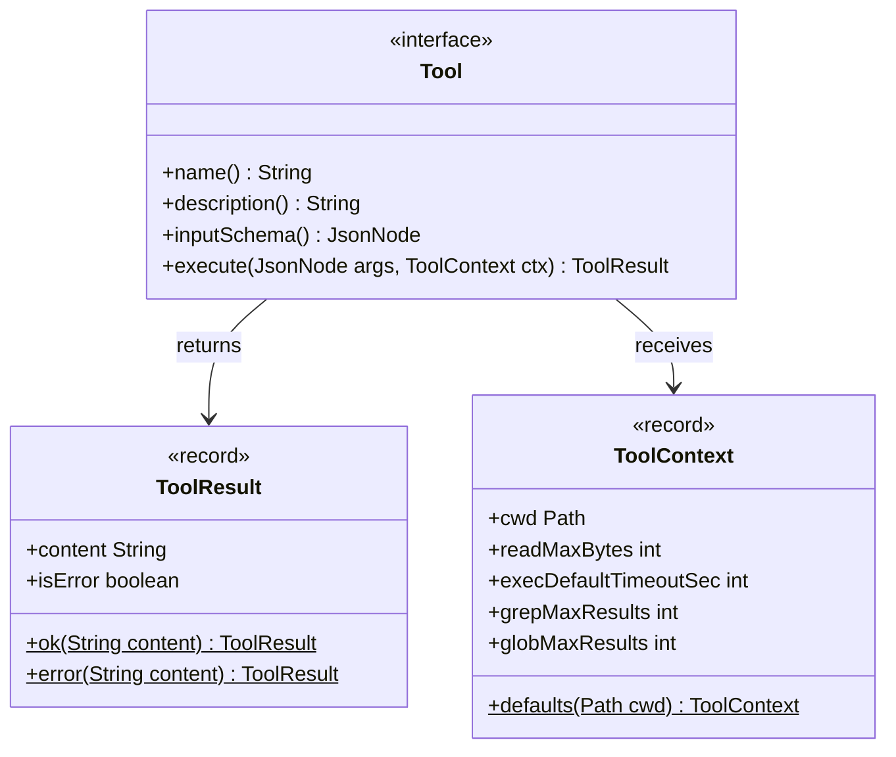
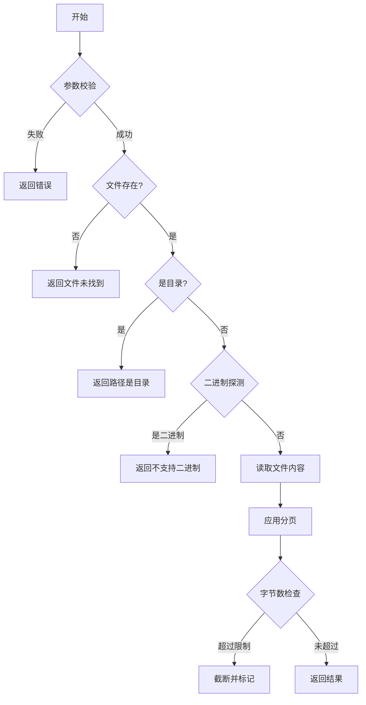
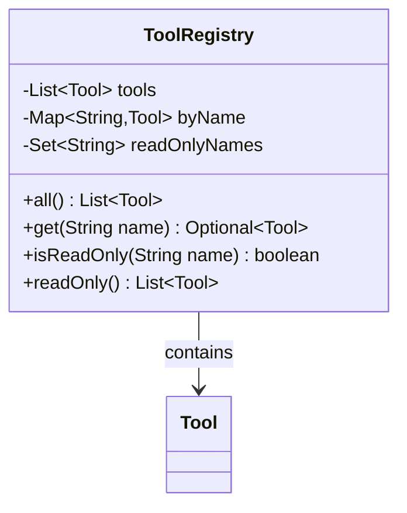
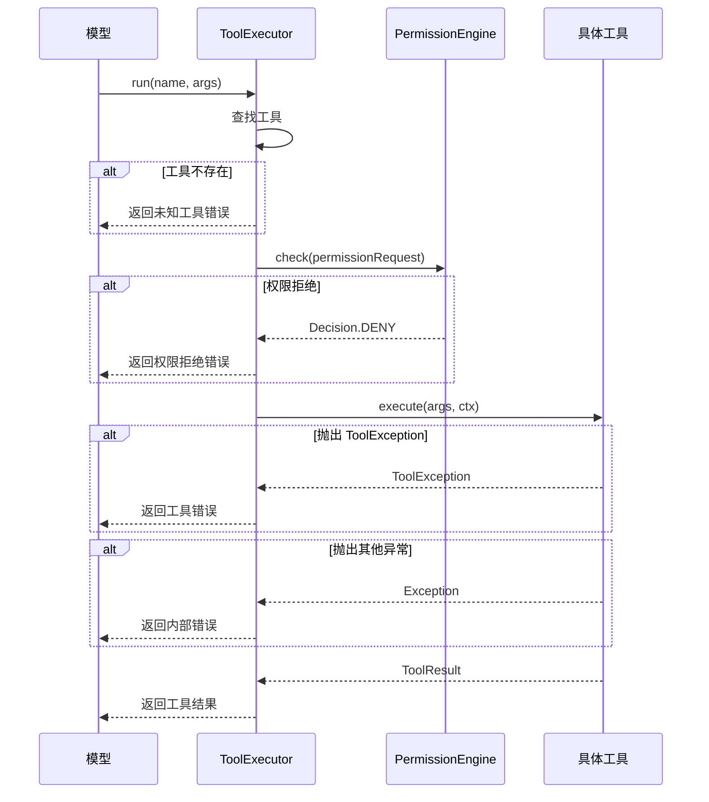
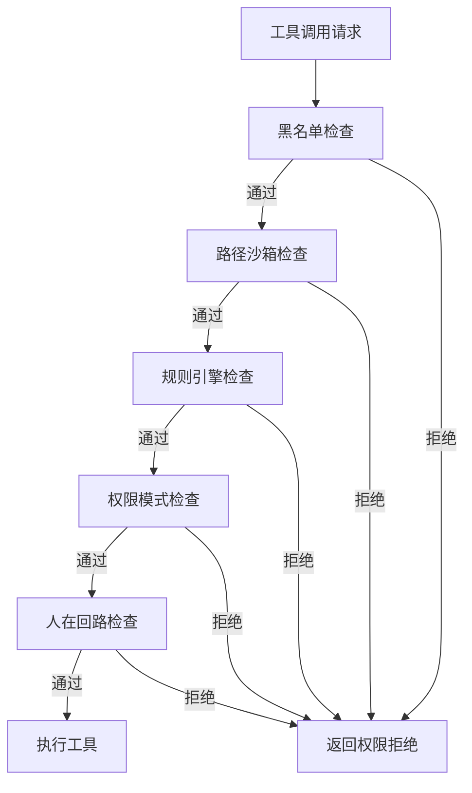

本页面详细阐述 MapleCode 的工具系统核心——Tool 接口的设计理念、内置工具的具体实现以及工具调用的完整生命周期。工具系统是 Agent Loop 的执行手臂，赋予模型与外部世界交互的能力。

## Tool 接口：统一的工具抽象

Tool 接口是整个工具系统的基石，它定义了所有工具必须遵守的契约。这个设计体现了**接口隔离原则**和**依赖倒置原则**，将工具的语义定义与执行机制完全解耦。



Tool 接口的四个方法各司其职：

1. **`name()`**：返回工具的唯一标识符，模型在 `tool_use` 块中使用此名称调用工具
2. **`description()`**：提供人类可读的描述，帮助模型理解工具的功能和使用场景
3. **`inputSchema()`**：返回 JSON Schema 格式的参数定义，Provider 会直接透传给 LLM，指导模型生成正确的参数
4. **`execute()`**：执行工具逻辑，接收 JSON 参数和执行上下文，返回 `ToolResult`

Sources: [Tool.java](src/main/java/com/maplecode/tool/Tool.java#L15-L32)

## ToolResult 与 ToolContext：执行结果与上下文

**ToolResult** 是一个简洁的记录类型，封装了工具执行的两种可能结果：成功或失败。其设计哲学是"绝不抛异常"——所有失败都被包成 `ToolResult(isError=true)`，确保工具调用链的稳定性。

**ToolContext** 则提供了工具执行所需的环境信息，包括当前工作目录和各种资源限制。这些限制由 REPL 在启动期构造，确保工具执行不会消耗过多系统资源。

| 上下文字段 | 默认值 | 说明 |
|-----------|--------|------|
| `cwd` | 当前目录 | 工具执行的基准路径 |
| `readMaxBytes` | 1,048,576 (1MB) | 读取文件的最大字节数 |
| `execDefaultTimeoutSec` | 30 | 命令执行的默认超时时间 |
| `grepMaxResults` | 100 | grep 搜索的最大结果数 |
| `globMaxResults` | 100 | glob 匹配的最大结果数 |

Sources: [ToolResult.java](src/main/java/com/maplecode/tool/ToolResult.java#L1-L10), [ToolContext.java](src/main/java/com/maplecode/tool/ToolContext.java#L1-L18)

## 六个内置工具详解

MapleCode 提供了六个精心设计的核心工具，覆盖了模型与文件系统、命令行交互的主要场景。这些工具分为两类：**只读工具**（read_file、glob、grep）和**写入工具**（write_file、edit_file、exec）。

### 1. ReadFileTool：安全的文件读取

ReadFileTool 是模型探索代码库的主要工具，它提供了带行号显示的文件内容读取，并内置了多重安全防护：

- **二进制文件检测**：读取前 8KB 内容，检测到空字节则拒绝读取
- **分页支持**：通过 `offset` 和 `limit` 参数支持大文件的部分读取
- **字节数截断**：防止输出过大消耗过多上下文窗口



Sources: [ReadFileTool.java](src/main/java/com/maplecode/tool/ReadFileTool.java#L12-L113)

### 2. ExecTool：受控的命令执行

ExecTool 允许模型执行 shell 命令，这是最强大但也最危险的工具。其实现体现了几个关键的安全设计：

- **超时控制**：默认 30 秒超时，防止长时间运行的命令阻塞
- **输出限制**：最大 50KB 输出，防止输出过大
- **异步读取**：使用独立线程读取 stdout，避免进程管道缓冲区满导致的死锁
- **强制终止**：超时后强制终止进程

```java
// 关键实现片段：异步读取避免死锁
Thread reader = new Thread(() -> {
    try (BufferedReader br = new BufferedReader(
            new InputStreamReader(process.getInputStream(), StandardCharsets.UTF_8))) {
        char[] buf = new char[4096];
        int n;
        while ((n = br.read(buf)) != -1) {
            synchronized (out) {
                out.append(buf, 0, n);
            }
        }
    } catch (Exception ignored) {}
}, "exec-reader");
```

Sources: [ExecTool.java](src/main/java/com/maplecode/tool/ExecTool.java#L10-L107)

### 3. GlobTool 与 GrepTool：代码搜索工具

这两个工具为模型提供了强大的代码搜索能力：

- **GlobTool**：按模式查找文件，支持 `**/*.java` 等通配符模式
- **GrepTool**：按正则表达式搜索代码内容，支持文件类型过滤和二进制文件跳过

两者都实现了结果截断机制，防止搜索结果过大：

| 工具 | 最大结果数 | 截断策略 |
|------|-----------|----------|
| GlobTool | 100 个文件 | 显示前 100 个，标记总数 |
| GrepTool | 100 行匹配 | 显示前 100 行，标记总数 |

Sources: [GlobTool.java](src/main/java/com/maplecode/tool/GlobTool.java#L16-L69), [GrepTool.java](src/main/java/com/maplecode/tool/GrepTool.java#L18-L105)

### 4. WriteFileTool 与 EditFileTool：文件修改工具

这两个工具负责文件的写入操作，但采用了不同的策略：

- **WriteFileTool**：覆盖写入整个文件，要求父目录必须存在
- **EditFileTool**：精确替换文件中的文本，要求 `old_string` 在文件中必须唯一匹配

EditFileTool 的唯一匹配要求是一个巧妙的设计，它：
1. 防止意外的多处替换
2. 鼓励模型提供足够的上下文来精确指定替换位置
3. 当匹配不唯一时，返回错误信息指导模型提供更多上下文

Sources: [WriteFileTool.java](src/main/java/com/maplecode/tool/WriteFileTool.java#L11-L53), [EditFileTool.java](src/main/java/com/maplecode/tool/EditFileTool.java#L11-L84)

## 工具注册与执行流程

工具系统的运行依赖于两个核心组件：ToolRegistry 和 ToolExecutor。

### ToolRegistry：工具的注册中心

ToolRegistry 负责管理所有可用的工具实例，它维护了三个关键数据结构：

1. **工具列表**：保持注册顺序的工具列表
2. **名称映射**：按名称快速查找工具的 HashMap
3. **只读标识**：记录哪些工具是只读的（默认为 read_file、glob、grep）



Sources: [ToolRegistry.java](src/main/java/com/maplecode/tool/ToolRegistry.java#L9-L48)

### ToolExecutor：带权限检查的执行器

ToolExecutor 是工具执行的入口点，它封装了权限检查和错误处理逻辑：



ToolExecutor 的关键设计决策：
1. **永不抛异常**：所有失败都包成 `ToolResult(isError=true)`
2. **权限前置**：在工具执行前进行权限检查
3. **上下文兜底**：如果没有提供 ToolContext，构造默认上下文

Sources: [ToolExecutor.java](src/main/java/com/maplecode/tool/ToolExecutor.java#L12-L56)

## MCP 工具集成：扩展工具生态

MapleCode 通过 MCP (Model Context Protocol) 支持外部工具服务器，实现了工具系统的可扩展性。McpToolAdapter 负责将 MCP 工具适配为标准的 Tool 接口：

```java
// 命名空间策略：mcp__<server>__<tool>
private static String synthName(String clientName, String toolName) {
    String server = clientName;
    if (server.startsWith("[") && server.endsWith("]"))
        server = server.substring(1, server.length() - 1);
    return "mcp__" + server + "__" + toolName;
}
```

McpToolAdapter 的适配策略：
1. **命名空间隔离**：使用 `mcp__<server>__<tool>` 格式避免命名冲突
2. **错误映射**：将 MCP 协议错误转换为标准的 ToolResult 错误
3. **超时控制**：30 秒调用超时，防止 MCP 服务器响应过慢
4. **异常处理**：处理连接丢失、协议错误、超时等异常情况

Sources: [McpToolAdapter.java](src/main/java/com/maplecode/mcp/adapter/McpToolAdapter.java#L18-L69)

## 权限系统集成：五层防御管道

所有工具调用（包括内置工具和 MCP 工具）都必须通过五层权限防御管道。ToolExecutor 在执行工具前会调用 PermissionEngine 进行检查：



RuleCheck 是规则引擎的核心实现，它根据工具类型提取不同的模式：
- **exec 工具**：提取 `command` 参数，使用 shell glob 匹配
- **文件工具**：提取 `path` 参数，使用标准 glob 匹配
- **搜索工具**：提取 `path` 参数（默认 "."）

Sources: [RuleCheck.java](src/main/java/com/maplecode/permission/RuleCheck.java#L7-L79)

## 工具系统的设计哲学

MapleCode 的工具系统体现了几个重要的设计原则：

1. **接口统一性**：所有工具（内置和 MCP）都实现相同的 Tool 接口，简化了工具管理和调用
2. **安全优先**：多重防护机制（二进制检测、超时控制、输出限制、权限检查）
3. **可扩展性**：通过 MCP 协议支持外部工具，通过 Tool 接口支持自定义工具
4. **错误韧性**：所有错误都被捕获并转换为结构化结果，不会中断 Agent Loop
5. **资源可控**：通过 ToolContext 限制资源使用，防止工具滥用系统资源

这种设计使得 MapleCode 能够安全、可靠地扩展模型的能力边界，同时保持系统的稳定性和可控性。

## 自定义工具开发指南

要添加自定义工具，只需实现 Tool 接口并在 App.java 中注册：

```java
// 1. 实现 Tool 接口
public class MyCustomTool implements Tool {
    @Override public String name() { return "my_tool"; }
    @Override public String description() { return "我的自定义工具"; }
    @Override public JsonNode inputSchema() { /* 定义参数 schema */ }
    @Override public ToolResult execute(JsonNode args, ToolContext ctx) { /* 实现逻辑 */ }
}

// 2. 在 App.java 中注册
List<Tool> builtins = List.of(
    new ReadFileTool(), new WriteFileTool(), new EditFileTool(),
    new ExecTool(), new GlobTool(), new GrepTool(),
    new MyCustomTool()  // 添加到这里
);
```

注意：App.java 中的集中注册确保了编译时就能发现工具重复或遗漏，这是一个实用的设计权衡。

## 下一步阅读

了解完工具接口和内置工具后，建议继续阅读：

- [ToolRegistry 与 ToolExecutor](11-toolregistry-yu-toolexecutor) - 深入了解工具的注册和执行机制
- [MCP 客户端集成](12-mcp-ke-hu-duan-ji-cheng) - 了解如何连接外部工具服务器
- [五层权限防御管道](13-wu-ceng-quan-xian-fang-yu-guan-dao) - 理解工具执行的安全保障
- [自定义工具开发](28-zi-ding-yi-gong-ju-kai-fa) - 学习如何开发自己的工具