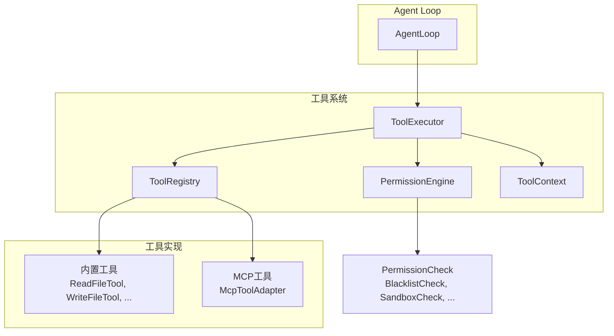
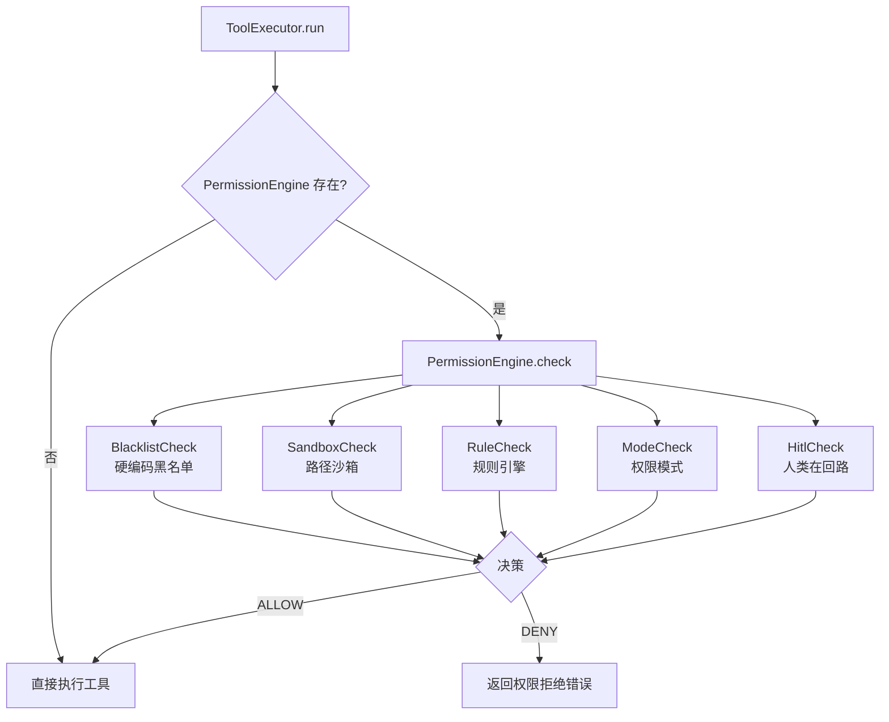
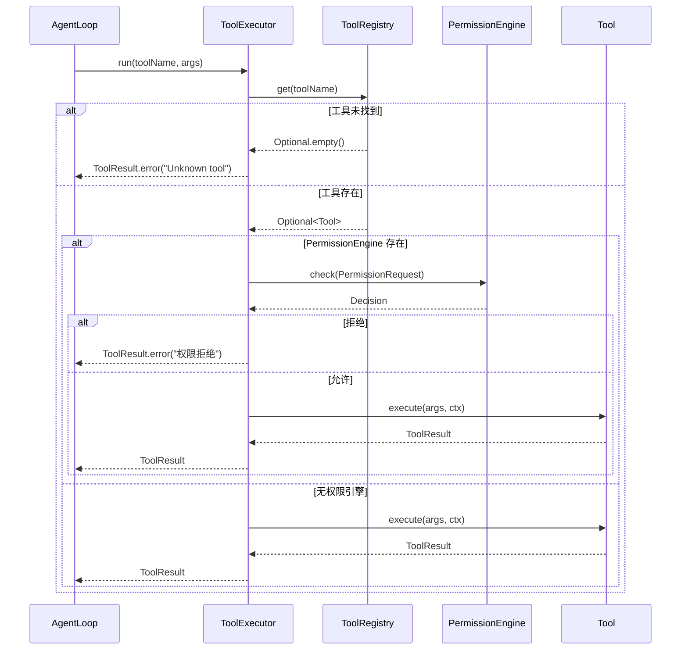

本文档详细介绍了 Maple Code 中工具系统的核心组件：**ToolRegistry** 和 **ToolExecutor**。这两个组件共同构成了工具注册、发现、权限控制和执行的基础设施，是 Agent 能力扩展的关键架构。

## 架构概览

工具系统采用分层架构设计，将工具注册、权限控制和执行逻辑解耦。ToolRegistry 负责工具的元数据管理，ToolExecutor 负责执行时的权限检查和异常处理，两者协同工作为 AgentLoop 提供安全的工具调用能力。



Sources: [AgentLoop.java](src/main/java/com/maplecode/agent/AgentLoop.java#L24-L282), [ToolRegistry.java](src/main/java/com/maplecode/tool/ToolRegistry.java#L1-L48), [ToolExecutor.java](src/main/java/com/maplecode/tool/ToolExecutor.java#L1-L57)

## 核心组件详解

### Tool 接口：统一的工具契约

`Tool` 接口是工具系统的基石，定义了所有工具必须遵循的统一契约。这个接口的设计体现了**接口隔离原则**，将工具的元数据、输入规范和执行逻辑清晰分离。

```java
public interface Tool {
    String name();                    // 工具名称，用于 tool_use 块
    String description();             // 模型看到的人类可读描述
    JsonNode inputSchema();           // 入参 JSON Schema，Provider 直接透传
    ToolResult execute(JsonNode args, ToolContext ctx);  // 执行工具
}
```

**设计要点**：
- **非 sealed 接口**：历史上曾为 sealed 接口，但因 Java sealed 不允许匿名类实现，阻碍测试用具名 mock，故改为非 sealed。工具的 6 个具体类仍在 App.java 中集中注册（新增工具时编译失败提醒）
- **JSON Schema 支持**：`inputSchema()` 返回 JSON Schema 格式的定义，Provider 可直接透传给 LLM
- **异常约定**：实现应抛 `ToolException` 表示已知错误；抛其它 Exception 视为 bug

Sources: [Tool.java](src/main/java/com/maplecode/tool/Tool.java#L1-L33)

### ToolRegistry：工具注册与发现中心

ToolRegistry 是工具的注册中心，负责管理所有可用工具、提供查找能力，并维护只读工具集合。它采用**不可变集合**设计，确保线程安全。

```java
public final class ToolRegistry {
    private static final Set<String> READ_ONLY_DEFAULT = Set.of("read_file", "glob", "grep");
    
    private final List<Tool> tools;          // 所有工具列表
    private final Map<String, Tool> byName;  // 名称到工具的映射
    private final Set<String> readOnlyNames; // 只读工具名称集合
    
    public ToolRegistry(List<Tool> tools) { ... }
    public ToolRegistry(List<Tool> tools, Set<String> readOnlyNames) { ... }
    
    public List<Tool> all();                 // 获取所有工具
    public Optional<Tool> get(String name);  // 按名称查找工具
    public boolean isReadOnly(String name);  // 判断是否只读工具
    public List<Tool> readOnly();            // 获取只读工具列表
}
```

**关键特性**：
1. **重复名称检测**：构造时检查工具名称唯一性，防止运行时冲突
2. **只读工具分类**：默认将 `read_file`、`glob`、`grep` 标记为只读，支持自定义
3. **不可变集合**：内部使用 `List.copyOf()` 和 `Set.copyOf()` 确保线程安全

Sources: [ToolRegistry.java](src/main/java/com/maplecode/tool/ToolRegistry.java#L1-L48)

### ToolExecutor：安全执行引擎

ToolExecutor 是工具执行的核心引擎，封装了权限检查、异常处理和上下文管理。它遵循**单一职责原则**，专注于工具执行的安全性和可靠性。

```java
public final class ToolExecutor {
    private final ToolRegistry registry;
    private final PermissionEngine engine;  // 可为 null
    
    public ToolExecutor(ToolRegistry registry) { ... }
    public ToolExecutor(ToolRegistry registry, PermissionEngine engine) { ... }
    
    public ToolResult run(String name, JsonNode args) { ... }
}
```

**执行流程**：
1. **工具查找**：从 ToolRegistry 按名称查找工具，未找到返回错误
2. **权限检查**：如果存在 PermissionEngine，进行权限检查
3. **上下文创建**：创建默认 ToolContext（cwd = user.dir）
4. **工具执行**：调用工具的 execute 方法
5. **异常处理**：捕获所有异常并转换为 ToolResult.error

**设计保证**：
- **绝不抛异常**：所有失败都包成 `ToolResult(isError=true)`
- **权限集成**：与 PermissionEngine 无缝集成，支持五层权限防御
- **向后兼容**：提供单参数构造函数，兼容无权限场景

Sources: [ToolExecutor.java](src/main/java/com/maplecode/tool/ToolExecutor.java#L1-L57)

### ToolContext 与 ToolResult：执行上下文与结果

**ToolContext** 封装了工具执行所需的环境参数，采用 Java record 实现不可变性：

```java
public record ToolContext(
    Path cwd,                    // 工作目录
    int readMaxBytes,            // 文件读取最大字节数（默认 1MB）
    int execDefaultTimeoutSec,   // 命令执行超时（默认 30 秒）
    int grepMaxResults,          // grep 最大结果数（默认 100）
    int globMaxResults           // glob 最大结果数（默认 100）
) {
    public static ToolContext defaults(Path cwd) { ... }
}
```

**ToolResult** 是工具执行的返回值，采用简单的 record 设计：

```java
public record ToolResult(String content, boolean isError) {
    public static ToolResult ok(String content) { ... }
    public static ToolResult error(String content) { ... }
}
```

Sources: [ToolContext.java](src/main/java/com/maplecode/tool/ToolContext.java#L1-L19), [ToolResult.java](src/main/java/com/maplecode/tool/ToolResult.java#L1-L11)

## 工具系统集成

### 内置工具实现

Maple Code 提供 6 个内置工具，覆盖文件操作、搜索和命令执行等核心能力：

| 工具名称 | 类型 | 功能描述 | 权限级别 |
|---------|------|---------|---------|
| `read_file` | 只读 | 读取文本文件，支持行号和分页 | 自动放行 |
| `write_file` | 写入 | 写入文件内容（覆盖） | 需要确认 |
| `edit_file` | 写入 | 替换文件中的唯一字符串 | 需要确认 |
| `exec` | 执行 | 运行 shell 命令 | 需要确认 |
| `glob` | 只读 | 查找匹配 glob 模式的文件 | 自动放行 |
| `grep` | 只读 | 正则表达式搜索文件内容 | 自动放行 |

**ReadFileTool 实现示例**：
```java
public final class ReadFileTool implements Tool {
    @Override
    public String name() { return "read_file"; }
    
    @Override
    public String description() {
        return "Read a text file. Returns lines with line numbers. "
            + "Use offset (0-indexed) and limit to read parts of large files.";
    }
    
    @Override
    public JsonNode inputSchema() {
        // 返回 JSON Schema 定义
    }
    
    @Override
    public ToolResult execute(JsonNode args, ToolContext ctx) {
        // 实现文件读取逻辑，包括二进制探测、行号格式化、字节数截断
    }
}
```

Sources: [ReadFileTool.java](src/main/java/com/maplecode/tool/ReadFileTool.java#L1-L114), [WriteFileTool.java](src/main/java/com/maplecode/tool/WriteFileTool.java#L1-L54), [ExecTool.java](src/main/java/com/maplecode/tool/ExecTool.java#L1-L108)

### MCP 工具适配

MCP (Model Context Protocol) 工具通过 `McpToolAdapter` 适配为本地工具，实现协议转换和异常处理：

```java
public final class McpToolAdapter {
    public static Tool of(McpClient client, McpToolDesc desc) {
        String synthetic = synthName(client.name(), desc.name());
        String description = desc.description();
        JsonNode schema = desc.inputSchema();
        
        return new Tool() {
            @Override public String name() { return synthetic; }
            // ... 其他方法实现
            
            @Override
            public ToolResult execute(JsonNode args, ToolContext ctx) {
                try {
                    McpCallResult r = client.callToolFuture(desc.name(), args)
                        .get(30, TimeUnit.SECONDS);
                    return r.isError() ? ToolResult.error(r.text()) : ToolResult.ok(r.text());
                } catch (TimeoutException e) {
                    return ToolResult.error("mcp[" + client.name() + ":" + desc.name() + "] call timed out");
                } catch (ExecutionException e) {
                    // 处理各种 MCP 异常
                }
            }
        };
    }
    
    private static String synthName(String clientName, String toolName) {
        return "mcp__" + server + "__" + toolName;
    }
}
```

**MCP 工具命名规范**：`mcp__{serverName}__{toolName}`，确保与内置工具不冲突。

Sources: [McpToolAdapter.java](src/main/java/com/maplecode/mcp/adapter/McpToolAdapter.java#L1-L70)

### 权限系统集成

ToolExecutor 与 PermissionEngine 深度集成，实现五层权限防御管道：



**权限检查顺序**：
1. **BlacklistCheck**：12 条硬编码正则黑名单，仅拦截 exec 工具
2. **SandboxCheck**：路径沙箱，拒绝逃逸沙箱根目录的文件系统工具
3. **RuleCheck**：规则引擎，匹配用户配置的权限规则
4. **ModeCheck**：权限模式，STRICT/PERMISSIVE/DEFAULT 模式决策
5. **HitlCheck**：人类在回路，交互式权限确认

Sources: [PermissionEngine.java](src/main/java/com/maplecode/permission/PermissionEngine.java#L1-L69), [BlacklistCheck.java](src/main/java/com/maplecode/permission/BlacklistCheck.java#L1-L47), [SandboxCheck.java](src/main/java/com/maplecode/permission/SandboxCheck.java#L1-L75)

## 执行流程详解

### AgentLoop 中的工具调用

AgentLoop 是工具调用的入口，它实现了工具的分批执行策略：

```java
// AgentLoop 中的工具调用流程
public void run(String userInput, Consumer<AgentEvent> sink) {
    // 1. PLAN 模式下创建只读 executor
    final ToolExecutor effectiveExecutor;
    if (config.planMode() == PlanMode.PLAN) {
        var readOnlyReg = new ToolRegistry(
            registry.all().stream()
                .filter(t -> registry.isReadOnly(t.name()))
                .toList());
        effectiveExecutor = new ToolExecutor(readOnlyReg);
    } else {
        effectiveExecutor = executor;
    }
    
    // 2. 工具调用分批执行
    var batch = Batch.partition(col.toolUses(), registry);
    
    // 3. 安全工具：并行执行
    batch.safe().parallelStream().forEach(u -> {
        var r = executeOne(u, effectiveExecutor);
        // 处理结果
    });
    
    // 4. 非安全工具：串行执行
    for (var u : batch.unsafe()) {
        var r = executeOne(u, effectiveExecutor);
        // 处理结果
    }
}
```

**分批策略**：
- **安全工具**（只读）：`read_file`、`glob`、`grep` → 并行执行
- **非安全工具**（有副作用）：`write_file`、`edit_file`、`exec` → 串行执行

Sources: [AgentLoop.java](src/main/java/com/maplecode/agent/AgentLoop.java#L82-L270), [Batch.java](src/main/java/com/maplecode/agent/Batch.java#L1-L29)

### 完整执行时序



## 测试与调试

### 测试策略

工具系统采用多层次的测试策略：

1. **单元测试**：每个工具类的独立测试
   - `ReadFileToolTest.java`：测试文件读取、分页、二进制检测
   - `WriteFileToolTest.java`：测试文件写入、目录创建
   - `EditFileToolTest.java`：测试字符串替换、唯一性检查

2. **集成测试**：ToolRegistry 和 ToolExecutor 的集成测试
   - `ToolRegistryTest.java`：测试工具注册、查找、只读分类
   - `ToolExecutorTest.java`：测试执行流程、异常处理
   - `ToolExecutorPermissionTest.java`：测试权限集成

3. **MCP 工具测试**：McpToolAdapter 的适配测试
   - `McpToolAdapterTest.java`：测试协议转换、异常处理
   - `McpToolRegistryCollisionTest.java`：测试名称冲突检测

4. **权限测试**：权限管道的完整测试
   - `PermissionEngineTest.java`：测试权限引擎
   - `BlacklistCheckTest.java`：测试黑名单规则
   - `SandboxCheckTest.java`：测试路径沙箱

Sources: [ReadFileToolTest.java](src/test/java/com/maplecode/tool/ReadFileToolTest.java), [ToolExecutorTest.java](src/test/java/com/maplecode/tool/ToolExecutorTest.java), [PermissionEngineTest.java](src/test/java/com/maplecode/permission/PermissionEngineTest.java)

### 调试技巧

1. **工具列表查看**：使用 `/tools` 命令查看所有可用工具
2. **权限调试**：查看权限模式和规则配置
3. **日志分析**：关注 `[mcp]`、`[permission]` 等日志标签
4. **异常追踪**：ToolExecutor 会捕获所有异常并转换为 ToolResult.error

## 扩展指南

### 添加新工具

1. **实现 Tool 接口**：
```java
public final class MyTool implements Tool {
    @Override public String name() { return "my_tool"; }
    @Override public String description() { return "我的工具描述"; }
    @Override public JsonNode inputSchema() { /* JSON Schema */ }
    @Override public ToolResult execute(JsonNode args, ToolContext ctx) { /* 实现 */ }
}
```

2. **注册到 App.java**：
```java
List<Tool> builtins = List.of(
    new ReadFileTool(), new WriteFileTool(), new EditFileTool(),
    new ExecTool(), new GlobTool(), new GrepTool(),
    new MyTool()  // 新增工具
);
```

3. **配置权限规则**（如需要）：
```yaml
# permissions.yaml
rules:
  - tool: my_tool
    pattern: "*"
    action: allow
```

### 自定义 MCP 工具

1. **配置 MCP 服务器**：
```yaml
# mcp_servers.yaml
servers:
  - name: my-server
    command: ["node", "server.js"]
    args: ["--port", "8080"]
    enabled: true
```

2. **实现 MCP 服务器**：遵循 MCP 协议实现工具描述和调用

3. **自动适配**：McpToolAdapter 会自动将 MCP 工具适配为本地工具

## 最佳实践

1. **工具设计原则**：
   - 单一职责：每个工具只做一件事
   - 明确错误：使用 ToolException 报告已知错误
   - 安全第一：遵循最小权限原则

2. **权限配置**：
   - 只读工具：自动放行，无需配置
   - 写入工具：根据项目需求配置规则
   - 敏感操作：启用 HITL 确认

3. **性能优化**：
   - 利用安全工具并行执行
   - 设置合理的超时和限制
   - 避免不必要的文件系统操作

4. **测试覆盖**：
   - 正常路径测试
   - 边界条件测试
   - 异常情况测试
   - 权限场景测试

## 相关文档

- [Tool 接口与内置工具](10-tool-jie-kou-yu-nei-zhi-gong-ju)：了解 Tool 接口设计和内置工具实现
- [MCP 客户端集成](12-mcp-ke-hu-duan-ji-cheng)：深入了解 MCP 协议集成
- [五层权限防御管道](13-wu-ceng-quan-xian-fang-yu-guan-dao)：理解权限系统架构
- [Agent Loop 实现](16-agent-loop-shi-xian)：了解工具调用在 Agent 循环中的集成
- [自定义工具开发](28-zi-ding-yi-gong-ju-kai-fa)：开发自定义工具的详细指南