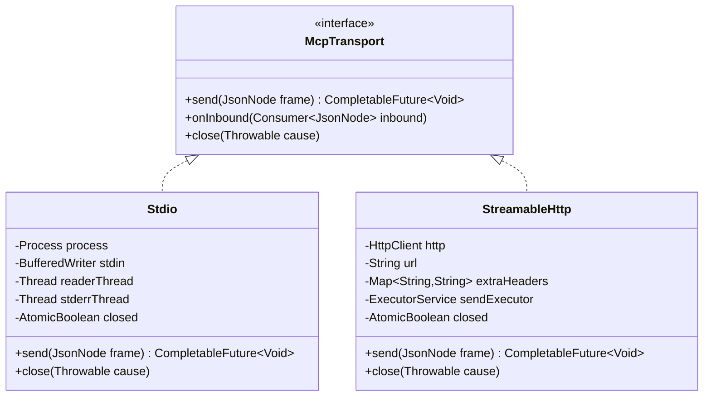
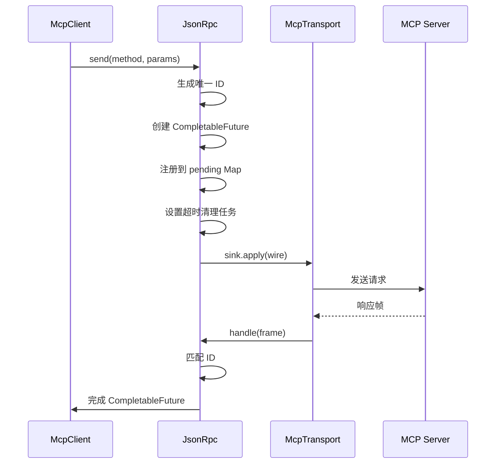

## 架构概述与设计目标

MapleCode 的 MCP（Model Context Protocol）客户端集成是一个分层架构系统，旨在将外部工具服务器无缝集成到现有工具生态系统中。该系统的核心设计目标是：**让外部 MCP 服务器提供的工具在模型视角中与内置工具完全一致**，同时保持架构的清晰边界和模块化。

从架构角度看，MCP 客户端集成形成了一个完整的管道：配置加载 → 传输层建立 → 协议握手 → 工具发现 → 适配转换 → 工具注册。这个管道的关键特性是**故障隔离**——单个 MCP 服务器的启动失败不会影响其他服务器或系统核心功能。

Sources: [McpClientBootstrap.java](src/main/java/com/maplecode/mcp/client/McpClientBootstrap.java#L19-L24), [McpServerConfigLoader.java](src/main/java/com/maplecode/mcp/config/McpServerConfigLoader.java#L16-L32)

## 配置管理与三层合并机制

MCP 服务器配置采用**三层合并策略**，实现了从全局共享到项目特定再到本地开发的灵活配置管理。配置文件按优先级从低到高依次为：

| 配置层 | 文件路径 | 用途 | 版本控制建议 |
|--------|----------|------|--------------|
| 用户全局 | `~/.maplecode/mcp_servers.yaml` | 跨项目共享的常用服务器配置 | 不入库 |
| 项目级 | `<项目>/.maplecode/mcp_servers.yaml` | 项目特定的必需服务器配置 | 应入 git |
| 项目本地 | `<项目>/.maplecode/mcp_servers.local.yaml` | 本地开发覆盖或调试配置 | 应入 .gitignore |

这种设计遵循了**配置分层原则**：高级配置可以覆盖低级配置，同时支持子 map 的深度合并（deep-merge）。环境变量通过 `${ENV_VAR}` 语法支持动态展开，增强了配置的安全性和可移植性。

Sources: [McpServerConfigLoader.java](src/main/java/com/maplecode/mcp/config/McpServerConfigLoader.java#L20-L32), [maplecode.yaml.example](maplecode.yaml.example#L37-L57)

## 传输层抽象与实现

传输层通过 `McpTransport` 接口实现了统一的通信抽象，将传输细节与协议语义完全解耦。当前支持两种传输实现：



**Stdio 传输**通过子进程管理实现，将 JSON-RPC 帧写入子进程的 stdin，并从 stdout 读取响应行。关键设计包括：
- 行分隔的 JSON 格式简化了解析
- 独立的 stderr 重定向线程支持日志收集和错误诊断
- 强制进程销毁确保资源清理

**StreamableHttp 传输**基于 Java 的 `HttpClient` 实现，支持 SSE（Server-Sent Events）和单帧 JSON 响应。其特性包括：
- 自动捕获和传递 `Mcp-Session-Id` 头
- 单线程发送执行器避免并发问题
- 支持自定义请求头和环境变量展开

Sources: [McpTransport.java](src/main/java/com/maplecode/mcp/transport/McpTransport.java#L1-L22), [Stdio.java](src/main/java/com/maplecode/mcp/transport/Stdio.java#L20-L43), [StreamableHttp.java](src/main/java/com/maplecode/mcp/transport/StreamableHttp.java#L21-L42)

## JSON-RPC 协议层实现

`JsonRpc` 类实现了异步配对器模式，将 JSON-RPC 请求与响应通过 ID 进行匹配。核心机制包括：



关键设计决策包括：
- **超时管理**：每个请求独立超时，默认超时时间为配置值
- **错误分类**：区分连接异常（`McpConnectionException`）、协议异常（`McpProtocolException`）和超时异常（`McpTimeoutException`）
- **并发安全**：使用 `ConcurrentHashMap` 管理待处理请求，支持安全的并发访问
- **资源清理**：关闭时通知所有待处理请求失败，防止资源泄漏

Sources: [JsonRpc.java](src/main/java/com/maplecode/mcp/rpc/JsonRpc.java#L19-L39), [JsonRpc.java](src/main/java/com/maplecode/mcp/rpc/JsonRpc.java#L43-L78)

## MCP 客户端核心功能

`McpClient` 类封装了与 MCP 服务器交互的核心逻辑，提供三大核心功能：

1. **协议握手**：执行 `initialize` 方法进行 JSON-RPC 握手，验证协议版本和服务器能力
2. **工具发现**：通过 `cachedTools()` 方法获取并缓存服务器提供的工具列表
3. **工具调用**：通过 `callToolFuture()` 方法异步调用远程工具，支持异步结果处理

协议握手过程严格遵循 MCP 规范：
- 支持的协议版本：`2024-11-05`、`2025-03-26`、`2025-06-18`
- 验证服务器能力包含 `tools` 特性
- 成功握手后发送 `notifications/initialized` 通知

工具调用结果的提取采用**内容类型分派策略**：
- `text` 类型：直接提取文本内容
- `image`、`audio` 类型：生成占位符描述，避免传输大量二进制数据
- `resource` 类型：记录嵌入资源 URI
- 其他类型：记录未知类型标记

Sources: [McpClient.java](src/main/java/com/maplecode/mcp/client/McpClient.java#L17-L39), [McpClient.java](src/main/java/com/maplecode/mcp/client/McpClient.java#L44-L67), [McpClient.java](src/main/java/com/maplecode/mcp/client/McpClient.java#L91-L104)

## 工具适配与命名空间管理

`McpToolAdapter` 类负责将 MCP 服务器提供的工具适配到 MapleCode 的 `Tool` 接口。适配过程遵循严格的命名空间规则：

**工具命名模式**：`mcp__<server>__<tool>`

这种命名设计实现了：
- **命名冲突避免**：通过 `mcp__` 前缀与内置工具区分
- **来源标识**：通过 `<server>` 标识工具来源服务器
- **模型兼容性**：清晰的命名有助于模型理解工具来源

适配过程的关键特性：
1. **透明错误映射**：将各种 MCP 异常转换为 `ToolResult.error()`
2. **超时控制**：单次调用 30 秒超时，防止长时间阻塞
3. **异常分类处理**：区分连接、协议、超时等不同异常类型
4. **中断处理**：正确处理线程中断，避免资源泄漏

Sources: [McpToolAdapter.java](src/main/java/com/maplecode/mcp/adapter/McpToolAdapter.java#L18-L39), [McpToolAdapter.java](src/main/java/com/maplecode/mcp/adapter/McpToolAdapter.java#L62-L67)

## 启动流程与故障隔离

`McpClientBootstrap` 类实现了并发启动机制，确保多个 MCP 服务器的高效启动和故障隔离：

```mermaid
flowchart TD
    A[启动配置加载] --> B[过滤启用服务器]
    B --> C[并发启动所有服务器]
    C --> D{单个服务器启动}
    D --> E[创建传输层]
    E --> F[协议握手]
    F --> G[工具发现]
    G --> H[缓存工具列表]
    H --> I[返回 McpClient]
    
    D --> J{失败处理}
    J --> K[记录警告日志]
    K --> L[返回 null]
    
    C --> M[等待全局超时]
    M --> N[收集成功客户端]
    N --> O[返回 Map<name, client>}
```

关键设计决策：
- **并发启动**：每个服务器独立线程启动，最大化启动效率
- **独立超时**：单个服务器启动失败不影响其他服务器
- **全局截止时间**：所有服务器启动的 wall-clock 上限
- **优雅降级**：失败服务器记录警告后跳过，系统继续运行

Sources: [McpClientBootstrap.java](src/main/java/com/maplecode/mcp/client/McpClientBootstrap.java#L25-L47), [McpClientBootstrap.java](src/main/java/com/maplecode/mcp/client/McpClientBootstrap.java#L49-L78)

## 系统集成与生命周期管理

MCP 客户端集成到 MapleCode 主应用的流程体现了**依赖注入**和**生命周期管理**的最佳实践：

1. **配置阶段**：加载三层配置，过滤启用服务器
2. **启动阶段**：并发启动 MCP 客户端，记录启动结果
3. **注册阶段**：将 MCP 工具适配后注册到 `ToolRegistry`
4. **运行阶段**：工具通过标准权限管道执行
5. **关闭阶段**：通过 shutdown hook 确保资源清理

关键集成点：
- **工具注册**：MCP 工具与内置工具统一注册，对模型完全透明
- **权限集成**：所有 MCP 工具调用都经过完整的权限检查管道
- **错误报告**：启动失败记录详细警告，帮助用户诊断配置问题
- **资源清理**：进程退出时自动关闭所有 MCP 连接

Sources: [App.java](src/main/java/com/maplecode/App.java#L75-L102), [App.java](src/main/java/com/maplecode/App.java#L109-L122), [App.java](src/main/java/com/maplecode/App.java#L152-L158)

## 配置示例与最佳实践

以下是一个完整的 MCP 服务器配置示例，展示了不同传输类型的配置方式：

```yaml
servers:
  # GitHub MCP 服务器 - stdio 传输
  github:
    type: stdio
    command: npx
    args: ["-y", "@modelcontextprotocol/server-github"]
    env:
      GITHUB_TOKEN: ${GITHUB_TOKEN}
    enabled: true
  
  # Notion MCP 服务器 - HTTP 传输
  notion:
    type: http
    url: https://mcp.notion.example.com/mcp
    headers:
      Authorization: "Bearer ${NOTION_TOKEN}"
      Accept: "application/json"
    enabled: true
  
  # 本地开发服务器 - HTTP 传输（调试用）
  local-dev:
    type: http
    url: http://localhost:3000/mcp
    enabled: false  # 开发时启用，提交时禁用
```

**最佳实践建议**：
1. **环境变量管理**：敏感信息使用 `${ENV_VAR}` 语法，避免硬编码
2. **服务器命名**：使用小写字母、数字和连字符，长度不超过 32 字符
3. **配置分层**：项目配置入库，本地配置加入 .gitignore
4. **故障诊断**：检查 stderr 日志（格式：`[mcp:<server>:stderr] `）

Sources: [McpServerSpec.java](src/main/java/com/maplecode/mcp/config/McpServerSpec.java#L9-L16), [maplecode.yaml.example](maplecode.yaml.example#L37-L57)

## 扩展性设计与未来方向

当前 MCP 客户端集成的设计为未来扩展预留了清晰的接口：

1. **传输层扩展**：新增传输类型只需实现 `McpTransport` 接口
2. **协议版本支持**：`SUPPORTED_PROTOCOL_VERSIONS` 集合可轻松扩展
3. **能力发现**：当前仅验证 `tools` 能力，未来可扩展资源、提示词等能力
4. **重连机制**：`McpClient` 可扩展重连逻辑，增强连接稳定性
5. **健康检查**：可添加服务器健康状态监控和自动恢复机制

设计决策明确排除了某些功能以保持系统简洁：
- 不实现 MCP 资源/提示词/采样能力
- 不实现服务器健康检查和自动重连
- 不处理服务器到客户端的通知
- 不实现 OAuth 认证，仅支持静态头部配置

这种**有界上下文**设计确保了系统的可维护性和可测试性，同时为未来的功能扩展提供了明确的边界。