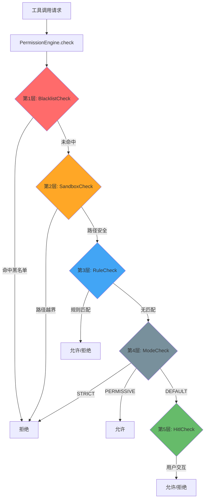
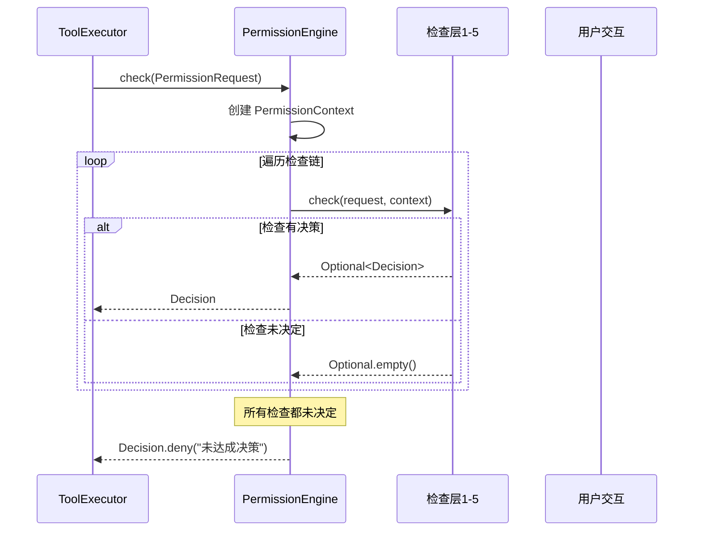

MapleCode 的权限系统采用**纵深防御（Defense in Depth）**策略，通过五层管道式检查机制，从硬编码黑名单到人在回路（HITL），为 AI 工具调用提供精细化的访问控制。这种设计确保在任何单点被绕过时，后续层仍能提供安全防护。

## 架构概览

权限系统的核心是 `PermissionEngine`，它持有一个有序的检查链（`List<PermissionCheck>`），对每个工具调用请求进行逐层审查。**第一个返回非空决策的检查将终止管道**，实现短路求值语义。



Sources: [PermissionEngine.java](src/main/java/com/maplecode/permission/PermissionEngine.java#L13-L68)

## 五层检查详解

### 第1层：BlacklistCheck - 硬编码黑名单

**防御目标**：拦截高危系统命令，防止灾难性破坏。

这是最严格的一层，使用12条硬编码正则表达式规则，**仅针对 `exec` 工具**。规则覆盖：
- **文件系统破坏**：`rm -rf /`、`mkfs`、`dd if=/dev/zero`
- **权限提升**：`sudo`、`chmod 777`
- **恶意代码**：fork 炸弹、`curl | sh`、`eval $()`
- **系统操作**：`shutdown`、`reboot`

```java
// 硬编码黑名单规则示例
rule("\\brm\\s+(-[a-zA-Z]*f[a-zA-Z]*\\s+)?-r?f?\\s+/(\\s|$|;|\\|)", "删除根目录"),
rule(":\\(\\)\\s*\\{\\s*:\\|", "fork 炸弹"),
rule("\\bsudo\\b", "不允许使用 sudo")
```

**特点**：不可配置、不可绕过，提供基础安全底线。

Sources: [BlacklistCheck.java](src/main/java/com/maplecode/permission/BlacklistCheck.java#L7-L46)

### 第2层：SandboxCheck - 路径沙箱

**防御目标**：防止文件系统工具逃逸工作目录。

针对文件系统工具（`read_file`、`write_file`、`edit_file`、`glob`、`grep`）实施路径沙箱控制：

| 工具类型 | 检查方式 | 特殊处理 |
|---------|---------|---------|
| `read_file`/`write_file`/`edit_file` | `Path.toRealPath()` 解析 symlink | 防止符号链接逃逸 |
| `glob`/`grep` | `Path.normalize()` | 模式不是真实路径 |
| `exec` | 完全跳过 | 不是路径工具 |

**关键安全特性**：
- 解析符号链接后检查，防止 symlink 逃逸
- 规范化路径后检查，防止 `../` 遍历
- 不存在的路径返回未决定（让工具层报告文件未找到）

Sources: [SandboxCheck.java](src/main/java/com/maplecode/permission/SandboxCheck.java#L20-L74)

### 第3层：RuleCheck - 规则集匹配

**防御目标**：基于配置的精细化访问控制。

这是最灵活的一层，支持 YAML 配置的规则集。规则结构：

```yaml
rules:
  - tool: exec
    pattern: "git *"  # 支持 shell glob 通配符
    action: allow
  - tool: read_file
    pattern: "src/**"  # 支持文件系统 glob
    action: allow
```

**匹配策略**：
- **exec 工具**：自定义 shell glob 匹配器，支持 `*`（零或多个 token）和 `?`（恰好一个 token）
- **文件系统工具**：使用 `java.nio.file.PathMatcher` 的 glob 语法
- **优先级**：规则按顺序匹配，第一个匹配的规则生效

**配置层次**（优先级从低到高）：
1. `~/.maplecode/permissions.yaml` - 用户全局
2. `<项目>/.maplecode/permissions.yaml` - 项目级（应入 git）
3. `<项目>/.maplecode/permissions.local.yaml` - 项目本地（应入 .gitignore）

Sources: [RuleCheck.java](src/main/java/com/maplecode/permission/RuleCheck.java#L7-L80), [PermissionFileLoader.java](src/main/java/com/maplecode/permission/PermissionFileLoader.java#L14-L83)

### 第4层：ModeCheck - 权限模式决策

**防御目标**：基于全局模式的兜底决策。

当规则集无匹配时，根据当前权限模式决定：

| 模式 | 行为 | 适用场景 |
|-----|------|---------|
| `STRICT` | 无匹配规则直接拒绝 | 生产环境、高安全要求 |
| `DEFAULT` | 无匹配规则进入人在回路 | 开发环境、平衡安全与效率 |
| `PERMISSIVE` | 无匹配规则直接放行 | 快速原型、受控环境 |

**运行时切换**：通过 `/mode` 命令可在运行时切换模式，重启后恢复配置文件设置。

Sources: [ModeCheck.java](src/main/java/com/maplecode/permission/ModeCheck.java#L5-L14), [ModeCommand.java](src/main/java/com/maplecode/command/ModeCommand.java#L5-L26)

### 第5层：HitlCheck - 人在回路（HITL）

**防御目标**：最终决策权交给用户。

这是最后一层防线，当所有自动化检查都未决定时，通过交互式提示让用户决策：

**交互选项**：
1. **本次允许** - 仅当前调用放行
2. **本会话允许** - 加入会话级允许列表
3. **本项目允许** - 写入 `permissions.local.yaml` 持久化
4. **拒绝** - 立即拒绝

**智能优化**：
- **只读工具自动放行**：`read_file`、`glob`、`grep` 在 DEFAULT 模式下不弹提示（沙箱已防护路径越界）
- **会话级缓存**：已允许/拒绝的工具调用在会话内缓存，避免重复提示
- **会话级拒绝优先**：即使用户之前允许过，仍可临时拒绝特定调用

Sources: [HitlCheck.java](src/main/java/com/maplecode/permission/HitlCheck.java#L10-L105)

## 核心数据流

权限检查的数据流经过精心设计，确保类型安全和不可变性：



**关键数据结构**：
- `PermissionRequest(toolName, args, cwd)` - 权限请求
- `PermissionContext(mode, sessionAllow, sessionDeny)` - 上下文信息
- `Decision(verdict, reason)` - 决策结果（ALLOW/DENY + 原因）

Sources: [PermissionRequest.java](src/main/java/com/maplecode/permission/PermissionRequest.java#L1-L7), [PermissionContext.java](src/main/java/com/maplecode/permission/PermissionContext.java#L6-L27), [Decision.java](src/main/java/com/maplecode/permission/Decision.java#L1-L8)

## 系统集成

### 应用启动时装配

在 `App.main()` 中，五层检查按严格顺序组装：

```java
PermissionEngine engine = new PermissionEngine(
    List.of(
        new BlacklistCheck(),      // 第1层：硬编码黑名单
        new SandboxCheck(cwd),     // 第2层：路径沙箱
        new RuleCheck(ruleSet),    // 第3层：规则集
        new ModeCheck(),           // 第4层：模式决策
        hitlCheck),                // 第5层：人在回路
    raw.permissionMode());
```

**顺序至关重要**：BlacklistCheck 必须最先执行，防止用户通过规则绕过高危命令拦截。

Sources: [App.java](src/main/java/com/maplecode/App.java#L202-L213)

### 工具执行器集成

`ToolExecutor` 作为权限系统的调用方，在每次工具执行前检查权限：

```java
public ToolResult run(String name, JsonNode args) {
    // ...工具查找...
    
    if (engine != null) {
        Decision decision = engine.check(new PermissionRequest(name, args, cwd));
        if (decision.verdict() == Decision.Verdict.DENY) {
            return ToolResult.error("权限拒绝: " + decision.reason());
        }
    }
    
    // ...工具执行...
}
```

**优雅降级**：如果 `PermissionEngine` 为 null（如测试环境），则跳过权限检查。

Sources: [ToolExecutor.java](src/main/java/com/maplecode/tool/ToolExecutor.java#L29-L55)

### Agent Loop 集成

在 Agent Loop 中，权限系统与 PLAN 模式协同工作：

1. **PLAN 模式**：创建只读工具注册表，构建无权限引擎的 `ToolExecutor`
2. **NORMAL 模式**：使用完整的 `PermissionEngine`

```java
if (config.planMode() == PlanMode.PLAN) {
    var readOnlyReg = new ToolRegistry(
        registry.all().stream()
            .filter(t -> registry.isReadOnly(t.name()))
            .toList());
    effectiveExecutor = new ToolExecutor(readOnlyReg); // 无权限引擎
} else {
    effectiveExecutor = executor; // 完整权限引擎
}
```

Sources: [AgentLoop.java](src/main/java/com/maplecode/agent/AgentLoop.java#L99-L109)

## 配置与运行时管理

### 配置文件格式

权限模式在主配置文件中设置：

```yaml
permission_mode: default  # strict | default | permissive
```

规则文件使用 YAML 格式：

```yaml
rules:
  - tool: exec
    pattern: "git *"
    action: allow
  - tool: read_file
    pattern: "src/**"
    action: allow
  - tool: exec
    pattern: "rm *"
    action: deny
```

Sources: [maplecode.yaml.example](maplecode.yaml.example#L17-L28)

### 运行时命令

通过 `/mode` 命令可实时切换权限模式：

```
/mode strict      # 切换到严格模式
/mode permissive  # 切换到放行模式
/mode             # 查看当前模式
```

**状态栏显示**：当前权限模式会显示在底部状态栏，格式为 `plan:mode` 或 `plan`（当 mode 为 default 时）。

Sources: [ReplLoop.java](src/main/java/com/maplecode/ui/ReplLoop.java#L108-L113)

## 安全特性总结

| 特性 | 实现 | 安全价值 |
|-----|------|---------|
| **纵深防御** | 五层独立检查 | 单点失败不影响整体安全 |
| **短路求值** | 首个决策终止管道 | 性能优化，避免不必要的计算 |
| **不可绕过** | 黑名单最先执行 | 高危命令永远被拦截 |
| **路径解析** | symlink 解析后检查 | 防止符号链接逃逸 |
| **配置分层** | 三级规则文件 | 全局、项目、个人配置分离 |
| **会话缓存** | 允许/拒绝列表 | 减少用户交互，提升体验 |
| **持久化** | 项目本地规则 | 常用规则可持久化，减少重复授权 |
| **模式切换** | 运行时 /mode | 适应不同安全需求场景 |

## 设计哲学

MapleCode 的权限系统体现了**渐进式安全**的理念：

1. **零配置可用**：默认的 DEFAULT 模式 + 只读工具自动放行，让新用户无摩擦上手
2. **安全可配置**：通过规则文件和模式切换，满足不同安全需求
3. **用户主权**：最终决策权始终在用户手中，AI 无法绕过人工审核
4. **透明可控**：所有权限决策都有明确原因，用户可随时审查和修改

这种设计在**安全性**、**可用性**和**灵活性**之间取得了良好平衡，既保护用户免受 AI 工具的潜在危害，又不过度限制 AI 的能力发挥。