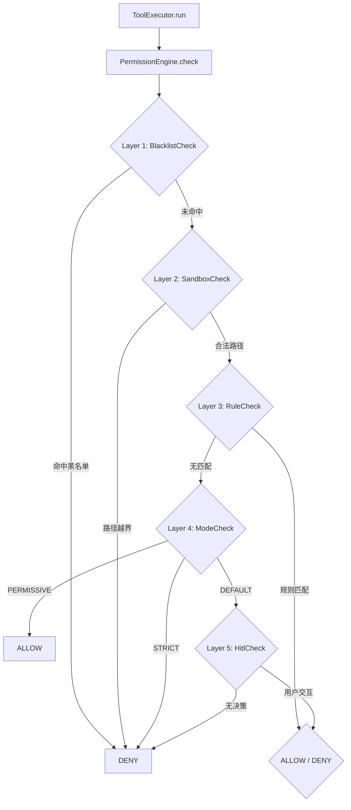
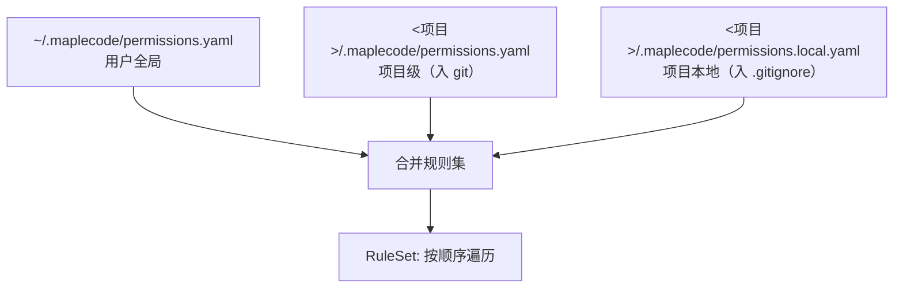
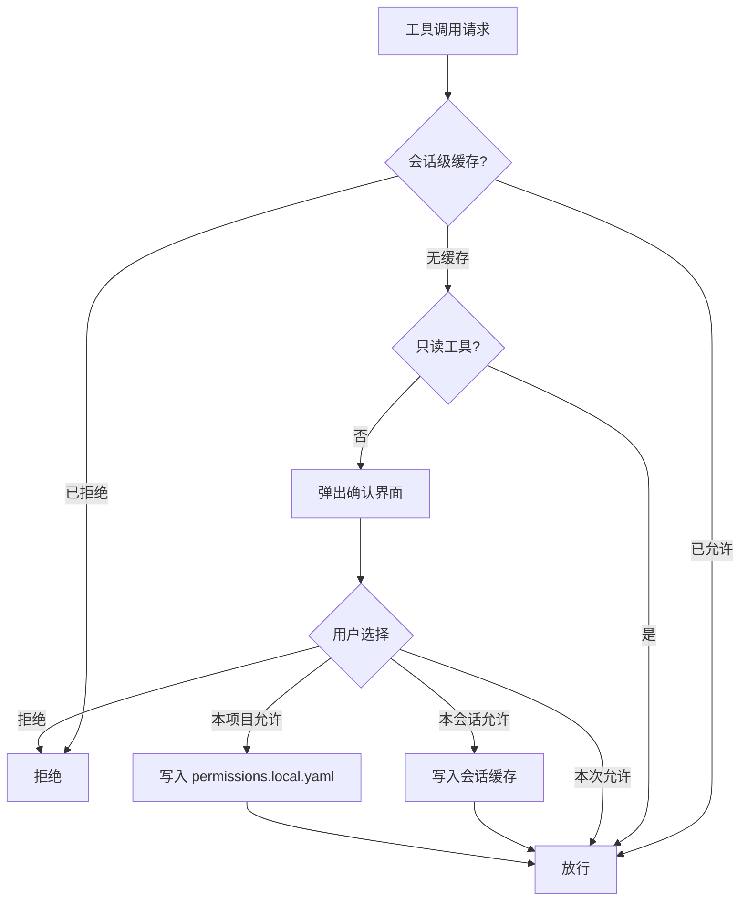

本页深入解析 MapleCode 的权限配置体系与规则匹配引擎。权限系统是五层防御管道的核心组成部分，负责决定每个工具调用是否被允许执行。它通过声明式 YAML 规则文件、内置黑名单、路径沙箱、权限模式兜底以及人在回路确认五层机制，构建了一个既安全又灵活的权限控制体系。

## 权限引擎核心架构

**PermissionEngine** 是权限决策的中央调度器。它接收一个有序的 `PermissionCheck` 链表，在 `check()` 方法中依次调用每个检查层，**首个返回 `Optional<Decision>` 的层即短路终止**——后续层不再执行。如果所有层均返回 `Optional.empty()`（未决），则最终兜底为"拒绝"。



Sources: [PermissionEngine.java](src/main/java/com/maplecode/permission/PermissionEngine.java#L1-L69)

## 五层检查管道

权限管道由五个 `PermissionCheck` 实现按顺序组成，每一层职责明确、互不重叠。下表概述各层的核心职责与决策逻辑：

| 层级 | 实现类 | 核心职责 | 决策逻辑 |
|------|--------|----------|----------|
| 1 | **BlacklistCheck** | 拦截危险命令 | 12 条硬编码正则，仅针对 `exec` 工具；匹配即拒绝 |
| 2 | **SandboxCheck** | 防止路径逃逸 | 文件系统工具的路径必须在沙箱根目录内；`exec` 跳过 |
| 3 | **RuleCheck** | 声明式规则匹配 | 从 YAML 规则文件加载的通配符/字面量规则 |
| 4 | **ModeCheck** | 全局模式兜底 | STRICT→拒绝，PERMISSIVE→放行，DEFAULT→交由 HITL |
| 5 | **HitlCheck** | 人在回路确认 | 弹出交互式确认界面，用户选择允许/拒绝 |

这些检查层在 `App.main()` 中按上述顺序组装，构成完整的防御管道：

```java
PermissionEngine engine = new PermissionEngine(
    List.of(
        new BlacklistCheck(),
        new SandboxCheck(cwd),
        new RuleCheck(ruleSet),
        new ModeCheck(),
        hitlCheck),
    raw.permissionMode());
```

Sources: [App.java](src/main/java/com/maplecode/App.java#L206-L213)

## 权限模式（PermissionMode）

权限模式定义了当规则引擎无法做出决策时的兜底行为。系统支持三种模式，可通过配置文件设置或运行时 `/mode` 命令热切换：

| 模式 | 值 | 未匹配规则时行为 | 典型场景 |
|------|----|------------------|----------|
| **严格模式** | `strict` | 直接拒绝 | 生产环境、安全敏感项目 |
| **默认模式** | `default` | 交由 HITL 确认 | 日常开发（推荐） |
| **放行模式** | `permissive` | 直接允许 | 快速原型、受信任环境 |

模式在配置文件中通过 `permission_mode` 字段指定，默认值为 `default`：

```yaml
permission_mode: default  # strict | default | permissive
```

运行时可通过 `/mode` 命令切换，但重启后恢复为配置文件中的值。

Sources: [PermissionMode.java](src/main/java/com/maplecode/permission/PermissionMode.java#L1-L4), [ConfigLoader.java](src/main/java/com/maplecode/config/ConfigLoader.java#L56-L62)

## 规则配置文件体系

规则配置采用**三层文件合并**架构，优先级从低到高依次加载，同名工具的规则按列表顺序排列，**首个匹配的规则决定结果**：



| 文件路径 | 层级 | 版本控制建议 | 用途 |
|----------|------|--------------|------|
| `~/.maplecode/permissions.yaml` | 用户全局 | 个人 dotfiles | 跨项目通用规则 |
| `<项目>/.maplecode/permissions.yaml` | 项目级 | 入 git | 团队共享的安全基线 |
| `<项目>/.maplecode/permissions.local.yaml` | 项目本地 | 入 .gitignore | 个人临时覆盖 |

合并后的规则列表中，**先加载的规则优先级更高**。例如用户全局文件中 `git *` 被 deny，项目本地文件中 `git *` 被 allow，则最终结果是 deny（用户全局先加载）。

Sources: [PermissionFileLoader.java](src/main/java/com/maplecode/permission/PermissionFileLoader.java#L25-L38)

## 规则文件格式

规则文件使用 YAML 格式，顶层为 `rules` 列表，每条规则包含三个必填字段：

```yaml
rules:
  - tool: exec          # 工具名称
    pattern: "git *"    # 匹配模式
    action: allow       # 动作：allow 或 deny

  - tool: read_file
    pattern: "src/**"   # 路径通配符
    action: allow

  - tool: write_file
    pattern: "config/**"
    action: deny
```

### 字段说明

| 字段 | 类型 | 说明 |
|------|------|------|
| `tool` | 字符串 | 目标工具名称，必须是已注册的内置工具之一 |
| `pattern` | 字符串 | 匹配模式，语义因工具而异（见下表） |
| `action` | 字符串 | `allow`（放行）或 `deny`（拒绝） |

### 工具名称与模式语义

系统仅识别以下六个内置工具名称，引用未知工具会抛出 `ConfigException`：

| 工具名称 | 模式含义 | 匹配方式 |
|----------|----------|----------|
| `exec` | Shell 命令 | 空格分词通配符（`*` 匹配零或多词，`?` 匹配一词） |
| `read_file` | 文件路径 | 文件系统 glob（`**` 递归，`*` 单层） |
| `write_file` | 文件路径 | 同上 |
| `edit_file` | 文件路径 | 同上 |
| `glob` | 搜索模式 | 同上 |
| `grep` | 搜索路径 | 同上 |

Sources: [Rule.java](src/main/java/com/maplecode/permission/Rule.java#L1-L6), [PermissionFileLoader.java](src/main/java/com/maplecode/permission/PermissionFileLoader.java#L16-L18)

## 规则匹配引擎（RuleCheck）

**RuleCheck** 是规则匹配的核心实现。它从合并后的 `RuleSet` 中按顺序遍历规则，对每条规则执行以下匹配逻辑：

1. **工具名过滤**：仅处理 `toolName` 与请求工具一致的规则
2. **模式提取**：从请求参数中提取待匹配的模式（命令字符串或文件路径）
3. **模式匹配**：根据工具类型选择不同的匹配算法

### exec 工具：Shell 通配符匹配

`exec` 工具使用自定义的 shell 通配符算法，将命令按空格分词后逐词匹配：

| 通配符 | 含义 | 示例 |
|--------|------|------|
| `*` | 匹配零个或多个词 | `git *` 匹配 `git`、`git status`、`git commit -m "fix"` |
| `?` | 恰好匹配一个词 | `ls ?` 匹配 `ls -la`，不匹配 `ls` |
| 字面量 | 精确匹配 | `ls -la` 仅匹配 `ls -la` |

### 文件系统工具：Glob 匹配

`read_file`、`write_file`、`edit_file`、`glob`、`grep` 使用 Java 标准库的 `PathMatcher`（`glob:` 语法）：

| 通配符 | 含义 | 示例 |
|--------|------|------|
| `**` | 递归匹配任意目录深度 | `src/**` 匹配 `src/main/Foo.java` |
| `*` | 匹配单层目录内的任意名称 | `*.java` 匹配 `Foo.java` |
| `?` | 匹配单个字符 | `?.txt` 匹配 `a.txt` |

### 首条匹配优先

规则列表中的**第一条匹配规则决定结果**。这与三层文件的合并顺序形成双重优先级机制：先按文件层级（用户→项目→本地），再按列表内顺序。

Sources: [RuleCheck.java](src/main/java/com/maplecode/permission/RuleCheck.java#L1-L81)

## 路径沙箱（SandboxCheck）

**SandboxCheck** 是防御路径遍历攻击的第一道防线。它将当前工作目录（`cwd`）解析为绝对路径作为沙箱根目录，所有文件系统工具的路径参数必须在沙箱范围内：

| 工具类型 | 路径解析方式 | 逃逸判定 |
|----------|--------------|----------|
| `read_file`/`write_file`/`edit_file` | `Path.toRealPath()`（解析 symlink） | 解析后的绝对路径不在沙箱根下 |
| `glob`/`grep` | `Path.normalize()`（仅规范化） | 规范化后的路径不在沙箱根下 |
| `exec` | 不检查 | 路径沙箱不适用于命令执行 |

沙箱检查在规则匹配之前执行，确保即使规则允许，也无法通过 `../../etc/passwd` 等路径遍历访问沙箱外的文件。

Sources: [SandboxCheck.java](src/main/java/com/maplecode/permission/SandboxCheck.java#L1-L75)

## 内置黑名单（BlacklistCheck）

**BlacklistCheck** 硬编码了 12 条针对 `exec` 工具的危险命令正则表达式。这些规则**不可配置、不可覆盖**，始终作为管道的第一层执行：

| 规则模式 | 拦截场景 |
|----------|----------|
| `rm -rf /` | 删除根目录 |
| `:()\{:\|` | Fork 炸弹 |
| `mkfs.*` | 格式化文件系统 |
| `dd if=/dev/zero` | dd 覆写磁盘 |
| `> /dev/sd[a-z]` | 重定向到块设备 |
| `sudo` | 使用 sudo |
| `chmod 777` | 危险权限设置 |
| `curl \| sh` | 远程代码执行 |
| `shutdown/reboot` | 系统关机/重启 |
| `eval $(...)` | eval 命令替换 |

黑名单使用 `Pattern.find()` 做子串匹配，确保即使命令嵌入复杂管道中也能被拦截。

Sources: [BlacklistCheck.java](src/main/java/com/maplecode/permission/BlacklistCheck.java#L1-L47)

## 人在回路确认（HitlCheck）

当规则引擎无法做出决策且权限模式为 `DEFAULT` 时，**HitlCheck** 会弹出交互式确认界面，让用户决定是否允许当前工具调用。

### 交互流程



### 确认选项

| 选项 | 行为 | 持久性 |
|------|------|--------|
| **本次允许** | 仅当前调用放行 | 内存，不持久化 |
| **本会话允许** | 写入 `sessionAllow` 集合 | 进程生命周期 |
| **本项目允许** | 追加到 `permissions.local.yaml` | 磁盘持久化 |
| **拒绝** | 拒绝当前调用 | 不持久化 |

### 只读工具自动放行

在 `DEFAULT` 模式下，以下只读工具会自动放行，不弹出确认界面（沙箱已在上游拦截越界路径）：
- `read_file`
- `glob`
- `grep`

Sources: [HitlCheck.java](src/main/java/com/maplecode/permission/HitlCheck.java#L1-L106)

## 会话级权限缓存

`PermissionEngine` 维护两个 `ConcurrentHashMap` 集合，用于在当前会话内缓存用户的权限决策：

| 集合 | 类型 | 作用 |
|------|------|------|
| `sessionAllow` | `Set<ToolCall>` | 存储用户选择"本会话允许"的工具调用模式 |
| `sessionDeny` | `Set<ToolCall>` | 存储用户选择"本会话拒绝"的工具调用模式 |

`ToolCall` 记录由工具名和模式字符串组成的二元组。`HitlCheck` 在每次检查前先查询这两个集合，命中则直接返回决策，避免重复弹出确认界面。

Sources: [PermissionEngine.java](src/main/java/com/maplecode/permission/PermissionEngine.java#L13-L14), [ToolCall.java](src/main/java/com/maplecode/permission/ToolCall.java#L1-L4)

## 项目级权限持久化

当用户在 HITL 确认界面选择"本项目允许"时，`PermissionEngine.persistProjectAllow()` 会将规则追加到 `<项目>/.maplecode/permissions.local.yaml` 文件：

```yaml
rules:
  - tool: exec
    pattern: "git status"
    action: allow
```

该方法会自动创建 `.maplecode` 目录，文件不存在时写入 `rules:` 头部，已存在时追加条目。模式字符串中的特殊字符（双引号、反斜杠、换行符）会自动转义为 YAML 安全格式。

Sources: [PermissionEngine.java](src/main/java/com/maplecode/permission/PermissionEngine.java#L35-L51)

## 与工具执行器的集成

**ToolExecutor** 是权限系统与工具系统的连接点。在每次 `run()` 调用中，它先构造 `PermissionRequest`（包含工具名、参数 JSON、当前工作目录），然后调用 `PermissionEngine.check()`。如果决策为 DENY，直接返回 `ToolResult.error()`，工具本身不会被执行。

```java
Decision decision = engine.check(new PermissionRequest(name, args, cwd));
if (decision.verdict() == Decision.Verdict.DENY) {
    return ToolResult.error("权限拒绝: " + decision.reason());
}
```

这种设计将权限检查与工具逻辑完全解耦——工具实现无需关心权限，权限系统也无需了解工具的内部实现。

Sources: [ToolExecutor.java](src/main/java/com/maplecode/tool/ToolExecutor.java#L33-L39)

## 数据模型概览

权限系统的核心数据模型如下表所示，它们共同构成了从配置到决策的完整数据流：

| 记录类型 | 用途 | 关键字段 |
|----------|------|----------|
| `Rule` | 单条权限规则 | `toolName`, `pattern`, `action(ALLOW/DENY)` |
| `RuleSet` | 合并后的规则集合 | `List<Rule> rules` |
| `PermissionFile` | YAML 文件解析中间体 | `List<RuleEntry> rules` |
| `PermissionRequest` | 工具调用权限请求 | `toolName`, `args(JsonNode)`, `cwd(Path)` |
| `PermissionContext` | 检查上下文 | `mode`, `sessionAllows`, `sessionDenies` |
| `Decision` | 权限决策结果 | `verdict(ALLOW/DENY)`, `reason(String)` |
| `ToolCall` | 工具调用标识 | `toolName`, `pattern` |

Sources: [Rule.java](src/main/java/com/maplecode/permission/Rule.java#L1-L6), [PermissionRequest.java](src/main/java/com/maplecode/permission/PermissionRequest.java#L1-L7), [Decision.java](src/main/java/com/maplecode/permission/Decision.java#L1-L8)

## 扩展性设计

权限系统的扩展点位于 `PermissionCheck` 接口。任何实现该接口的类都可以插入到检查管道中，只需在 `App.main()` 的 `List.of(...)` 中添加即可。接口极其简洁——仅一个方法：

```java
public interface PermissionCheck {
    Optional<Decision> check(PermissionRequest req, PermissionContext ctx);
}
```

返回 `Optional.of(Decision)` 表示做出决策（短路），返回 `Optional.empty()` 表示交由下一层处理。这种设计使得新增检查层无需修改现有代码，符合开闭原则。