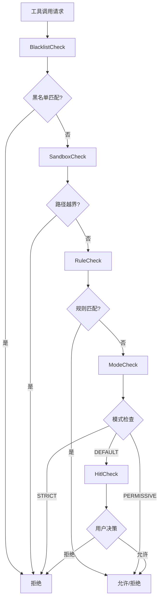
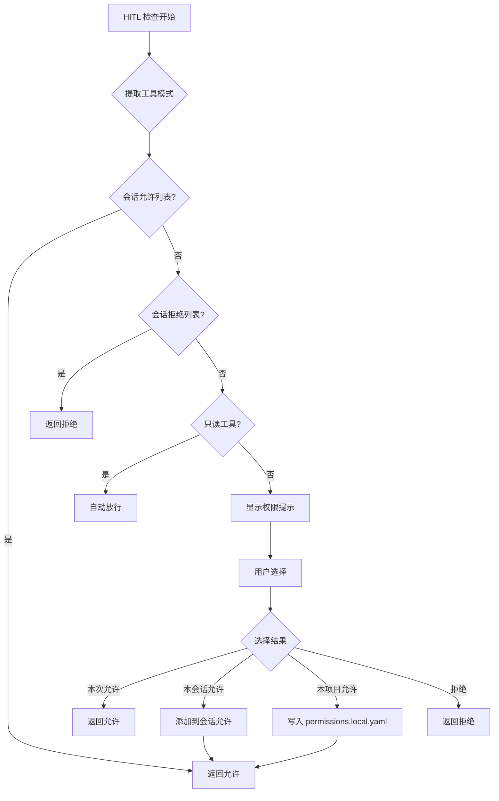

人在回路（Human-In-The-Loop，HITL）是 MapleCode 权限系统的第五层也是最后一层防御机制。作为五层权限管道中的兜底环节，HITL 在**规则未命中且权限模式为 DEFAULT**时启动，通过交互式用户界面将决策权交还给人类，确保 AI 代理在不确定情况下始终获得明确授权。

## HITL 在权限管道中的位置

HITL 机制嵌入在 MapleCode 的五层权限防御管道中，其执行顺序严格遵循 `BlacklistCheck → SandboxCheck → RuleCheck → ModeCheck → HitlCheck` 的链式调用模式。只有当前四层检查均返回 `Optional.empty()`（即未达成决策）时，HITL 才会被激活。



Sources: [PermissionEngine.java](src/main/java/com/maplecode/permission/PermissionEngine.java#L25-L31), [HitlCheck.java](src/main/java/com/maplecode/permission/HitlCheck.java#L28-L88)

## HITL 工作流程

当 HITL 被激活时，系统会执行以下标准化流程：

1. **会话级缓存检查**：首先检查当前工具调用是否已在会话级允许/拒绝列表中
2. **只读工具自动放行**：对于 `read_file`、`glob`、`grep` 等只读工具，在 DEFAULT 模式下自动放行
3. **交互式提示**：显示权限确认界面，展示工具名称、参数和当前模式
4. **用户决策处理**：根据用户选择执行相应操作
5. **决策持久化**：根据选择更新会话缓存或项目配置文件



Sources: [HitlCheck.java](src/main/java/com/maplecode/permission/HitlCheck.java#L28-L88), [PermissionEngine.java](src/main/java/com/maplecode/permission/PermissionEngine.java#L39-L40)

## 用户交互界面设计

HITL 采用 JLine 终端库实现交互式选择界面，支持上下箭头导航和数字快捷键。界面设计遵循清晰、简洁的原则：

**界面元素**：
- **标题栏**：`─── 需要权限确认 ─────────────────────────────────────────────`
- **信息展示**：工具名称、参数摘要、当前权限模式
- **选项列表**：四个选项，使用箭头指示当前选择
- **确认提示**：`上下箭头选择，回车确认:`

**交互方式**：
1. **箭头导航**：上下箭头键在选项间移动
2. **数字快捷键**：直接输入 1-4 快速选择
3. **回车确认**：确认当前选择
4. **Ctrl-C 中断**：中断权限确认，返回拒绝

```java
// JLineInputSource 实现的交互式选择界面
var options = List.of(
    "本次允许",
    "本会话允许", 
    "本项目允许（写入 permissions.local.yaml）",
    "拒绝"
);
int choice = input.readChoice("  上下箭头选择，回车确认:", options);
```

Sources: [JLineInputSource.java](src/main/java/com/maplecode/permission/JLineInputSource.java#L32-L89), [HitlCheck.java](src/main/java/com/maplecode/permission/HitlCheck.java#L50-L56)

## 决策粒度与持久化机制

HITL 提供四种不同粒度的决策选项，每种选项对应不同的持久化策略：

| 选项 | 决策粒度 | 持久化范围 | 实现机制 |
|------|----------|------------|----------|
| 本次允许 | 单次调用 | 无 | 直接返回 `Decision.allow()` |
| 本会话允许 | 当前会话 | 内存 | 添加到 `PermissionEngine.sessionAllow` |
| 本项目允许 | 项目级别 | 文件 | 写入 `.maplecode/permissions.local.yaml` |
| 拒绝 | 单次调用 | 无 | 直接返回 `Decision.deny()` |

**会话级允许机制**：
- 存储结构：`ConcurrentHashMap.newKeySet()` 确保线程安全
- 匹配逻辑：使用 `ToolCall(toolName, pattern)` 二元组进行精确匹配
- 生命周期：随会话结束自动清除

**项目级允许机制**：
- 文件路径：`<项目根目录>/.maplecode/permissions.local.yaml`
- 写入方式：追加模式，避免破坏现有配置
- 格式：标准 YAML 规则格式，包含 tool、pattern、action 字段
- 错误处理：写入失败时降级为会话级允许

```java
// 项目级允许的写入逻辑
public void persistProjectAllow(Path projectRoot, String tool, String pattern) throws IOException {
    Path file = projectRoot.resolve(".maplecode/permissions.local.yaml");
    Files.createDirectories(file.getParent());
    String entry = String.format(
        "  - tool: %s%n    pattern: %s%n    action: allow%n",
        tool, escapeYamlString(pattern));
    // 追加写入，保持 YAML 格式完整性
}
```

Sources: [PermissionEngine.java](src/main/java/com/maplecode/permission/PermissionEngine.java#L44-L55), [HitlCheck.java](src/main/java/com/maplecode/permission/HitlCheck.java#L66-L84)

## 只读工具优化

为了减少不必要的用户交互，HITL 对只读工具进行了特殊优化。在 DEFAULT 模式下，以下工具会自动放行，无需用户确认：

- `read_file`：读取文件内容
- `glob`：文件模式匹配
- `grep`：文本搜索

这种优化基于以下考虑：
1. **安全性**：只读操作不会修改文件系统
2. **效率**：减少交互次数，提升用户体验
3. **一致性**：沙箱检查已确保路径安全，无需重复确认

```java
// 只读工具自动放行逻辑
private static final Set<String> READ_ONLY = Set.of("read_file", "glob", "grep");

if (READ_ONLY.contains(req.toolName())) {
    return Optional.of(Decision.allow("只读工具自动放行"));
}
```

Sources: [HitlCheck.java](src/main/java/com/maplecode/permission/HitlCheck.java#L13), [HitlCheck.java](src/main/java/com/maplecode/permission/HitlCheck.java#L40-L42)

## 与 PermissionEngine 的集成

HITL 通过 `setEngine()` 方法与 `PermissionEngine` 建立双向依赖关系，解决构造期的循环依赖问题：

1. **构造阶段**：`HitlCheck` 接收 `InputSource` 和 `OutputSink` 参数
2. **引擎注入**：通过 `setEngine()` 方法注入 `PermissionEngine` 引用
3. **运行时交互**：HITL 通过引擎引用调用 `permitForSession()` 和 `persistProjectAllow()`

```java
// App.java 中的初始化流程
HitlCheck hitlCheck = new HitlCheck(
    new JLineInputSource(reader),
    new PrintStreamOutputSink(System.out));
PermissionEngine engine = new PermissionEngine(
    List.of(
        new BlacklistCheck(),
        new SandboxCheck(cwd),
        new RuleCheck(ruleSet),
        new ModeCheck(),
        hitlCheck),
    raw.permissionMode());
hitlCheck.setEngine(engine);  // 后置注入打破循环依赖
```

这种设计确保了：
- **线程安全**：`PermissionEngine` 使用 `ConcurrentHashMap` 存储会话级决策
- **状态一致性**：HITL 决策立即反映到引擎状态中
- **错误隔离**：HITL 错误不影响其他权限检查层

Sources: [App.java](src/main/java/com/maplecode/App.java#L202-L213), [PermissionEngine.java](src/main/java/com/maplecode/permission/PermissionEngine.java#L39-L40)

## 参数摘要与工具适配

HITL 界面会针对不同工具类型显示相应的参数摘要，帮助用户快速理解工具调用的具体内容：

| 工具类型 | 参数摘要显示 | 示例 |
|----------|--------------|------|
| `exec` | 命令字符串 | `git status` |
| `read_file` | 文件路径 | `src/Main.java` |
| `write_file` | 文件路径 | `config.yaml` |
| `edit_file` | 文件路径 | `README.md` |
| `glob` | 匹配模式 | `**/*.java` |
| `grep` | 搜索模式和路径 | `pattern=TODO path=src` |

```java
// 参数摘要生成逻辑
private static String summarizeArgs(PermissionRequest req) {
    return switch (req.toolName()) {
        case "exec" -> req.args().path("command").asText();
        case "read_file", "write_file", "edit_file" -> req.args().path("path").asText();
        case "glob" -> req.args().path("pattern").asText();
        case "grep" -> "pattern=" + req.args().path("pattern").asText()
            + " path=" + (req.args().has("path") ? req.args().get("path").asText() : ".");
        default -> req.args().toString();
    };
}
```

Sources: [HitlCheck.java](src/main/java/com/maplecode/permission/HitlCheck.java#L95-L104)

## 错误处理与降级策略

HITL 机制实现了多层次的错误处理和降级策略，确保系统在异常情况下仍能正常运行：

**用户中断处理**：
- **Ctrl-C 中断**：返回 `Decision.deny("用户在权限确认时中断")`
- **EOF 输入**：返回 `Decision.deny("用户在权限确认时中断")`

**文件写入失败处理**：
- **降级策略**：写入 `permissions.local.yaml` 失败时，降级为会话级允许
- **用户提示**：显示警告信息，说明降级原因
- **状态一致性**：确保用户意图不被磁盘 I/O 错误破坏

**输入验证**：
- **无效选项**：返回 `Decision.deny("无效选项，默认拒绝")`
- **数字范围**：确保用户输入在有效范围内

```java
// 错误处理示例
try {
    Path cwd = Paths.get(System.getProperty("user.dir"));
    engine.persistProjectAllow(cwd, req.toolName(), pattern);
} catch (IOException e) {
    output.println("  警告: 写入项目规则失败: "
        + e.getMessage() + "，降级为本会话允许");
    engine.permitForSession(new ToolCall(req.toolName(), pattern));
}
```

Sources: [HitlCheck.java](src/main/java/com/maplecode/permission/HitlCheck.java#L74-L84), [HitlCheck.java](src/main/java/com/maplecode/permission/HitlCheck.java#L60-L63)

## 性能与并发考虑

HITL 机制在设计时充分考虑了性能和并发安全：

**线程安全设计**：
- **会话级存储**：使用 `ConcurrentHashMap.newKeySet()` 确保线程安全
- **模式切换**：`PermissionMode` 使用 `volatile` 保证可见性
- **状态隔离**：每次 `engine.check()` 创建新的 `PermissionContext` 视图

**性能优化**：
- **缓存命中**：会话级允许/拒绝列表提供快速查找
- **只读优化**：自动放行只读工具，减少交互开销
- **延迟初始化**：HITL 只在需要时激活，避免不必要的资源消耗

**并发场景处理**：
- **多线程工具调用**：每个线程独立处理权限检查
- **状态一致性**：会话级决策通过线程安全集合共享
- **决策原子性**：单个决策操作是原子的，避免竞态条件

Sources: [PermissionEngine.java](src/main/java/com/maplecode/permission/PermissionEngine.java#L16-L18), [PermissionContext.java](src/main/java/com/maplecode/permission/PermissionContext.java#L6-L27)

## 配置与使用示例

### 权限模式配置

HITL 只在 `DEFAULT` 模式下激活。可以通过以下方式配置权限模式：

**配置文件**（`maplecode.yaml`）：
```yaml
permission_mode: default  # strict | default | permissive
```

**运行时切换**：
```bash
# 查看当前模式
/mode

# 切换到严格模式
/mode strict

# 切换到放行模式
/mode permissive

# 切换回默认模式（启用 HITL）
/mode default
```

### 权限规则配置

**用户全局配置**（`~/.maplecode/permissions.yaml`）：
```yaml
rules:
  - tool: exec
    pattern: "git *"
    action: allow
  - tool: exec
    pattern: "npm *"
    action: allow
```

**项目级配置**（`.maplecode/permissions.yaml`）：
```yaml
rules:
  - tool: read_file
    pattern: "**/.env"
    action: deny
  - tool: exec
    pattern: "docker *"
    action: allow
```

**项目本地配置**（`.maplecode/permissions.local.yaml`）：
```yaml
rules:
  - tool: exec
    pattern: "git push"
    action: allow
```

Sources: [maplecode.yaml.example](maplecode.yaml.example#L17-L27), [PermissionFileLoader.java](src/main/java/com/maplecode/permission/PermissionFileLoader.java#L21-L36)

## 测试与验证

HITL 机制包含全面的测试用例，覆盖各种场景：

**单元测试**：
- 选择选项验证（0-3）
- 会话级允许/拒绝缓存
- 只读工具自动放行
- 参数摘要显示
- 错误处理与降级

**集成测试**：
- 与 PermissionEngine 集成
- 文件写入失败降级
- 并发安全验证

**端到端测试**：
- 完整权限管道流程
- 多层权限检查交互
- 会话状态持久化

```java
// 测试示例：会话级允许
@Test
void choice_1_adds_to_session_allow() {
    var out = new CapturingOutput();
    var in = new StubInput(1);  // 本会话允许
    var engine = new PermissionEngine(List.of(), PermissionMode.DEFAULT);
    var hitl = new HitlCheck(in, out);
    hitl.setEngine(engine);
    var d = hitl.check(req("ls"), new PermissionContext(PermissionMode.DEFAULT));
    assertEquals(Decision.Verdict.ALLOW, d.orElseThrow().verdict());
    assertTrue(engine.sessionAllowForTest().contains(new ToolCall("exec", "ls")));
}
```

Sources: [HitlCheckTest.java](src/test/java/com/maplecode/permission/HitlCheckTest.java#L57-L67), [PermissionEngineTest.java](src/test/java/com/maplecode/permission/PermissionEngineTest.java#L72-L77)

## 最佳实践与建议

### 权限模式选择

| 模式 | 适用场景 | HITL 行为 | 安全性 | 便利性 |
|------|----------|-----------|--------|--------|
| `STRICT` | 生产环境、敏感操作 | 不激活 | 最高 | 最低 |
| `DEFAULT` | 开发环境、日常使用 | 激活 | 中等 | 中等 |
| `PERMISSIVE` | 测试环境、快速原型 | 不激活 | 最低 | 最高 |

### 权限规则设计原则

1. **最小权限原则**：只授予必要的权限
2. **分层配置**：用户全局 → 项目级 → 项目本地，优先级递增
3. **定期审查**：定期清理不再需要的权限规则
4. **文档化**：为重要权限规则添加注释说明

### 性能优化建议

1. **合理使用会话级允许**：对于重复调用的工具，使用"本会话允许"减少交互
2. **项目级规则**：对于项目特定的工具调用，使用"本项目允许"持久化配置
3. **只读工具**：利用自动放行机制，避免不必要的确认
4. **模式切换**：根据工作阶段动态切换权限模式

## 故障排除

### 常见问题

**问题1：HITL 频繁弹出**
- **原因**：权限规则配置不足或过于严格
- **解决方案**：添加适当的权限规则或切换到 `PERMISSIVE` 模式

**问题2：项目级允许不生效**
- **原因**：`permissions.local.yaml` 文件写入失败
- **解决方案**：检查文件权限，确保 `.maplecode` 目录可写

**问题3：会话级允许丢失**
- **原因**：会话结束或应用重启
- **解决方案**：使用项目级允许持久化重要规则

**问题4：只读工具仍弹出确认**
- **原因**：权限模式不是 `DEFAULT`
- **解决方案**：切换到 `DEFAULT` 模式或添加权限规则

### 调试技巧

1. **查看当前模式**：使用 `/mode` 命令
2. **检查权限规则**：查看配置文件中的规则列表
3. **启用详细日志**：在配置中启用调试输出
4. **测试权限检查**：使用测试工具验证权限规则

Sources: [ModeCommand.java](src/main/java/com/maplecode/command/ModeCommand.java#L13-L26), [ConfigLoader.java](src/main/java/com/maplecode/config/ConfigLoader.java#L54-L61)

## 未来演进方向

HITL 机制的设计为未来扩展提供了良好基础：

1. **智能学习**：基于用户历史决策自动推荐权限规则
2. **批量操作**：支持一次性批准多个相关工具调用
3. **条件权限**：基于时间、环境等条件动态调整权限
4. **审计日志**：记录所有 HITL 决策，支持合规性审查
5. **远程协作**：支持多用户协同决策，适用于团队开发环境

## 相关页面导航

- **上一页**：[权限配置与规则引擎](14-quan-xian-pei-zhi-yu-gui-ze-yu-hui-lu-hitl-ji-zhi)
- **下一页**：[Agent Loop 实现](16-agent-loop-shi-xian)
- **相关主题**：[五层权限防御管道](13-wu-ceng-quan-xian-fang-yu-guan-dao)
- **配置参考**：[配置文件详解](3-pei-zhi-wen-jian-xiang-jie)