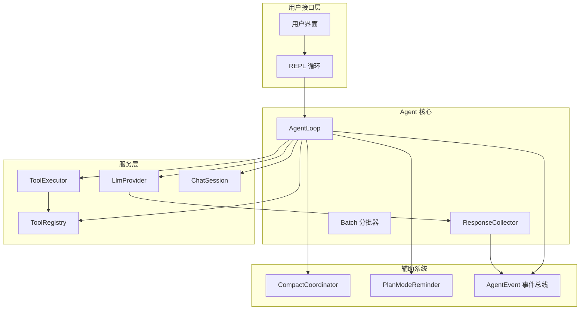
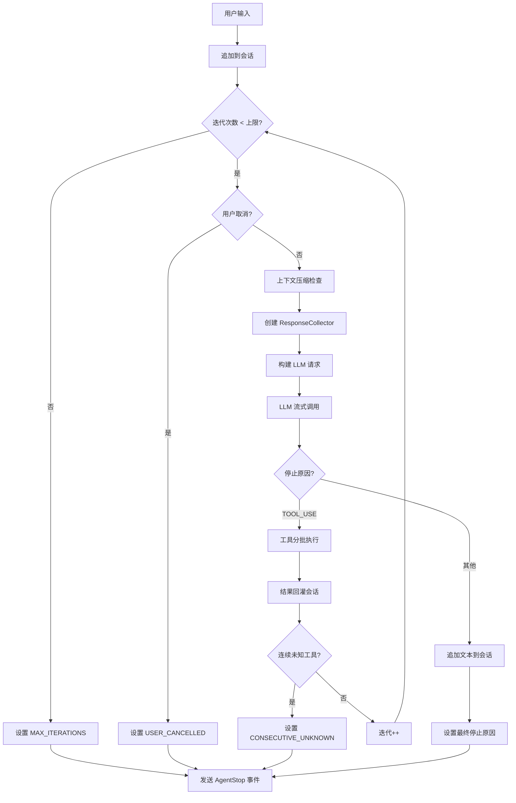

Agent Loop 是 MapleCode 的核心执行引擎，实现了模型自主循环调用工具的 ReAct 模式。本文档深入解析其架构设计、执行流程和关键实现细节。

## 1. 核心架构概览

Agent Loop 采用**事件驱动的循环架构**，通过 `AgentLoop` 类协调 LLM 提供者、工具系统、会话管理和上下文压缩等组件。其设计目标是实现模型自主决策工具调用，直到任务完成或满足停止条件。

**核心组件关系图**：


Sources: [AgentLoop.java](src/main/java/com/maplecode/agent/AgentLoop.java#L24-L80), [App.java](src/main/java/com/maplecode/App.java#L60-L80)

## 2. 核心类详解

### 2.1 AgentLoop 主类

`AgentLoop` 是整个系统的核心，实现了 ReAct 循环。其构造函数接收所有依赖组件：

```java
public AgentLoop(LlmProvider provider, ToolRegistry registry,
                 ToolExecutor executor, ChatSession session,
                 AgentConfig config, Consumer<TokenUsage> usageSink,
                 CompactCoordinator coord)
```

**关键职责**：
- 管理 Agent 执行状态（运行、取消）
- 协调 LLM 流式调用和工具执行
- 处理上下文压缩触发
- 实现多种停止条件检测
- 通过事件总线推送执行状态

Sources: [AgentLoop.java](src/main/java/com/maplecode/agent/AgentLoop.java#L24-L61)

### 2.2 AgentConfig 配置

`AgentConfig` 记录了 Agent 运行的所有配置参数：

```java
public record AgentConfig(
    String model,
    List<SystemBlock> systemBlocks,
    ThinkingConfig thinking,
    int maxIterations,
    int maxConsecutiveUnknown,
    PlanMode planMode,
    PlanModeReminder.State reminderState
)
```

**配置参数说明**：

| 参数 | 类型 | 默认值 | 说明 |
|------|------|--------|------|
| `model` | String | "test-model" | 使用的 LLM 模型 |
| `maxIterations` | int | 50 | 最大迭代次数，防止无限循环 |
| `maxConsecutiveUnknown` | int | 3 | 连续未知工具调用次数上限 |
| `planMode` | PlanMode | NORMAL | 计划模式（NORMAL/PAN） |
| `reminderState` | PlanModeReminder.State | initial() | 计划模式提醒状态 |

Sources: [AgentConfig.java](src/main/java/com/maplecode/agent/AgentConfig.java#L11-L55)

### 2.3 AgentEvent 事件系统

`AgentEvent` 是一个密封接口（sealed interface），定义了所有可能的事件类型：

```java
public sealed interface AgentEvent
    permits AgentEvent.TextDelta,
            AgentEvent.ThinkingDelta,
            AgentEvent.ToolCallStart,
            AgentEvent.ToolCallEnd,
            AgentEvent.ToolResult,
            AgentEvent.IterationStart,
            AgentEvent.IterationEnd,
            AgentEvent.BatchStart,
            AgentEvent.BatchEnd,
            AgentEvent.AgentStop,
            AgentEvent.CompactApplied {
    // 各事件类型定义...
}
```

**事件类型分类**：
- **文本流事件**：`TextDelta`、`ThinkingDelta`
- **工具调用事件**：`ToolCallStart`、`ToolCallEnd`、`ToolResult`
- **迭代控制事件**：`IterationStart`、`IterationEnd`
- **批处理事件**：`BatchStart`、`BatchEnd`
- **生命周期事件**：`AgentStop`、`CompactApplied`

**密封接口的优势**：编译期强制穷尽检查，新增事件类型时所有订阅者必须更新处理逻辑。

Sources: [AgentEvent.java](src/main/java/com/maplecode/agent/AgentEvent.java#L16-L48)

## 3. 核心执行流程

### 3.1 主循环算法

Agent Loop 的核心在 `runInternal` 方法中实现，遵循标准的 ReAct 循环模式：



Sources: [AgentLoop.java](src/main/java/com/maplecode/agent/AgentLoop.java#L92-L270)

### 3.2 工具分批执行机制

当 LLM 返回多个工具调用请求时，系统通过 `Batch` 类按安全性分批执行：

```java
var batch = Batch.partition(col.toolUses(), registry);
sink.accept(new AgentEvent.BatchStart(batch.safe().size(), batch.unsafe().size()));

var results = new ArrayList<ToolResultPayload>();

// 安全工具：并行执行
batch.safe().parallelStream().forEach(u -> {
    var r = executeOne(u, effectiveExecutor);
    synchronized (results) {
        results.add(new ToolResultPayload(u.id(), r));
    }
    sink.accept(new AgentEvent.ToolResult(u.id(), u.name(), r.isError(), r.content()));
});

// 非安全工具：串行执行
for (var u : batch.unsafe()) {
    var r = executeOne(u, effectiveExecutor);
    results.add(new ToolResultPayload(u.id(), r));
    sink.accept(new AgentEvent.ToolResult(u.id(), u.name(), r.isError(), r.content()));
}
```

**安全分类标准**：
- **只读工具**（并发安全）：`read_file`、`glob`、`grep`
- **有副作用工具**（需串行）：`write_file`、`edit_file`、`exec`

Sources: [Batch.java](src/main/java/com/maplecode/agent/Batch.java#L1-L28), [AgentLoop.java](src/main/java/com/maplecode/agent/AgentLoop.java#L196-L218)

### 3.3 响应收集器（ResponseCollector）

`ResponseCollector` 实现了**双路流式处理**模式：

```java
public final class ResponseCollector implements Consumer<StreamChunk> {
    private final StringBuilder text = new StringBuilder();
    private final List<ToolUse> toolUses = new ArrayList<>();
    private final Consumer<AgentEvent> sink;
    // ...
    
    @Override
    public void accept(StreamChunk chunk) {
        switch (chunk) {
            case StreamChunk.TextDelta d -> {
                text.append(d.text());
                sink.accept(new AgentEvent.TextDelta(d.text()));
            }
            // ... 其他事件处理
        }
    }
}
```

**双路处理机制**：
1. **实时转发**：将每个流块立即推送给 UI 显示
2. **状态累加**：在内部累积完整的文本和工具调用信息

**参数摘要提取**：实时从工具参数 JSON 中提取关键字段（path、command、pattern），为 UI 提供有意义的参数摘要。

Sources: [ResponseCollector.java](src/main/java/com/maplecode/agent/ResponseCollector.java#L21-L115)

## 4. 关键特性实现

### 4.1 计划模式（Plan Mode）

计划模式通过 `/plan` 命令激活，限制模型只能使用只读工具：

**实现机制**：
1. 在构建 LLM 请求时过滤工具列表
2. 追加计划模式提醒消息（不持久化到会话）
3. 提醒消息有完整版和简要版两种形式

```java
// PLAN 模式：构建只读 executor 实现纵深防御
final ToolExecutor effectiveExecutor;
if (config.planMode() == PlanMode.PLAN) {
    var readOnlyReg = new ToolRegistry(
        registry.all().stream()
            .filter(t -> registry.isReadOnly(t.name()))
            .toList());
    effectiveExecutor = new ToolExecutor(readOnlyReg);
} else {
    effectiveExecutor = executor;
}
```

**计划模式提醒策略**：
- 首次：完整提醒（包含具体限制说明）
- 后续：简要提醒
- 每 5 次迭代重复完整提醒

Sources: [AgentLoop.java](src/main/java/com/maplecode/agent/AgentLoop.java#L99-L109), [PlanModeReminder.java](src/main/java/com/maplecode/prompt/PlanModeReminder.java#L1-L36)

### 4.2 上下文压缩集成

Agent Loop 集成了 `CompactCoordinator` 进行上下文压缩：

```java
if (coord != null && iteration > 0) {
    var outcome = coord.beforeRequest(session, CompactTrigger.AUTO, coord.lastSeenUsage());
    if (outcome.result() instanceof CompactResult.ChangedOffloadOnly
        || outcome.result() instanceof CompactResult.ChangedFull) {
        session.replaceAll(outcome.newMessages());
        sink.accept(new AgentEvent.CompactApplied(outcome.result()));
    }
    // ... 其他压缩结果处理
}
```

**压缩触发条件**：
- 自动触发：每次迭代前检查 token 估算
- 手动触发：通过 `/compact` 命令
- 熔断机制：连续失败后自动禁用

**压缩结果类型**：
- `Noop`：无需压缩
- `ChangedOffloadOnly`：仅卸载足够
- `ChangedFull`：卸载 + 摘要
- `Failed*`：各种失败情况
- `SkippedCircuitOpen`：熔断器打开

Sources: [AgentLoop.java](src/main/java/com/maplecode/agent/AgentLoop.java#L118-L134), [CompactCoordinator.java](src/main/java/com/maplecode/compact/CompactCoordinator.java#L12-L127)

### 4.3 取消机制

支持用户随时取消正在执行的 Agent 任务：

```java
public void cancel() {
    if (running) cancelled = true;
}

// 在流式处理中检查取消状态
provider.stream(req, chunk -> {
    if (cancelled) throw new CancellationException("agent cancelled");
    col.accept(chunk);
});
```

**取消响应**：
- 在流式处理中立即抛出 `CancellationException`
- 捕获异常后发送 `USER_CANCELLED` 事件
- 下次运行时自动重置取消状态

Sources: [AgentLoop.java](src/main/java/com/maplecode/agent/AgentLoop.java#L63-L65), [AgentLoop.java](src/main/java/com/maplecode/agent/AgentLoop.java#L160-L168)

## 5. 停止条件系统

Agent Loop 定义了五种停止条件，确保循环安全终止：

| 停止条件 | 触发场景 | 停止原因枚举值 |
|----------|----------|----------------|
| 模型自然结束 | LLM 不再请求工具调用 | `END_TURN` |
| 达到迭代上限 | 迭代次数 ≥ maxIterations | `MAX_ITERATIONS` |
| 用户取消 | 用户调用 cancel() | `USER_CANCELLED` |
| 连续未知工具 | 连续调用未知工具 ≥ maxConsecutiveUnknown | `CONSECUTIVE_UNKNOWN` |
| Provider 错误 | LLM 提供者抛出异常 | `PROVIDER_ERROR` |

**停止条件检测逻辑**：

```java
// 1. 用户取消检测
if (cancelled) {
    finalStop = StopReason.USER_CANCELLED;
    finalDetail = "user cancelled";
    break;
}

// 2. 迭代上限检测
if (iteration >= config.maxIterations() && finalStop == StopReason.END_TURN) {
    finalStop = StopReason.MAX_ITERATIONS;
    finalDetail = "reached iteration cap: " + config.maxIterations();
}

// 3. 连续未知工具检测
if (consecutiveUnknown >= config.maxConsecutiveUnknown()) {
    finalStop = StopReason.CONSECUTIVE_UNKNOWN;
    finalDetail = "unknown tool called " + config.maxConsecutiveUnknown() + " times in a row";
    break;
}
```

Sources: [AgentLoop.java](src/main/java/com/maplecode/agent/AgentLoop.java#L264-L268), [StreamChunk.java](src/main/java/com/maplecode/provider/StreamChunk.java#L42-L48)

## 6. 与其他系统的集成

### 6.1 与 REPL 循环的集成

`ReplLoop` 类负责创建和管理 `AgentLoop` 实例：

```java
// 在 ReplLoop 构造函数中
this.agent = new AgentLoop(provider, registry, executor, session, agentConfig,
        usageSink, coord);

// 执行 Agent
private StopReason runAgent(String prompt) {
    AtomicReference<StopReason> finalStop = new AtomicReference<>();
    Consumer<AgentEvent> sink = event -> {
        // 事件处理逻辑
        printer.accept(event);
    };
    agent.run(prompt, sink);
    return finalStop.get();
}
```

**集成要点**：
- 通过事件消费者（Consumer<AgentEvent>）实现 UI 更新
- 支持逃逸控制器（EscapeController）管理流式状态
- 状态栏显示模型信息和 token 使用情况

Sources: [ReplLoop.java](src/main/java/com/maplecode/ui/ReplLoop.java#L42-L78), [ReplLoop.java](src/main/java/com/maplecode/ui/ReplLoop.java#L163-L185)

### 6.2 与权限系统的集成

工具执行前必须通过权限检查：

```java
public ToolResult run(String name, JsonNode args) {
    var toolOpt = registry.get(name);
    if (toolOpt.isEmpty()) {
        return ToolResult.error("Unknown tool: " + name + ". Available: " + available);
    }
    
    if (engine != null) {
        Path cwd = Path.of(System.getProperty("user.dir"));
        Decision decision = engine.check(new PermissionRequest(name, args, cwd));
        if (decision.verdict() == Decision.Verdict.DENY) {
            return ToolResult.error("权限拒绝: " + decision.reason());
        }
    }
    
    // 执行工具
    return toolOpt.get().execute(args, ctx);
}
```

**权限检查管道**：
1. 黑名单检查（BlacklistCheck）
2. 路径沙箱检查（SandboxCheck）
3. 规则引擎检查（RuleCheck）
4. 模式检查（ModeCheck）
5. 人在回路检查（HitlCheck）

Sources: [ToolExecutor.java](src/main/java/com/maplecode/tool/ToolExecutor.java#L29-L55)

## 7. 性能优化设计

### 7.1 流式处理优化

- **实时转发**：每个流块立即推送给 UI，提供即时反馈
- **状态累积**：内部累积完整状态供后续决策
- **参数摘要**：实时提取关键参数，减少 JSON 解析开销

### 7.2 并发执行优化

- **安全工具并行**：只读工具使用 parallelStream 并发执行
- **非安全工具串行**：有副作用工具严格串行执行
- **线程安全**：使用 synchronized 保护共享结果列表

### 7.3 内存管理优化

- **会话不可变副本**：ChatSession 返回消息的不可变副本
- **压缩集成**：自动检测并压缩过长的上下文
- **熔断机制**：连续失败后自动禁用压缩功能

Sources: [ResponseCollector.java](src/main/java/com/maplecode/agent/ResponseCollector.java#L49-L86), [AgentLoop.java](src/main/java/com/maplecode/agent/AgentLoop.java#L201-L215)

## 8. 测试策略

Agent Loop 的测试覆盖了核心场景：

1. **基本功能测试**：空响应、正常对话流
2. **取消机制测试**：流中取消、状态重置
3. **工具调用测试**：单工具、多工具、混合类型
4. **停止条件测试**：迭代上限、连续未知工具
5. **计划模式测试**：工具过滤、提醒消息

**测试辅助类**：
- `FakeLlmProvider`：模拟 LLM 提供者
- `RecordingTool`：记录工具调用的模拟工具
- `AgentConfig.defaults()`：提供测试配置

Sources: [AgentLoopTest.java](src/main/java/com/maplecode/agent/AgentLoopTest.java#L1-L100)

## 9. 扩展点与定制

### 9.1 添加新的停止条件

1. 在 `StopReason` 枚举中添加新值
2. 在 `runInternal` 方法中添加检测逻辑
3. 更新所有事件处理订阅者

### 9.2 自定义工具执行策略

通过实现自定义的 `ToolExecutor` 或扩展 `ToolRegistry`：
- 添加新的只读工具分类
- 实现自定义的并发执行策略
- 集成额外的权限检查

### 9.3 事件订阅扩展

通过实现 `Consumer<AgentEvent>` 接口：
- 添加日志记录
- 实现性能监控
- 集成外部通知系统

Sources: [AgentEvent.java](src/main/java/com/maplecode/agent/AgentEvent.java#L16-L48), [ToolRegistry.java](src/main/java/com/maplecode/tool/ToolRegistry.java#L9-L48)

## 10. 最佳实践与注意事项

### 10.1 配置调优建议

- **maxIterations**：根据任务复杂度调整，简单任务 10-20，复杂任务 50-100
- **maxConsecutiveUnknown**：建议 3-5，防止模型陷入无效调用循环
- **上下文窗口**：根据模型能力设置合理的压缩阈值

### 10.2 错误处理最佳实践

- 工具错误不中断循环，让模型自动调整策略
- Provider 错误立即终止，避免无效重试
- 连续未知工具达到阈值时强制终止

### 10.3 性能监控要点

- 监控迭代次数和工具调用频率
- 跟踪 token 使用情况和压缩效果
- 记录停止原因分布，优化提示词设计

Sources: [AgentConfig.java](src/main/java/com/maplecode/agent/AgentConfig.java#L29-L38), [AgentLoop.java](src/main/java/com/maplecode/agent/AgentLoop.java#L264-L268)

## 11. 相关文档与下一步

**相关架构文档**：
- [整体架构与数据流](5-zheng-ti-jia-gou-yu-shu-ju-liu) - 了解系统整体架构
- [核心抽象与接口设计](6-he-xin-chou-xiang-yu-jie-kou-she-ji) - 理解核心接口设计
- [Tool 接口与内置工具](10-tool-jie-kou-yu-nei-zhi-gong-ju) - 深入工具系统

**相关功能模块**：
- [上下文管理与压缩](17-shang-xia-wen-guan-li-yu-ya-suo) - 了解上下文压缩机制
- [命令框架与 REPL](20-ming-ling-kuang-jia-yu-repl) - 了解用户命令系统
- [人在回路（HITL）机制](15-ren-zai-hui-lu-hitl-ji-zhi) - 了解权限审批机制

**开发实践指南**：
- [自定义工具开发](28-zi-ding-yi-gong-ju-kai-fa) - 扩展工具系统
- [新增 LLM Provider 指南](27-xin-zeng-llm-provider-zhi-nan) - 集成新的 LLM 提供者
- [测试策略与质量保证](24-ce-shi-ce-lue-yu-zhi-liang-bao-zheng) - 了解测试方法

**设计文档**：
- [Agent Loop 设计规格](docs/superpowers/specs/2026-07-04-maple-code-agent-loop-design.md) - 详细设计文档