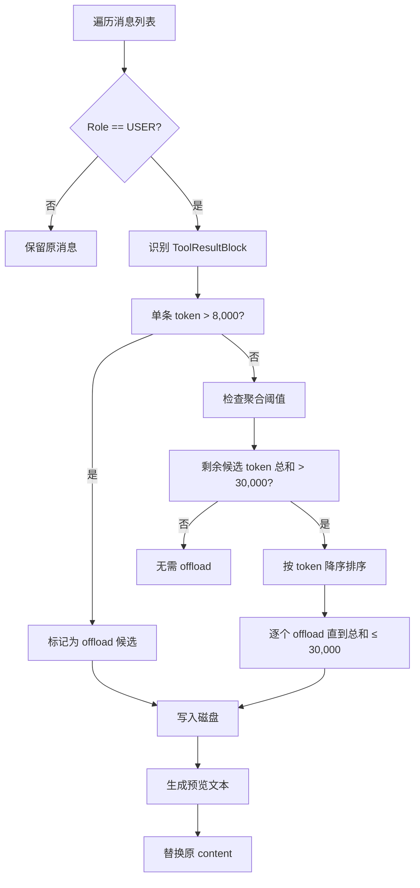
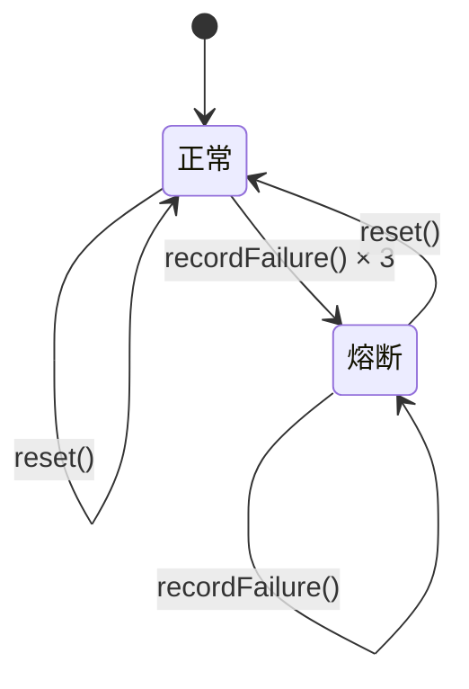

MapleCode 实现了一套**两层上下文压缩系统**，确保在有限的 Token 预算下长时间工作而不溢出。该系统采用**轻量预防 + 重量兜底**的策略，通过工具结果 offload 和 LLM 摘要生成两种机制，在对话累积过程中动态管理上下文空间。

## 架构设计概述

上下文管理系统采用分层架构，核心组件按"数据、IO、编排"职责分离。系统在 `com.maplecode.compact` 包中实现，包含 11 个类，形成完整的压缩管道。

```mermaid
graph TB
    subgraph "AgentLoop (触发点)"
        A[每个 iteration 开头] --> B[CompactCoordinator.beforeRequest]
        C[/compact 命令] --> B
    end
    
    subgraph "CompactCoordinator (编排层)"
        B --> D[TokenEstimator.estimate]
        D --> E{token < threshold?}
        E -->|否| F[Offloader.apply]
        F --> G{offload 后仍超阈?}
        G -->|否| H[返回 ChangedOffloadOnly]
        G -->|是| I[ConversationSummarizer.apply]
        I --> J[返回 ChangedFull]
        E -->|是| K[返回 Noop]
    end
    
    subgraph "存储层"
        F --> L[CompactStorage.write]
        L --> M[写入会话目录]
    end
    
    subgraph "熔断器"
        I --> N[FailureCounter]
        N --> O{失败次数 ≥ 3?}
        O -->|是| P[返回 SkippedCircuitOpen]
        O -->|否| Q[记录失败]
    end
    
    B --> R[CompactResult]
    R --> S[ChatSession.replaceAll]
```

**Sources: [CompactCoordinator.java](src/main/java/com/maplecode/compact/CompactCoordinator.java#L12-L127), [App.java](src/main/java/com/maplecode/App.java#L131-L142)**

## 核心组件职责

### CompactConfig：配置参数聚合

`CompactConfig` 是一个不可变记录，集中管理所有压缩阈值参数。它从 `AppConfig` 派生，支持通过 YAML 配置文件覆盖默认值。

| 参数 | 默认值 | 说明 |
|------|--------|------|
| `window` | 200,000 | 上下文窗口总 token 数 |
| `autoMargin` | 13,000 | 自动压缩余量 |
| `manualMargin` | 3,000 | 手动压缩余量 |
| `singleToolResultOffloadTokens` | 8,000 | 单条工具结果 offload 阈值 |
| `messageToolResultAggregateTokens` | 30,000 | 消息内工具结果聚合阈值 |
| `recencyTokens` | 10,000 | 近期消息保留 token 数 |
| `recencyMinMessages` | 5 | 近期消息最小保留条数 |
| `previewHeadLines` | 8 | 预览文本头行数 |
| `previewTailLines` | 4 | 预览文本尾行数 |
| `failureThreshold` | 3 | 熔断器阈值 |

**Sources: [CompactConfig.java](src/main/java/com/maplecode/compact/CompactConfig.java#L1-L58)**

### CompactCoordinator：压缩协调器

`CompactCoordinator` 是压缩系统的**唯一公开入口**，负责协调 offloader（第一层）和 summarizer（第二层），并集成熔断器机制。它维护 `lastSeenUsage` 锚点，用于 token 估算。

```java
// 压缩流程伪代码
public CompactOutcome beforeRequest(ChatSession session, CompactTrigger trigger, TokenUsage anchor) {
    if (trigger == AUTO && counter.isTripped()) {
        return SkippedCircuitOpen;  // 熔断器触发
    }
    
    int estimated = estimator.estimate(messages, anchor);
    int threshold = config.window() - config.marginFor(trigger);
    
    if (estimated < threshold) {
        return Noop;  // 无需压缩
    }
    
    // 第一层：offload
    List<ChatMessage> offloaded = offloader.apply(messages, config);
    if (afterOffload < threshold) {
        return ChangedOffloadOnly;
    }
    
    // 第二层：摘要
    List<ChatMessage> summarized = summarizer.apply(offloaded, config);
    counter.recordSuccess();
    return ChangedFull;
}
```

**Sources: [CompactCoordinator.java](src/main/java/com/maplecode/compact/CompactCoordinator.java#L62-L126)**

### TokenEstimator：Token 估算器

`TokenEstimator` 使用 `chars / 4` 近似估算 token 数，支持锚定 API 返回的精确值。估算逻辑考虑三种内容块类型：

1. **TextBlock**：直接计算 `text.length()`
2. **ToolUseBlock**：JSON 序列化（id + name + input）后的字符数
3. **ToolResultBlock**：`content.length()`（content 已是字符串）

估算公式：`max(anchorTokens, chars / 4)`，避免重复计算历史消息。

**Sources: [TokenEstimator.java](src/main/java/com/maplecode/compact/TokenEstimator.java#L12-L66)**

## 两层压缩策略

### 第一层：Offloader（轻量预防）

`Offloader` 负责处理工具结果，将大内容写入磁盘并替换为预览文本。这是**轻量预防**层，主要针对工具结果占用大量 token 的问题。

#### Offload 触发条件

1. **单条阈值**：单个 `ToolResultBlock` 的 token 数 > `singleToolResultOffloadTokens`（默认 8,000）
2. **聚合阈值**：同一消息内多个 `ToolResultBlock` 的 token 总和 > `messageToolResultAggregateTokens`（默认 30,000）

#### Offload 流程



#### 预览文本格式

```
[Offloaded to /path/to/file.txt — 124,503 bytes, 3,210 lines]
--- head ---
<前 8 行原文>
--- tail ---
<后 4 行原文>
[End of preview; re-read from path above for full content]
```

若原文行数 < `headLines + tailLines`，预览只贴全部原文，不分 head/tail。

**Sources: [Offloader.java](src/main/java/com/maplecode/compact/Offloader.java#L11-L101), [CompactStorage.java](src/main/java/com/maplecode/compact/CompactStorage.java#L47-L73)**

### 第二层：ConversationSummarizer（重量兜底）

`ConversationSummarizer` 是**重量兜底层**，调用 LLM 生成结构化摘要，将较早的消息摘掉，保留近期原文。这是处理长对话的最后一道防线。

#### 摘要生成流程

1. **计算近期尾部**：从消息列表末尾向前遍历，保留 `recencyTokens`（默认 10,000）或至少 `recencyMinMessages`（默认 5）条消息
2. **调用 LLM**：使用专用的摘要系统提示词，禁止调用工具
3. **校验结构**：必须包含 5 个 `## ` 标题（Intent / Decisions / Open Questions / State / Next Step）
4. **拼接结果**：摘要 + 近期尾部 + 边界消息

#### 摘要系统提示词

摘要 LLM 使用专用的系统提示词，要求生成包含 5 个章节的结构化摘要：

1. **Intent**：用户原始目标（1-2 句）
2. **Decisions**：关键决策（文件路径、方法选择等）
3. **Open Questions**：未解决问题
4. **State**：当前状态（已完成、进行中、损坏等）
5. **Next Step**：下一步具体行动（1 句）

LLM 先在 `<scratchpad>` 中进行内部分析（会被丢弃），然后输出正式摘要。

**Sources: [ConversationSummarizer.java](src/main/java/com/maplecode/compact/ConversationSummarizer.java#L17-L208)**

## 熔断器机制

`FailureCounter` 实现熔断器模式，防止压缩系统连续失败导致系统不稳定。它使用 `AtomicInteger` 和 `AtomicBoolean` 保证线程安全。

#### 熔断器状态转换



#### 熔断器行为

- **自动压缩触发**：若 `isTripped() == true`，返回 `SkippedCircuitOpen`，跳过压缩
- **手动压缩触发**：即使熔断器触发，仍允许尝试
- **/clear 命令**：重置熔断器状态（`coord.resetCounter()`）
- **成功重置**：`recordSuccess()` 会清零失败计数

**Sources: [FailureCounter.java](src/main/java/com/maplecode/compact/FailureCounter.java#L6-L37)**

## 压缩结果类型

压缩系统使用 `sealed interface` 定义 6 种结果类型，强制编译器穷尽所有情况：

| 结果类型 | 说明 | 会话是否更新 |
|----------|------|-------------|
| `Noop` | token 未超阈，无需压缩 | 否 |
| `ChangedOffloadOnly` | 仅 offload 即已足够 | 是 |
| `ChangedFull` | offload + 摘要，完全压缩 | 是 |
| `FailedOffload` | offload 写盘失败 | 否 |
| `FailedSummary` | 摘要生成失败，计数器 +1 | 否 |
| `SkippedCircuitOpen` | 熔断器触发，跳过自动压缩 | 否 |

**Sources: [CompactResult.java](src/main/java/com/maplecode/compact/CompactResult.java#L1-L17)**

## 集成与触发点

### AgentLoop 自动触发

`AgentLoop` 在每个 iteration 开头（`iteration > 0`）自动调用压缩协调器。这是压缩系统的主要触发点，确保每次模型请求前都有足够的上下文空间。

```java
// AgentLoop.runInternal() 中的压缩触发
if (coord != null && iteration > 0) {
    var outcome = coord.beforeRequest(session, CompactTrigger.AUTO, coord.lastSeenUsage());
    if (outcome.result() instanceof CompactResult.ChangedOffloadOnly
        || outcome.result() instanceof CompactResult.ChangedFull) {
        session.replaceAll(outcome.newMessages());
        sink.accept(new AgentEvent.CompactApplied(outcome.result()));
    }
    // 其他结果静默继续
}
```

**Sources: [AgentLoop.java](src/main/java/com/maplecode/agent/AgentLoop.java#L118-L134)**

### /compact 命令手动触发

用户可以通过 `/compact` 命令手动触发压缩，使用更小的 `manualMargin`（默认 3,000），触发更激进的压缩。

```java
// CompactCommand.execute()
var outcome = coord.beforeRequest(ctx.getSession(), CompactTrigger.MANUAL, coord.lastSeenUsage());
if (outcome.result() instanceof CompactResult.ChangedOffloadOnly
    || outcome.result() instanceof CompactResult.ChangedFull) {
    ctx.getSession().replaceAll(outcome.newMessages());
}
ctx.sendMessage(outcome.result().toString());
```

**Sources: [CompactCommand.java](src/main/java/com/maplecode/command/CompactCommand.java#L7-L29)**

### /clear 命令重置

`/clear` 命令清空会话历史并重置压缩计数器，但不删除 offload 文件。这允许用户重置压缩状态，重新开始压缩尝试。

```java
// ClearCommand.execute()
ctx.getSession().clear();
if (coord != null) {
    coord.recordUsage(null);  // 重置 token 使用锚点
}
```

**Sources: [ClearCommand.java](src/main/java/com/maplecode/command/ClearCommand.java#L5-L26)**

## 配置与调优

### YAML 配置示例

```yaml
# 上下文窗口总 token 数（输入预算）
context_window: 200000

# 摘要专用模型（可选）
summarizer_model: claude-haiku-4-5
```

### 配置参数调优建议

| 场景 | 调整建议 |
|------|----------|
| 长时间编码任务 | 保持默认 200,000，让系统自动管理 |
| GPT-4o 模型 | 调低到 128,000（GPT-4o 上下文窗口较小） |
| 调试压缩逻辑 | 临时调小到 30,000，强制触发摘要 |
| 成本敏感 | 配置 `summarizer_model` 为便宜模型（如 Haiku） |

**Sources: [maplecode.yaml.example](maplecode.yaml.example#L59-L70), [AppConfig.java](src/main/java/com/maplecode/config/AppConfig.java#L23-L24)**

## 错误处理与监控

### 错误处理策略

| 阶段 | 出错情形 | 处理方式 |
|------|----------|----------|
| Offload | 磁盘写失败 | 不计 counter，stderr WARN，返回原 list |
| Summary 流 | HTTP/超时/解析错 | counter.recordFailure，stderr WARN |
| Summary 校验 | 5 段缺失/段名错 | counter.recordFailure，stderr WARN |
| Summary 内容 | 模型输出 refusal | counter.recordFailure，stderr WARN |

### 监控与调试

压缩系统的所有诊断信息通过 stderr 输出，前缀为 `[compact]`：

- `[compact] offload failed: ...`
- `[compact] summary failed (N consecutive): ...`
- `[compact] circuit open (N failures); auto-compact disabled this session`

**Sources: [AgentLoop.java](src/main/java/com/maplecode/agent/AgentLoop.java#L124-L133)**

## 测试覆盖

压缩系统有完整的单元测试覆盖，包括：

- **TokenEstimatorTest**：测试空列表、单文本块、锚点与 chars/4 取大、缓存锚点等
- **OffloaderTest**：测试单条大结果 offload、短内容预览、助手消息不变等
- **ConversationSummarizerTest**：测试成功摘要、近期尾部扩展、缺少章节抛异常、拒绝抛异常等
- **FailureCounterTest**：测试熔断器状态转换、并发安全性等
- **CompactStorageTest**：测试文件写入、预览生成、目录清理等
- **CompactCoordinatorTest**：测试完整压缩流程、熔断器行为等

**Sources: [OffloaderTest.java](src/test/java/com/maplecode/compact/OffloaderTest.java#L14-L85), [ConversationSummarizerTest.java](src/test/java/com/maplecode/compact/ConversationSummarizerTest.java#L18-L199)**

## 总结

MapleCode 的上下文管理系统通过**两层压缩策略**有效地解决了长对话的上下文溢出问题：

1. **第一层（Offloader）**：轻量预防，处理大工具结果，避免单个工具结果占用过多 token
2. **第二层（ConversationSummarizer）**：重量兜底，调用 LLM 生成结构化摘要，压缩整个对话历史

系统设计考虑了**熔断器机制**、**手动触发**、**配置调优**等企业级特性，确保在生产环境中的可靠性和可维护性。通过 `sealed interface` 的类型安全设计和完整的测试覆盖，系统具有很高的代码质量和可维护性。