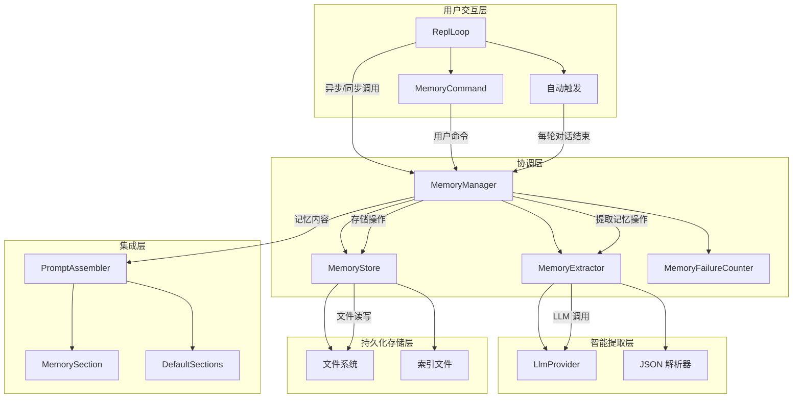
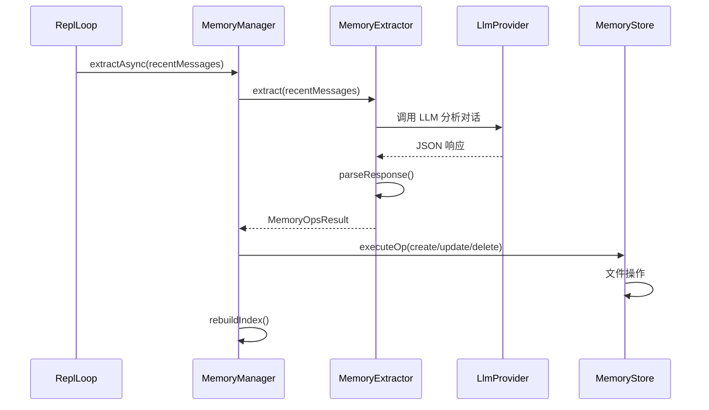
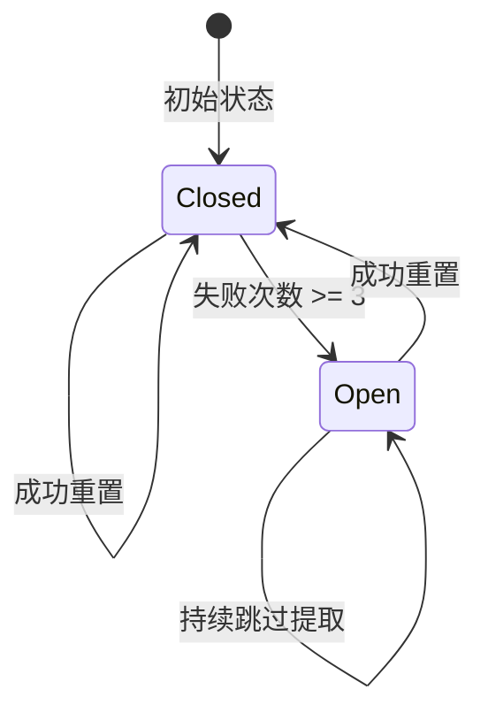
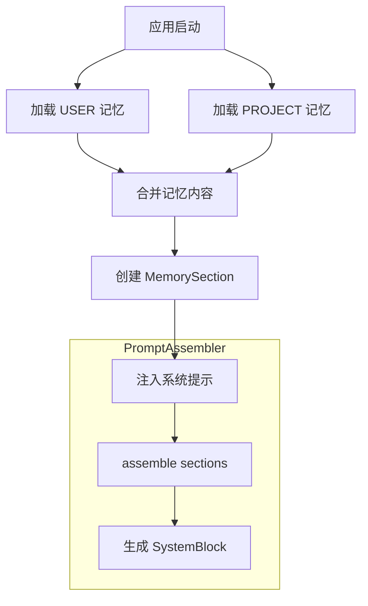

长期记忆系统是 MapleCode 的核心功能之一，实现了跨会话的知识积累和上下文保持。该系统通过自动提取对话中的重要信息，将其持久化为结构化记忆，并在后续会话中自动注入系统提示，从而让 AI 助手具备持续学习和记忆能力。

## 系统架构概览

长期记忆系统采用分层架构设计，包含三个核心组件：**MemoryManager**（协调层）、**MemoryExtractor**（智能提取层）和 **MemoryStore**（持久化存储层）。这种分层设计实现了关注点分离，使得每个组件可以独立演进和测试。



Sources: [MemoryManager.java](src/main/java/com/maplecode/memory/MemoryManager.java#L1-L120), [App.java](src/main/java/com/maplecode/App.java#L168-L180)

## 核心组件详解

### MemoryManager - 协调管理门面

**MemoryManager** 是记忆系统的统一入口，协调提取和存储两个子系统。它采用单线程 ExecutorService 保证串行文件 I/O，通过 ReentrantLock 实现同步/异步路径的互斥访问，确保并发安全。

```java
public final class MemoryManager implements Closeable {
    private final MemoryConfig config;
    private final LlmProvider provider;
    private final MemoryStore store;
    private final String mainModel;
    private final MemoryFailureCounter counter = new MemoryFailureCounter();
    private final ReentrantLock storeLock = new ReentrantLock();
    private final ExecutorService executor = Executors.newSingleThreadExecutor(r -> {
        Thread t = new Thread(r, "memory-extractor");
        t.setDaemon(true);
        return t;
    });
}
```

**关键设计决策**：
1. **单线程串行化**：避免复杂的并发控制，确保文件 I/O 的原子性
2. **守护线程**：不阻止 JVM 正常退出
3. **熔断器集成**：连续失败达到阈值后自动停止提取，防止系统雪崩
4. **锁保护**：所有对 MemoryStore 的访问都通过 storeLock 保护

Sources: [MemoryManager.java](src/main/java/com/maplecode/memory/MemoryManager.java#L19-L38)

### MemoryExtractor - 智能提取引擎

**MemoryExtractor** 负责调用 LLM 从对话中提取记忆操作。它设计了一个专门的系统提示，指导 LLM 识别四种类型的记忆：用户偏好、行为反馈、项目事实和外部引用。



**系统提示设计**：
```java
private static final String EXTRACTION_SYSTEM_PROMPT = """
    You are a memory extraction agent. Your job is to analyze a conversation
    and extract important facts, preferences, or references that should be
    remembered for future sessions.
    
    当前已有记忆：
    {existing_memory_list}
    
    CATEGORIES:
    - user: Personal preferences, habits, or settings of the user
    - feedback: Corrections or feedback the user gave about your behavior
    - project: Project-specific facts
    - reference: External references, URLs, documentation links mentioned
    
    RULES:
    - Only extract facts that are explicitly stated or clearly implied.
    - Do NOT extract transient conversation state or one-time actions.
    - Use short, descriptive "name" values (lowercase, hyphens, max 50 chars).
    - "content" should be a concise summary (1-2 sentences).
    - If nothing is worth remembering, return {"ops": []}.
    
    OUTPUT FORMAT (strict JSON, no markdown, no prose):
    {
      "ops": [
        {"action": "create", "category": "<category>", "name": "<name>", "content": "<content>"},
        {"action": "update", "name": "<name>", "content": "<content>"},
        {"action": "delete", "name": "<name>"}
      ]
    }
    """;
```

**提取策略**：
1. **现有记忆感知**：将现有记忆列表注入提示，避免重复创建
2. **严格 JSON 输出**：要求 LLM 直接输出 JSON，无 markdown 包裹
3. **容错解析**：支持 markdown 代码块包裹的 JSON，增强鲁棒性
4. **贪婪匹配**：当直接解析失败时，尝试从文本中提取 JSON 对象

Sources: [MemoryExtractor.java](src/main/java/com/maplecode/memory/MemoryExtractor.java#L30-L62), [MemoryExtractor.java](src/main/java/com/maplecode/memory/MemoryExtractor.java#L80-L92)

### MemoryStore - 结构化持久化

**MemoryStore** 负责记忆条目的持久化存储，采用基于文件系统的结构化存储方案。每个记忆条目存储为独立的 Markdown 文件，包含 YAML 前置元数据和正文内容。

**存储结构**：
```
~/.maplecode/memory/
├── MEMORY.md                    # 索引文件
├── user/                        # 用户级记忆
│   ├── 001-prefer-java21.md
│   └── 002-no-emojis.md
├── feedback/                    # 反馈记忆
│   └── 001-be-concise.md
├── project/                     # 项目级记忆
│   ├── 001-spring-boot.md
│   └── 002-aws-deploy.md
└── reference/                   # 参考链接
    └── 001-official-docs.md
```

**文件格式示例**：
```markdown
---
name: prefer-java21
category: user
created: 2026-07-10 10:30
updated: 2026-07-10 10:30
---

用户偏好使用 Java 21，喜欢使用虚拟线程和模式匹配特性。
```

**原子写入**：所有文件操作都使用 `IoUtil.atomicWrite()` 实现 write-to-temp + atomic-move 模式，确保崩溃时不会损坏文件。

Sources: [MemoryStore.java](src/main/java/com/maplecode/memory/MemoryStore.java#L15-L30), [MemoryStore.java](src/main/java/com/maplecode/memory/MemoryStore.java#L131-L150)

## 记忆分类与作用域

记忆系统采用双维度分类：**作用域**（Scope）和**类别**（Category）。作用域决定记忆的持久化位置，类别决定记忆的语义类型。

| 作用域 | 存储路径 | 说明 |
|--------|----------|------|
| USER | `~/.maplecode/memory/` | 跨项目共享的用户级记忆 |
| PROJECT | `<项目>/.maplecode/memory/` | 当前项目专用的项目级记忆 |

| 类别 | 目录名 | 作用域 | 说明 |
|------|--------|--------|------|
| USER | `user/` | USER | 个人偏好、习惯、设置 |
| FEEDBACK | `feedback/` | USER | 对 AI 行为的纠正或反馈 |
| PROJECT | `project/` | PROJECT | 项目特定事实（技术栈、部署环境等） |
| REFERENCE | `reference/` | PROJECT | 外部引用、URL、文档链接 |

**设计哲学**：
1. **用户级 vs 项目级**：用户偏好（如语言、编码风格）跨项目共享，项目事实（如技术栈、架构）项目专用
2. **反馈与偏好分离**：将反馈从用户偏好中独立出来，便于分析和优化
3. **参考链接独立化**：外部引用单独管理，避免污染核心记忆

Sources: [MemoryScope.java](src/main/java/com/maplecode/memory/MemoryScope.java#L1-L18), [MemoryCategory.java](src/main/java/com/maplecode/memory/MemoryCategory.java#L1-L29)

## 记忆提取流程

记忆提取采用异步触发机制，在每轮 Agent Loop 结束后自动启动。系统设计了三层防护机制：**配置开关**、**熔断器**和**并发控制**。

### 触发机制

1. **自动触发**：每轮对话结束且非用户取消时，自动调用 `extractAsync()`
2. **手动触发**：用户执行 `/memory extract` 命令，同步调用 `extractSync()`
3. **禁用检查**：配置 `memory.enabled=false` 时完全跳过提取

### 熔断器机制

**MemoryFailureCounter** 实现了简单的熔断器模式，连续失败达到阈值（默认 3 次）后自动停止提取，防止系统雪崩。



**熔断器状态**：
- **Closed**（正常工作）：允许记忆提取
- **Open**（熔断状态）：跳过所有提取请求，直到下次成功

**重置逻辑**：
- 任何提取成功都会重置失败计数器和熔断状态
- 熔断器状态对用户透明，仅在日志中记录警告

Sources: [MemoryFailureCounter.java](src/main/java/com/maplecode/memory/MemoryFailureCounter.java#L10-L35), [MemoryManager.java](src/main/java/com/maplecode/memory/MemoryManager.java#L41-L49)

### 并发控制

系统通过 `ReentrantLock storeLock` 确保同步和异步路径的互斥访问：

```java
private void doExtract(List<ChatMessage> recentMessages) {
    storeLock.lock();
    try {
        // 1. 加载现有记忆
        List<MemoryEntry> allEntries = new ArrayList<>(store.loadIndex(MemoryScope.USER));
        allEntries.addAll(store.loadIndex(MemoryScope.PROJECT));
        
        // 2. 调用 LLM 提取
        var extractor = new MemoryExtractor(provider, model, allEntries);
        MemoryOpsResult result = extractor.extract(recentMessages);
        
        // 3. 执行存储操作
        for (MemoryOp op : result.ops()) {
            try {
                store.executeOp(op);
            } catch (Exception e) {
                System.err.println("[memory] WARN: op failed: " + e.getMessage());
            }
        }
        
        // 4. 重建索引
        counter.recordSuccess();
    } catch (Exception e) {
        counter.recordFailure();
        System.err.println("[memory] WARN: extraction failed: " + e.getMessage());
    } finally {
        storeLock.unlock();
    }
}
```

**并发场景**：
- **异步提取**：通过单线程 ExecutorService 串行化
- **同步提取**：在 REPL 主线程直接执行
- **互斥保护**：storeLock 确保两者不会同时访问 MemoryStore

Sources: [MemoryManager.java](src/main/java/com/maplecode/memory/MemoryManager.java#L61-L84)

## 索引与检索机制

### 索引文件设计

**MEMORY.md** 是记忆系统的索引文件，采用 Markdown 格式，便于人类阅读和 LLM 理解。索引文件在每次记忆操作后自动重建。

**索引格式**：
```markdown
# Memory Index

## user
- [prefer-java21](user/001-prefer-java21.md) — 用户偏好使用 Java 21
- [no-emojis](user/002-no-emojis.md) — 不要使用表情符号

## project
- [spring-boot](project/001-spring-boot.md) — 项目使用 Spring Boot 3
- [aws-deploy](project/002-aws-deploy.md) — 部署在 AWS 上
```

**索引解析**：
```java
static List<MemoryEntry> parseIndex(String text, MemoryScope scope) {
    List<MemoryEntry> entries = new ArrayList<>();
    MemoryCategory currentCategory = null;
    for (String line : text.split("\n")) {
        if (line.startsWith("## ")) {
            String catDirName = line.substring(3).trim();
            currentCategory = findCategoryByDirName(catDirName, scope);
        } else if (line.startsWith("- [") && currentCategory != null) {
            // 解析格式: - [name](path) — summary
            int closeBracket = line.indexOf(']');
            int closeParen = line.indexOf(')');
            if (closeBracket > 0 && closeParen > closeBracket) {
                String name = line.substring(3, closeBracket);
                String path = line.substring(closeBracket + 2, closeParen);
                String summary = "";
                int dash = line.indexOf(" — ", closeParen);
                if (dash >= 0) {
                    summary = line.substring(dash + 2).trim();
                }
                entries.add(new MemoryEntry(name, currentCategory, summary, path, ""));
            }
        }
    }
    return entries;
}
```

**索引优势**：
1. **人类可读**：Markdown 格式便于手动编辑和调试
2. **LLM 友好**：结构化格式便于 LLM 理解现有记忆
3. **增量更新**：每次操作后重建索引，确保一致性
4. **跨作用域合并**：支持 USER 和 PROJECT 作用域的统一视图

Sources: [MemoryStore.java](src/main/java/com/maplecode/memory/MemoryStore.java#L200-L223), [MemoryStore.java](src/main/java/com/maplecode/memory/MemoryStore.java#L354-L368)

### 记忆注入系统提示

记忆内容通过 **MemorySection** 注入系统提示，实现跨会话知识传递。注入逻辑在应用启动时执行，将 USER 和 PROJECT 两个作用域的记忆合并后注入。



**注入位置**：
```java
public static List<PromptSection> standard(DynamicContext env, List<Tool> tools,
                                            PlanMode planMode, String customInstruction,
                                            String agentsMd, String memoryContent) {
    List<PromptSection> list = new ArrayList<>(List.of(
        IDENTITY, SYSTEM_CONSTRAINTS, TASK_MODE, ACTION_EXECUTION,
        TOOL_USAGE, TONE_STYLE, TEXT_OUTPUT,
        new AgentsMdSection(agentsMd),
        new MemorySection(memoryContent),   // v7.3 新增
        ENVIRONMENT));
    // ...
    return list;
}
```

**注入策略**：
1. **启动时加载**：避免每次对话都读取文件系统
2. **缓存友好**：MemorySection 标记为 cacheable，优化缓存命中率
3. **空内容跳过**：当记忆内容为空时，MemorySection 自动禁用
4. **作用域合并**：USER 和 PROJECT 记忆合并为单一 MemorySection

Sources: [DefaultSections.java](src/main/java/com/maplecode/prompt/DefaultSections.java#L50-L64), [MemorySection.java](src/main/java/com/maplecode/prompt/MemorySection.java#L1-L34)

## 配置与使用指南

### 配置选项

记忆系统通过 YAML 配置文件进行配置，支持三个核心参数：

```yaml
# maplecode.yaml
memory:
  enabled: true                    # 启用/禁用记忆系统
  memory_model: claude-haiku-4-5  # 记忆提取专用模型（可选）
  max_context_messages: 10        # 提取时考虑的最近消息数（默认 10）
```

| 参数 | 类型 | 默认值 | 说明 |
|------|------|--------|------|
| `enabled` | boolean | false | 是否启用记忆系统 |
| `memory_model` | string | null（复用主模型） | 记忆提取使用的 LLM 模型 |
| `max_context_messages` | integer | 10 | 提取时考虑的最近消息数量 |

**配置建议**：
1. **模型选择**：推荐使用轻量级模型（如 claude-haiku-4-5），降低成本
2. **消息数量**：默认 10 条平衡了上下文完整性和提取成本
3. **启用策略**：建议在生产环境中启用，开发调试时可临时禁用

Sources: [MemoryConfig.java](src/main/java/com/maplecode/memory/MemoryConfig.java#L1-L28), [maplecode.yaml.example](maplecode.yaml.example#L72-L79)

### 用户命令

记忆系统提供三个用户命令，通过 `/memory` 前缀访问：

| 命令 | 说明 | 示例 |
|------|------|------|
| `/memory list` | 列出所有记忆 | `/memory list` |
| `/memory clear` | 清空所有记忆 | `/memory clear` |
| `/memory extract` | 手动触发记忆提取 | `/memory extract` |

**命令实现**：
```java
public class MemoryCommand implements Command {
    @Override
    public void execute(String args, CommandContext ctx) {
        if (manager == null) {
            ctx.sendError("记忆系统未启用。");
            return;
        }
        switch (args) {
            case "list" -> ctx.sendMessage(manager.listMemories());
            case "clear" -> manager.clearAll();
            case "extract" -> manager.extractSync(ctx.getSession().recentMessages(20));
            default -> ctx.sendError("用法: /memory <list|clear|extract>");
        }
    }
}
```

**使用场景**：
- **查看记忆**：`/memory list` 查看当前存储的所有记忆
- **清理记忆**：`/memory clear` 重置记忆系统（谨慎使用）
- **手动提取**：`/memory extract` 强制从当前对话提取记忆

Sources: [MemoryCommand.java](src/main/java/com/maplecode/command/MemoryCommand.java#L1-L32)

## 测试与质量保证

记忆系统包含完整的单元测试套件，覆盖了核心功能、边界条件和异常场景：

| 测试类 | 测试重点 | 测试数量 |
|--------|----------|----------|
| MemoryManagerTest | 协调层逻辑、熔断器、并发控制 | 5 个测试 |
| MemoryExtractorTest | JSON 解析、消息格式化、容错处理 | 12 个测试 |
| MemoryStoreTest | 文件操作、索引重建、原子写入 | 8 个测试 |
| MemoryFailureCounterTest | 熔断器状态转换 | 4 个测试 |
| MemoryCommandTest | 命令处理、参数验证 | 5 个测试 |

**关键测试场景**：
1. **正常流程**：记忆提取、存储、检索的完整流程
2. **熔断器测试**：连续失败达到阈值后的行为
3. **并发测试**：同步/异步路径的互斥性
4. **容错测试**：JSON 解析失败、文件操作异常的处理
5. **边界测试**：空消息、特殊字符、长文本等边界条件

**测试覆盖率**：所有核心路径都有对应测试，确保系统在各种场景下的可靠性。

Sources: [MemoryManagerTest.java](src/test/java/com/maplecode/memory/MemoryManagerTest.java#L1-L111), [MemoryExtractorTest.java](src/test/java/com/maplecode/memory/MemoryExtractorTest.java#L1-L153)

## 设计决策与权衡

### 1. 异步 vs 同步提取

**决策**：采用异步提取为主，同步提取为辅的混合模式。

**权衡**：
- **异步提取**：不阻塞用户交互，提升用户体验，但可能丢失最新上下文
- **同步提取**：确保提取最新对话，但阻塞用户操作
- **混合模式**：自动触发异步，手动支持同步，平衡两者优势

### 2. 文件存储 vs 数据库存储

**决策**：采用基于文件系统的 Markdown 存储。

**权衡**：
- **文件存储**：人类可读、版本控制友好、无需额外依赖，但查询效率较低
- **数据库存储**：查询高效、结构化强，但增加复杂性、不易调试
- **Markdown 选择**：符合 AI 助手的使用场景，便于手动编辑和调试

### 3. 全量重建 vs 增量更新

**决策**：每次操作后全量重建索引。

**权衡**：
- **全量重建**：实现简单、保证一致性，但性能开销较大
- **增量更新**：性能更好，但实现复杂、容易出错
- **当前选择**：记忆数量有限（通常 <100），全量重建的开销可接受

### 4. LLM 提取 vs 规则提取

**决策**：采用 LLM 提取而非规则匹配。

**权衡**：
- **LLM 提取**：理解语义、适应性强、可提取隐含信息，但成本高、可能幻觉
- **规则提取**：成本低、确定性强，但只能提取显式信息
- **LLM 优势**：能理解用户意图、识别重要信息，适合复杂场景

## 性能优化策略

### 1. 缓存优化

- **索引缓存**：启动时加载索引，避免重复读取文件
- **MemorySection 缓存**：标记为 cacheable，优化系统提示缓存命中率
- **作用域缓存**：分别缓存 USER 和 PROJECT 记忆，按需合并

### 2. 异步处理

- **非阻塞提取**：自动触发的提取在后台线程执行
- **串行化**：单线程 ExecutorService 避免并发问题
- **守护线程**：不阻止应用正常退出

### 3. 成本控制

- **轻量级模型**：推荐使用 haiku 等低成本模型
- **消息数量限制**：默认只考虑最近 10 条消息
- **熔断器机制**：避免失败时的无效 LLM 调用

## 未来演进方向

### 1. 智能检索增强

- **向量搜索**：引入向量数据库，支持语义相似度检索
- **相关性排序**：根据对话上下文动态调整记忆权重
- **记忆衰减**：实现时间衰减机制，自动清理过时记忆

### 2. 多模态记忆

- **代码片段**：支持存储和检索代码片段
- **图表记忆**：支持 Mermaid 图表、架构图等视觉元素
- **文件引用**：支持引用项目文件作为记忆上下文

### 3. 协作记忆

- **团队共享**：支持团队级记忆共享和同步
- **权限控制**：细粒度的记忆访问权限管理
- **冲突解决**：多人编辑时的冲突检测和解决机制

### 4. 分析优化

- **使用统计**：记忆使用频率和效果分析
- **自动优化**：根据使用模式自动调整提取策略
- **A/B 测试**：支持不同提取策略的效果对比

## 相关文档

- [上下文管理与压缩](17-shang-xia-wen-guan-li-yu-ya-suo) - 了解会话内的上下文管理机制
- [会话管理与归档](19-hui-hua-guan-li-yu-gui-dang) - 了解会话的持久化和恢复机制
- [整体架构与数据流](5-zheng-ti-jia-gou-yu-shu-ju-liu) - 了解系统的整体架构设计
- [配置文件详解](3-pei-zhi-wen-jian-xiang-jie) - 了解完整的配置选项和最佳实践

## 总结

MapleCode 的长期记忆系统通过 **智能提取**、**结构化存储** 和 **系统集成** 三大支柱，实现了真正意义上的跨会话知识积累。系统设计体现了 **关注点分离**、**容错优先** 和 **用户体验导向** 的设计原则，为 AI 助手提供了持久化的记忆能力。

**核心优势**：
1. **自动化**：无需用户干预，自动提取和存储重要信息
2. **结构化**：分类清晰、索引完善，便于检索和管理
3. **可靠性**：熔断器机制、原子写入、并发控制，确保系统稳定
4. **可扩展**：模块化设计，支持未来功能扩展和优化

**适用场景**：
- 长期项目开发中的知识积累
- 个人偏好和习惯的持久化
- 团队协作中的知识共享
- 复杂对话的上下文保持

通过长期记忆系统，MapleCode 从一个无状态的对话工具演进为具备持续学习能力的智能助手，为用户提供更加个性化、连贯的服务体验。