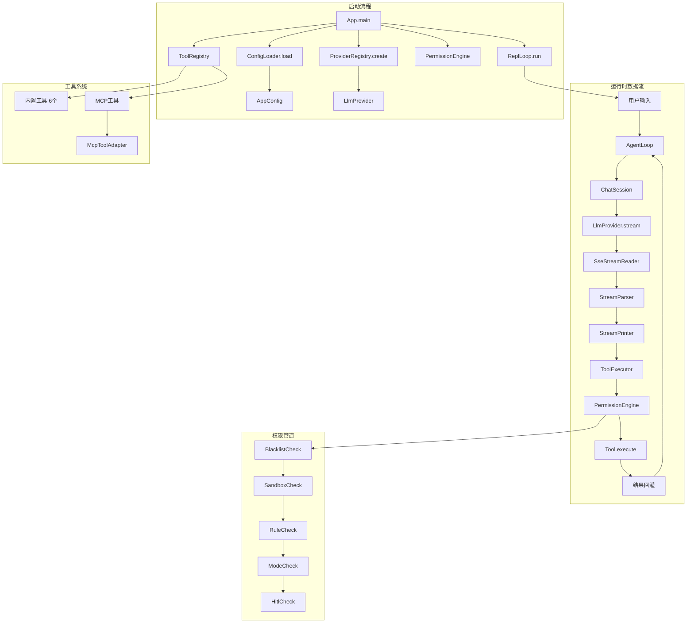

本指南将帮助您从零开始搭建 MapleCode 开发环境，并快速体验这个极简的 Java 命令行 AI 对话工具。MapleCode 通过 SSE 流式转发 Anthropic Claude 或 OpenAI Chat Completions 的响应，支持多轮对话记忆、工具调用和 Agent Loop，让 AI 模型能够自主循环调用工具完成任务。

## 环境准备

### 1. 系统要求

MapleCode 是一个纯 Java 应用，运行环境要求如下：

| 要求 | 最低版本 | 推荐版本 | 说明 |
|------|----------|----------|------|
| Java | 21 | 21+ | 必须使用 Java 21，支持最新的语言特性 |
| Maven | 3.9 | 3.9+ | 用于构建和管理依赖 |
| 操作系统 | - | - | 跨平台支持（Windows/macOS/Linux） |

**检查环境版本：**
```bash
java --version
mvn --version
```

### 2. 获取项目源码

```bash
git clone <repository-url>
cd maple-code-java
```

项目采用标准的 Maven 项目结构：

```
maple-code-java/
├── pom.xml                    # Maven 构建配置
├── maplecode.yaml.example     # 配置文件模板
├── AGENTS.md                  # 架构设计文档
├── src/
│   ├── main/java/com/maplecode/
│   │   ├── App.java          # 应用入口点
│   │   ├── config/           # 配置加载
│   │   ├── provider/         # LLM 提供商抽象
│   │   ├── tool/             # 工具系统
│   │   ├── permission/       # 权限系统
│   │   └── ...              # 其他模块
│   └── test/java/           # 单元测试
└── docs/                    # 设计文档
```

### 3. 配置 API 密钥

MapleCode 支持 Anthropic Claude 和 OpenAI 两种 LLM 提供商。您需要获取相应的 API 密钥：

**获取 API 密钥：**
- Anthropic Claude: 访问 [Anthropic Console](https://console.anthropic.com/)
- OpenAI: 访问 [OpenAI Platform](https://platform.openai.com/)

**设置环境变量：**
```bash
# Anthropic Claude
export ANTHROPIC_API_KEY=sk-ant-your-api-key-here

# OpenAI
export OPENAI_API_KEY=sk-your-openai-key-here
```

### 4. 创建配置文件

MapleCode 查找配置文件的顺序为：`--config <path>` → `./maplecode.yaml` → `~/.maplecode/config.yaml`。

**方法一：项目内配置（推荐开发使用）**
```bash
cp maplecode.yaml.example maplecode.yaml
```

**方法二：用户全局配置**
```bash
mkdir -p ~/.maplecode
cp maplecode.yaml.example ~/.maplecode/config.yaml
```

**编辑配置文件：**
```yaml
# Anthropic Claude 配置示例
protocol: anthropic
model: claude-sonnet-4-6
base_url: https://api.anthropic.com
api_key: ${ANTHROPIC_API_KEY}

# OpenAI 配置示例
protocol: openai
model: gpt-4o
base_url: https://api.openai.com/v1
api_key: ${OPENAI_API_KEY}

# 可选配置
system_prompt: |
  You are MapleCode, a helpful coding assistant. Be concise.
permission_mode: default  # strict | default | permissive
```

Sources: [README.md](README.md#L20-L50), [maplecode.yaml.example](maplecode.yaml.example#L1-L30)

## 构建与运行

### 1. 构建项目

使用 Maven 构建可执行的 JAR 文件：

```bash
mvn package
```

构建过程会：
1. 编译 Java 21 源代码
2. 运行单元测试
3. 使用 Maven Shade 插件创建包含所有依赖的 fat JAR
4. 生成 `target/maple-code-java-0.1.0.jar`

**构建输出：**
```
[INFO] Building jar: /path/to/maple-code-java/target/maple-code-java-0.1.0.jar
[INFO] BUILD SUCCESS
```

### 2. 运行应用

**基本运行：**
```bash
java -jar target/maple-code-java-0.1.0.jar
```

**指定配置文件运行：**
```bash
java -jar target/maple-code-java-0.1.0.jar --config /path/to/config.yaml
```

**验证安装：**
启动后，您应该看到 MapleCode 的 REPL 提示符：
```
MapleCode v0.1.0 (type /help for commands)
>
```

### 3. 运行测试

```bash
# 运行所有测试
mvn test

# 运行特定测试类
mvn test -Dtest=ConfigLoaderTest

# 运行特定测试方法
mvn test -Dtest=ConfigLoaderTest#loads_full_anthropic_config

# 运行匹配模式的测试
mvn test -Dtest='*StreamParser*'
```

Sources: [pom.xml](pom.xml#L40-L106), [AGENTS.md](AGENTS.md#L20-L35)

## 快速开始示例

### 1. 基本对话

启动 MapleCode 后，您可以直接与 AI 模型对话：

```bash
> 请解释什么是递归？
```

AI 模型将流式返回响应，支持多轮对话记忆。

### 2. 使用工具系统

MapleCode 内置 6 个核心工具，AI 模型可以自动调用：

| 工具 | 功能 | 示例 |
|------|------|------|
| `read_file` | 读取文件内容 | "读取 src/main/java/com/maplecode/App.java 文件" |
| `write_file` | 写入文件 | "创建一个 hello.txt 文件，内容为 'Hello World'" |
| `edit_file` | 精确编辑文件 | "在 App.java 的 main 方法中添加 System.out.println" |
| `exec` | 执行 shell 命令 | "运行 `ls -la` 查看当前目录" |
| `glob` | 查找文件 | "查找所有 .java 文件" |
| `grep` | 搜索代码内容 | "搜索包含 'ConfigLoader' 的文件" |

**工具调用流程：**
1. 识别需求 → 2. 权限检查 → 3. 执行工具 → 4. 返回结果 → 5. 继续对话

### 3. REPL 命令

MapleCode 提供丰富的 REPL 命令：

| 命令 | 功能 | 使用场景 |
|------|------|----------|
| `/clear` | 清空消息历史 | 开始新对话 |
| `/compact` | 手动压缩上下文 | 对话过长时优化性能 |
| `/tools` | 列出可用工具 | 查看内置和 MCP 工具 |
| `/plan <query>` | 规划模式 | 分析问题但不执行 |
| `/do` | 执行规划 | 执行上一条规划 |
| `/mode [strict\|default\|permissive]` | 切换权限模式 | 调整安全级别 |
| `/exit` 或 Ctrl+D | 退出 | 结束会话 |

### 4. MCP 工具集成

MapleCode 支持 Model Context Protocol (MCP)，可连接外部工具服务器：

```yaml
# mcp_servers.yaml 示例
servers:
  github:
    type: stdio
    command: npx
    args: ["-y", "@modelcontextprotocol/server-github"]
    env:
      GITHUB_TOKEN: ${GITHUB_TOKEN}
  notion:
    type: http
    url: https://mcp.notion.example.com/mcp
    headers:
      Authorization: "Bearer ${NOTION_TOKEN}"
```

MCP 工具命名空间为 `mcp__<server>__<tool>`，与内置工具一视同仁地经过权限管道。

Sources: [README.md](README.md#L60-L100), [AGENTS.md](AGENTS.md#L50-L80)

## 高级配置

### 1. Extended Thinking（扩展思考）

仅支持 Anthropic Claude 模型：

```yaml
extended_thinking:
  type: adaptive        # adaptive（推荐）或 enabled（旧版）
  effort: high          # low | medium | high
```

**格式说明：**
- `type: adaptive` + `effort: low|medium|high`：适用于所有 Claude 模型（Opus 4.7、Opus 4.6、Sonnet 4.6）
- `type: enabled` + `budget_tokens: N`（≥1024）：旧版格式，仅适用于 Opus 4.6/Sonnet 4.6

### 2. 上下文管理

MapleCode 自动管理对话上下文，支持压缩和摘要：

```yaml
context_window: 200000           # 输入预算（默认 200000）
summarizer_model: claude-haiku-4-5  # 摘要专用模型（可选）
```

当对话 token 数接近上下文窗口时，自动触发压缩：摘要旧消息 + offload 已执行的工具结果。

### 3. 记忆系统

长期记忆系统实现跨会话知识积累：

```yaml
memory:
  enabled: true
  memory_model: claude-haiku-4-5    # 记忆提取用模型（可选）
  max_context_messages: 10          # 提取时看最近几条消息（默认 10）
```

记忆按 scope 分为 `user`（跨项目）和 `project`（当前项目），存储在 `~/.maplecode/memory/` 下。

### 4. 权限系统配置

五层权限防御管道：

| 层 | 说明 | 配置 |
|----|------|------|
| 黑名单 | 12 条硬编码正则拦截高危命令 | 不可配置 |
| 路径沙箱 | 文件操作必须在项目目录内 | 自动启用 |
| 规则引擎 | 三层 YAML 规则 | 用户全局/项目/项目本地 |
| 权限模式 | strict/default/permissive | `permission_mode` 配置 |
| 人在回路 | default 模式下弹 4 选 1 | 自动启用 |

**规则文件配置：**
```yaml
# ~/.maplecode/permissions.yaml（用户全局）
rules:
  - tool: exec
    pattern: "git *"
    action: allow
  - tool: read_file
    pattern: "**/.env"
    action: deny
```

Sources: [maplecode.yaml.example](maplecode.yaml.example#L30-L79), [AGENTS.md](AGENTS.md#L80-L120)

## 故障排除

### 常见问题及解决方案

| 问题 | 可能原因 | 解决方案 |
|------|----------|----------|
| `no config found` | 配置文件不存在 | 创建配置文件或使用 `--config` 参数 |
| `environment variable not set: ANTHROPIC_API_KEY` | API 密钥环境变量未设置 | 设置环境变量：`export ANTHROPIC_API_KEY=sk-ant-...` |
| `missing required field: protocol` | 配置文件缺少必要字段 | 检查配置文件格式，确保包含所有必填字段 |
| `extended_thinking.type=enabled requires budget_tokens >= 1024` | Extended Thinking 配置错误 | 使用 `type: adaptive` 或确保 `budget_tokens ≥ 1024` |
| 构建失败 | Java 版本不兼容 | 确保使用 Java 21：`java --version` |
| 工具调用被拒绝 | 权限系统限制 | 检查权限配置，或切换到 `permissive` 模式 |

### 诊断命令

```bash
# 检查 Java 版本
java --version

# 检查 Maven 版本
mvn --version

# 验证配置文件语法
java -jar target/maple-code-java-0.1.0.jar --config maplecode.yaml

# 运行测试套件
mvn test

# 查看详细构建日志
mvn package -X
```

### 日志和调试

MapleCode 的日志输出到 stderr，MCP 相关日志以 `[mcp:<server>]` 为前缀。使用以下命令查看详细输出：

```bash
java -jar target/maple-code-java-0.1.0.jar 2>&1 | tee maplecode.log
```

## 下一步

完成环境准备和快速开始后，建议您按以下顺序深入学习：

1. **[配置文件详解](3-pei-zhi-wen-jian-xiang-jie)** - 深入了解所有配置选项
2. **[基础使用指南](4-ji-chu-shi-yong-zhi-nan)** - 掌握日常使用技巧
3. **[整体架构与数据流](5-zheng-ti-jia-gou-yu-shu-ju-liu)** - 理解系统工作原理
4. **[工具系统](10-tool-jie-kou-yu-nei-zhi-gong-ju)** - 学习工具开发和使用
5. **[权限系统](13-wu-ceng-quan-xian-fang-yu-guan-dao)** - 了解安全机制

## 架构概览

MapleCode 采用单向数据流架构，启动时一次性装配所有组件：



**核心抽象：**
- **LlmProvider**：统一接口，支持 Anthropic 和 OpenAI
- **Tool**：工具接口，6 个内置工具 + MCP 工具
- **PermissionEngine**：五层权限防御管道
- **AgentLoop**：ReAct 循环，模型自主调用工具
- **ChatSession**：多轮对话记忆管理

Sources: [AGENTS.md](AGENTS.md#L35-L50), [App.java](src/main/java/com/maplecode/App.java#L1-L100)

## 项目结构详解

| 目录/文件 | 用途 | 关键类/文件 |
|-----------|------|-------------|
| `src/main/java/com/maplecode/` | 主源代码 | App.java（入口点） |
| `config/` | 配置加载和校验 | ConfigLoader.java, AppConfig.java |
| `provider/` | LLM 提供商抽象 | LlmProvider.java, ProviderRegistry.java |
| `provider/anthropic/` | Anthropic 实现 | AnthropicProvider.java |
| `provider/openai/` | OpenAI 实现 | OpenAiProvider.java |
| `tool/` | 工具系统 | Tool.java, ToolRegistry.java, ToolExecutor.java |
| `permission/` | 权限系统 | PermissionEngine.java, 5层Check类 |
| `agent/` | Agent Loop | AgentLoop.java, PlanMode.java |
| `session/` | 会话管理 | ChatSession.java |
| `memory/` | 长期记忆 | MemoryManager.java, MemoryStore.java |
| `mcp/` | MCP 客户端 | McpClient.java, McpToolAdapter.java |
| `ui/` | 用户界面 | ReplLoop.java, StreamPrinter.java |
| `src/test/java/` | 单元测试 | 各模块对应测试类 |
| `docs/` | 设计文档 | 各版本设计规范 |

## 快速参考卡片

### 环境变量
```bash
export ANTHROPIC_API_KEY=sk-ant-...    # Anthropic API 密钥
export OPENAI_API_KEY=sk-...           # OpenAI API 密钥
```

### 常用命令
```bash
# 构建
mvn package

# 运行
java -jar target/maple-code-java-0.1.0.jar

# 测试
mvn test

# 指定配置
java -jar target/maple-code-java-0.1.0.jar --config /path/to/config.yaml
```

### 配置文件位置优先级
1. `--config <path>` 参数
2. `./maplecode.yaml`（项目内）
3. `~/.maplecode/config.yaml`（用户全局）

### 权限模式
- **strict**：未匹配直接拒绝
- **default**：未匹配走人回路（推荐）
- **permissive**：未匹配直接放行