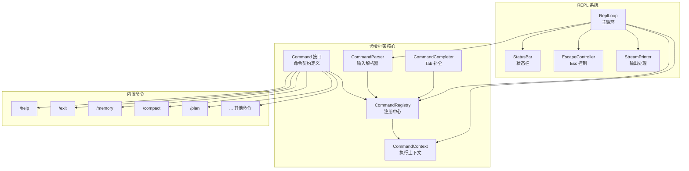
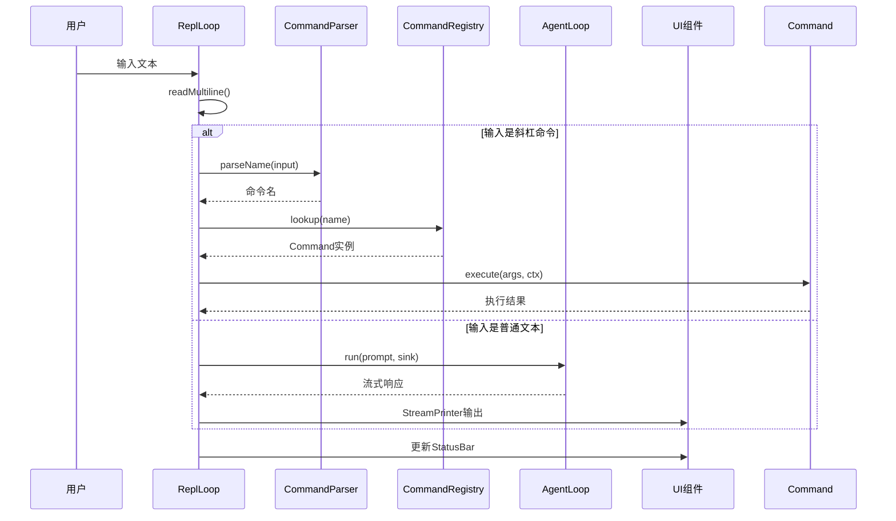

本页深入解析 MapleCode 的命令框架架构和 REPL（Read-Eval-Print Loop）交互系统。MapleCode 采用**斜杠命令框架**（Slash Command Framework）实现用户交互，将传统的命令行工具设计与现代 AI 对话体验相结合。命令框架提供结构化的命令注册、解析和执行机制，而 REPL 系统则负责输入处理、状态管理和流式输出。

## 命令框架架构

命令框架的核心设计遵循**接口契约模式**（Interface Contract Pattern），通过清晰的抽象层次将命令定义、注册、解析和执行分离。这种架构使得命令系统具有良好的扩展性和可测试性。



## Command 接口设计

`Command` 接口是命令系统的基石，定义了所有命令必须遵循的契约。每个命令实现此接口，并在应用启动时注册到 `CommandRegistry`。

**接口核心方法**：
- `name()`：命令名称（小写），如 "help"、"memory"
- `description()`：一句话描述，用于 `/help` 列表显示
- `usage()`：用法示例，如 "/help [command]"
- `type()`：命令类型分类（`CommandType` 枚举）
- `hidden()`：是否隐藏，隐藏命令不参与 `/help` 列表和 Tab 补全
- `aliases()`：别名列表，默认返回空集合
- `execute(args, ctx)`：执行命令，接收参数和上下文

Sources: [Command.java](src/main/java/com/maplecode/command/Command.java#L1-L45)

## 命令分类与类型系统

命令通过 `CommandType` 枚举进行分类，这种分类纯粹用于 `/help` 命令的分组显示，不影响命令的路由逻辑。

| 命令类型 | 说明 | 示例命令 |
|---------|------|---------|
| **LOCAL** | 纯本地操作，不涉及 Agent 交互 | `/help`、`/clear`、`/exit`、`/status`、`/tools` |
| **UI_STATE** | 影响界面状态（session、压缩、权限模式等） | `/compact`、`/mode`、`/new` |
| **PROMPT** | 预设提示词送给 AI 执行 | `/plan`、`/do`、`/review` |

Sources: [CommandType.java](src/main/java/com/maplecode/command/CommandType.java#L1-L14)

## CommandRegistry 注册中心

`CommandRegistry` 是命令系统的中央管理器，负责命令的注册、查找和冲突检测。它维护两个核心映射：命令名称映射和别名映射。

**注册机制**：
1. 启动时注册所有内置命令
2. 检测名称和别名冲突（撞名直接抛 `IllegalArgumentException`）
3. 大小写不敏感的查找机制
4. 提供可见命令列表和可补全名称列表

**冲突检测规则**：
- 命令名称不能重复
- 命令名称不能与已有别名冲突
- 别名不能与命令名称冲突
- 别名不能重复
- 别名不能等于自己的命令名称

Sources: [CommandRegistry.java](src/main/java/com/maplecode/command/CommandRegistry.java#L1-L75)

## CommandParser 输入解析

`CommandParser` 是一个静态工具类，负责解析斜杠命令输入。它遵循简洁的解析规则：

**解析逻辑**：
1. `isCommand(input)`：判断输入是否以 `/` 开头且后面紧跟非空格字符
2. `parseName(input)`：解析命令名（`/` 后、首个空格前），转为小写
3. `parseArgs(input)`：解析参数（首个空格之后的部分，已 trim）

**示例解析**：
- `/HELP args` → 命令名："help"，参数："args"
- `/memory list` → 命令名："memory"，参数："list"
- `/exit` → 命令名："exit"，参数：""

Sources: [CommandParser.java](src/main/java/com/maplecode/command/CommandParser.java#L1-L39)

## CommandContext 执行上下文

`CommandContext` 是一个窄 facade 接口，命令通过它与 UI、Agent 和状态交互，而不需要直接依赖 `ReplLoop` 内部实现。这种设计实现了命令逻辑与 UI 逻辑的解耦。

**上下文功能分类**：

| 功能类别 | 方法 | 说明 |
|---------|------|------|
| **输出** | `sendMessage(message)` | 显示普通信息给用户 |
| | `sendError(message)` | 显示红色错误信息 |
| **Agent 交互** | `sendToAgent(prompt)` | 把文本送进对话交给 AI，同步阻塞 |
| **模式控制** | `setPlanMode(mode)` / `getPlanMode()` | 设置/获取计划模式 |
| | `setPermissionMode(mode)` / `getPermissionMode()` | 设置/获取权限模式 |
| **状态查询** | `getTokenUsage()` | 获取当前 token 用量 |
| | `updateStatusBar()` | 刷新底部状态栏 |
| **交互** | `readLine(prompt)` | 读取用户输入（带 prompt） |
| **会话** | `getSession()` | 获取当前会话 |
| | `getAgentConfig()` | 获取 Agent 配置 |

Sources: [CommandContext.java](src/main/java/com/maplecode/command/CommandContext.java#L1-L52)

## CommandCompleter Tab 补全

`CommandCompleter` 实现 JLine 的 `Completer` 接口，为命令提供 Tab 补全功能。它遵循严格的触发条件：

**补全规则**：
1. 只在行首的 `/` 开头触发
2. 光标必须在第一个 word 上（命令名本身），不能在参数区域
3. 大小写不敏感匹配
4. 隐藏命令不参与补全

**补全流程**：
1. 检查输入是否以 `/` 开头
2. 检查光标位置是否在命令名区域
3. 从 `CommandRegistry` 获取所有可补全名称
4. 匹配以用户输入开头的所有命令

Sources: [CommandCompleter.java](src/main/java/com/maplecode/command/CommandCompleter.java#L1-L38)

## REPL 主循环架构

`ReplLoop` 是 MapleCode 的核心交互循环，负责协调用户输入、命令执行、Agent 交互和状态管理。它实现了完整的 REPL 模式，同时集成了现代终端 UI 组件。



**REPL 核心功能**：
1. **输入处理**：支持单行和多行输入（`"""` 触发多行模式）
2. **命令分发**：解析斜杠命令并路由到对应处理器
3. **Agent 交互**：执行 AI 对话，支持流式输出
4. **状态管理**：维护会话状态、token 用量、模式状态
5. **UI 集成**：状态栏、Escape 控制、输出格式化

Sources: [ReplLoop.java](src/main/java/com/maplecode/ui/ReplLoop.java#L1-L306)

## 多行输入机制

MapleCode 支持多行输入模式，通过 `"""` 触发和结束。这种设计允许用户输入复杂的多行文本，如代码片段、长段落等。

**多行输入流程**：
1. 用户输入 `"""` 触发多行模式
2. REPL 显示续行提示符 `... `
3. 用户逐行输入内容
4. 用户再次输入 `"""` 结束多行模式
5. 所有输入内容合并为一个完整输入

**实现细节**：
- 使用 `StringBuilder` 累积多行内容
- 每行输入后检查 `EscapeController` 的多行中止标志
- 支持 Escape 键双击清空整个多行输入
- 多行模式下 JLine 的 history 正常工作（每行独立记录）

Sources: [ReplLoop.java](src/main/java/com/maplecode/ui/ReplLoop.java#L258-L306)

## 内置命令详解

MapleCode 提供了 13 个内置命令，覆盖了会话管理、AI 交互、状态控制等核心功能。

### 本地命令（LOCAL）

| 命令 | 功能 | 用法 | 别名 |
|------|------|------|------|
| `/help` | 显示帮助信息 | `/help [command]` | `/h`、`/?` |
| `/clear` | 清空会话历史 | `/clear` | - |
| `/new` | 归档当前会话并清空 | `/new` | - |
| `/resume` | 加载历史会话 | `/resume [id]` | - |
| `/tools` | 列出所有可用工具 | `/tools` | - |
| `/status` | 显示当前状态 | `/status` | - |
| `/exit` | 退出程序 | `/exit` | - |
| `/memory` | 记忆管理 | `/memory <list\|clear\|extract>` | - |

### 状态命令（UI_STATE）

| 命令 | 功能 | 用法 |
|------|------|------|
| `/compact` | 手动触发上下文压缩 | `/compact` |
| `/mode` | 查看或切换权限模式 | `/mode [strict\|default\|permissive]` |

### AI 命令（PROMPT）

| 命令 | 功能 | 用法 |
|------|------|------|
| `/plan` | 进入计划模式并发送查询 | `/plan <query>` |
| `/do` | 执行上一条计划 | `/do` |
| `/review` | 审查当前 Git 变更 | `/review [额外关注点]` |

## 命令实现模式

每个命令都遵循相似的实现模式，确保代码的一致性和可维护性。

**典型命令实现结构**：
1. 实现 `Command` 接口的所有方法
2. 构造函数注入依赖（如 `MemoryManager`、`CompactCoordinator`）
3. `execute` 方法包含命令核心逻辑
4. 通过 `CommandContext` 与 UI 和 Agent 交互

**示例：MemoryCommand 实现**：
```java
public class MemoryCommand implements Command {
    private final MemoryManager manager;
    
    // 构造函数注入依赖
    public MemoryCommand(MemoryManager manager) {
        this.manager = manager;
    }
    
    // 接口方法实现
    @Override public String name() { return "memory"; }
    @Override public String description() { return "记忆管理"; }
    @Override public String usage() { return "/memory <list|clear|extract>"; }
    @Override public CommandType type() { return CommandType.LOCAL; }
    @Override public boolean hidden() { return false; }
    
    // 核心执行逻辑
    @Override
    public void execute(String args, CommandContext ctx) {
        if (manager == null) {
            ctx.sendError("记忆系统未启用。");
            return;
        }
        switch (args) {
            case "list" -> ctx.sendMessage(manager.listMemories());
            case "clear" -> manager.clearAll();
            case "extract" -> manager.extractSync(ctx.getSession().recentMessages(20));
            default -> ctx.sendError("用法: /memory <list|clear|extract>");
        }
    }
}
```

Sources: [MemoryCommand.java](src/main/java/com/maplecode/command/MemoryCommand.java#L1-L32)

## 控制流异常机制

`ExitReplException` 是一个特殊的控制流异常，专门用于 `/exit` 命令终止 REPL 主循环。这种设计避免了复杂的标志位传递，提供了清晰的退出路径。

**异常处理流程**：
1. `/exit` 命令的 `execute` 方法抛出 `ExitReplException`
2. `ReplLoop.run()` 方法的 catch 块捕获该异常
3. 执行清理逻辑（保存会话等）
4. 正常退出 REPL 循环

**设计优势**：
- 无需在 `CommandContext` 中添加退出标志
- 命令实现简单直接
- 异常处理集中在 REPL 层
- 符合 Java 异常处理惯例

Sources: [ExitReplException.java](src/main/java/com/maplecode/command/ExitReplException.java#L1-L7)

## 状态栏系统

`StatusBar` 是 MapleCode 的终端状态栏组件，显示关键的状态信息，提供类似现代 IDE 的用户体验。

**状态栏内容**：
- **模型名称**：当前使用的 AI 模型（如 `claude-sonnet-4`）
- **Token 用量**：输入/输出 token 统计（如 `tok:1.2k/3.4k`）
- **当前模式**：计划模式和权限模式的组合（如 `plan:strict`）
- **工作目录**：当前工作目录的缩略路径（如 `~/projects/myapp`）

**技术实现**：
- 基于 JLine 的 `Status` 类（scroll region 技巧）
- 支持终端 resize 事件
- dumb terminal 降级：状态栏不可用时静默跳过
- 使用 `AttributedStringBuilder` 构建带样式的文本

Sources: [StatusBar.java](src/main/java/com/maplecode/ui/StatusBar.java#L1-L96)

## Escape 控制机制

`EscapeController` 是 MapleCode 的键盘交互控制器，处理 Esc 键的各种交互场景。

**Esc 键行为**：

| 场景 | 单击 Esc | 双击 Esc（500ms内） |
|------|---------|-------------------|
| **用户输入期间** | 无操作 | 清空当前输入 |
| **Agent 流式输出期间** | 立即取消当前流式响应 | - |
| **多行输入模式** | 无操作 | 丢弃整个多行输入 |
| **权限确认期间** | 无操作 | 无操作 |

**技术实现**：
- 状态机管理：INPUT、AGENT_STREAMING、INACTIVE
- JLine widget 绑定：单 Esc → no-op，双 Esc → 清空
- Agent 流式期间进入 raw mode 监听线程
- 多线程安全：同步状态切换，幂等停止监听

Sources: [EscapeController.java](src/main/java/com/maplecode/ui/EscapeController.java#L1-L146)

## 流式输出处理

`StreamPrinter` 负责处理 Agent 的流式输出，提供丰富的视觉反馈。

**输出类型**：
- **文本增量**：逐字流式显示助手回复
- **思考过程**：灰色显示模型思考内容
- **工具调用**：显示工具开始/结束状态
- **错误信息**：红色显示错误
- **Token 用量**：显示 usage 统计
- **压缩结果**：显示上下文压缩结果

**视觉设计**：
- 使用 ANSI 转义码实现颜色和样式
- 工具调用：⚙ 开头，灰色文本
- 工具成功：✓ 绿色
- 工具失败：✗ 红色
- 思考过程：灰色文本

Sources: [StreamPrinter.java](src/main/java/com/maplecode/ui/StreamPrinter.java#L1-L160)

## 命令注册与初始化

命令系统的初始化在 `App.main()` 中完成，遵循依赖注入和配置驱动的原则。

**初始化流程**：
1. 创建 `CommandRegistry` 实例
2. 注册所有内置命令
3. 创建 `CommandCompleter` 并注入到 `LineReader`
4. 将 `CommandRegistry` 注入到 `ReplLoop`

**命令注册示例**：
```java
static CommandRegistry createCommandRegistry(
        ToolRegistry tools, SessionArchive archive,
        CompactCoordinator coord, MemoryManager memoryManager) {
    CommandRegistry commands = new CommandRegistry();
    commands.register(new ClearCommand(coord));
    commands.register(new CompactCommand(coord));
    commands.register(new DoCommand());
    commands.register(new ExitCommand());
    commands.register(new HelpCommand(commands));
    if (memoryManager != null) commands.register(new MemoryCommand(memoryManager));
    commands.register(new ModeCommand());
    commands.register(new NewCommand(archive, coord));
    commands.register(new PlanCommand());
    commands.register(new ResumeCommand(archive));
    commands.register(new ReviewCommand());
    commands.register(new StatusCommand());
    commands.register(new ToolsCommand(tools));
    return commands;
}
```

Sources: [App.java](src/main/java/com/maplecode/App.java#L228-L248)

## 错误处理与边界情况

命令框架和 REPL 系统包含完善的错误处理机制，确保系统的健壮性。

**错误处理策略**：
1. **命令未找到**：显示 "未知命令" 错误，提示使用 `/help`
2. **参数错误**：显示用法提示，帮助用户正确使用命令
3. **依赖未启用**：如记忆系统未启用时，显示相应提示
4. **Agent 执行错误**：错误信息返回给模型，不中断 REPL
5. **权限拒绝**：显示拒绝原因，Agent Loop 不中断
6. **终端不支持**：状态栏等功能静默降级

**边界情况处理**：
- 空输入：跳过处理，继续下一轮循环
- 多行输入中断：Escape 键或 EOF 正确处理
- Agent 取消：正确清理状态，不触发记忆提取
- 终端 resize：状态栏重新渲染

## 性能优化与资源管理

命令框架和 REPL 系统在设计时考虑了性能和资源管理。

**性能优化**：
1. **延迟初始化**：命令依赖按需注入
2. **轻量解析**：`CommandParser` 使用简单的字符串操作
3. **高效查找**：`CommandRegistry` 使用 HashMap 实现 O(1) 查找
4. **流式处理**：`StreamPrinter` 逐块输出，减少内存占用
5. **异步记忆提取**：记忆提取在后台线程执行

**资源管理**：
1. **会话归档**：会话自动保存和过期清理
2. **终端恢复**：EscapeController 确保终端状态正确恢复
3. **线程管理**：监听线程为 daemon 线程，不阻止 JVM 退出
4. **内存控制**：上下文压缩防止 token 超限

## 扩展性设计

命令框架具有良好的扩展性，支持未来功能增强。

**扩展点**：
1. **新命令**：实现 `Command` 接口并注册到 `CommandRegistry`
2. **命令别名**：通过 `aliases()` 方法添加
3. **隐藏命令**：设置 `hidden()` 返回 `true`
4. **命令分类**：通过 `CommandType` 枚举扩展分类
5. **Tab 补全**：`CommandCompleter` 自动支持新命令

**未来扩展方向**：
- 用户自定义命令（插件系统）
- 命令级权限控制
- 命令历史统计
- 异步命令执行
- 命令组合和宏

## 测试策略

命令框架和 REPL 系统采用全面的测试策略，确保代码质量和功能正确性。

**测试层次**：
1. **单元测试**：测试单个命令的 execute 方法
2. **集成测试**：测试命令与 CommandRegistry 的交互
3. **模拟测试**：使用 Mockito 模拟依赖
4. **边界测试**：测试错误情况和边界条件

**测试示例**：
```java
@Test
void execute_throwsExitReplException() {
    ExitCommand cmd = new ExitCommand();
    assertThrows(ExitReplException.class, () -> cmd.execute("", null));
}
```

Sources: [ExitCommandTest.java](src/test/java/com/maplecode/command/ExitCommandTest.java#L1-L29)

## 设计原则与最佳实践

命令框架和 REPL 系统遵循一系列设计原则和最佳实践。

**核心设计原则**：
1. **单一职责**：每个类/接口有明确的职责
2. **开闭原则**：对扩展开放，对修改关闭
3. **依赖倒置**：依赖抽象而非具体实现
4. **接口隔离**：窄接口减少耦合
5. **控制反转**：通过构造函数注入依赖

**最佳实践**：
1. **命令命名**：小写字母，简洁明了
2. **错误处理**：提供清晰的错误信息和用法提示
3. **状态管理**：通过 CommandContext 集中管理状态
4. **UI 反馈**：提供即时的视觉反馈
5. **资源清理**：确保退出时正确清理资源

## 相关文档导航

本页详细介绍了 MapleCode 的命令框架与 REPL 系统。如需了解其他相关主题，请参考：

- **[Agent Loop 实现](16-agent-loop-shi-xian)**：了解 AI 对话的核心循环机制
- **[上下文管理与压缩](17-shang-xia-wen-guan-li-yu-ya-suo)**：了解 token 管理和上下文压缩策略
- **[长期记忆系统](18-chang-qi-ji-yi-xi-tong)**：了解跨会话的记忆积累机制
- **[会话管理与归档](19-hui-hua-guan-li-yu-gui-dang)**：了解会话的保存和恢复机制
- **[扩展性设计与插件机制](21-kuo-zhan-xing-she-ji-yu-cha-jian-ji-zhi)**：了解系统的扩展能力
- **[调试与故障排除](25-diao-shi-yu-gu-zhang-pai-chu)**：了解问题诊断和解决方法

命令框架与 REPL 系统是 MapleCode 用户交互的核心，理解其架构和实现对于有效使用和扩展系统至关重要。通过本页的详细解析，您应该能够掌握命令系统的设计哲学、实现细节和最佳实践。