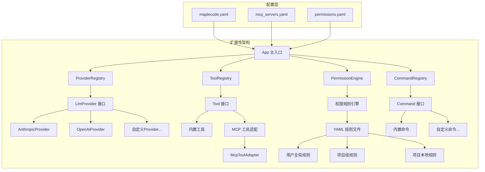

MapleCode 采用了**多层次、松耦合的扩展性架构**，通过清晰的接口抽象和工厂模式，为 LLM 提供商、工具系统、MCP 服务器集成、权限规则以及命令框架提供了标准化的扩展点。这种设计使得系统能够灵活适应不断变化的业务需求和技术生态，同时保持核心架构的稳定性。

## 核心扩展点架构概览

MapleCode 的扩展性设计遵循**开闭原则**（对扩展开放，对修改封闭），通过接口抽象和依赖注入实现组件的可替换性。系统的主要扩展点分布在四个核心领域：LLM 提供商层、工具系统层、权限规则层和命令框架层。



## LLM 提供商扩展机制

### 1. Provider 接口与注册表

LLM 提供商的扩展基于**`LlmProvider`接口**和**`ProviderRegistry`工厂模式**。`LlmProvider`接口定义了统一的流式对话补全方法，屏蔽了不同提供商的实现差异。

```java
// src/main/java/com/maplecode/provider/LlmProvider.java
public interface LlmProvider {
    /**
     * 流式输出对话补全。每个 chunk 同步推送到 sink。
     * 传输 / 协议 / HTTP 错误抛出 ProviderException。
     */
    void stream(ChatRequest request, Consumer<StreamChunk> sink);
}
```

`ProviderRegistry`作为工厂类，根据配置文件中的`protocol`字段选择相应的Provider实现。目前系统内置支持`anthropic`和`openai`两种协议。

```java
// src/main/java/com/maplecode/provider/ProviderRegistry.java
public final class ProviderRegistry {
    private final Map<String, Function<AppConfig, LlmProvider>> factories = Map.of(
        "anthropic", AnthropicProvider::new,
        "openai",    OpenAiProvider::new
    );

    public LlmProvider create(AppConfig config) {
        // 根据 protocol 字段选择对应的工厂函数
        Function<AppConfig, LlmProvider> factory = factories.get(config.protocol());
        return factory.apply(config);
    }
}
```

### 2. 新增 Provider 的实现模式

要新增一个 LLM 提供商，需要：

1. **实现`LlmProvider`接口**：创建新的Provider类，实现`stream`方法
2. **创建请求映射器**：将`ChatRequest`转换为提供商特定的HTTP请求
3. **实现流式解析器**：解析提供商的SSE流式响应
4. **注册到ProviderRegistry**：在`ProviderRegistry`中添加新的工厂映射

以`AnthropicProvider`为例，其实现模式如下：

```java
// src/main/java/com/maplecode/provider/anthropic/AnthropicProvider.java
public final class AnthropicProvider implements LlmProvider {
    private final AppConfig config;
    private final HttpClient httpClient;
    private final AnthropicRequestMapper mapper = new AnthropicRequestMapper();
    private final AnthropicStreamParser parser = new AnthropicStreamParser();
    
    @Override
    public void stream(ChatRequest request, Consumer<StreamChunk> sink) {
        HttpRequest httpReq = mapper.toHttpRequest(request, config.baseUrl(), config.apiKey(), config.timeouts().readDuration());
        // HTTP 请求发送和流式解析...
    }
}
```

## 工具系统扩展机制

### 1. Tool 接口与工具注册

工具系统通过**`Tool`接口**定义了统一的工具契约，所有工具（无论是内置工具还是MCP工具）都实现此接口。

```java
// src/main/java/com/maplecode/tool/Tool.java
public interface Tool {
    String name();              // 工具名称
    String description();       // 人类可读描述
    JsonNode inputSchema();     // 输入参数的JSON Schema
    ToolResult execute(JsonNode args, ToolContext ctx);  // 执行工具
}
```

`ToolRegistry`负责管理所有工具实例，支持工具的注册、查找和分类（只读/可写）。

```java
// src/main/java/com/maplecode/tool/ToolRegistry.java
public final class ToolRegistry {
    private final List<Tool> tools;
    private final Map<String, Tool> byName;
    private final Set<String> readOnlyNames;
    
    public ToolRegistry(List<Tool> tools) {
        // 初始化工具集合，检查名称冲突
    }
    
    public Optional<Tool> get(String name) {
        return Optional.ofNullable(byName.get(name));
    }
}
```

### 2. 内置工具与MCP工具集成

系统内置了6个核心工具：`ReadFileTool`、`WriteFileTool`、`EditFileTool`、`ExecTool`、`GlobTool`和`GrepTool`。这些工具在`App.main`中集中注册。

MCP工具通过**`McpToolAdapter`**适配为本地`Tool`接口，实现了MCP协议与本地工具系统的无缝集成。

```java
// src/main/java/com/maplecode/mcp/adapter/McpToolAdapter.java
public final class McpToolAdapter {
    public static Tool of(McpClient client, McpToolDesc desc) {
        String synthetic = synthName(client.name(), desc.name());
        return new Tool() {
            @Override public String name() { return synthetic; }  // mcp__<server>__<tool>
            @Override public String description() { return desc.description(); }
            @Override public JsonNode inputSchema() { return desc.inputSchema(); }
            @Override public ToolResult execute(JsonNode args, ToolContext ctx) {
                // 调用MCP客户端执行工具
                McpCallResult r = client.callToolFuture(desc.name(), args).get(30, TimeUnit.SECONDS);
                return r.isError() ? ToolResult.error(r.text()) : ToolResult.ok(r.text());
            }
        };
    }
}
```

## MCP 服务器集成与扩展

### 1. MCP 协议支持

MapleCode 实现了完整的 MCP（Model Context Protocol）客户端，支持两种传输方式：**Stdio**（标准输入输出）和**Streamable HTTP**。

```java
// src/main/java/com/maplecode/mcp/transport/McpTransport.java
public interface McpTransport extends AutoCloseable {
    CompletableFuture<Void> send(JsonNode frame);  // 发送JSON-RPC帧
    void onInbound(Consumer<JsonNode> inbound);    // 注册进站回调
    void close(Throwable cause);                   // 关闭传输
}
```

### 2. 多服务器并发启动

`McpClientBootstrap`负责并发启动多个MCP服务器，实现了**容错降级**机制：单个服务器失败不影响其他服务器的启动。

```java
// src/main/java/com/maplecode/mcp/client/McpClientBootstrap.java
public final class McpClientBootstrap {
    public Map<String, McpClient> start(List<McpServerSpec> specs) {
        var futures = new LinkedHashMap<String, CompletableFuture<McpClient>>();
        for (var spec : specs) {
            futures.put(spec.name(), CompletableFuture.supplyAsync(() -> tryStart(spec)));
        }
        // 等待所有服务器启动，超时后收集已完成的结果
        // 单个服务器失败时打印警告并继续
    }
}
```

### 3. 三级配置合并

MCP服务器配置支持**三级配置合并**，优先级从低到高：用户全局配置、项目级配置、项目本地配置。

```yaml
# ~/.maplecode/mcp_servers.yaml (用户全局)
servers:
  github:
    type: stdio
    command: npx
    args: ["-y", "@modelcontextprotocol/server-github"]
    env:
      GITHUB_TOKEN: ${GITHUB_TOKEN}

# <项目>/.maplecode/mcp_servers.yaml (项目级)
servers:
  notion:
    type: http
    url: https://mcp.notion.example.com/mcp
    headers:
      Authorization: "Bearer ${NOTION_TOKEN}"
```

## 权限规则扩展机制

### 1. 多层权限管道

MapleCode 实现了**五层权限防御管道**，每层检查都可以独立配置和扩展：

1. **黑名单检查**：硬编码的危险操作拦截
2. **沙箱检查**：基于工作目录的访问控制
3. **规则检查**：基于YAML配置的规则引擎
4. **模式检查**：全局权限模式（严格/默认/宽松）
5. **人在回路**：需要用户确认的交互式检查

```java
// src/main/java/com/maplecode/permission/PermissionEngine.java
public final class PermissionEngine {
    private final List<PermissionCheck> checks;
    private final PermissionMode mode;
    
    public Decision check(PermissionRequest request) {
        // 按顺序执行各层检查，任一层返回DENY则立即拒绝
    }
}
```

### 2. YAML 规则配置

权限规则通过YAML文件定义，支持**工具名**、**参数模式**和**动作**三个维度。

```yaml
# permissions.yaml
rules:
  - tool: exec
    pattern: "git *"
    action: allow
  - tool: write_file
    pattern: "/etc/*"
    action: deny
```

规则加载器支持三级配置合并，确保不同环境下的灵活配置。

## 命令框架扩展机制

### 1. Command 接口与注册表

斜杠命令系统通过**`Command`接口**定义了统一的命令契约，支持命令的注册、查找和补全。

```java
// src/main/java/com/maplecode/command/Command.java
public interface Command {
    String name();           // 命令名称
    String description();    // 命令描述
    String usage();          // 使用示例
    CommandType type();      // 命令类型
    boolean hidden();        // 是否隐藏
    List<String> aliases();  // 别名列表
    void execute(String args, CommandContext ctx);  // 执行命令
}
```

`CommandRegistry`管理所有命令实例，支持名称和别名的冲突检测。

### 2. 内置命令示例

系统内置了多个命令，如`/help`、`/memory`、`/mode`、`/tools`等。每个命令都是独立的类，通过`App.main`中的`createCommandRegistry`方法集中注册。

```java
// src/main/java/com/maplecode/App.java
static CommandRegistry createCommandRegistry(...) {
    CommandRegistry commands = new CommandRegistry();
    commands.register(new HelpCommand(commands));
    commands.register(new MemoryCommand(memoryManager));
    commands.register(new ModeCommand());
    commands.register(new ToolsCommand(tools));
    // ... 其他命令
    return commands;
}
```

## 扩展性最佳实践

### 1. 新增 LLM Provider 的步骤

1. **创建Provider包**：在`provider`包下创建新的子包（如`azure`）
2. **实现核心类**：实现`AzureProvider`、`AzureRequestMapper`、`AzureStreamParser`
3. **注册工厂**：在`ProviderRegistry`中添加`"azure", AzureProvider::new`
4. **配置支持**：在`AppConfig`中添加必要的配置字段（如`apiVersion`）

### 2. 新增内置工具的步骤

1. **实现Tool接口**：创建新的工具类，实现所有必需方法
2. **定义JSON Schema**：为工具输入参数定义完整的JSON Schema
3. **注册工具**：在`App.main`的`builtins`列表中添加新工具
4. **权限配置**：在权限规则中为新工具配置适当的访问控制

### 3. 新增MCP服务器的步骤

1. **准备服务器**：确保MCP服务器符合协议规范
2. **配置YAML**：在`mcp_servers.yaml`中添加服务器配置
3. **环境变量**：设置必要的环境变量（如API密钥）
4. **测试集成**：启动MapleCode，验证工具是否被正确发现和注册

### 4. 新增斜杠命令的步骤

1. **实现Command接口**：创建新的命令类
2. **定义命令类型**：在`CommandType`中添加适当的分类
3. **注册命令**：在`App.main`的`createCommandRegistry`中注册
4. **添加补全**：命令会自动出现在Tab补全列表中

## 扩展性设计优势

1. **松耦合**：通过接口抽象，各组件可以独立演进
2. **可测试性**：每个扩展点都可以通过Mock进行单元测试
3. **配置驱动**：通过YAML文件实现运行时配置，无需修改代码
4. **容错降级**：MCP服务器启动失败不影响核心功能
5. **多环境支持**：三级配置合并机制适应不同部署环境

## 与其他模块的关联

- **[核心抽象与接口设计](6-he-xin-chou-xiang-yu-jie-kou-she-ji)**：扩展点设计的基础
- **[统一接口 LlmProvider](7-tong-jie-kou-llmprovider)**：LLM提供商扩展的具体实现
- **[Tool 接口与内置工具](10-tool-jie-kou-yu-nei-zhi-gong-ju)**：工具系统扩展的详细说明
- **[MCP 客户端集成](12-mcp-ke-hu-duan-ji-cheng)**：MCP协议集成的完整实现
- **[五层权限防御管道](13-wu-ceng-quan-xian-fang-yu-guan-dao)**：权限系统扩展的架构设计
- **[命令框架与 REPL](20-ming-ling-kuang-jia-yu-repl)**：命令系统扩展的实现细节

通过这种**分层、接口驱动**的扩展性设计，MapleCode 能够在不修改核心架构的情况下，灵活适应新的LLM提供商、工具协议、权限需求和用户交互模式，为系统的长期演进提供了坚实的技术基础。