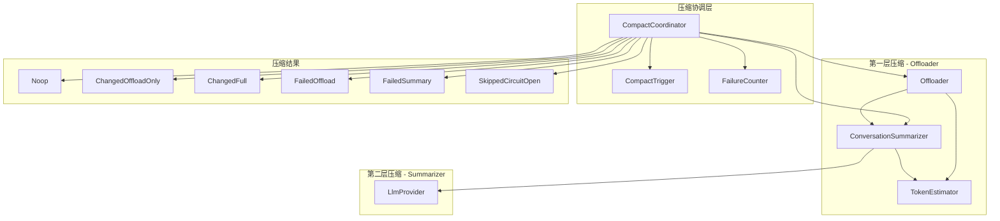
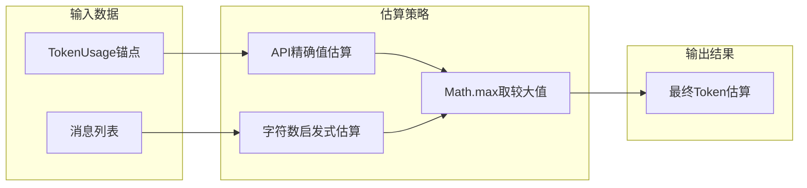
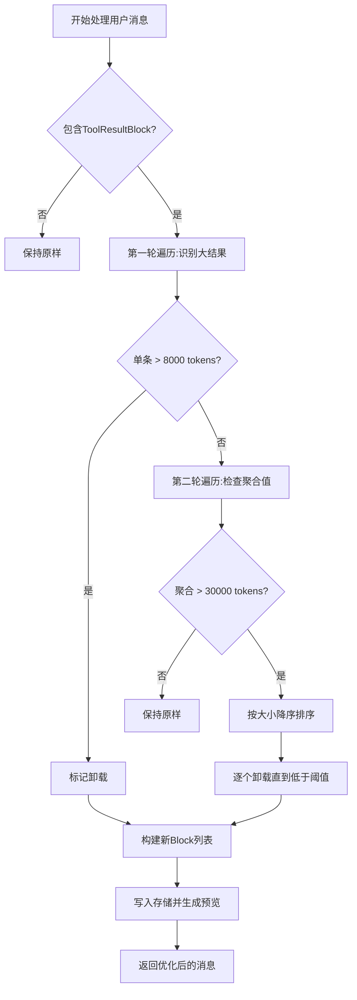
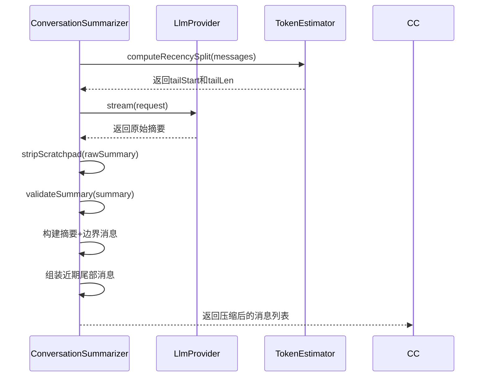
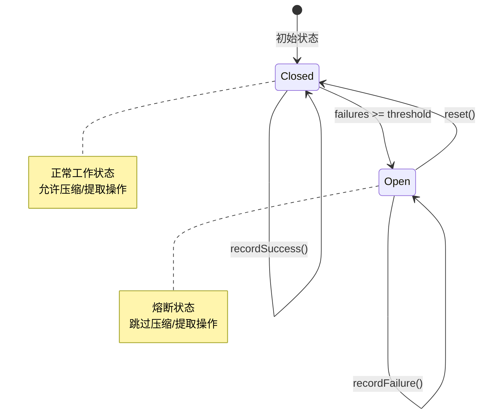
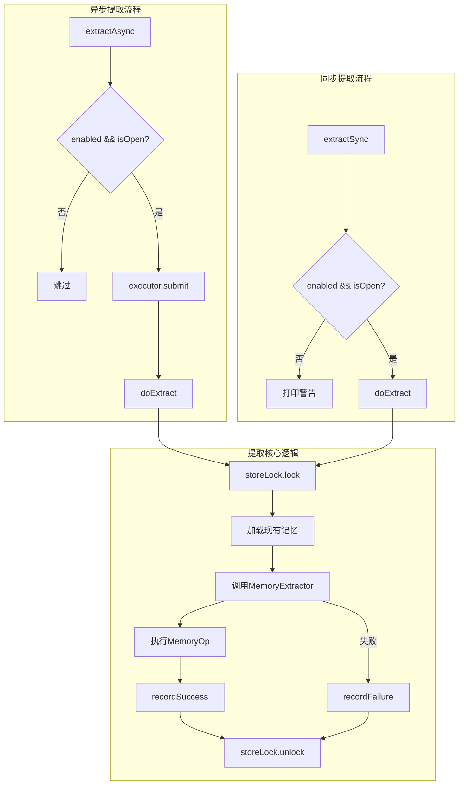
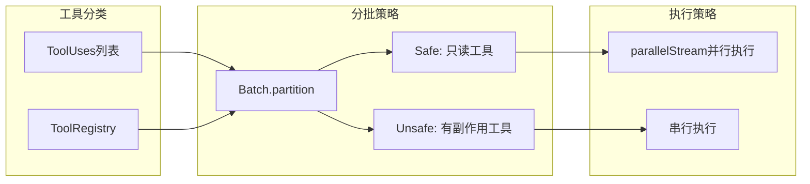
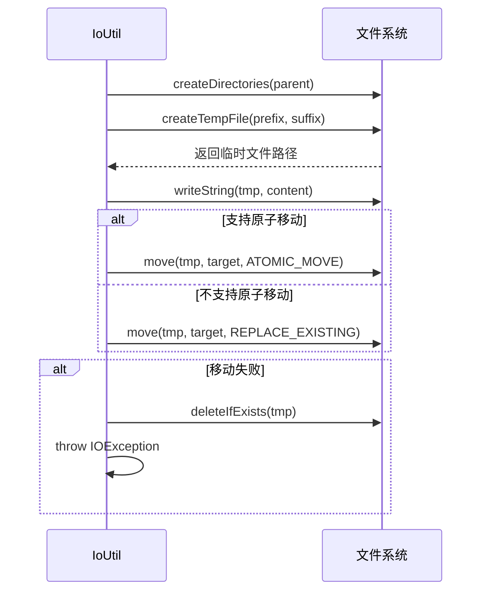
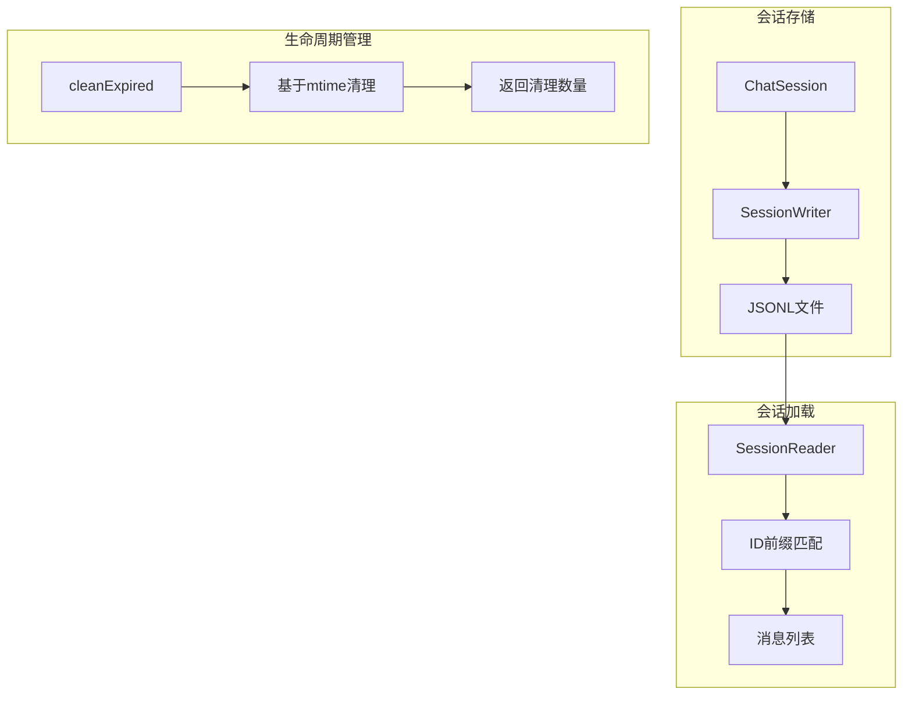

MapleCode通过多层次、多维度的优化策略，在保证功能完整性的同时实现了高效的资源管理。本文档深入剖析上下文压缩系统、内存管理机制、工具执行优化、文件I/O优化以及会话生命周期管理等核心性能设计。

## 上下文压缩系统架构

MapleCode实现了创新的**两层压缩架构**，通过智能的上下文管理来应对LLM上下文窗口的限制。该系统由`CompactCoordinator`统一协调，采用熔断器模式确保系统稳定性。



Sources: [CompactCoordinator.java](src/main/java/com/maplecode/compact/CompactCoordinator.java#L1-L128)

## Token估算与阈值管理

`TokenEstimator`是压缩系统的核心组件，通过混合策略实现精确的token估算。它结合了API返回的精确值（作为下界）和基于字符数的启发式估算（`chars/4`），取两者中的较大值作为最终估算结果。



`CompactConfig`定义了关键的性能阈值参数，这些参数直接影响压缩行为和系统性能：

| 参数 | 默认值 | 说明 |
|------|--------|------|
| `window` | 200,000 | 上下文窗口总token数 |
| `autoMargin` | 13,000 | 自动压缩触发阈值 |
| `manualMargin` | 3,000 | 手动压缩触发阈值 |
| `singleToolResultOffloadTokens` | 8,000 | 单工具结果卸载阈值 |
| `messageToolResultAggregateTokens` | 30,000 | 消息级工具结果聚合阈值 |
| `recencyTokens` | 10,000 | 近期消息保留token预算 |
| `recencyMinMessages` | 5 | 近期消息最小保留数 |
| `previewHeadLines` | 8 | 预览头行数 |
| `previewTailLines` | 4 | 预览尾行数 |
| `failureThreshold` | 3 | 熔断器失败阈值 |

Sources: [CompactConfig.java](src/main/java/com/maplecode/compact/CompactConfig.java#L1-L58), [TokenEstimator.java](src/main/java/com/maplecode/compact/TokenEstimator.java#L1-L67)

## 第一层压缩：工具结果卸载

`Offloader`实现了智能的工具结果卸载策略，通过两轮遍历识别需要卸载的内容：

1. **第一轮遍历**：识别超过单条阈值的tool result
2. **第二轮遍历**：检查剩余tool result的聚合值，按大小降序排序并逐个卸载



卸载的内容被存储到会话级目录中，文件名采用`UUID-seq.txt`格式确保唯一性和可排序性。预览内容包含文件路径、字节数、行数等元数据，便于后续重新读取。

Sources: [Offloader.java](src/main/java/com/maplecode/compact/Offloader.java#L1-L101), [CompactStorage.java](src/main/java/com/maplecode/compact/CompactStorage.java#L1-L89)

## 第二层压缩：对话摘要生成

`ConversationSummarizer`通过调用LLM生成结构化的5章节摘要，实现了对话历史的语义压缩：

1. **Intent**：用户原始目标
2. **Decisions**：关键决策和权衡
3. **Open Questions**：未解决的问题
4. **State**：当前工作状态
5. **Next Step**：下一步具体行动



近期分割点的计算采用**从末尾向前遍历**的策略，确保：
- tailTokenBudget（10,000 tokens）内的消息被保留
- 最小消息数（5条）得到保证
- tailStart落在ASSISTANT消息上，避免与摘要USER连续

Sources: [ConversationSummarizer.java](src/main/java/com/maplecode/compact/ConversationSummarizer.java#L1-L209)

## 熔断器机制

MapleCode在压缩系统和记忆系统中都实现了熔断器模式，防止级联失败：



`FailureCounter`使用`AtomicInteger`和`AtomicBoolean`确保线程安全，阈值默认为3次连续失败。成功操作会重置失败计数器，`reset()`方法用于手动恢复。

Sources: [FailureCounter.java](src/main/java/com/maplecode/compact/FailureCounter.java#L1-L38), [MemoryFailureCounter.java](src/main/java/com/maplecode/memory/MemoryFailureCounter.java#L1-L35)

## 内存管理优化

`MemoryManager`采用**单线程ExecutorService**保证串行文件I/O，避免并发写入导致的数据竞争。记忆提取操作通过`storeLock`（`ReentrantLock`）进行同步控制。



`MemoryConfig`提供关键的性能配置：
- `enabled`：启用/禁用记忆系统
- `memoryModel`：记忆提取专用模型（可选，默认复用主模型）
- `maxContextMessages`：提取时查看的最近消息数（默认10）

Sources: [MemoryManager.java](src/main/java/com/maplecode/memory/MemoryManager.java#L1-L120), [MemoryConfig.java](src/main/java/com/maplecode/memory/MemoryConfig.java#L1-L28)

## 工具执行并行优化

`Batch.partition()`实现了智能的工具执行策略，根据工具的安全性进行分批处理：



在`AgentLoop`中，安全工具使用`parallelStream()`并行执行，而非安全工具（有副作用的工具）则串行执行。执行结果通过`synchronized`块收集到线程安全的列表中。

Sources: [Batch.java](src/main/java/com/maplecode/agent/Batch.java#L1-L29), [AgentLoop.java](src/main/java/com/maplecode/agent/AgentLoop.java#L196-L215)

## 文件I/O原子性保证

`IoUtil.atomicWrite()`实现了**原子写入**模式，确保进程崩溃时不会损坏目标文件：

1. 创建临时文件（`.maplecode-*.tmp`）
2. 写入内容到临时文件
3. 原子移动到目标路径（如果支持）
4. 失败时清理临时文件



Sources: [IoUtil.java](src/main/java/com/maplecode/util/IoUtil.java#L1-L45)

## 会话生命周期管理

`SessionArchive`实现了高效的会话存储和清理机制：

1. **会话保存**：采用`JSONL`格式，支持流式写入
2. **会话加载**：支持ID前缀匹配，提高查找效率
3. **过期清理**：基于文件修改时间，自动清理过期会话



会话ID采用`时间戳-UUID前缀`格式（如`2026-07-09T143022-a1b2c3`），确保时间有序性和唯一性。`listRecent()`方法按修改时间倒序排列，支持限制返回数量。

Sources: [SessionArchive.java](src/main/java/com/maplecode/session/archive/SessionArchive.java#L1-L129)

## 配置驱动的性能调优

MapleCode通过`maplecode.yaml`配置文件提供细粒度的性能调优选项：

```yaml
# 上下文管理配置
context_window: 200000  # 上下文窗口大小
summarizer_model: claude-haiku-4-5  # 摘要专用模型

# 记忆系统配置
memory:
  enabled: true
  memory_model: claude-haiku-4-5
  max_context_messages: 10

# 超时配置
timeouts:
  connect_seconds: 10
  read_seconds: 60

# Agent限制
agent:
  max_iterations: 50
  max_consecutive_unknown: 3
```

关键配置建议：
- **context_window**：根据模型能力设置，Sonnet 4.6/Opus 4.7支持200,000 tokens
- **summarizer_model**：推荐使用Haiku 4.5，便宜且快速，适合5章节摘要任务
- **memory_model**：可选配置，默认复用主模型
- **max_iterations**：防止无限循环，默认50次

Sources: [maplecode.yaml.example](maplecode.yaml.example#L59-L79), [AppConfig.java](src/main/java/com/maplecode/config/AppConfig.java#L1-L68)

## 性能监控与诊断

`StreamPrinter`提供实时的性能监控信息，包括token用量统计：

```java
// Token用量输出示例
[usage: input=15000 out=2000 cache_create=5000 cache_read=10000]
```

关键监控指标：
- `inputTokens`：输入token数
- `outputTokens`：输出token数
- `cacheCreationTokens`：缓存创建token数
- `cacheReadTokens`：缓存读取token数

压缩结果也会实时显示：
```
[compact] applied: [compact] full compact: offloaded 3, summary covered ~45000 input tokens
```

Sources: [StreamPrinter.java](src/main/java/com/maplecode/ui/StreamPrinter.java#L76-L86)

## 最佳实践

### 上下文窗口管理
1. **定期监控token使用**：通过`/status`命令查看当前token使用情况
2. **合理设置context_window**：根据模型能力和使用场景调整
3. **使用摘要模型**：为摘要任务配置专用模型，降低成本

### 内存系统优化
1. **启用异步提取**：避免阻塞主对话流程
2. **控制上下文消息数**：根据对话复杂度调整`max_context_messages`
3. **监控熔断器状态**：注意连续失败情况

### 工具执行优化
1. **理解工具安全性**：只读工具可并行，有副作用工具需串行
2. **监控工具执行时间**：识别性能瓶颈
3. **合理设置超时**：避免长时间阻塞

### 文件I/O优化
1. **利用原子写入**：确保数据一致性
2. **定期清理会话**：使用`/clean`命令清理过期会话
3. **监控磁盘空间**：特别是工具结果卸载目录

## 故障排除

### 压缩失败
- **熔断器打开**：使用`/clear`命令重置熔断器
- **摘要质量差**：检查`summarizer_model`配置
- **卸载失败**：检查磁盘空间和文件权限

### 内存提取失败
- **连续失败3次**：熔断器打开，等待自动恢复或重启
- **模型配置错误**：检查`memory_model`配置
- **文件权限问题**：检查`.maplecode/memory/`目录权限

### 性能下降
- **上下文过长**：触发手动压缩`/compact`
- **工具执行慢**：检查工具实现和超时配置
- **会话过多**：定期清理过期会话

MapleCode的性能优化系统通过多层次、多维度的设计，在保证功能完整性的同时实现了高效的资源管理。理解这些优化机制有助于更好地使用和定制系统，充分发挥其性能潜力。