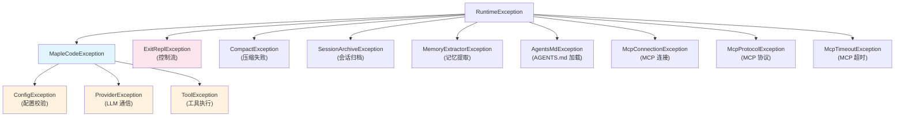

MapleCode 构建了一套**分层、分域**的异常体系，核心设计理念是：**配置阶段快速失败（fail-fast）、运行阶段优雅降级（graceful degradation）、工具层永不抛异常（never-throw）**。本文将从异常层次结构、各域错误处理策略、熔断保护机制三个维度，系统解读 MapleCode 的错误处理架构。

## 异常层次总览

MapleCode 的异常体系并非单一继承树，而是按**生命周期阶段**分为两族：一族以 `MapleCodeException` 为核心的可恢复业务异常，一族以 `RuntimeException` 为根的域内异常。设计上的关键选择是——所有自定义异常都继承 `RuntimeException`（unchecked），避免 Java 的 checked exception 繁杂传播，同时通过分层 catch 来保证错误信息的精确控制。



**`MapleCodeException`** 是三个核心业务异常的公共基类，提供统一的 `message + cause` 构造模式：

| 异常类 | 抛出时机 | 典型场景 | 终止行为 |
|---|---|---|---|
| `ConfigException` | 启动期配置加载 | 字段缺失、类型错误、环境变量未设置 | 退出码 78 |
| `ProviderException` | LLM 流式调用中 | HTTP 请求失败、非 2xx 响应 | Agent 停止，`StopReason.PROVIDER_ERROR` |
| `ToolException` | 工具执行期间 | 文件不存在、exec 非零退出、regex 非法 | 转换为 `ToolResult(isError=true)` |

Sources: [MapleCodeException.java](src/main/java/com/maplecode/error/MapleCodeException.java#L1-L11), [ConfigException.java](src/main/java/com/maplecode/error/ConfigException.java#L1-L11), [ProviderException.java](src/main/java/com/maplecode/error/ProviderException.java#L1-L11), [ToolException.java](src/main/java/com/maplecode/error/ToolException.java#L1-L15)

## 启动期：ConfigException 与退出码 78

启动阶段采用 **fail-fast** 策略——配置文件任何字段校验失败都立即抛出 `ConfigException`，由 `App.main()` 未捕获直接导致进程退出。退出码约定为 **78**（沿用 `sysexits.h` 的 `EX_CONFIG` 语义），这一约定贯穿配置加载、权限文件解析、MCP 服务器配置等所有启动期模块。

`ConfigLoader.load()` 是配置加载的入口，它在以下场景抛出 `ConfigException`：

- YAML 根节点不是 mapping（`"config root must be a mapping"`）
- 必填字段缺失（`"missing required field: <key>"`）
- 环境变量占位符 `${VAR}` 对应的环境变量不存在（`"environment variable not set: <VAR>"`）
- 枚举字段值不合法（如 `permission_mode` 不在 `strict|default|permissive` 范围内）
- YAML 文件读取失败（包装底层 `IOException`）

`expandEnv()` 方法实现环境变量展开，采用正则 `\$\{([A-Z_][A-Z0-9_]*)}` 匹配占位符并替换为 `System.getenv()` 的值，缺失时抛出 `ConfigException`。

Sources: [ConfigLoader.java](src/main/java/com/maplecode/config/ConfigLoader.java#L19-L26), [ConfigLoader.java](src/main/java/com/maplecode/config/ConfigLoader.java#L133-L145), [App.java](src/main/java/com/maplecode/App.java#L56-L63)

## 工具层：永不抛异常的 ToolExecutor

**工具系统的异常处理是整个项目中最精妙的设计之一**。`ToolExecutor.run()` 的核心承诺是：**绝不抛异常——所有失败都包成 `ToolResult(isError=true)`**。这保证了 Agent Loop 在任何工具失败时都不会被中断，而是能将错误信息回灌给模型，让它自行调整策略。

错误捕获分为三层：

1. **未知工具**：查 `ToolRegistry` 找不到工具名时，返回包含所有可用工具列表的错误信息
2. **权限拒绝**：`PermissionEngine.check()` 返回 `DENY` 时，返回 `"权限拒绝: <reason>"`
3. **执行异常**：`ToolException` 直接提取 message；其他 `Exception` 包装为 `"internal error: <ClassName>: <message>"`

```java
try {
    ToolContext ctx = ToolContext.defaults(Path.of(System.getProperty("user.dir")));
    return toolOpt.get().execute(args, ctx);
} catch (ToolException e) {
    return ToolResult.error(e.getMessage());
} catch (Exception e) {
    return ToolResult.error("internal error: " + e.getClass().getSimpleName() + ": " + e.getMessage());
}
```

各内置工具在执行过程中遇到 I/O 错误时主动抛出 `ToolException`（如 `"read failed: ..."`、`"write failed: ..."`），由 `ToolExecutor` 统一兜底转换为 `ToolResult.error`。这种分层设计使得**工具开发者只需关注业务逻辑和异常抛出，无需操心错误传播路径**。

Sources: [ToolExecutor.java](src/main/java/com/maplecode/tool/ToolExecutor.java#L29-L57), [ToolResult.java](src/main/java/com/maplecode/tool/ToolResult.java#L1-L11), [ReadFileTool.java](src/main/java/com/maplecode/tool/ReadFileTool.java)

## Agent Loop：Provider 错误与取消机制

Agent Loop 是 MapleCode 的核心控制循环，它需要处理两种运行时中断：**Provider 通信失败**和**用户主动取消**。两者采用了不同的信号传递机制。

**Provider 错误**通过 `ProviderException` 抛出，由 Agent Loop 的 `provider.stream()` 调用处捕获，转换为 `AgentEvent.AgentStop(StopReason.PROVIDER_ERROR, message)` 发送给 UI 层后正常退出循环。

**用户取消**通过两个并发信号协作：`volatile boolean cancelled` 标志位由 `cancel()` 方法设置；在流式 chunk 回调中检测到 cancelled 时，抛出 `CancellationException`，同样被 catch 后转换为 `StopReason.USER_CANCELLED`。

```java
try {
    provider.stream(req, chunk -> {
        if (cancelled) throw new CancellationException("agent cancelled");
        col.accept(chunk);
    });
} catch (CancellationException e) {
    sink.accept(new AgentEvent.AgentStop(StopReason.USER_CANCELLED, "user cancelled"));
    return;
} catch (ProviderException e) {
    sink.accept(new AgentEvent.AgentStop(StopReason.PROVIDER_ERROR, e.getMessage()));
    return;
}
```

除上述两种中断外，Agent Loop 还定义了完整的停止条件枚举 `StopReason`：

| 停止条件 | 触发场景 | 来源 |
|---|---|---|
| `END_TURN` | 模型自然结束对话 | 正常 |
| `TOOL_USE` | 模型请求调用工具 | 正常 |
| `MAX_ITERATIONS` | 达到迭代上限 | 安全保护 |
| `CONSECUTIVE_UNKNOWN` | 连续调用未知工具 | 防幻觉 |
| `PROVIDER_ERROR` | LLM 通信失败 | 异常 |
| `USER_CANCELLED` | 用户按 Esc | 中断 |
| `MAX_TOKENS` | 输出 token 超限 | Provider 返回 |

Sources: [AgentLoop.java](src/main/java/com/maplecode/agent/AgentLoop.java#L147-L167), [StreamChunk.java](src/main/java/com/maplecode/provider/StreamChunk.java#L38-L49)

## MCP 协议层：三类专用异常

MCP（Model Context Protocol）客户端引入了三个专用异常类，分别对应连接生命周期的不同故障阶段：

| 异常类 | 携带信息 | 触发点 | 最终表现 |
|---|---|---|---|
| `McpConnectionException` | message + cause | transport 连接断开、send 失败、进程退出 | `ToolResult.error("mcp[<server>] connection lost: ...")` |
| `McpProtocolException` | error code + message | 握手协议版本不匹配、server 返回 JSON-RPC error | `ToolResult.error("mcp[<server>:<tool>] server error: <msg> (code N)")` |
| `McpTimeoutException` | message | 单次调用超时（`JsonRpc` per-call timer） | `ToolResult.error("mcp[<server>:<tool>] call timed out after Ns")` |

`JsonRpc` 类是异步配对器，它通过 `ConcurrentHashMap<Long, CompletableFuture<JsonNode>>` 管理所有待响应请求。超时机制使用 `ScheduledExecutorService` 注册定时任务，超时后从 pending map 中移除 future 并 `completeExceptionally(new McpTimeoutException(...))`。

当 server 返回 JSON-RPC error frame 时，`handle()` 方法解析 `error.code` 和 `error.message`，以 `McpProtocolException` 异步完成对应的 future。连接彻底断开时，`failAllPending(McpConnectionException)` 批量失败所有 pending 请求。

**关键设计点**：MCP 异常不会直接传播到用户层。`McpToolAdapter` 将 MCP 调用包装在 try-catch 中，任何 `McpConnectionException`、`McpProtocolException`、`McpTimeoutException` 都被转换为 `ToolResult.error`，通过 `ToolExecutor` 的标准路径返回给模型。

Sources: [McpConnectionException.java](src/main/java/com/maplecode/mcp/rpc/McpConnectionException.java#L1-L7), [McpProtocolException.java](src/main/java/com/maplecode/mcp/rpc/McpProtocolException.java#L1-L18), [McpTimeoutException.java](src/main/java/com/maplecode/mcp/rpc/McpTimeoutException.java#L1-L6), [JsonRpc.java](src/main/java/com/maplecode/mcp/rpc/JsonRpc.java#L46-L83)

## 流式错误传播：StreamChunk.Error

在 LLM Provider 的流式通信中，错误不仅通过异常（`ProviderException`，用于 HTTP 层错误），还可通过**流内错误事件** `StreamChunk.Error(code, message)` 传递。这是一种 sealed interface 的子类型，与 `TextDelta`、`ToolUseEnd` 等并列。

`StreamChunk.Error` 用于处理 LLM 在流式返回过程中主动报告的错误（如内容过滤、安全拒绝等），与 `ProviderException`（传输层错误）形成互补。`MemoryExtractor` 中的典型用法：

```java
provider.stream(request, chunk -> {
    if (chunk instanceof StreamChunk.TextDelta td) {
        sb.append(td.text());
    } else if (chunk instanceof StreamChunk.Error e) {
        throw new MemoryExtractorException("Provider error: " + e.code() + " - " + e.message());
    }
});
```

流内错误最终在 `ResponseCollector` 中被捕获并记录到 `StreamChunk.MessageEnd` 的 `StopReason.ERROR` 中，触发 Agent Loop 的相应处理路径。

Sources: [StreamChunk.java](src/main/java/com/maplecode/provider/StreamChunk.java#L1-L50), [MemoryExtractor.java](src/main/java/com/maplecode/memory/MemoryExtractor.java#L159-L166)

## 熔断保护：FailureCounter 与 MemoryFailureCounter

MapleCode 在两个关键子系统中引入了**熔断器（Circuit Breaker）**模式，防止重复失败耗尽资源：

**压缩系统**的 `FailureCounter` 是可配置阈值的熔断器。当 `ConversationSummarizer` 连续失败达到阈值后，`isTripped()` 返回 true，后续自动压缩请求被跳过（`CompactResult.SkippedCircuitOpen`），仅手动 `/compact` 命令不受限制。成功时通过 `recordSuccess()` 重置计数器。`/clear` 命令调用 `reset()` 强制关闭熔断器。

**记忆系统**的 `MemoryFailureCounter` 是固定阈值（3 次）的简化版本。`isOpen()` 返回 false 时，`MemoryManager.extractAsync()` 直接跳过提取请求，避免反复调用 LLM 造成资源浪费。

两个熔断器都使用 `AtomicInteger` + `AtomicBoolean` 实现线程安全的无锁状态管理。

| 熔断器 | 所属模块 | 阈值 | 重置方式 | 熔断后行为 |
|---|---|---|---|---|
| `FailureCounter` | Compact 压缩 | 可配置 | 成功自动重置 / `/clear` 手动重置 | 跳过自动压缩 |
| `MemoryFailureCounter` | Memory 记忆 | 固定 3 | 成功自动重置 | 跳过记忆提取 |

Sources: [FailureCounter.java](src/main/java/com/maplecode/compact/FailureCounter.java#L1-L38), [MemoryFailureCounter.java](src/main/java/com/maplecode/memory/MemoryFailureCounter.java#L1-L35), [CompactCoordinator.java](src/main/java/com/maplecode/compact/CompactCoordinator.java#L79-L88), [MemoryManager.java](src/main/java/com/maplecode/memory/MemoryManager.java#L39-L44)

## 控制流异常：ExitReplException

`ExitReplException` 是一种特殊的异常——它不是错误，而是**控制流信号**。当用户在 REPL 中输入 `/exit` 命令时，`ExitCommand.execute()` 直接抛出此异常，由 `ReplLoop.run()` 的 catch 块捕获后正常退出主循环。

```java
try {
    cmd.get().execute(args, commandContext);
} catch (ExitReplException e) {
    break;  // 退出 REPL 主循环
}
```

这是 Java 中利用异常进行控制流跳转的惯用模式，尤其适合需要从深层调用栈中直接跳出多层循环的场景。`ExitReplException` 不携带任何信息（空类体），语义纯粹。

Sources: [ExitReplException.java](src/main/java/com/maplecode/command/ExitReplException.java#L1-L7), [ReplLoop.java](src/main/java/com/maplecode/ui/ReplLoop.java#L215-L220), [ExitCommand.java](src/main/java/com/maplecode/command/ExitCommand.java)

## 域内异常：Compact、Session、Memory、Agents

除核心业务异常外，各功能模块定义了自己的 `RuntimeException` 子类，用于域内错误传播：

**CompactException**：在 `ConversationSummarizer` 和 `CompactStorage` 中抛出，涵盖 LLM 摘要拒绝、必要输出段缺失、session 目录创建失败等场景。由 `CompactCoordinator` 捕获后转换为 `CompactResult.Failed*`，不影响主流程。

**SessionArchiveException**：会话归档的读写失败，包括找不到会话、文件解析错误、未知 block 类型。由 `SessionArchive` 在序列化/反序列化过程中抛出。

**MemoryExtractorException**：`MemoryExtractor` 调用 LLM 提取记忆时遇到 `StreamChunk.Error` 抛出。由 `MemoryManager.doExtract()` 的外层 catch 捕获，触发 `counter.recordFailure()` 计入熔断器。

**AgentsMdException**：`AgentsMdLoader` 加载 AGENTS.md 文件失败时抛出。但根据设计文档，即使 AGENTS.md 加载失败也不应阻塞启动——在 `App.main()` 中被静默处理为 warn 级日志。

这些域内异常的设计原则是：**异常不越界**——每个模块捕获自己的异常并转换为模块内的结果类型（`CompactResult`、空值、warn 日志），避免异常泄漏到上层调用栈。

Sources: [CompactException.java](src/main/java/com/maplecode/compact/CompactException.java#L1-L7), [SessionArchiveException.java](src/main/java/com/maplecode/session/archive/SessionArchiveException.java#L1-L7), [MemoryExtractorException.java](src/main/java/com/maplecode/memory/MemoryExtractorException.java#L1-L7), [AgentsMdException.java](src/main/java/com/maplecode/agents/AgentsMdException.java#L1-L12)

## 错误处理架构总结

MapleCode 的错误处理遵循一个清晰的分层模型：

```mermaid
graph TB
    subgraph "启动期（fail-fast）"
        Config["ConfigLoader"] -->|throw| CE["ConfigException"]
        PermFile["PermissionFileLoader"] -->|throw| CE
        McpSpec["McpServerSpec"] -->|throw| CE
        CE -->|未捕获| Exit78["进程退出 (78)"]
    end

    subgraph "运行期（graceful degradation）"
        Provider["LlmProvider.stream()"] -->|throw| PE["ProviderException"]
        PE -->|catch| AS["AgentStop(PROVIDER_ERROR)"]
        
        Tool["Tool.execute()"] -->|throw| TE["ToolException"]
        TE -->|catch| TR["ToolResult(isError=true)"]
        TR -->|回灌| Model["LLM 自行调整"]
        
        McpCall["MCP 调用"] -->|throw| McpEx["Mcp*Exception"]
        McpEx -->|catch| TR
    end

    subgraph "保护层（circuit breaker）"
        Compact["CompactCoordinator"] -->|连续失败| CB1["FailureCounter"]
        Memory["MemoryManager"] -->|连续失败| CB2["MemoryFailureCounter"]
        CB1 -->|熔断| SkipCompact["跳过自动压缩"]
        CB2 -->|熔断| SkipMemory["跳过记忆提取"]
    end

    subgraph "控制流（signal）"
        ExitCmd["/exit 命令"] -->|throw| ExitEx["ExitReplException"]
        ExitEx -->|catch| BreakLoop["退出 REPL"]
    end
```



**设计原则总结**：

1. **unchecked 优先**：所有自定义异常均为 `RuntimeException`，避免 checked exception 的签名污染
2. **异常不越界**：每个模块捕获自己的异常，转换为结果类型或日志，不向上传播
3. **ToolExecutor 兜底**：工具层是最终防线，所有异常都被捕获并转换为 `ToolResult.error`
4. **熔断器保护**：对 LLM 调用密集的子系统（压缩、记忆）实施熔断，防止雪崩
5. **退出码约定**：启动期错误统一退出码 78，便于 CI/CD 和脚本判断

## 下一步阅读

- 了解 Agent Loop 的完整控制流程：[Agent Loop 实现](16-agent-loop-shi-xian)
- 深入上下文压缩的熔断机制：[上下文管理与压缩](17-shang-xia-wen-guan-li-yu-ya-suo)
- 探索 MCP 客户端的连接管理：[MCP 客户端集成](12-mcp-ke-hu-duan-ji-cheng)
- 理解测试如何覆盖异常路径：[测试策略与质量保证](24-ce-shi-ce-lue-yu-zhi-liang-bao-zheng)