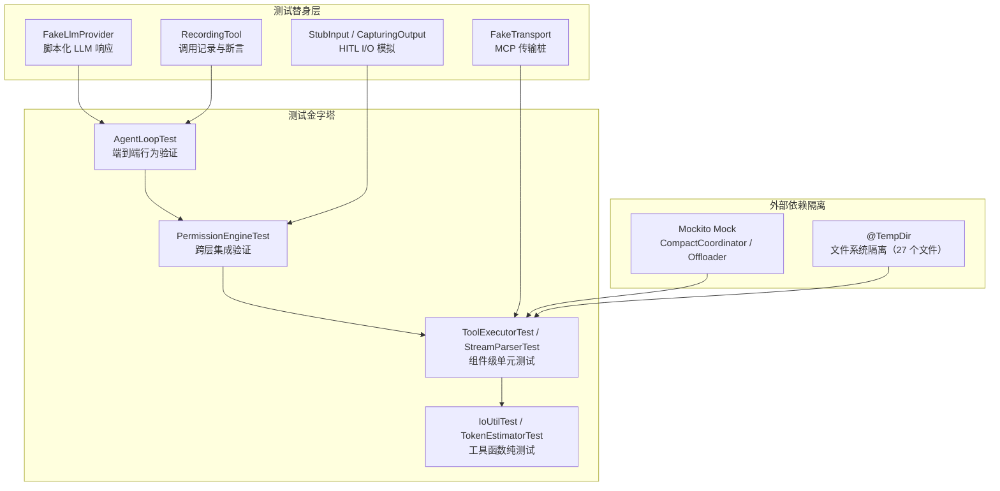
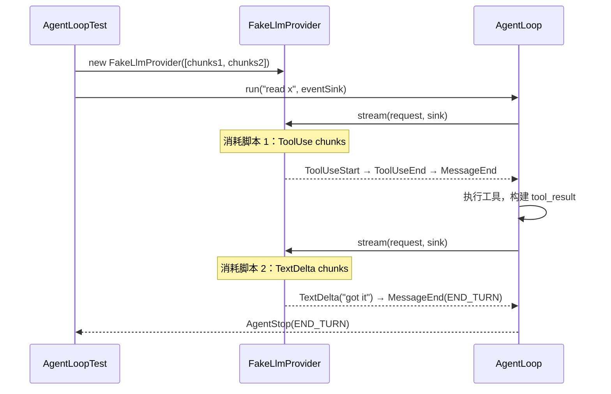
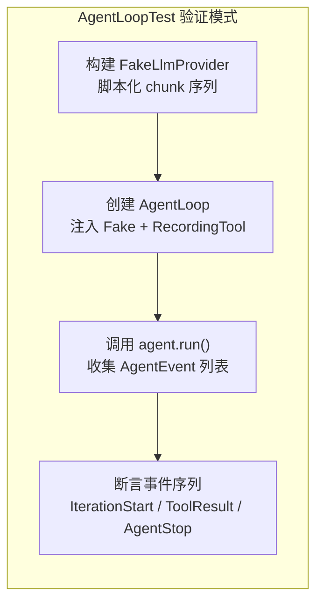

本页全面剖析 Maple Code Java 的测试体系——从测试替身（Test Double）的设计哲学、到各模块的测试覆盖分布、再到跨层验证策略。项目采用 **纯单元测试** 路线，以手写 Fake 实现为核心骨架，辅以 Mockito 处理复杂协作者，在不依赖外部服务、不启动 Spring 上下文的前提下，对 Agent Loop、权限管道、SSE 流式解析、MCP 协议等关键路径实现了深度行为验证。

## 测试体系全景

Maple Code Java 的测试仓库共包含 **116 个测试文件、566 个 `@Test` 方法**，覆盖从底层 I/O 工具到顶层 Agent Loop 的完整栈。测试框架选用 JUnit 5（`junit-jupiter 5.11.3`）+ Mockito 5.20，构建工具为 Maven Surefire 3.5.2。

测试不包含任何集成测试或端到端测试——所有验证均在 JVM 进程内完成，不启动 HTTP 服务器、不连接真实 LLM API、不依赖文件系统全局状态。Sources: [pom.xml](pom.xml#L38-L43)

## 测试替身设计哲学

项目偏好 **手写 Fake 实现** 而非 Mockito 代理，原因是核心抽象（`LlmProvider`、`Tool`、`McpTransport`）的行为契约需要精确控制——Fake 可以编程式地注入预定义的响应序列、记录所有调用细节、甚至模拟并发时序。

### FakeLlmProvider：脚本化 LLM 响应

`FakeLlmProvider` 是测试体系的核心支柱，它接受一个 `List<List<StreamChunk>>` 参数——每次 `stream()` 调用消耗一个脚本（`List<StreamChunk>`），将所有 chunk 推送给 sink。脚本耗尽后抛出 `NoSuchElementException`。

这种设计使得测试可以精确编排多轮对话序列：第一轮返回 `ToolUse` 触发工具调用，第二轮返回 `TextDelta` 完成回复。AgentLoop 的迭代逻辑、取消机制、迭代上限等场景全部依赖此 Fake 进行验证。

Sources: [FakeLlmProvider.java](src/test/java/com/maplecode/fake/FakeLlmProvider.java#L1-L38), [FakeLlmProviderTest.java](src/test/java/com/maplecode/fake/FakeLlmProviderTest.java#L1-L52)

### RecordingTool：调用记录与断言

`RecordingTool` 记录每次 `execute()` 调用的参数（`args`）、上下文（`ToolContext`）和执行线程名，返回预置的 `ToolResult`。其内部使用 `CopyOnWriteArrayList` 确保并发安全——这与 AgentLoop 的批量工具并行执行机制形成对应。

测试通过 `tool.calls().size()` 验证调用次数，通过 `tool.calls().get(i).args()` 验证参数传递，通过 `tool.calls().get(i).threadName()` 验证并发执行的线程模型。

Sources: [RecordingTool.java](src/test/java/com/maplecode/fake/RecordingTool.java#L1-L46), [RecordingToolTest.java](src/test/java/com/maplecode/fake/RecordingToolTest.java#L1-L35)

### 内联 Fake：按需定制的测试桩

对于 MCP 传输层、HITL 输入输出等场景，项目采用 **内联 Fake** 模式——在测试类内部定义匿名类或 record 实现，只覆盖测试所需的行为：

| 测试场景 | Fake 实现 | 位置 | 核心能力 |
|---------|---------|------|---------|
| MCP 客户端 | `FakeTransport` | `McpClientTest` | `sent` 队列记录发出帧，`deliver()` 模拟接收 |
| HITL 交互 | `StubInput` | `HitlCheckTest` | 预置选择队列，模拟用户按键 |
| HITL 输出 | `CapturingOutput` | `HitlCheckTest` | 捕获所有打印行，验证提示信息 |
| Provider 异常 | 匿名 `LlmProvider` | `AgentLoopTest` | 直接抛出 `ProviderException` |
| Provider 间谍 | 匿名 `LlmProvider` | `AgentLoopTest` | 捕获 `ChatRequest` 后转发 chunk |

Sources: [McpClientTest.java](src/test/java/com/maplecode/mcp/client/McpClientTest.java#L22-L47), [HitlCheckTest.java](src/test/java/com/maplecode/permission/HitlCheckTest.java#L12-L32)

## 模块测试分布与覆盖策略

测试文件数量按模块分布如下，呈现出明显的 **安全关键路径倾斜**——权限系统和命令框架占据最多测试资源：

| 模块 | 测试文件数 | 核心测试重点 |
|------|-----------|------------|
| permission | 15 | 五层管道独立验证、沙箱逃逸、HITL 交互、规则匹配 |
| command | 15 | 每个斜杠命令的解析与执行 |
| provider | 14 | Anthropic/OpenAI 的请求映射、SSE 流式解析、使用量统计 |
| tool | 12 | 内置工具行为、权限集成、注册表冲突 |
| mcp | 9 | JSON-RPC 协议、传输层、工具适配器 |
| prompt | 7 | 提示词组装、Plan 模式提醒、动态上下文 |
| memory | 7 | 记忆提取、熔断机制、持久化 |
| agents | 7 | agents.md 加载、层级解析、include 指令 |
| compact | 6 | 上下文压缩协调、token 估算、失败计数器 |
| session | 5 | 消息追加、归档读写、不可变性保证 |
| ui | 5 | 流式打印、转义控制、状态栏 |
| agent | 4 | AgentLoop 核心行为、批量执行、取消机制 |
| config | 3 | 配置加载、废弃字段警告、权限模式 |
| util | 1 | 原子写入 |
| http | 1 | SSE 流读取器 |

Sources: [src/test/java/com/maplecode](src/test/java/com/maplecode)

## 核心模块测试深度解析

### AgentLoop：事件驱动的行为验证

AgentLoop 是系统的核心循环，其测试采用 **事件收集-断言** 模式：测试通过 `events::add` 收集所有 `AgentEvent`，然后对事件序列进行结构化断言。

**关键测试场景**：

- **空响应**：验证 `AgentStop` 事件携带正确的 `StopReason`
- **取消机制**：在流式传输中调用 `cancel()`，验证后续 `TextDelta` 被抑制、`StopReason` 为 `USER_CANCELLED`
- **工具调用后取消**：验证取消后工具不会被执行（`RecordingTool.calls().size() == 0`）
- **单工具调用**：验证产生 2 个 `IterationStart`、1 个 `ToolResult`、session 包含 4 条消息
- **三轮迭代**：验证 3 个工具调用后正常结束
- **批量执行**：验证两个 `read_file` 并行执行（`BatchStart` 事件存在），两个 `exec` 串行执行
- **迭代上限**：配置 `maxIterations=3`，验证第 4 轮不执行，`StopReason` 为 `MAX_ITERATIONS`
- **连续未知工具**：3 次未知工具后触发 `CONSECUTIVE_UNKNOWN` 停止
- **Provider 异常**：验证 `ProviderException` 被捕获为 `PROVIDER_ERROR`
- **Plan 模式**：验证只传递只读工具、不安全工具在执行器层被拒绝

Sources: [AgentLoopTest.java](src/test/java/com/maplecode/agent/AgentLoopTest.java#L1-L428)

### 权限管道：五层独立验证

权限系统是测试覆盖最密集的模块（15 个文件），采用 **分层独立 + 组合验证** 策略。每一层（`BlacklistCheck`、`SandboxCheck`、`RuleCheck`、`ModeCheck`、`HitlCheck`）都有独立测试文件，`PermissionEngineTest` 验证层间编排逻辑。

**分层测试矩阵**：

| 检查层 | 测试文件 | 验证重点 |
|--------|---------|---------|
| BlacklistCheck | `BlacklistCheckTest` | 黑名单模式匹配、通配符 |
| SandboxCheck | `SandboxCheckTest` | 相对路径、绝对路径逃逸、`..` 遍历、符号链接逃逸、glob 模式 |
| RuleCheck | `RuleCheckTest` | Shell glob 匹配、路径 glob、首次匹配优先、未匹配返回 undecided |
| ModeCheck | `ModeCheckTest` | DEFAULT/PERMISSIVE/STRICT 模式下的默认行为 |
| HitlCheck | `HitlCheckTest` | 选择映射（本次允许/会话允许/项目允许/拒绝）、只读工具自动放行、会话级短路 |
| PermissionEngine | `PermissionEngineTest` | 首个决策层短路、全部 undecided 返回 deny、模式切换、会话级允许/拒绝集合、项目级持久化 |

`SandboxCheckTest` 尤其值得关注——它测试了符号链接逃逸这一真实安全场景：创建指向沙箱外文件的符号链接，验证被正确拦截。

Sources: [PermissionEngineTest.java](src/test/java/com/maplecode/permission/PermissionEngineTest.java#L1-L119), [HitlCheckTest.java](src/test/java/com/maplecode/permission/HitlCheckTest.java#L1-L138), [SandboxCheckTest.java](src/test/java/com/maplecode/permission/SandboxCheckTest.java#L1-L112), [RuleCheckTest.java](src/test/java/com/maplecode/permission/RuleCheckTest.java#L1-L88)

### SSE 流式解析：原始协议数据喂入

Provider 层的测试直接向解析器喂入原始 SSE 行数据（`event:` + `data:` 格式），验证输出的 `StreamChunk` 序列正确。这种 **黑盒解析验证** 模式确保了解析器与 LLM API 的协议兼容性。

Anthropic 解析器测试覆盖了：`message_start` → `content_block_start` → `content_block_delta`（文本）→ `content_block_stop` → `message_stop` 的完整序列，以及 `tool_use` 块、`thinking` 块、`cache_creation` / `cache_read` 使用量、`error` 事件等边界场景。

OpenAI 解析器测试则覆盖了 `choices[].delta.content` 累积、`finish_reason` 映射、`[DONE]` 终止标记、`tool_calls` 增量 JSON 等特有协议行为。

Sources: [AnthropicStreamParserTest.java](src/test/java/com/maplecode/provider/anthropic/AnthropicStreamParserTest.java#L1-L80), [OpenAiStreamParserTest.java](src/test/java/com/maplecode/provider/openai/OpenAiStreamParserTest.java#L1-L60)

### 上下文压缩：Mockito 协作验证

`CompactCoordinatorTest` 是少数大量使用 Mockito 的测试文件——它通过 `mock(ChatSession.class)` 和 `mock(LlmProvider.class)` 验证协调器在不同 token 预算下的决策逻辑：

- **低于阈值**：返回 `Noop`，不调用 Offloader 和 Summarizer
- **仅卸载**：调用 Offloader 但不调用 Summarizer
- **卸载+摘要**：两者都调用，验证消息替换
- **摘要失败**：验证 `FailureCounter` 递增、熔断逻辑

这种场景适合 Mockito，因为 `CompactCoordinator` 的协作者（`Offloader`、`ConversationSummarizer`）是内部实现细节，不值得为其编写完整 Fake。

Sources: [CompactCoordinatorTest.java](src/test/java/com/maplecode/compact/CompactCoordinatorTest.java#L1-L80)

## 文件系统隔离策略

项目中有 **27 个测试文件** 使用 JUnit 5 的 `@TempDir` 注解，每次测试运行自动创建临时目录并在结束后清理。这一策略覆盖了所有涉及文件 I/O 的测试场景：

- **工具测试**：`ReadFileToolTest`、`WriteFileToolTest`、`EditFileToolTest`、`ExecToolTest`、`GlobToolTest`、`GrepToolTest` 在临时目录中创建文件、执行操作、验证结果
- **配置测试**：`ConfigLoaderTest` 在临时目录中写入 YAML 配置文件，验证解析逻辑
- **权限测试**：`SandboxCheckTest` 在临时目录中创建符号链接、测试沙箱逃逸
- **记忆测试**：`MemoryManagerTest` 使用独立的 `userDir` 和 `projectDir`
- **压缩测试**：`CompactStorageTest`、`CompactCoordinatorTest` 在临时目录中存储压缩快照
- **I/O 工具测试**：`IoUtilTest` 验证原子写入在各种异常场景下的数据安全性

Sources: [ReadFileToolTest.java](src/test/java/com/maplecode/tool/ReadFileToolTest.java#L1-L74), [IoUtilTest.java](src/test/java/com/maplecode/util/IoUtilTest.java#L1-L69)

## 异常路径覆盖

项目中有 25 个测试文件使用 `assertThrows` 或 `assertDoesNotThrow`，覆盖了以下异常类别：

| 异常类型 | 触发场景 | 测试验证 |
|---------|---------|---------|
| `ConfigException` | 配置缺失必填字段、未知协议、无效 AgentConfig 参数 | 消息内容精确匹配 |
| `ProviderException` | LLM Provider 网络错误 | 转化为 `PROVIDER_ERROR` 停止原因 |
| `ToolException` | 工具执行失败 | 返回 `ToolResult.error`，不传播异常 |
| `IOException` | 原子写入目标不可写 | 原始文件内容保持不变 |
| `NoSuchElementException` | FakeLlmProvider 脚本耗尽 | 测试预期行为 |
| `UnsupportedOperationException` | 向 session 消息列表添加元素 | 不可变性保证 |

值得注意的是 `IoUtilTest` 中的 **故障注入测试**：通过创建一个指向文件的符号链接，然后尝试在其子路径写入，强制触发 `IOException`，验证原始文件内容不被破坏。Sources: [IoUtilTest.java](src/test/java/com/maplecode/util/IoUtilTest.java#L55-L69)

## 测试设计模式总结

项目形成了几个可复用的测试设计模式：

| 模式 | 适用场景 | 优势 | 典型代表 |
|------|---------|------|---------|
| 脚本化 Fake | 多轮交互、时序敏感 | 精确控制响应序列，可复现任意场景 | `AgentLoopTest` |
| 录制-验证 | 工具调用验证 | 不侵入生产代码，线程安全 | `AgentLoopTest`（批量执行） |
| 分层独立测试 | 管道/链式架构 | 每层可独立回归，组合测试覆盖编排 | 权限系统 15 个测试文件 |
| 原始协议喂入 | 协议解析器 | 黑盒验证，与生产输入格式一致 | `AnthropicStreamParserTest` |
| Mockito 协作 | 内部实现细节协作者 | 轻量级，避免编写完整 Fake | `CompactCoordinatorTest` |
| @TempDir 隔离 | 文件系统操作 | 自动清理，测试间零干扰 | 27 个文件 |

## 构建与运行

测试通过 Maven Surefire 插件执行，命令为 `mvn test`。Surefire 配置使用默认设置（版本 3.5.2），自动发现并执行所有 `*Test.java` 文件中的 `@Test` 方法。项目不区分单元测试和集成测试——所有测试均为纯 JVM 内单元测试，执行时间通常在数秒内完成。

Sources: [pom.xml](pom.xml#L78-L81)

## Next Steps

深入理解测试策略后，建议继续阅读以下页面以掌握完整质量保证体系：

- [错误处理与异常设计](23-cuo-wu-chu-li-yu-yi-chang-she-ji)：了解测试中验证的异常传播路径在生产代码中的设计原理
- [五层权限防御管道](13-wu-ceng-quan-xian-fang-yu-guan-dao)：权限测试的被测对象——五层管道的架构设计
- [Agent Loop 实现](16-agent-loop-shi-xian)：AgentLoopTest 的被测对象——核心循环的完整实现
- [调试与故障排除](25-diao-shi-yu-gu-zhang-pai-chu)：当测试失败时的调试方法论
- [代码规范与约定](26-dai-ma-gui-fan-yu-yue-ding)：测试代码本身遵循的编码规范