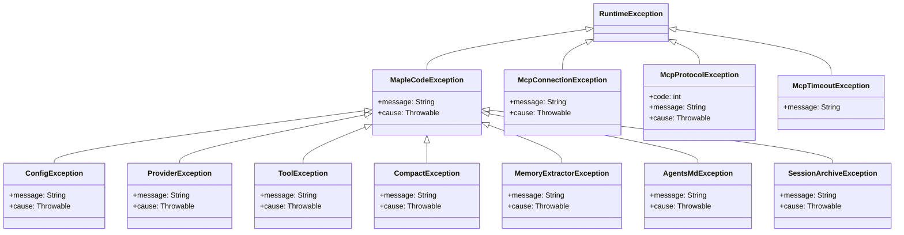
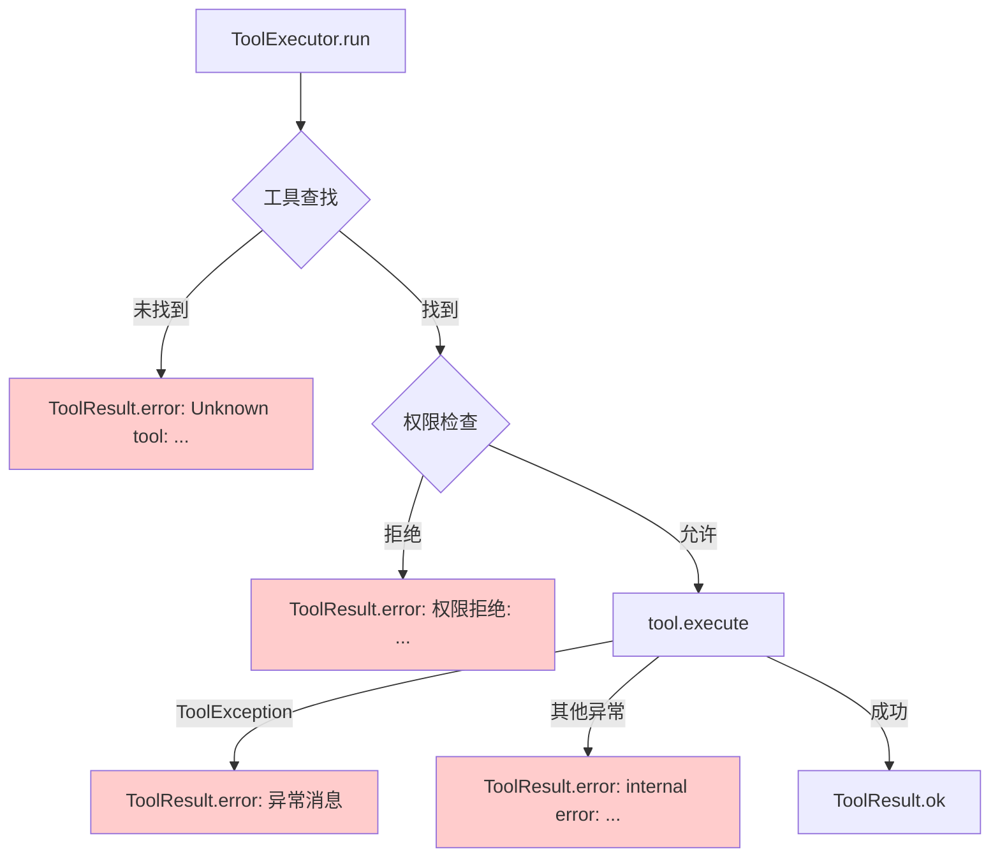

本指南为MapleCode开发者和用户提供系统化的调试方法论。基于项目的极简设计哲学，MapleCode采用**日志输出到stderr + 结构化错误返回**的诊断模式，而非传统的日志框架。本文将从架构层面解析调试策略，提供从配置验证到运行时故障的完整排查路径。

## 诊断输出架构

MapleCode的诊断系统遵循**输出分离原则**：所有调试信息写入stderr，用户交互内容写入stdout。这种设计确保了MCP协议的纯净性（stdout用于JSON-RPC通信）和用户界面的清晰度。

**核心输出机制**：
- **System.err**：内部诊断、警告和调试信息
- **System.out**：用户交互内容（通过StreamPrinter）
- **工具错误**：通过`ToolResult.error()`返回给模型，不中断Agent Loop

**诊断前缀约定**：
| 前缀 | 组件 | 示例 |
|------|------|------|
| `[mcp:<server>]` | MCP客户端 | `[mcp:github] WARN: failed to load tools` |
| `[compact]` | 上下文压缩 | `[compact] offload failed: ...` |
| `[memory]` | 长期记忆 | `[memory] WARN: extraction failed` |
| `[session]` | 会话管理 | `[session] cleaned 3 expired archives` |
| `[agent]` | Agent Loop | `[agent stopped: USER_CANCELLED]` |

Sources: [App.java](src/main/java/com/maplecode/App.java#L55-L65), [StreamPrinter.java](src/main/java/com/maplecode/ui/StreamPrinter.java#L85-L90), [McpClientBootstrap.java](src/main/java/com/maplecode/mcp/client/McpClientBootstrap.java#L70-L75)

## 异常层次结构

MapleCode定义了清晰的异常层次结构，每个层次对应不同的故障域：



**异常处理策略**：
- **MapleCodeException**：运行时异常基类，所有可恢复的业务异常
- **ConfigException**：配置加载阶段错误，退出码78（EX_CONFIG）
- **ProviderException**：LLM提供商通信错误，打印但不中断REPL
- **ToolException**：工具执行失败，包装为`ToolResult.error()`返回给模型
- **MCP异常**：连接、协议、超时错误，降级为警告信息

Sources: [MapleCodeException.java](src/main/java/com/maplecode/error/MapleCodeException.java), [ConfigException.java](src/main/java/com/maplecode/error/ConfigException.java), [ProviderException.java](src/main/java/com/maplecode/error/ProviderException.java), [ToolException.java](src/main/java/com/maplecode/error/ToolException.java)

## 配置调试

配置错误是启动失败最常见的原因。MapleCode提供严格的配置验证和清晰的错误信息。

### 配置加载流程

```mermaid
flowchart TD
    A[启动] --> B{配置文件查找}
    B -->|--config参数| C[指定路径]
    B -->./maplecode.yaml| D[当前目录]
    B -->~/.maplecode/config.yaml| E[用户目录]
    C --> F[ConfigLoader.load]
    D --> F
    E --> F
    F --> G{YAML解析}
    G -->|格式错误| H[ConfigException: config root must be a mapping]
    G -->|成功| I{必需字段验证}
    I -->|缺失| J[ConfigException: missing required field: ...]
    I -->|成功| K{环境变量展开}
    K -->|未设置| L[ConfigException: environment variable not set: ...]
    K -->|成功| M[AppConfig创建]
    M --> N[ThinkingConfig验证]
    N -->|不兼容| O[ConfigException: ...]
    N -->|成功| P[配置完成]
    
    style H fill:#ffcccc
    style J fill:#ffcccc
    style L fill:#ffcccc
    style O fill:#ffcccc
```

### 常见配置问题

**1. API密钥问题**
```yaml
# 错误：环境变量未设置
api_key: ${NON_EXISTENT_VAR}

# 正确：确保环境变量已导出
export ANTHROPIC_API_KEY=sk-ant-...
```
**错误信息**：`ConfigException: environment variable not set: NON_EXISTENT_VAR`

**2. Extended Thinking兼容性**
```yaml
# 错误：Opus 4.7不支持type: enabled
extended_thinking:
  type: enabled
  budget_tokens: 500

# 正确：使用adaptive类型
extended_thinking:
  type: adaptive
  effort: high
```
**错误信息**：`ConfigException: extended_thinking.type=enabled requires budget_tokens >= 1024`

**3. 权限模式配置**
```yaml
# 错误：拼写错误
permission_mode: stricts

# 正确：strict|default|permissive
permission_mode: strict
```
**错误信息**：`ConfigException: permission_mode must be strict|default|permissive, got: stricts`

Sources: [ConfigLoader.java](src/main/java/com/maplecode/config/ConfigLoader.java#L25-L50), [ConfigLoaderTest.java](src/test/java/com/maplecode/config/ConfigLoaderTest.java#L55-L80)

## 运行时调试

### Agent Loop调试

Agent Loop是系统的核心，调试时需关注迭代状态、工具调用和停止原因。

**停止原因枚举**：
| 原因 | 触发条件 | 调试方法 |
|------|----------|----------|
| `END_TURN` | 模型正常结束 | 正常情况 |
| `TOOL_USE` | 请求工具调用 | 检查工具执行结果 |
| `USER_CANCELLED` | 用户按Esc取消 | 检查EscapeController |
| `MAX_ITERATIONS` | 达到最大迭代次数 | 调整`max_iterations`配置 |
| `CONSECUTIVE_UNKNOWN` | 连续未知工具调用 | 检查工具注册表 |
| `PROVIDER_ERROR` | LLM提供商错误 | 查看ProviderException详情 |

**调试技巧**：
1. **监听AgentEvent**：通过Consumer<AgentEvent>订阅所有事件
2. **检查迭代计数**：`IterationStart`事件包含迭代编号
3. **验证工具调用**：`ToolCallStart`和`ToolResult`事件提供详细信息
4. **监控token使用**：`IterationEnd`事件包含TokenUsage

Sources: [AgentEvent.java](src/main/java/com/maplecode/agent/AgentEvent.java#L25-L50), [AgentLoop.java](src/main/java/com/maplecode/agent/AgentLoop.java#L85-L120)

### 工具执行调试

工具执行通过ToolExecutor统一管理，所有错误都包装为ToolResult。

**错误处理流程**：


**常见工具问题**：
1. **路径权限错误**：SandboxCheck拦截项目目录外的文件操作
2. **命令黑名单**：BlacklistCheck拦截高危命令（如`rm -rf /`）
3. **文件不存在**：ReadFileTool返回错误信息
4. **正则表达式错误**：GrepTool返回regex无效信息

Sources: [ToolExecutor.java](src/main/java/com/maplecode/tool/ToolExecutor.java#L25-L55), [ToolException.java](src/main/java/com/maplecode/error/ToolException.java#L5-L15)

### MCP客户端调试

MCP集成是故障高发区域，涉及进程管理、网络通信和协议解析。

**诊断输出**：
```bash
# MCP启动信息
[mcp] connected: github (15 tools), notion (8 tools) — total 23 tools

# 单个服务器警告
[mcp:bootstrap] WARN: server 'github' transport creation failed: ...

# 进程日志（重定向到文件）
/tmp/mcp-github.log
```

**故障排查步骤**：
1. **检查服务器配置**：验证`mcp_servers.yaml`语法和路径
2. **验证环境变量**：确保`${ENV_VAR}`已正确设置
3. **查看进程日志**：检查`/tmp/mcp-<server>.log`文件
4. **测试连接**：使用`/tools`命令验证工具加载
5. **检查超时**：调整`startup_timeout_ms`配置

**MCP异常类型**：
- **McpConnectionException**：进程启动失败、连接断开
- **McpProtocolException**：JSON-RPC协议错误（包含错误码）
- **McpTimeoutException**：操作超时

Sources: [McpClientBootstrap.java](src/main/java/com/maplecode/mcp/client/McpClientBootstrap.java#L60-L80), [Stdio.java](src/main/java/com/maplecode/mcp/transport/Stdio.java#L50-L65), [McpConnectionException.java](src/main/java/com/maplecode/mcp/rpc/McpConnectionException.java)

### 权限系统调试

五层权限管道可能产生复杂的交互，需要逐层分析。

**调试命令**：
```bash
# 查看当前权限模式
/mode

# 切换权限模式（临时，不持久化）
/mode strict
/mode default
/mode permissive
```

**权限决策追踪**：
1. **BlacklistCheck**：检查`exec`命令是否匹配黑名单正则
2. **SandboxCheck**：验证文件路径是否在项目目录内（解析符号链接）
3. **RuleCheck**：匹配三层YAML规则（用户全局 → 项目 → 项目本地）
4. **ModeCheck**：根据权限模式决定未匹配规则的处理
5. **HitlCheck**：在default模式下弹出人机交互提示

**规则调试**：
```yaml
# 权限规则示例
rules:
  - tool: exec
    pattern: "git *"  # shell glob模式
    action: allow
  - tool: read_file
    pattern: "**/.env"  # 标准glob模式
    action: deny
```

**常见问题**：
- **路径转义**：符号链接可能导致SandboxCheck误判
- **模式匹配**：exec工具使用shell glob，其他工具使用PathMatcher
- **规则优先级**：local > project > user，first-match-wins

Sources: [PermissionEngine.java](src/main/java/com/maplecode/permission/PermissionEngine.java#L25-L40), [PermissionCheck.java](src/main/java/com/maplecode/permission/PermissionCheck.java)

## 测试与调试工具

MapleCode提供专门的测试工具用于调试和验证。

### FakeLlmProvider

用于单元测试的LLM模拟器，按脚本返回预定义的chunks序列。

```java
// 创建测试脚本
List<List<StreamChunk>> scripts = List.of(
    // 第一次调用：返回工具调用
    List.of(
        new StreamChunk.ToolUseStart("t1", "read_file"),
        new StreamChunk.ToolUseEnd("t1", "read_file", mapper.readTree("{}")),
        new StreamChunk.MessageEnd(StopReason.TOOL_USE, null)
    ),
    // 第二次调用：返回文本响应
    List.of(
        new StreamChunk.TextDelta("工具执行完成"),
        new StreamChunk.MessageEnd(StopReason.END_TURN, null)
    )
);

LlmProvider fake = new FakeLlmProvider(scripts);
```

**使用场景**：
- 测试Agent Loop迭代逻辑
- 验证工具调用流程
- 模拟错误场景

### RecordingTool

用于记录工具调用的测试工具，验证调用次数、参数和线程。

```java
RecordingTool tool = new RecordingTool("read_file", ToolResult.ok("content"));

// 执行后检查调用记录
List<Call> calls = tool.calls();
assertEquals(2, calls.size());
assertEquals("{}", calls.get(0).args().toString());
```

**验证点**：
- 工具是否被调用
- 调用次数是否正确
- 参数是否正确传递
- 并发调用时的线程信息

Sources: [FakeLlmProvider.java](src/test/java/com/maplecode/fake/FakeLlmProvider.java#L15-L35), [RecordingTool.java](src/test/java/com/maplecode/fake/RecordingTool.java#L20-L45)

## 性能调试

### Token使用监控

通过TokenUsage事件监控资源消耗：

```java
// 监听token使用
Consumer<TokenUsage> usageSink = usage -> {
    System.out.printf("输入: %d, 输出: %d, 缓存创建: %d, 缓存读取: %d%n",
        usage.inputTokens(), usage.outputTokens(),
        usage.cacheCreationTokens(), usage.cacheReadTokens());
};

// 在AgentLoop中注册
AgentLoop agent = new AgentLoop(provider, registry, executor, session, config, usageSink);
```

### 上下文压缩调试

压缩系统有三层触发机制：

1. **自动触发**：token数接近上下文窗口
2. **手动触发**：`/compact`命令
3. **熔断机制**：连续失败后禁用自动压缩

**调试信息**：
```bash
# 压缩结果
[compact] applied: [compact] offloaded 5 tool result(s)
[compact] applied: [compact] full compact: offloaded 3, summary covered ~15000 input tokens

# 压缩失败
[compact] summary failed (2 consecutive): model returned incomplete summary

# 熔断器激活
[compact] circuit open (3 failures); auto-compact disabled this session
```

**配置调整**：
```yaml
# 调试时临时调小上下文窗口
context_window: 30000  # 触发频繁压缩

# 指定摘要模型（更便宜）
summarizer_model: claude-haiku-4-5
```

Sources: [CompactCoordinator.java](src/main/java/com/maplecode/compact/CompactCoordinator.java#L50-L80), [StreamPrinter.java](src/main/java/com/maplecode/ui/StreamPrinter.java#L120-L140)

## 日志分析模式

虽然MapleCode没有传统日志框架，但可以通过模式匹配分析stderr输出。

### 错误模式识别

**连接问题**：
```bash
# HTTP连接失败
HTTP request failed: java.net.ConnectException: Connection refused

# SSE流读取失败
SSE stream read failed: java.io.IOException: ...

# MCP进程崩溃
[mcp:github] stderr] reader crashed: ...
```

**协议错误**：
```bash
# Anthropic API错误
Anthropic returned HTTP 400: {"error":{"type":"invalid_request_error",...}}

# OpenAI API错误
OpenAI returned HTTP 429: {"error":{"message":"Rate limit reached",...}}

# MCP协议错误
[mcp:notion] WARN: server 'notion' failed: McpProtocolException: -32600 Invalid Request
```

**资源限制**：
```bash
# 内存不足
java.lang.OutOfMemoryError: Java heap space

# 线程阻塞
Thread "mcp-stdio-reader" blocked for 30s
```

### 诊断命令

**系统状态**：
```bash
/status  # 显示模型、token使用、权限模式、工作目录
/tools   # 列出所有可用工具（内置 + MCP）
```

**会话调试**：
```bash
/clear   # 清空会话历史（重置压缩计数器）
/memory  # 查看长期记忆内容
```

## 故障排除清单

### 启动失败

1. **检查Java版本**：`java -version`（需要21+）
2. **验证配置文件**：确保YAML语法正确
3. **检查环境变量**：确保`${VAR}`已设置
4. **查看退出码**：78表示配置错误

### 工具执行失败

1. **检查权限模式**：`/mode`查看当前模式
2. **验证路径**：确保文件在项目目录内
3. **查看错误详情**：工具错误会返回给模型
4. **测试工具**：使用`/tools`确认工具可用

### MCP连接问题

1. **检查服务器配置**：验证`mcp_servers.yaml`
2. **查看进程日志**：检查`/tmp/mcp-*.log`
3. **测试连接**：重启应用观察启动信息
4. **调整超时**：增加`startup_timeout_ms`

### 性能问题

1. **监控token使用**：观察`/status`输出
2. **调整上下文窗口**：临时调小`context_window`
3. **检查压缩状态**：查看`[compact]`日志
4. **优化工具调用**：减少不必要的文件读取

## 高级调试技巧

### 环境变量调试

```bash
# 启用详细HTTP日志
JAVA_OPTS="-Djdk.httpclient.HttpClient.log=all"

# 调整JVM内存
java -Xmx4g -jar target/maple-code-java-0.1.0.jar

# 启用远程调试
java -agentlib:jdwp=transport=dt_socket,server=y,suspend=n,address=5005 \
     -jar target/maple-code-java-0.1.0.jar
```

### 测试配置

```yaml
# 调试专用配置
protocol: anthropic
model: claude-sonnet-4-6
base_url: https://api.anthropic.com
api_key: ${ANTHROPIC_API_KEY}

# 敏感配置
context_window: 30000  # 小窗口触发压缩
permission_mode: strict  # 严格模式测试权限
max_iterations: 5  # 限制迭代次数

# 禁用可选功能
mcp_servers:
  enabled: false
memory:
  enabled: false
```

### 核心转储分析

```bash
# 生成堆转储
jmap -dump:format=b,file=heap.hprof <pid>

# 线程转储
jstack <pid> > threads.txt

# 分析工具
# Eclipse MAT: heap.hprof
# VisualVM: 连接运行中的进程
```

## 最佳实践

1. **渐进式调试**：从简单配置开始，逐步添加复杂功能
2. **隔离测试**：使用FakeLlmProvider和RecordingTool进行单元测试
3. **日志分离**：调试信息到stderr，用户内容到stdout
4. **错误恢复**：工具失败不中断Agent Loop，返回错误信息给模型
5. **配置验证**：启动时验证所有配置，避免运行时错误
6. **资源监控**：定期检查token使用和内存状态

## 相关文档

- [错误处理与异常设计](23-cuo-wu-chu-li-yu-yi-chang-she-ji) - 详细的异常处理机制
- [测试策略与质量保证](24-ce-shi-ce-lue-yu-zhi-liang-bao-zheng) - 完整的测试方法论
- [配置文件详解](3-pei-zhi-wen-jian-xiang-jie) - 配置选项完整说明
- [整体架构与数据流](5-zheng-ti-jia-gou-yu-shu-ju-liu) - 系统架构概述
- [LLM Provider 抽象层](7-tong-jie-kou-llmprovider) - 提供商集成细节