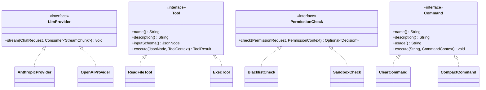
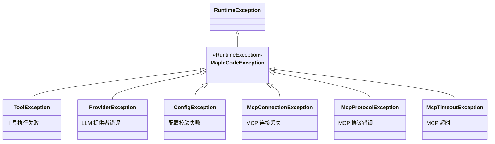

本页记录 MapleCode 项目的编码风格、语言特性使用偏好、命名规范、架构约定与测试惯例。这些规范不是通过 Checkstyle/Spotless 等工具强制执行，而是从源码中反复出现的一致性模式中提炼而来，供贡献者参考。

## Java 版本与现代语言特性

项目要求 **Java 21**（见 `pom.xml` 中 `maven.compiler.source/target`），并充分利用其现代特性：

**Record 作为首选数据载体**。所有不可变数据类——从顶层 `AppConfig` 到嵌套的 `Timeouts`、`AgentLimits`、`McpConfig`——均声明为 `record`。Record 天然提供 `equals`/`hashCode`/`toString`，且紧凑构造器可用于参数校验。

```java
public record AppConfig(
    String protocol, String model, String baseUrl, String apiKey,
    // ...
    int contextWindow
) {
    public AppConfig {
        if (contextWindow < 0) throw new IllegalArgumentException("context_window must be >= 0");
    }
}
```

Sources: [AppConfig.java](src/main/java/com/maplecode/config/AppConfig.java#L11-L68)

**Sealed interface 用于封闭类型层次**。`StreamChunk`、`ContentBlock`、`AgentEvent` 均声明为 `sealed interface`，配合 `permits` 明确列出所有实现类。这使得新增变体时编译器能强制所有 `switch` 表达式必须更新，杜绝遗漏分支的 bug。

Sources: [StreamChunk.java](src/main/java/com/maplecode/provider/StreamChunk.java#L1-L50), [ContentBlock.java](src/main/java/com/maplecode/provider/ContentBlock.java#L1-L26)

**`var` 局部变量类型推断**。在方法体内部广泛使用 `var` 减少冗余，但字段声明和方法签名保持显式类型。

**Text blocks 用于多行字符串**。测试中的 YAML 配置和 JSON 片段均使用 `"""` text block 语法。

Sources: [ConfigLoaderTest.java](src/test/java/com/maplecode/config/ConfigLoaderTest.java#L26-L43)

## 包结构与模块划分

项目采用**单根包 `com.maplecode`**，按功能域划分子包，每个子包内聚且边界清晰：

| 子包 | 职责 | 代表类 |
|---|---|---|
| `config` | YAML 配置加载与校验 | `AppConfig`, `ConfigLoader` |
| `provider` | LLM 提供者抽象与通用类型 | `LlmProvider`, `ChatMessage`, `StreamChunk`, `ContentBlock` |
| `provider.anthropic` | Anthropic 专用实现 | `AnthropicRequestMapper`, `AnthropicStreamParser` |
| `provider.openai` | OpenAI 专用实现 | `OpenAiRequestMapper`, `OpenAiStreamParser` |
| `tool` | 工具接口与 6 个内置工具 | `Tool`, `ToolRegistry`, `ToolExecutor` |
| `permission` | 五层权限管道 | `PermissionCheck`, `PermissionEngine`, `BlacklistCheck` |
| `agent` | Agent Loop 与 ReAct 循环 | `AgentLoop`, `AgentConfig`, `AgentEvent` |
| `compact` | 上下文压缩（摘要 + offload） | `CompactCoordinator`, `Offloader`, `ConversationSummarizer` |
| `memory` | 长期记忆系统 | `MemoryManager`, `MemoryStore`, `MemoryExtractor` |
| `command` | REPL 斜杠命令 | `Command`, `CommandRegistry`, `ClearCommand` |
| `prompt` | 系统提示词装配 | `PromptAssembler`, `DefaultSections`, `DynamicContext` |
| `session` | 会话管理与归档 | `ChatSession`, `SessionArchive` |
| `mcp.*` | MCP 客户端集成（5 个子包） | `McpClient`, `McpToolAdapter`, `Stdio` |
| `http` | SSE 流读取 | `SseStreamReader` |
| `ui` | REPL 交互与输出 | `ReplLoop`, `StreamPrinter`, `StatusBar` |
| `error` | 异常层次 | `MapleCodeException`, `ToolException` |
| `util` | 工具方法 | `IoUtil` |

**MCP 子包的分层模式**值得特别关注——`mcp.rpc`（协议帧）、`mcp.transport`（传输层）、`mcp.client`（客户端逻辑）、`mcp.config`（配置加载）、`mcp.adapter`（Tool 适配器）五层各司其职，体现了该子系统较高的复杂度管理需求。

Sources: [目录结构](src/main/java/com/maplecode/mcp)

## 命名规范

| 元素 | 规范 | 示例 |
|---|---|---|
| 包名 | 全小写，点分隔 | `com.maplecode.provider.anthropic` |
| 类名/接口名 | PascalCase，名词或名词短语 | `ReadFileTool`, `PermissionCheck` |
| 方法名 | camelCase，动词或动词短语 | `execute()`, `check()`, `stream()` |
| 常量 | UPPER_SNAKE_CASE | `DEFAULT_MAX_ITERATIONS`, `OUTPUT_MAX_BYTES` |
| 局部变量 | camelCase，短名允许（`ctx`, `cfg`, `sb`） | — |
| 测试类 | 被测类名 + `Test` 后缀 | `ReadFileToolTest`, `ConfigLoaderTest` |
| 异常类 | 以 `Exception` 结尾 | `ToolException`, `ProviderException` |

**工具类命名**遵循 `动作 + 名词 + Tool` 模式（如 `ReadFileTool`、`WriteFileTool`、`EditFileTool`），MCP 工具则通过 `McpToolAdapter.synthName()` 生成命名空间化的合成名 `mcp__<server>__<tool>`。

Sources: [McpToolAdapter.java](src/main/java/com/maplecode/mcp/adapter/McpToolAdapter.java#L63-L69)

## 接口设计哲学

项目中四个核心接口构成了整个系统的骨架，它们共享一致的设计哲学：



**接口尽量精简**。`LlmProvider` 只有一个方法 `stream(ChatRequest, Consumer<StreamChunk>)`，新增后端只需实现这一个方法并在 `ProviderRegistry.factories` 注册工厂。`PermissionCheck` 同样只有一个方法 `check()`，返回 `Optional<Decision>` 实现短路管道。

**Tool 接口有意保留为非 sealed**。最初设计为 `sealed permits` 6 个具体工具类，但 Java sealed 接口不允许匿名类实现，这会阻碍测试中使用 `new Tool() { ... }` 创建 mock 实例。改为非 sealed 后，6 个具体类仍在 `App.main` 集中注册——新增工具时 App.java 的编译失败自然起到提醒作用。

Sources: [Tool.java](src/main/java/com/maplecode/tool/Tool.java#L1-L33), [LlmProvider.java](src/main/java/com/maplecode/provider/LlmProvider.java#L1-L12), [PermissionCheck.java](src/main/java/com/maplecode/permission/PermissionCheck.java#L1-L8), [Command.java](src/main/java/com/maplecode/command/Command.java#L1-L45)

## 异常层次设计

项目的异常体系采用**单根继承 + 语义分层**模式：



**关键约定：Tool 层不抛异常给调用方**。工具执行失败（文件不存在、exec 退出非零、正则非法等）统一返回 `ToolResult.error("reason")`，而非抛出 `ToolException`。`ToolExecutor.run()` 作为最后一道防线，捕获所有 `Exception` 并包成 `ToolResult.error()`——**绝不让异常逃逸到 REPL 主循环**。

**配置错误使用退出码 78**（对应 sysexits.h 的 `EX_CONFIG`），在 `App.main` 中通过 `System.exit(78)` 退出。REPL 流式过程中的 Provider 错误则只打印、不退出——主循环继续运行。

Sources: [ToolExecutor.java](src/main/java/com/maplecode/tool/ToolExecutor.java#L35-L56), [ToolException.java](src/main/java/com/maplecode/error/ToolException.java#L1-L15), [AppConfig.java](src/main/java/com/maplecode/config/AppConfig.java#L11-L68)

## 并发与线程安全

项目中的并发策略遵循**最小化共享可变状态**原则：

| 场景 | 机制 | 示例 |
|---|---|---|
| 取消标志 | `volatile boolean` | `AgentLoop.cancelled` |
| 运行状态 | `volatile boolean` | `AgentLoop.running` |
| 原子模式切换 | `AtomicReference<PermissionMode>` | `PermissionEngine.mode` |
| 会话级允许/拒绝集合 | `ConcurrentHashMap.newKeySet()` | `PermissionEngine.sessionAllow` |
| 文件 I/O 串行化 | `ReentrantLock` | `MemoryManager.storeLock` |
| 异步记忆提取 | 单线程 `ExecutorService` | `MemoryManager.executor` |
| 输出缓冲读取 | `synchronized(out)` + daemon 线程 | `ExecTool.execute()` |

**设计原则**：Agent Loop 的工具执行按安全性分流——只读工具用 `parallelStream` 并行执行，有副作用的工具串行执行。`Batch.partition()` 负责此分类逻辑。

Sources: [AgentLoop.java](src/main/java/com/maplecode/agent/AgentLoop.java#L28-L35), [PermissionEngine.java](src/main/java/com/maplecode/permission/PermissionEngine.java#L14-L18), [MemoryManager.java](src/main/java/com/maplecode/memory/MemoryManager.java#L22-L31)

## 测试规范与模式

项目使用 **JUnit 5 + Mockito**，测试包结构与主代码一一对应。当前有 147 个主类和 116 个测试类，无集成测试（`*IT.java`）——端到端 smoke 测试为手工执行。

### 测试文件组织

| 模式 | 说明 | 示例 |
|---|---|---|
| `@TempDir Path` | 配置/文件操作测试的标准模板 | `ConfigLoaderTest`, `ReadFileToolTest` |
| `FakeLlmProvider` | 按脚本序列返回 `StreamChunk` 的测试替身 | `AgentLoopTest` |
| `RecordingTool` | 记录调用历史的工具 mock | `AgentLoopTest` |
| 匿名 `new Tool() { ... }` | 利用 Tool 非 sealed 特性快速构造 mock | `ToolExecutorTest` |
| `@TempDir` + `Files.writeString` | 写入临时 YAML → 加载 → 断言 | `ConfigLoaderTest` |

### 测试命名约定

测试方法名使用 **snake_case 描述行为**，读起来接近自然语言：

```java
@Test void loads_full_anthropic_config(@TempDir Path tmp) { ... }
@Test void missing_file_returns_error(@TempDir Path tmp) { ... }
@Test void cancelDuringStreamStopsLaterTextAndResetsForNextRun() { ... }
@Test void emptyResponseEmitsAgentStop() { ... }
```

### Fake 类放在独立包

测试替身统一放在 `com.maplecode.fake` 包，与被测包解耦：

| 类 | 用途 |
|---|---|
| `FakeLlmProvider` | 预编程的 LLM 响应序列 |
| `RecordingTool` | 记录调用参数的工具 stub |

Sources: [FakeLlmProvider.java](src/test/java/com/maplecode/fake/FakeLlmProvider.java#L1-L38), [RecordingTool.java](src/test/java/com/maplecode/fake/RecordingTool.java#L1-L46), [ReadFileToolTest.java](src/test/java/com/maplecode/tool/ReadFileToolTest.java#L1-L74), [ConfigLoaderTest.java](src/test/java/com/maplecode/config/ConfigLoaderTest.java#L1-L199)

## 注释与文档风格

项目的注释风格呈现出**设计决策优先**的特征，而非简单的代码复述：

**接口和核心抽象必须有 Javadoc**。`Tool`、`LlmProvider`、`PermissionCheck`、`Command` 等接口均有文档注释，说明契约和调用方预期。

**历史设计决策用注释保留上下文**。最典型的例子是 `Tool` 接口顶部的大段注释，解释了 sealed → non-sealed 的演变原因以及对测试的影响。

```java
/**
 * 工具的统一接口。...
 * <p>
 * 历史上此接口声明为 sealed permits ReadFileTool/.../GrepTool，但
 * Java sealed 接口不允许匿名类实现——这会阻碍测试用具名 mock。
 * ...
 */
public interface Tool { ... }
```

**`CLAUDE.md` 承担架构文档职责**。项目没有独立的 ARCHITECTURE.md，而是将完整的架构说明、数据流、约定细节写在 CLAUDE.md（AGENTS.md 是其符号链接），服务于 AI 辅助编码工具和新开发者。

**中文用于用户可见消息**。权限拒绝信息（`"权限拒绝: "`）、命令帮助文本（`"清空会话历史"`）、日志前缀（`"[mcp]"`, `"[memory]"`）均使用中文。API 名称、技术术语保持英文。

Sources: [Tool.java](src/main/java/com/maplecode/tool/Tool.java#L1-L33), [CLAUDE.md](CLAUDE.md#L1-L165)

## 代码风格细节

**类默认声明为 `final`**。除接口实现类和少量需要继承的基类外，所有具体类均标记 `final`，防止意外继承。

**单行 getter 允许省略花括号**。`name()`、`description()` 等简单 getter 方法使用单行紧凑写法：

```java
@Override public String name() { return "read_file"; }
@Override public String description() { return "Read a text file. Returns lines with line numbers. ..."; }
```

**构造器重载链**。当参数列表增长时，保留旧签名的重载构造器以维持调用兼容性，新参数用 `null` 默认值：

```java
/** 6 参重载（coord=null），保留调用兼容性。 */
public AgentLoop(..., Consumer<TokenUsage> usageSink) {
    this(provider, registry, executor, session, config, usageSink, null);
}
```

Sources: [AgentLoop.java](src/main/java/com/maplecode/agent/AgentLoop.java#L47-L53)

**Import 使用通配符**仅在 `command` 包内出现（`import com.maplecode.command.*`），其他包保持显式 import。

**无代码格式化工具强制执行**。`pom.xml` 中未配置 Checkstyle、Spotless 或 PMD 插件。`.idea/checkstyle-idea.xml` 中仅配置了 IntelliJ 内置的 Sun/Google 预设规则，并非项目自定义。

Sources: [pom.xml](pom.xml#L1-L106), [.idea/checkstyle-idea.xml](.idea/checkstyle-idea.xml#L1-L15)

## 构建与依赖

项目使用 **Maven** 构建，依赖极其精简：

| 依赖 | 用途 | 范围 |
|---|---|---|
| JLine 3.27.0 | REPL 交互（行编辑、补全） | compile |
| Jackson 2.17.2 | JSON 处理 | compile |
| SnakeYAML 2.3 | YAML 配置解析 | compile |
| JUnit 5.11.3 | 单元测试 | test |
| Mockito 5.20.0 | Mock 框架 | test |

**shade 插件**将所有依赖打入单个可执行 JAR（`maple-code-java-0.1.0.jar`），排除签名文件（`.SF`/`.DSA`/`.RSA`）避免冲突。

Sources: [pom.xml](pom.xml#L1-L106)

## 值得注意的设计妥协

以下约定虽不违反通用规范，但体现了项目在**实用性与纯粹性之间的权衡**，新贡献者应了解其背景：

1. **Tool 接口非 sealed**——为测试 mock 牺牲了编译期穷尽检查，通过 App.main 集中注册补偿
2. **ToolExecutor 自建 ToolContext**——不接受外部 ctx，用 `System.getProperty("user.dir")` 作为 cwd，简化了调用链但降低了可测试性（测试通过 ToolContext.defaults(tmp) 覆盖）
3. **记忆提取异步但串行**——单线程 Executor + ReentrantLock 保证了文件 I/O 的线程安全，但牺牲了吞吐量（可接受：记忆操作低频）
4. **Parser 状态需手动 reset**——`AnthropicStreamParser.reset()` 在每次 `stream()` 入口调用，不依赖构造新实例，减少了对象分配但增加了状态泄漏风险