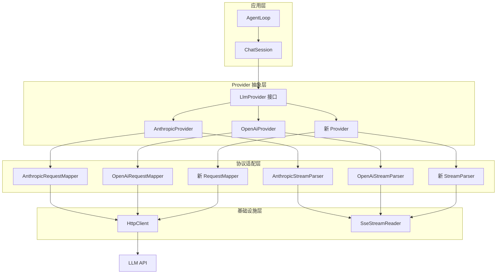

本指南将帮助您为 MapleCode 添加新的 LLM Provider 支持。我们将深入探讨系统架构、核心接口、实现步骤以及最佳实践，确保您能够高效地集成任何兼容的 LLM 服务。

## 架构概述与核心设计

MapleCode 采用分层架构设计，通过抽象接口和策略模式实现 LLM Provider 的可扩展性。系统的核心在于统一接口 `LlmProvider`，它定义了所有 Provider 必须实现的流式对话能力。



**核心设计原则**：所有 Provider 必须实现 `LlmProvider` 接口的 `stream()` 方法，该方法接收 `ChatRequest` 并通过 `Consumer<StreamChunk>` 推送流式响应。这种设计确保了 Agent Loop 的统一处理逻辑，无论底层使用哪个 LLM 服务。

## 核心接口与数据结构

### LlmProvider 接口

`LlmProvider` 是系统中最核心的抽象，定义了 Provider 必须提供的唯一能力：

```java
public interface LlmProvider {
    /**
     * 流式输出对话补全。每个 chunk 同步推送到 sink。
     * 传输 / 协议 / HTTP 错误抛出 ProviderException。
     */
    void stream(ChatRequest request, Consumer<StreamChunk> sink);
}
```

**关键约束**：
1. 方法必须同步执行，通过 `sink` 推送 `StreamChunk`
2. 任何传输错误必须抛出 `ProviderException`
3. 实现必须线程安全，因为 `AgentLoop` 可能并发调用

Sources: [LlmProvider.java](src/main/java/com/maplecode/provider/LlmProvider.java#L5-L12)

### 请求与响应数据结构

系统使用统一的数据结构来表示请求和响应，这些结构在 `provider` 包中定义：

| 数据结构 | 用途 | 关键字段 |
|----------|------|----------|
| `ChatRequest` | 封装完整的对话请求 | model, systemBlocks, messages, thinking, tools |
| `ChatMessage` | 表示单条消息 | role (USER/ASSISTANT), blocks (ContentBlock 列表) |
| `ContentBlock` | 消息内容的原子单元 | TextBlock, ToolUseBlock, ToolResultBlock |
| `StreamChunk` | 流式响应事件 | TextDelta, ThinkingDelta, ToolUseStart/Delta/End, MessageStart/End, Error |
| `TokenUsage` | Token 使用统计 | inputTokens, outputTokens, cacheCreationTokens, cacheReadTokens |

**重要设计决策**：`ChatMessage` 使用 `List<ContentBlock>` 而不是简单的字符串，这是因为现代 LLM API 支持多模态内容（文本 + 工具调用 + 工具结果），需要更灵活的数据结构。

Sources: [ChatRequest.java](src/main/java/com/maplecode/provider/ChatRequest.java#L8-L14), [ChatMessage.java](src/main/java/com/maplecode/provider/ChatMessage.java#L11-L13), [ContentBlock.java](src/main/java/com/maplecode/provider/ContentBlock.java#L12-L25)

## 新增 Provider 的完整步骤

### 步骤 1：创建 Provider 包结构

首先在 `com.maplecode.provider` 包下创建新的子包，遵循现有命名约定：

```
src/main/java/com/maplecode/provider/
├── yourprovider/
│   ├── YourProvider.java          # 主要实现类
│   ├── YourRequestMapper.java     # 请求转换器
│   └── YourStreamParser.java      # 流解析器
```

**命名约定**：包名应与 `protocol` 配置值一致（如 `azure` 对应 `azure/` 包）。

### 步骤 2：实现 YourProvider 主类

主类必须实现 `LlmProvider` 接口，并遵循以下模式：

```java
public final class YourProvider implements LlmProvider {
    private final AppConfig config;
    private final HttpClient httpClient;
    private final YourRequestMapper mapper = new YourRequestMapper();
    private final YourStreamParser parser = new YourStreamParser();
    private final SseStreamReader sseReader = new SseStreamReader();

    public YourProvider(AppConfig config) {
        this(config, HttpClient.newBuilder()
            .connectTimeout(config.timeouts().connectDuration())
            .build());
    }

    // 用于测试的构造器
    public YourProvider(AppConfig config, HttpClient httpClient) {
        this.config = config;
        this.httpClient = httpClient;
    }

    @Override
    public void stream(ChatRequest request, Consumer<StreamChunk> sink) {
        HttpRequest httpReq = mapper.toHttpRequest(request, config.baseUrl(), 
            config.apiKey(), config.timeouts().readDuration());
        
        HttpResponse<java.util.stream.Stream<String>> resp;
        try {
            resp = httpClient.send(httpReq, HttpResponse.BodyHandlers.ofLines());
        } catch (Exception e) {
            throw new ProviderException("HTTP request failed: " + e.getMessage(), e);
        }
        
        if (resp.statusCode() / 100 != 2) {
            String body = readBodyForError(resp);
            throw new ProviderException(
                "YourProvider returned HTTP " + resp.statusCode() + ": " + body);
        }
        
        parser.reset();
        sseReader.read(resp, ev -> parser.feed(ev, sink));
        // 某些 Provider 需要调用 finish() 处理流结束
        parser.finish(sink);
    }

    private String readBodyForError(HttpResponse<java.util.stream.Stream<String>> resp) {
        try {
            return resp.body().reduce("", (a, b) -> a + b);
        } catch (Exception e) {
            return "<body unavailable>";
        }
    }
}
```

**关键实现要点**：
1. 必须提供两个构造器：一个用于生产，一个用于测试
2. 使用 `SseStreamReader` 处理 SSE 流（已封装在 `http` 包中）
3. 错误处理必须抛出 `ProviderException`
4. 某些 Provider 可能需要 `parser.finish()` 处理流结束（如 OpenAI）

Sources: [AnthropicProvider.java](src/main/java/com/maplecode/provider/anthropic/AnthropicProvider.java#L15-L60), [OpenAiProvider.java](src/main/java/com/maplecode/provider/openai/OpenAiProvider.java#L15-L60)

### 步骤 3：实现请求转换器

请求转换器负责将内部 `ChatRequest` 转换为目标 API 的 HTTP 请求：

```java
public final class YourRequestMapper {
    private static final ObjectMapper JSON = new ObjectMapper();

    public HttpRequest toHttpRequest(ChatRequest req, String baseUrl, 
            String apiKey, Duration readTimeout) {
        String body = toJsonBody(req);
        return HttpRequest.newBuilder()
            .uri(URI.create(baseUrl + "/your/endpoint"))
            .timeout(readTimeout)
            .header("content-type", "application/json")
            .header("authorization", "Bearer " + apiKey)  // 根据目标 API 调整
            .POST(HttpRequest.BodyPublishers.ofString(body, StandardCharsets.UTF_8))
            .build();
    }

    public String toJsonBody(ChatRequest req) {
        try {
            ObjectNode root = JSON.createObjectNode();
            root.put("model", req.model());
            root.put("stream", true);  // 通常需要流式支持
            
            // 处理系统提示
            if (!req.systemBlocks().isEmpty()) {
                String systemPrompt = req.systemBlocks().stream()
                    .map(SystemBlock::content)
                    .collect(Collectors.joining("\n\n"));
                root.put("system", systemPrompt);
            }
            
            // 处理消息
            ArrayNode messages = root.putArray("messages");
            for (var m : req.messages()) {
                messages.add(encodeMessage(m));
            }
            
            // 处理工具（如果支持）
            if (req.tools() != null && !req.tools().isEmpty()) {
                ArrayNode toolsArr = root.putArray("tools");
                for (var tool : req.tools()) {
                    ObjectNode t = toolsArr.addObject();
                    t.put("name", tool.name());
                    t.put("description", tool.description());
                    t.set("parameters", tool.inputSchema());
                }
            }
            
            return JSON.writeValueAsString(root);
        } catch (JsonProcessingException e) {
            throw new IllegalStateException("序列化请求失败", e);
        }
    }

    private ObjectNode encodeMessage(ChatMessage m) {
        // 根据目标 API 格式实现消息编码
        // 参考 AnthropicRequestMapper 和 OpenAiRequestMapper
    }
}
```

**关键考虑**：
1. **系统提示处理**：不同 API 对系统提示的处理方式不同（Anthropic 用 `system` 数组，OpenAI 用 `system` 消息）
2. **消息格式转换**：需要将 `ContentBlock` 转换为目标 API 的格式
3. **工具定义**：需要将 `Tool` 对象转换为目标 API 的工具格式
4. **特殊功能**：如 thinking、cache control 等需要特殊处理

Sources: [AnthropicRequestMapper.java](src/main/java/com/maplecode/provider/anthropic/AnthropicRequestMapper.java#L17-L117), [OpenAiRequestMapper.java](src/main/java/com/maplecode/provider/openai/OpenAiRequestMapper.java#L18-L134)

### 步骤 4：实现流解析器

流解析器负责将 SSE 事件流转换为统一的 `StreamChunk`：

```java
public final class YourStreamParser {
    private boolean ended = false;
    private TokenUsage lastUsage;
    
    // 根据需要添加状态字段
    private String currentToolUseId = null;
    private String currentToolName = null;
    private StringBuilder currentToolJson = new StringBuilder();

    public void reset() {
        ended = false;
        lastUsage = null;
        currentToolUseId = null;
        currentToolName = null;
        currentToolJson.setLength(0);
    }

    public void feed(SseEvent event, Consumer<StreamChunk> sink) {
        if (ended) return;
        
        String data = event.data();
        if (data == null) return;
        
        // 检查结束信号（如 OpenAI 的 [DONE]）
        if (isEndSignal(data)) {
            finish(sink);
            return;
        }
        
        try {
            JsonNode node = JSON.readTree(data);
            processEvent(node, sink);
        } catch (Exception e) {
            sink.accept(new StreamChunk.Error("parse_error", 
                "Failed to parse SSE data: " + e.getMessage()));
        }
    }

    private void processEvent(JsonNode node, Consumer<StreamChunk> sink) {
        // 根据目标 API 的事件格式实现
        // 通常需要处理以下事件：
        // 1. 消息开始 → MessageStart
        // 2. 文本增量 → TextDelta
        // 3. 思考增量 → ThinkingDelta（如果支持）
        // 4. 工具调用开始/增量/结束 → ToolUseStart/Delta/End
        // 5. 消息结束 → MessageEnd
        // 6. 错误 → Error
    }

    public void finish(Consumer<StreamChunk> sink) {
        if (ended) return;
        
        // 处理任何未完成的工具调用
        flushPendingTools(sink);
        
        // 发送消息结束事件
        StreamChunk.StopReason reason = determineStopReason();
        sink.accept(new StreamChunk.MessageEnd(reason, lastUsage));
        ended = true;
    }

    private void flushPendingTools(Consumer<StreamChunk> sink) {
        // 处理累积的工具调用数据
    }
}
```

**流解析关键点**：
1. **状态管理**：需要跟踪当前解析状态（文本块、工具调用等）
2. **工具调用累积**：工具调用可能分多个事件发送，需要累积参数 JSON
3. **结束处理**：某些 API 需要在流结束后处理最终数据（如 OpenAI 的 usage 统计）
4. **错误处理**：必须优雅处理解析错误，避免中断整个流

Sources: [AnthropicStreamParser.java](src/main/java/com/maplecode/provider/anthropic/AnthropicStreamParser.java#L11-L165), [OpenAiStreamParser.java](src/main/java/com/maplecode/provider/openai/OpenAiStreamParser.java#L13-L176)

## 配置集成与注册

### 步骤 5：更新 ProviderRegistry

在 `ProviderRegistry` 中注册新的 Provider 工厂：

```java
public final class ProviderRegistry {
    private final Map<String, Function<AppConfig, LlmProvider>> factories = Map.of(
        "anthropic", AnthropicProvider::new,
        "openai",    OpenAiProvider::new,
        "yourprovider", YourProvider::new  // 添加新条目
    );

    public LlmProvider create(AppConfig config) {
        // 现有逻辑不变
    }

    private static final List<String> SUPPORTED = List.of(
        "anthropic", "openai", "yourprovider"  // 更新支持列表
    );
}
```

**注册要点**：
1. 工厂函数必须接受 `AppConfig` 参数
2. 更新 `SUPPORTED` 列表用于错误消息
3. 确保协议名称与配置文件中的 `protocol` 值一致

Sources: [ProviderRegistry.java](src/main/java/com/maplecode/provider/ProviderRegistry.java#L12-L31)

### 步骤 6：配置文件支持

更新 `ConfigLoader` 以支持新 Provider 的特定配置：

```java
private static AppConfig parse(Map<?, ?> root) {
    // 现有解析逻辑...
    
    // 如果新 Provider 有特殊配置需求
    Map<?, ?> providerSpecific = optionalMap(root, "yourprovider");
    // 解析特定配置...
    
    return new AppConfig(protocol, model, baseUrl, apiKey, yamlPrompt,
        List.of(), thinking, new AppConfig.Timeouts(connect, read), mode,
        new AppConfig.AgentLimits(maxIter, maxUnknown), mcp,
        contextWindow, summarizerModel, memoryConfig);
}
```

**配置示例**（`maplecode.yaml`）：
```yaml
protocol: yourprovider
model: your-model-name
base_url: https://api.yourprovider.com
api_key: ${YOURPROVIDER_API_KEY}

# 可选：Provider 特定配置
yourprovider:
  special_param: value
```

Sources: [ConfigLoader.java](src/main/java/com/maplecode/config/ConfigLoader.java#L26-L79)

## 测试策略

### 单元测试模式

为每个组件编写全面的单元测试：

```java
// 1. 测试请求转换器
class YourRequestMapperTest {
    private final YourRequestMapper mapper = new YourRequestMapper();
    
    @Test
    void minimal_request_conversion() {
        var req = new ChatRequest("model", List.of(),
            List.of(new ChatMessage(ChatMessage.Role.USER,
                List.of(new ContentBlock.TextBlock("hi")))), null, null);
        
        HttpRequest http = mapper.toHttpRequest(req, "https://api.test", 
            "sk-test", Duration.ofSeconds(30));
        
        // 验证 HTTP 请求结构
        assertEquals(URI.create("https://api.test/your/endpoint"), http.uri());
        assertEquals("Bearer sk-test", 
            http.headers().firstValue("authorization").orElseThrow());
        
        // 验证 JSON 体
        String body = mapper.toJsonBody(req);
        assertTrue(body.contains("\"model\":\"model\""));
        assertTrue(body.contains("\"stream\":true"));
    }
}

// 2. 测试流解析器
class YourStreamParserTest {
    private final YourStreamParser parser = new YourStreamParser();
    
    @Test
    void text_delta_parsing() {
        List<StreamChunk> chunks = new ArrayList<>();
        parser.reset();
        
        // 模拟 SSE 事件
        SseEvent event = new SseEvent("message", "{\"delta\":\"Hello\"}");
        parser.feed(event, chunks::add);
        
        assertEquals(1, chunks.size());
        assertInstanceOf(StreamChunk.TextDelta.class, chunks.get(0));
        assertEquals("Hello", ((StreamChunk.TextDelta) chunks.get(0)).text());
    }
}

// 3. 测试端到端集成
class YourProviderIntegrationTest {
    @Test
    void stream_response_handling() {
        // 使用 mock HttpClient 或测试服务器
        // 验证完整的流式响应处理
    }
}
```

**测试覆盖要点**：
1. **正常流程**：文本响应、工具调用、混合内容
2. **边界情况**：空响应、超长响应、特殊字符
3. **错误处理**：网络错误、API 错误、解析错误
4. **状态管理**：连续请求、并发请求

Sources: [AnthropicRequestMapperTest.java](src/test/java/com/maplecode/provider/anthropic/AnthropicRequestMapperTest.java#L24-L145)

## 高级主题与最佳实践

### 性能优化

1. **连接复用**：使用 `HttpClient.newBuilder()` 创建可复用的客户端
2. **流式处理**：避免将整个响应加载到内存，使用 `HttpResponse.BodyHandlers.ofLines()`
3. **缓冲策略**：对于工具调用，使用 `StringBuilder` 累积 JSON 片段

### 错误处理策略

```java
// 在 Provider 中统一处理错误
public void stream(ChatRequest request, Consumer<StreamChunk> sink) {
    try {
        // 执行流式请求
    } catch (Exception e) {
        if (e instanceof ProviderException) {
            throw e;  // 重新抛出已知 Provider 错误
        }
        // 包装未知错误
        throw new ProviderException("Unknown error: " + e.getMessage(), e);
    }
}
```

### 工具调用处理

现代 LLM API 支持工具调用，需要特别注意：

1. **参数累积**：工具参数可能分多个事件发送
2. **JSON 解析**：需要累积后解析完整的 JSON
3. **错误处理**：无效 JSON 需要优雅处理，避免中断整个流

### 与现有系统的兼容性

确保新 Provider 与现有系统组件兼容：

1. **权限系统**：工具调用必须经过权限检查
2. **上下文管理**：token 使用统计必须正确报告
3. **会话管理**：消息格式必须与会话存储兼容

## 调试与故障排除

### 常见问题

1. **SSE 解析错误**：检查事件格式是否符合 SSE 规范
2. **工具调用失败**：验证参数 JSON 是否正确累积和解析
3. **token 统计不准确**：确保正确解析 usage 事件

### 调试工具

1. **日志记录**：在关键位置添加日志（SSE 事件、解析结果）
2. **测试脚本**：使用 `FakeLlmProvider` 测试系统逻辑
3. **API 文档**：仔细阅读目标 API 的流式响应文档

## 下一步行动

完成 Provider 实现后，建议：

1. **运行测试套件**：确保所有现有测试通过
2. **集成测试**：在真实环境中测试新 Provider
3. **文档更新**：更新配置示例和用户指南
4. **性能测试**：验证流式响应的性能和稳定性

相关文档：
- [统一接口 LlmProvider](7-tong-jie-kou-llmprovider) - 了解核心接口设计
- [Anthropic 与 OpenAI 实现](8-anthropic-yu-openai-shi-xian) - 参考现有实现
- [SSE 流式解析机制](9-sse-liu-shi-jie-xi-ji-zhi) - 深入了解流处理
- [配置文件详解](3-pei-zhi-wen-jian-xiang-jie) - 了解配置系统