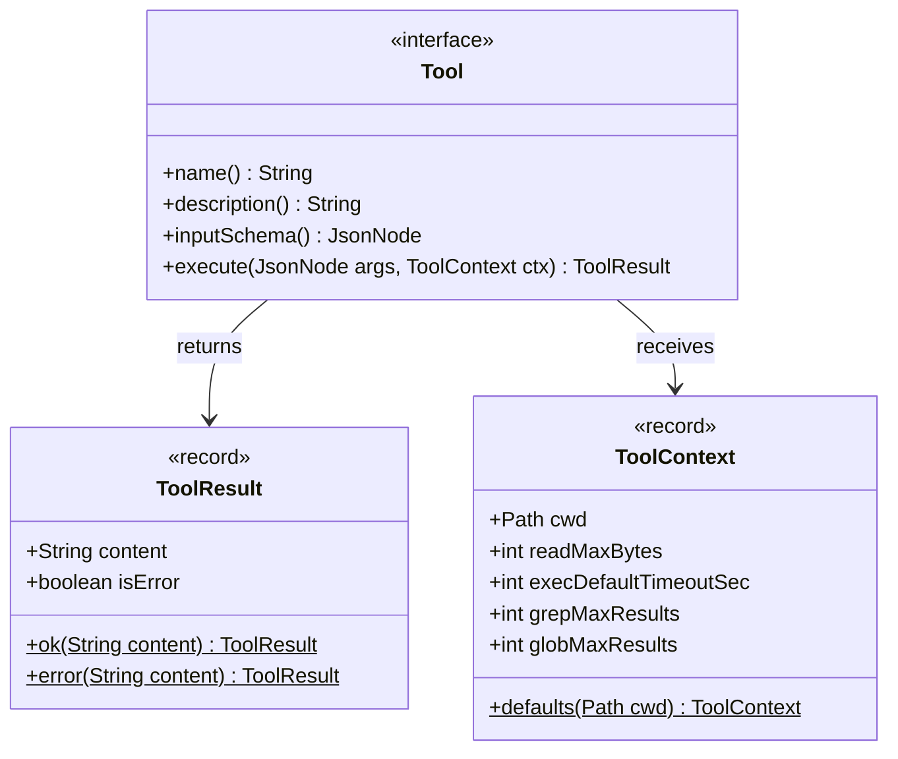
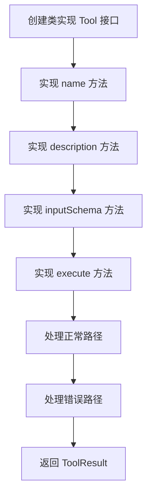
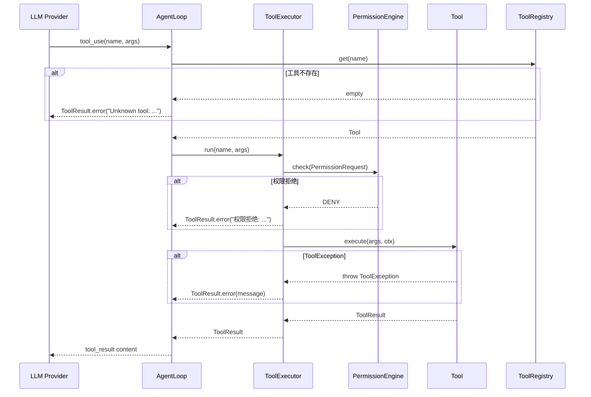
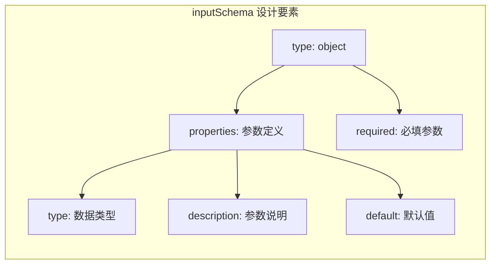
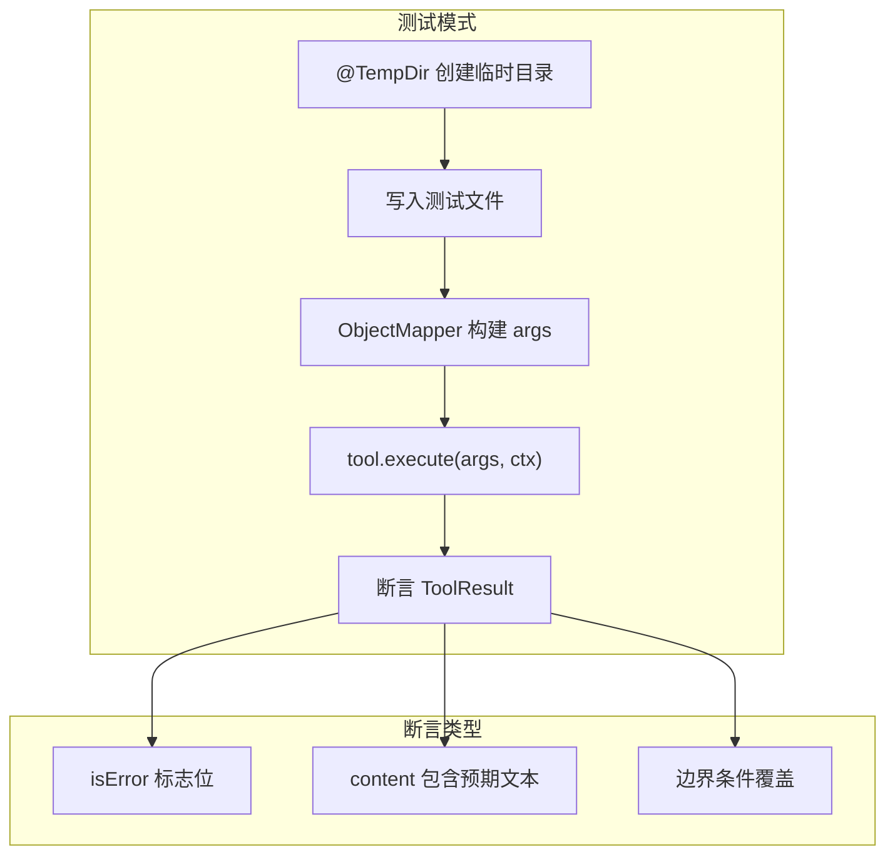
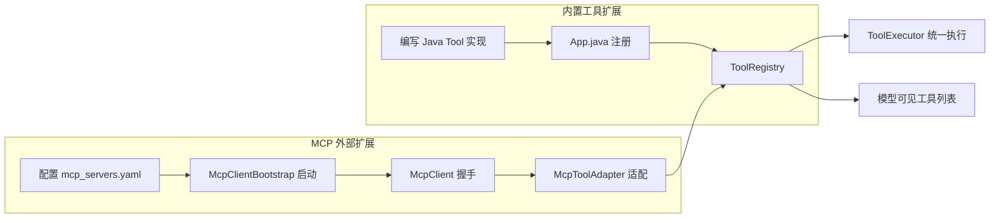

本文面向希望扩展 MapleCode 工具能力的中高级开发者，系统讲解如何从零实现一个自定义工具、如何注册到工具系统、如何编写测试，以及通过 MCP 协议集成外部工具的替代方案。全文基于源码实证分析，所有代码路径均可追溯到具体文件和行号。

## Tool 接口：工具的统一契约

MapleCode 的工具系统建立在一个精简的接口之上。**`Tool`** 接口（[Tool.java](src/main/java/com/maplecode/tool/Tool.java#L15-L32)）仅声明四个方法，构成了工具能力的完整契约：



| 方法 | 职责 | 典型实现 |
|------|------|----------|
| `name()` | 工具唯一标识符，模型在 `tool_use` 块中使用此名称调用工具 | 返回如 `"read_file"`、`"exec"` 等蛇形命名字符串 |
| `description()` | 模型可读的自然语言描述，影响模型何时选择调用此工具 | 简明英文短句，描述功能和关键参数 |
| `inputSchema()` | JSON Schema 格式的入参定义，Provider 直接透传给 LLM API 的 wire 格式 | 使用 Jackson `ObjectMapper` 构建 `ObjectNode` |
| `execute(JsonNode, ToolContext)` | 工具的实际执行逻辑 | 核心业务代码；抛 `ToolException` 表示已知错误，其它异常视为 bug |

Sources: [Tool.java](src/main/java/com/maplecode/tool/Tool.java#L15-L32), [ToolResult.java](src/main/java/com/maplecode/tool/ToolResult.java#L7-L10), [ToolContext.java](src/main/java/com/maplecode/tool/ToolContext.java#L8-L18)

### 错误处理约定

`ToolResult` 是一个极简的 record（[ToolResult.java](src/main/java/com/maplecode/tool/ToolResult.java#L7-L10)），通过 `isError` 标志位区分成功与失败。关键设计决策是：**工具绝不应向调用栈抛异常**。工具执行层（`ToolExecutor`）会兜底所有异常（[ToolExecutor.java](src/main/java/com/maplecode/tool/ToolExecutor.java#L46-L54)）：

- `ToolException` → 提取 `getMessage()` 包装为 `ToolResult.error`
- 其它 `Exception` → 包装为 `"internal error: <SimpleClassName>: <message>"`

这意味着开发者在实现 `execute` 时有两种错误表达方式：
1. **已知业务错误**（文件不存在、参数非法等）：抛 `ToolException` 或直接返回 `ToolResult.error(...)`
2. **未知内部错误**（bug）：让它自然抛出，由 `ToolExecutor` 兜底

Sources: [ToolExecutor.java](src/main/java/com/maplecode/tool/ToolExecutor.java#L46-L54), [ToolException.java](src/main/java/com/maplecode/error/ToolException.java#L7-L15)

## 从零实现一个自定义工具

下面以实现一个 **`count_lines`** 工具（统计文件行数）为例，走完从创建类到注册上线的完整流程。

### 第一步：创建 Tool 实现类



```java
package com.maplecode.tool;

import com.fasterxml.jackson.databind.JsonNode;
import com.fasterxml.jackson.databind.ObjectMapper;
import com.maplecode.error.ToolException;
import java.io.IOException;
import java.nio.charset.StandardCharsets;
import java.nio.file.Files;
import java.nio.file.Path;
import java.util.List;

public final class CountLinesTool implements Tool {

    @Override
    public String name() { return "count_lines"; }

    @Override
    public String description() {
        return "Count the number of lines in a text file. "
            + "Returns total line count and optional line range statistics.";
    }

    @Override
    public JsonNode inputSchema() {
        var mapper = new ObjectMapper();
        var schema = mapper.createObjectNode();
        schema.put("type", "object");
        var props = schema.putObject("properties");
        props.putObject("path").put("type", "string")
            .put("description", "File path; relative paths resolve to cwd.");
        schema.putArray("required").add("path");
        return schema;
    }

    @Override
    public ToolResult execute(JsonNode args, ToolContext ctx) {
        // 参数提取（复用 ReadFileTool 的辅助方法）
        String pathStr = ReadFileTool.requiredString(args, "path");
        Path path = ReadFileTool.resolvePath(pathStr, ctx.cwd());

        if (!Files.exists(path)) {
            return ToolResult.error("file not found: " + pathStr);
        }
        if (Files.isDirectory(path)) {
            return ToolResult.error("path is a directory: " + pathStr);
        }

        try {
            List<String> lines = Files.readAllLines(path, StandardCharsets.UTF_8);
            return ToolResult.ok("Total lines: " + lines.size());
        } catch (IOException e) {
            throw new ToolException("read failed: " + e.getMessage(), e);
        }
    }
}
```

关键实现要点：

| 实践 | 说明 |
|------|------|
| 类声明为 `final` | 所有内置工具均为 `final`，防止继承带来的语义漂移 |
| 复用 `ReadFileTool.requiredString` | 参数提取和路径解析已有成熟工具方法（[ReadFileTool.java](src/main/java/com/maplecode/tool/ReadFileTool.java#L106-L112)），无需重复实现 |
| 用 `ToolResult.error` 处理业务错误 | 文件不存在、参数非法等已知条件直接返回错误，不抛异常 |
| 用 `ToolException` 处理 IO 错误 | IO 异常是工具层面的可控失败，抛出后由 `ToolExecutor` 包装为 `ToolResult.error` |

Sources: [ReadFileTool.java](src/main/java/com/maplecode/tool/ReadFileTool.java#L97-L112), [EditFileTool.java](src/main/java/com/maplecode/tool/EditFileTool.java#L37-L74)

### 第二步：注册到 App 启动入口

工具实现后，必须在 `App.java` 的 `main` 方法中注册到 `ToolRegistry`（[App.java](src/main/java/com/maplecode/App.java#L106-L122)）。注册位置在内置工具列表构建处：

```java
List<Tool> builtins = List.of(
    new ReadFileTool(), new WriteFileTool(), new EditFileTool(),
    new ExecTool(),    new GlobTool(),     new GrepTool());
// ⬇ 新增自定义工具
List<Tool> allTools = new ArrayList<>(builtins);
allTools.add(new CountLinesTool());  // ← 在此添加
allTools.addAll(mcpTools);
ToolRegistry registry = new ToolRegistry(allTools);
```

`ToolRegistry` 在构造时会校验工具名称唯一性（[ToolRegistry.java](src/main/java/com/maplecode/tool/ToolRegistry.java#L24-L28)），重复名称会抛 `IllegalArgumentException` 并阻止启动。这是一个**编译期保障**——新增工具后，如果名称与已有工具（含 MCP 工具的 `mcp__<server>__<tool>` 合成名）冲突，`App.java` 在运行时立刻报错。

Sources: [App.java](src/main/java/com/maplecode/App.java#L106-L122), [ToolRegistry.java](src/main/java/com/maplecode/tool/ToolRegistry.java#L17-L31)

### 第三步：（可选）标记为只读工具

如果自定义工具**无副作用**（不写文件、不执行命令、不修改系统状态），可以通过自定义 `readOnlyNames` 集合将其标记为只读。只读工具在 PLAN 模式下仍可被模型调用（[AgentLoop.java](src/main/java/com/maplecode/agent/AgentLoop.java#L99-L109)），且在混合批次中会被并行执行（[AgentLoop.java](src/main/java/com/maplecode/agent/AgentLoop.java#L201-L208)）。

内置只读工具默认为 `read_file`、`glob`、`grep`（[ToolRegistry.java](src/main/java/com/maplecode/tool/ToolRegistry.java#L11)）。自定义只读集合时，需要使用 `ToolRegistry` 的双参构造器：

```java
var readOnlyNames = Set.of("read_file", "glob", "grep", "count_lines");
ToolRegistry registry = new ToolRegistry(allTools, readOnlyNames);
```

Sources: [ToolRegistry.java](src/main/java/com/maplecode/tool/ToolRegistry.java#L11), [ToolRegistry.java](src/main/java/com/maplecode/tool/ToolRegistry.java#L21-L31), [AgentLoop.java](src/main/java/com/maplecode/agent/AgentLoop.java#L196-L208)

## 工具执行的完整链路

理解工具从调用到返回的完整数据流，有助于排查问题和编写高质量的工具实现。



### 执行调度策略

Agent Loop 采用**安全分级调度**策略（[Batch.java](src/main/java/com/maplecode/agent/Batch.java#L12-L23)）：

| 分类 | 工具示例 | 执行方式 | 原因 |
|------|----------|----------|------|
| **Safe（只读）** | `read_file`, `glob`, `grep` | `parallelStream()` 并行 | 无副作用，线程安全 |
| **Unsafe（有副作用）** | `write_file`, `edit_file`, `exec` | 顺序 for 循环串行 | 有副作用，避免竞态条件 |

自定义工具的只读属性直接决定了其在多工具调用批次中的执行策略。

Sources: [AgentLoop.java](src/main/java/com/maplecode/agent/AgentLoop.java#L196-L215), [Batch.java](src/main/java/com/maplecode/agent/Batch.java#L12-L23)

### 权限管道集成

所有工具调用自动经过五层权限防御管道（[ToolExecutor.java](src/main/java/com/maplecode/tool/ToolExecutor.java#L38-L44)），开发者无需在工具代码中处理权限逻辑。权限拒绝时，错误信息 `"权限拒绝: <reason>"` 会返回给模型，Agent Loop 继续运行。

权限规则中的 `tool` 字段匹配的就是 `Tool.name()` 返回值。因此，自定义工具的名称选择直接影响权限配置的表达力。例如，如果工具名为 `count_lines`，用户可以在规则文件中配置：

```yaml
rules:
  - tool: count_lines
    pattern: "**/.env"
    action: deny
```

Sources: [ToolExecutor.java](src/main/java/com/maplecode/tool/ToolExecutor.java#L38-L44), [PermissionEngine.java](src/main/java/com/maplecode/permission/PermissionEngine.java#L25-L32)

## inputSchema 设计最佳实践

`inputSchema` 是工具的"接口文档"，直接决定了 LLM 如何理解和调用工具。设计质量直接影响模型的调用准确率。



### 内置工具 Schema 模式对比

| 工具 | 必填参数 | 可选参数 | Schema 特征 |
|------|----------|----------|-------------|
| `read_file` | `path` (string) | `offset` (int, default=0), `limit` (int, default=2000) | 分页支持 + 默认值 |
| `write_file` | `path`, `content` (string) | 无 | 两个必填字符串 |
| `edit_file` | `path`, `old_string`, `new_string` | 无 | 三参数精确替换 |
| `exec` | `command` (string) | `timeout_seconds` (int, default=30) | 超时控制 |
| `glob` | `pattern` (string) | 无 | 单参数 glob 模式 |
| `grep` | `pattern` (string) | `path` (default="."), `include_glob` | 正则 + 过滤 |

Sources: [ReadFileTool.java](src/main/java/com/maplecode/tool/ReadFileTool.java#L26-L38), [ExecTool.java](src/main/java/com/maplecode/tool/ExecTool.java#L24-L34), [EditFileTool.java](src/main/java/com/maplecode/tool/EditFileTool.java#L23-L34)

### Schema 编写建议

1. **描述要面向模型**：`description` 字段是 LLM 决策的依据，应写成"这个参数做什么"而非"开发者说明"
2. **为可选参数设置 default**：减少模型需要猜测的参数数量，提高调用成功率
3. **required 只列必要参数**：过多必填参数增加模型调用失败率
4. **类型要准确**：`"integer"` 而非 `"number"`，模型对类型的判断依赖此字段

## 测试自定义工具

项目使用 JUnit 5 测试框架。工具测试的核心模式是：构造 `ToolContext.defaults(tmp)` 上下文，传入 `ObjectMapper` 构建的 `JsonNode` 参数，断言 `ToolResult` 的内容和 `isError` 状态。



```java
class CountLinesToolTest {

    private final CountLinesTool tool = new CountLinesTool();
    private final ObjectMapper JSON = new ObjectMapper();

    @Test
    void count_lines_basic(@TempDir Path tmp) throws Exception {
        Path f = tmp.resolve("test.txt");
        Files.writeString(f, "line1\nline2\nline3\n");
        var args = JSON.createObjectNode().put("path", f.toString());
        var r = tool.execute(args, ToolContext.defaults(tmp));
        assertFalse(r.isError());
        assertTrue(r.content().contains("3"));
    }

    @Test
    void missing_file_returns_error(@TempDir Path tmp) {
        var args = JSON.createObjectNode().put("path", tmp.resolve("nope.txt").toString());
        var r = tool.execute(args, ToolContext.defaults(tmp));
        assertTrue(r.isError());
        assertTrue(r.content().contains("nope.txt"));
    }
}
```

### 测试辅助工具

项目提供了 `RecordingTool`（[RecordingTool.java](src/test/java/com/maplecode/fake/RecordingTool.java#L16-L45)）作为测试替身，它记录每次调用的参数和上下文，返回预置的 `ToolResult`。适用于测试 Agent Loop 对工具的调用行为，而非工具自身逻辑。

Sources: [ReadFileToolTest.java](src/test/java/com/maplecode/tool/ReadFileToolTest.java#L13-L73), [ToolExecutorTest.java](src/test/java/com/maplecode/tool/ToolExecutorTest.java#L14-L77), [RecordingTool.java](src/test/java/com/maplecode/fake/RecordingTool.java#L16-L45)

## 通过 MCP 扩展外部工具

除了编写 Java 类实现 `Tool` 接口，MapleCode 还支持通过 **MCP（Model Context Protocol）** 连接外部工具服务器，无需修改 Java 代码即可添加新工具。



### 两种扩展方式对比

| 维度 | 内置 Java Tool | MCP 外部工具 |
|------|----------------|-------------|
| **实现语言** | Java | 任意（MCP server 是独立进程） |
| **注册方式** | `App.java` 硬编码 | YAML 配置文件 |
| **工具命名** | 自定义名称 | 自动合成 `mcp__<server>__<tool>` |
| **权限系统** | 完整五层管道 | 完整五层管道（一视同仁） |
| **执行上下文** | `ToolContext`（cwd、限值等） | MCP 远程调用（30s 超时） |
| **生命周期** | 随 App 启停 | 独立进程，启动时并发初始化 |
| **适用场景** | 深度集成、需要 Java 生态能力 | 快速接入已有 MCP 生态工具 |

Sources: [McpToolAdapter.java](src/main/java/com/maplecode/mcp/adapter/McpToolAdapter.java#L22-L60), [App.java](src/main/java/com/maplecode/App.java#L109-L122)

### MCP 工具适配机制

`McpToolAdapter.of(client, desc)` 是一个工厂方法（[McpToolAdapter.java](src/main/java/com/maplecode/mcp/adapter/McpToolAdapter.java#L22-L60)），它将 MCP 协议的 `McpToolDesc` 适配为 MapleCode 的 `Tool` 接口。适配器的核心职责：

- **名称合成**：`"mcp__" + serverName + "__" + toolName`，避免工具名冲突
- **错误映射**：MCP 超时、连接丢失、协议错误统一映射为 `ToolResult.error`
- **Schema 透传**：`McpToolDesc.inputSchema()` 直接作为工具的 `inputSchema()` 返回

Sources: [McpToolAdapter.java](src/main/java/com/maplecode/mcp/adapter/McpToolAdapter.java#L18-L69), [McpClient.java](src/main/java/com/maplecode/mcp/client/McpClient.java#L91-L104)

## 内置工具速查表

以下六个内置工具覆盖了文件读写、代码搜索、命令执行等核心编程场景，可作为自定义工具实现的参考范本：

| 工具 | 源文件 | 行数 | 关键技术点 |
|------|--------|------|-----------|
| `read_file` | [ReadFileTool.java](src/main/java/com/maplecode/tool/ReadFileTool.java) | 113 | 二进制探测、分页读取、字节截断 + 多字节字符安全 |
| `write_file` | [WriteFileTool.java](src/main/java/com/maplecode/tool/WriteFileTool.java) | 53 | 父目录校验、UTF-8 写入 |
| `edit_file` | [EditFileTool.java](src/main/java/com/maplecode/tool/EditFileTool.java) | 85 | 唯一匹配约束、occurrences 计数 |
| `exec` | [ExecTool.java](src/main/java/com/maplecode/tool/ExecTool.java) | 107 | 进程管理、异步读取、超时控制、输出截断 |
| `glob` | [GlobTool.java](src/main/java/com/maplecode/tool/GlobTool.java) | 70 | `PathMatcher` glob 匹配、结果截断 |
| `grep` | [GrepTool.java](src/main/java/com/maplecode/tool/GrepTool.java) | 106 | 正则搜索、二进制过滤、文件类型过滤 |

### 工具开发检查清单

完成自定义工具开发后，请确认以下事项：

1. **名称唯一**：`name()` 返回值不与任何内置工具或 MCP 工具冲突（[ToolRegistry.java](src/main/java/com/maplecode/tool/ToolRegistry.java#L24-L28)）
2. **Schema 完整**：所有必需参数在 `required` 数组中声明，每个参数有 `description`
3. **错误处理**：业务错误用 `ToolResult.error` 或 `ToolException`，不在工具层抛运行时异常
4. **路径安全**：文件路径通过 `ReadFileTool.resolvePath` 解析，确保在 cwd 范围内（权限沙箱层会额外校验）
5. **输出大小**：大输出做截断处理，避免撑爆上下文窗口（参考 `ReadFileTool` 的 `ctx.readMaxBytes()` 限制）
6. **只读标记**：如果无副作用，通过自定义 `readOnlyNames` 集合标记为只读，获得并行执行优势
7. **测试覆盖**：至少覆盖正常路径、缺失文件、边界条件三种场景
8. **注册入口**：在 `App.java` 的内置工具列表中添加实例

Sources: [ToolRegistry.java](src/main/java/com/maplecode/tool/ToolRegistry.java#L17-L31), [ReadFileTool.java](src/main/java/com/maplecode/tool/ReadFileTool.java#L97-L104)

## 推荐阅读路径

完成自定义工具开发后，建议按以下顺序阅读相关文档：

- [Tool 接口与内置工具](10-tool-jie-kou-yu-nei-zhi-gong-ju) — 深入理解工具系统的接口设计与内置实现
- [ToolRegistry 与 ToolExecutor](11-toolregistry-yu-toolexecutor) — 工具注册、发现与执行的完整机制
- [MCP 客户端集成](12-mcp-ke-hu-duan-ji-cheng) — MCP 协议的完整集成架构
- [权限规则配置最佳实践](29-quan-xian-gui-ze-pei-zhi-zui-jia-shi-jian) — 为自定义工具编写精确的权限规则
- [测试策略与质量保证](24-ce-shi-ce-lue-yu-zhi-liang-bao-zheng) — 工具测试的系统性方法论