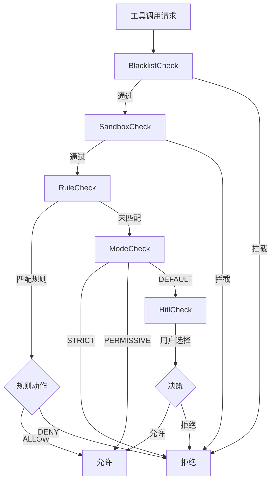

本文档详细介绍了 MapleCode 权限规则配置的最佳实践，帮助开发者安全、高效地管理工具调用权限。权限系统采用五层防御管道架构，通过规则配置实现细粒度的访问控制。

## 权限系统概述

MapleCode 的权限系统采用**五层防御管道**架构，按照优先级从高到低依次执行检查：

1. **黑名单检查（BlacklistCheck）**：硬编码的12条危险命令拦截，不可配置
2. **路径沙箱检查（SandboxCheck）**：防止文件路径逃逸项目根目录
3. **规则引擎检查（RuleCheck）**：基于YAML配置的细粒度规则匹配
4. **模式检查（ModeCheck）**：三种权限模式的默认行为
5. **人在回路检查（HitlCheck）**：用户交互式权限确认



Sources: [PermissionEngine.java](src/main/java/com/maplecode/permission/PermissionEngine.java#L18-L28), [App.java](src/main/java/com/maplecode/App.java#L206-L215)

## 权限模式配置

MapleCode 支持三种权限模式，通过配置文件中的 `permission_mode` 字段设置：

| 模式 | 行为 | 适用场景 | 风险等级 |
|------|------|----------|----------|
| **strict** | 未匹配规则直接拒绝 | 生产环境、高安全性要求 | 低 |
| **default** | 未匹配规则进入HITL确认 | 开发环境、平衡安全与便利 | 中 |
| **permissive** | 未匹配规则直接允许 | 实验环境、快速原型开发 | 高 |

**配置示例**：
```yaml
permission_mode: default  # strict | default | permissive
```

**运行时切换**：在REPL中可通过 `/mode` 命令临时切换模式，但重启后会恢复配置文件中的设置。

Sources: [ConfigLoader.java](src/main/java/com/maplecode/config/ConfigLoader.java#L65-L71), [maplecode.yaml.example](maplecode.yaml.example#L16-L21)

## 规则配置文件结构

权限规则配置采用三层文件结构，优先级从低到高：

### 1. 用户全局配置（优先级最低）
- **路径**：`~/.maplecode/permissions.yaml`
- **用途**：个人通用规则，跨项目共享
- **示例**：
```yaml
rules:
  - tool: exec
    pattern: "git *"
    action: allow
  - tool: read_file
    pattern: "~/.bashrc"
    action: allow
```

### 2. 项目级配置（优先级中等）
- **路径**：`<项目根目录>/.maplecode/permissions.yaml`
- **用途**：团队共享的项目规则，应纳入版本控制
- **示例**：
```yaml
rules:
  - tool: exec
    pattern: "npm test"
    action: allow
  - tool: write_file
    pattern: "src/**"
    action: allow
  - tool: exec
    pattern: "rm -rf *"
    action: deny
```

### 3. 项目本地配置（优先级最高）
- **路径**：`<项目根目录>/.maplecode/permissions.local.yaml`
- **用途**：个人项目特定规则，应加入 `.gitignore`
- **示例**：
```yaml
rules:
  - tool: exec
    pattern: "find . -name '*.log' -delete"
    action: deny
  - tool: read_file
    pattern: ".env"
    action: deny
```

**重要说明**：规则匹配采用**首次匹配即返回**策略，因此高优先级文件中靠前的规则会覆盖低优先级文件中的相同规则。

Sources: [PermissionFileLoader.java](src/main/java/com/maplecode/permission/PermissionFileLoader.java#L20-L35), [maplecode.yaml.example](maplecode.yaml.example#L22-L32)

## 规则编写最佳实践

### 规则语法结构
每条规则包含三个字段：
```yaml
rules:
  - tool: <工具名称>    # 必需
    pattern: <匹配模式> # 必需
    action: <允许/拒绝>  # 必需：allow 或 deny
```

### 支持的工具类型
- **文件系统工具**：`read_file`、`write_file`、`edit_file`
- **命令执行工具**：`exec`
- **文件搜索工具**：`glob`、`grep`

### 模式匹配规则

#### 1. exec 工具 - Shell Glob 匹配
exec 工具使用特殊的 shell glob 匹配，支持以下通配符：
- `*`：匹配零个或多个单词
- `?`：恰好匹配一个单词
- 字面量匹配：精确匹配命令

**示例**：
```yaml
# 允许所有 git 命令
- tool: exec
  pattern: "git *"
  action: allow

# 允许特定 npm 命令
- tool: exec
  pattern: "npm test"
  action: allow

# 允许 find 命令，但限制深度
- tool: exec
  pattern: "find . -maxdepth 3 -type f"
  action: allow

# 拒绝删除根目录
- tool: exec
  pattern: "rm -rf /"
  action: deny
```

#### 2. 文件工具 - 文件路径 Glob 匹配
文件工具使用标准的文件路径 glob 匹配：
- `*`：匹配任意字符（除路径分隔符）
- `**`：匹配任意路径深度
- `?`：匹配单个字符

**示例**：
```yaml
# 允许读取 src 目录下的所有 Java 文件
- tool: read_file
  pattern: "src/**/*.java"
  action: allow

# 允许写入 docs 目录
- tool: write_file
  pattern: "docs/**"
  action: allow

# 拒绝编辑配置文件
- tool: edit_file
  pattern: "*.config"
  action: deny
```

#### 3. 搜索工具 - 路径范围限制
glob 和 grep 工具的 pattern 字段用于限制搜索路径：

```yaml
# 允许在 src 目录下搜索
- tool: glob
  pattern: "src/**"
  action: allow

# 允许在当前目录搜索
- tool: grep
  pattern: "."
  action: allow

# 限制搜索范围
- tool: grep
  pattern: "src/main/java"
  action: allow
```

### 规则编写原则

#### 1. 最小权限原则
只授予完成任务所必需的最小权限：
```yaml
# 好：只允许读取特定目录
- tool: read_file
  pattern: "src/main/java/**/*.java"
  action: allow

# 差：允许读取所有文件
- tool: read_file
  pattern: "**"
  action: allow
```

#### 2. 明确拒绝优先
对于危险操作，应明确拒绝而非依赖默认模式：
```yaml
# 明确拒绝危险命令
- tool: exec
  pattern: "sudo *"
  action: deny
- tool: exec
  pattern: "rm -rf /"
  action: deny
- tool: exec
  pattern: "chmod 777 *"
  action: deny
```

#### 3. 规则顺序优化
将最具体的规则放在前面，提高匹配效率：
```yaml
# 好：具体规则在前
- tool: exec
  pattern: "npm test"
  action: allow
- tool: exec
  pattern: "npm *"
  action: allow

# 差：通用规则在前会覆盖具体规则
- tool: exec
  pattern: "npm *"
  action: allow
- tool: exec
  pattern: "npm test"
  action: allow
```

#### 4. 避免规则冲突
确保同一工具和模式的规则不会产生矛盾：
```yaml
# 冲突配置（应避免）
- tool: exec
  pattern: "git *"
  action: allow
- tool: exec
  pattern: "git *"
  action: deny  # 会导致不可预测的行为
```

Sources: [RuleCheck.java](src/main/java/com/maplecode/permission/RuleCheck.java#L30-L55), [RuleCheckTest.java](src/test/java/com/maplecode/permission/RuleCheckTest.java#L25-L85)

## 常见场景配置示例

### 场景1：Node.js 项目开发
```yaml
# 项目级权限配置
rules:
  # 允许常见的 npm 命令
  - tool: exec
    pattern: "npm test"
    action: allow
  - tool: exec
    pattern: "npm run build"
    action: allow
  - tool: exec
    pattern: "npm install"
    action: allow
  - tool: exec
    pattern: "npx *"
    action: allow
  
  # 允许 Git 操作
  - tool: exec
    pattern: "git *"
    action: allow
  
  # 允许读取和写入源代码
  - tool: read_file
    pattern: "src/**"
    action: allow
  - tool: write_file
    pattern: "src/**"
    action: allow
  - tool: edit_file
    pattern: "src/**"
    action: allow
  
  # 允许搜索代码
  - tool: glob
    pattern: "src/**"
    action: allow
  - tool: grep
    pattern: "src"
    action: allow
  
  # 拒绝危险操作
  - tool: exec
    pattern: "rm -rf node_modules"
    action: deny
  - tool: exec
    pattern: "sudo *"
    action: deny
```

### 场景2：Python 数据分析项目
```yaml
# 用户全局配置
rules:
  # 允许 Python 常用命令
  - tool: exec
    pattern: "python *"
    action: allow
  - tool: exec
    pattern: "pip *"
    action: allow
  - tool: exec
    pattern: "jupyter *"
    action: allow
  
  # 允许数据分析工具
  - tool: exec
    pattern: "pandas *"
    action: allow
  - tool: exec
    pattern: "numpy *"
    action: allow
  
  # 允许读取数据文件
  - tool: read_file
    pattern: "**/*.csv"
    action: allow
  - tool: read_file
    pattern: "**/*.json"
    action: allow
  
  # 拒绝修改系统文件
  - tool: write_file
    pattern: "/etc/**"
    action: deny
  - tool: edit_file
    pattern: "/usr/**"
    action: deny
```

### 场景3：多环境配置管理
```yaml
# 生产环境配置（严格模式）
# permission_mode: strict

rules:
  # 只允许必要的部署命令
  - tool: exec
    pattern: "docker build *"
    action: allow
  - tool: exec
    pattern: "docker push *"
    action: allow
  
  # 只允许读取配置文件
  - tool: read_file
    pattern: "config/**"
    action: allow
  
  # 明确拒绝所有其他操作
  - tool: exec
    pattern: "*"
    action: deny
  - tool: write_file
    pattern: "*"
    action: deny
```

### 场景4：开源项目贡献
```yaml
# 开源项目本地配置（.maplecode/permissions.local.yaml）
rules:
  # 允许 fork 后的自定义构建
  - tool: exec
    pattern: "make *"
    action: allow
  - tool: exec
    pattern: "cargo *"
    action: allow
  
  # 允许个人测试脚本
  - tool: exec
    pattern: "test-*"
    action: allow
  
  # 拒绝提交到上游
  - tool: exec
    pattern: "git push upstream *"
    action: deny
  
  # 拒绝修改 CI 配置
  - tool: write_file
    pattern: ".github/**"
    action: deny
```

Sources: [PermissionFileLoaderTest.java](src/test/java/com/maplecode/permission/PermissionFileLoaderTest.java#L25-L65), [maplecode.yaml.example](maplecode.yaml.example#L22-L32)

## 安全最佳实践

### 1. 黑名单不可覆盖
系统内置的12条黑名单规则是硬编码的，无法通过配置文件覆盖。这些规则拦截了常见的危险操作：
- 删除根目录：`rm -rf /`
- 格式化文件系统：`mkfs.*`
- 覆写磁盘：`dd if=/dev/zero`
- sudo 提权：`sudo *`
- 危险重定向：`> /dev/sd[a-z]`
- 管道执行：`curl | sh`
- 系统关机：`shutdown`、`reboot`
- 命令替换攻击：`eval $(`

**重要提示**：即使配置了允许规则，黑名单检查也会优先拦截这些危险命令。

Sources: [BlacklistCheck.java](src/main/java/com/maplecode/permission/BlacklistCheck.java#L15-L30)

### 2. 路径沙箱防护
路径沙箱检查防止文件路径逃逸项目根目录：
- 对于 `read_file`、`write_file`、`edit_file`：解析符号链接后检查真实路径
- 对于 `glob`、`grep`：使用规范化路径检查
- 对于 `exec`：不进行路径检查（非路径工具）

**防护机制**：
```java
// 解析符号链接防止逃逸
Path real = requested.toRealPath();
if (!real.startsWith(sandboxRoot)) {
    return Decision.deny("路径越界");
}
```

Sources: [SandboxCheck.java](src/main/java/com/maplecode/permission/SandboxCheck.java#L35-L55)

### 3. 会话级权限管理
HITL 机制提供四种权限选择，支持不同粒度的权限控制：
1. **本次允许**：仅当前工具调用有效
2. **本会话允许**：整个会话期间有效
3. **本项目允许**：写入 `permissions.local.yaml` 文件，永久有效
4. **拒绝**：拒绝当前调用

**最佳实践**：
- 开发阶段选择"本会话允许"提高效率
- 对常用操作选择"本项目允许"形成规则积累
- 敏感操作选择"本次允许"确保安全

Sources: [HitlCheck.java](src/main/java/com/maplecode/permission/HitlCheck.java#L50-L80)

### 4. 规则审计与清理
定期审查和清理权限规则：

```bash
# 查看当前生效的规则
cat ~/.maplecode/permissions.yaml
cat .maplecode/permissions.yaml
cat .maplecode/permissions.local.yaml

# 查看会话级允许的规则
# 在 REPL 中查看权限模式状态
/mode

# 备份重要规则
cp .maplecode/permissions.yaml .maplecode/permissions.yaml.backup
```

**建议**：
- 每月审查一次项目级规则
- 删除不再需要的临时规则
- 保持规则文件简洁明了

## 调试与故障排除

### 常见问题诊断

#### 1. 规则不生效
**可能原因**：
- 规则格式错误（YAML 语法错误）
- 工具名称拼写错误（必须是 `read_file`、`write_file`、`edit_file`、`exec`、`glob`、`grep` 之一）
- 模式匹配不准确
- 规则优先级问题

**诊断步骤**：
```bash
# 1. 检查 YAML 语法
python -c "import yaml; yaml.safe_load(open('.maplecode/permissions.local.yaml'))"

# 2. 查看规则加载顺序
# 在代码中查看 PermissionFileLoader.loadAll() 方法

# 3. 测试模式匹配
# 在 REPL 中尝试工具调用，观察权限提示
```

#### 2. 权限被意外拒绝
**可能原因**：
- 命中黑名单规则（无法覆盖）
- 路径沙箱拦截（路径逃逸项目根目录）
- 严格模式下的默认拒绝
- 规则冲突

**解决方案**：
```bash
# 1. 检查是否命中黑名单
# 查看 BlacklistCheck.java 中的硬编码规则

# 2. 验证路径安全性
# 确保文件路径在项目根目录内

# 3. 切换到默认模式测试
/mode default

# 4. 查看具体拒绝原因
# 权限拒绝时会显示详细原因
```

#### 3. 规则加载失败
**可能原因**：
- YAML 文件格式错误
- 文件权限问题
- 工具名称不在允许列表中

**错误信息示例**：
```
ConfigException: permission rule references unknown tool: Bash
ConfigException: invalid rule action: maybe
ConfigException: rule entry missing tool/pattern/action
```

**解决方案**：
```bash
# 1. 检查工具名称
# 必须使用以下名称之一：
# read_file, write_file, edit_file, exec, glob, grep

# 2. 检查 action 字段
# 只能是 allow 或 deny（不区分大小写）

# 3. 验证 YAML 结构
# 确保 rules 字段是列表格式
```

### 调试工具使用

#### 1. 权限模式切换
```bash
# 查看当前模式
/mode

# 切换到严格模式（测试规则是否完整）
/mode strict

# 切换到放行模式（测试是否为权限问题）
/mode permissive

# 切换回默认模式
/mode default
```

#### 2. 规则测试方法
```bash
# 在 REPL 中测试具体工具调用
# 观察权限提示和决策原因

# 测试 exec 命令
exec: find . -name "*.java" | head -10

# 测试文件操作
read_file: src/main/java/com/maplecode/App.java

# 测试搜索操作
glob: src/**/*.java
```

#### 3. 日志分析
```bash
# 查看权限决策日志
# 权限检查时会输出详细信息：
# "rule match: Rule[toolName=exec, pattern=git *, action=ALLOW]"
# "内置黑名单拦截: 删除根目录"
# "路径越界: /etc/passwd 在沙箱 /项目根目录 之外"
```

## 性能优化建议

### 1. 规则数量控制
- 保持规则数量在合理范围内（建议不超过50条）
- 合并相似规则，避免重复
- 定期清理过期规则

### 2. 匹配效率优化
- 将常用规则放在前面
- 避免过于复杂的模式匹配
- 使用具体的模式而非通用通配符

### 3. 文件组织策略
```bash
# 推荐的文件结构
.maplecode/
├── permissions.yaml          # 项目核心规则（团队共享）
├── permissions.local.yaml    # 个人开发规则（.gitignore）
└── mcp_servers.yaml          # MCP 服务器配置
```

## 总结

MapleCode 的权限规则配置系统提供了灵活而强大的访问控制能力。通过合理配置三层规则文件、选择合适的权限模式、遵循安全最佳实践，开发者可以在保证安全的前提下提高开发效率。

**关键要点**：
1. 理解五层防御管道的工作原理
2. 根据项目需求选择合适的权限模式
3. 遵循最小权限原则编写规则
4. 定期审查和维护规则配置
5. 善用调试工具排查权限问题

通过本文档的指导，开发者可以建立安全、高效、可维护的权限规则配置体系，为 AI 辅助开发提供可靠的权限保障。