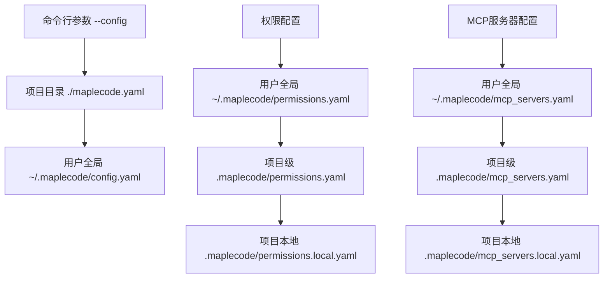

MapleCode 采用分层配置架构，支持从全局到项目的多级配置覆盖。本文档将详细解析配置文件的完整结构、各项参数的含义以及最佳实践，帮助开发者快速上手并根据需求定制化配置。

## 配置文件层次结构

MapleCode 的配置系统采用 **三层优先级架构**，允许在全局、项目和本地三个层次上定义配置。下图展示了配置文件的加载顺序和优先级关系：



**加载优先级规则**：
1. **主配置文件**：命令行参数 `--config` > 项目目录 `./maplecode.yaml` > 用户全局 `~/.maplecode/config.yaml`
2. **权限配置文件**：用户全局 < 项目级 < 项目本地（后者覆盖前者）
3. **MCP服务器配置文件**：用户全局 < 项目级 < 项目本地（后者覆盖前者）

Sources: [App.java](src/main/java/com/maplecode/App.java#L254-L263), [PermissionFileLoader.java](src/main/java/com/maplecode/permission/PermissionFileLoader.java#L21-L36), [McpServerConfigLoader.java](src/main/java/com/maplecode/mcp/config/McpServerConfigLoader.java#L20-L32)

## 核心配置项详解

主配置文件 `maplecode.yaml` 包含以下核心配置项：

### 基础连接配置

| 配置项 | 类型 | 必需 | 默认值 | 说明 |
|--------|------|------|--------|------|
| `protocol` | string | 是 | - | LLM协议类型：`"anthropic"` 或 `"openai"` |
| `model` | string | 是 | - | 模型名称，如 `claude-sonnet-4-6` |
| `base_url` | string | 是 | - | API端点URL |
| `api_key` | string | 是 | - | API密钥，支持 `${ENV_VAR}` 语法从环境变量解析 |

**环境变量替换机制**：配置文件中的 `${ENV_VAR}` 占位符会在加载时自动替换为对应的环境变量值。如果环境变量未设置，将抛出 `ConfigException` 异常。

Sources: [maplecode.yaml.example](maplecode.yaml.example#L4-L7), [ConfigLoader.java](src/main/java/com/maplecode/config/ConfigLoader.java#L142-L155)

### 系统提示词配置

| 配置项 | 类型 | 必需 | 默认值 | 说明 |
|--------|------|------|--------|------|
| `system_prompt` | string | 否 | null | 自定义系统提示词，支持多行YAML格式 |

系统提示词会在启动时与其他系统块（如工具定义、环境信息等）组装成完整的系统提示。

Sources: [maplecode.yaml.example](maplecode.yaml.example#L9-L10), [ConfigLoader.java](src/main/java/com/maplecode/config/ConfigLoader.java#L44-L45)

### 扩展思考配置

扩展思考（Extended Thinking）是Anthropic Claude的增强推理能力，支持两种模式：

| 配置项 | 类型 | 必需 | 默认值 | 说明 |
|--------|------|------|--------|------|
| `extended_thinking.type` | string | 否 | null | 思考模式：`"adaptive"`（推荐）或 `"enabled"`（已弃用） |
| `extended_thinking.effort` | string | 否 | null | `adaptive`模式下的努力程度：`"low"`、`"medium"`或 `"high"` |
| `extended_thinking.budget_tokens` | integer | 否 | null | `enabled`模式下的token预算（≥1024且<max_tokens） |

**重要提示**：
- `adaptive` 模式是推荐的思考模式，自动根据问题复杂度调整思考深度
- `enabled` 模式已弃用，在 Opus 4.7 上会返回 HTTP 400 错误
- 两种模式互斥，不能同时配置 `effort` 和 `budget_tokens`

Sources: [maplecode.yaml.example](maplecode.yaml.example#L12-L15), [ThinkingConfig.java](src/main/java/com/maplecode/provider/ThinkingConfig.java#L5-L34), [ConfigLoader.java](src/main/java/com/maplecode/config/ConfigLoader.java#L81-L114)

## 权限配置详解

权限配置控制工具调用的安全策略，支持三种模式：

### 权限模式配置

| 配置项 | 类型 | 必需 | 默认值 | 说明 |
|--------|------|------|--------|------|
| `permission_mode` | string | 否 | `"default"` | 权限模式：`"strict"`、`"default"`或 `"permissive"` |

**权限模式说明**：
- **strict**：未匹配规则直接拒绝所有工具调用
- **default**：未匹配规则时通过人机交互（HITL）确认
- **permissive**：未匹配规则直接放行

权限模式可通过运行时 `/mode` 命令热切换，但重启后会恢复为配置文件中的值。

Sources: [maplecode.yaml.example](maplecode.yaml.example#L17-L27), [PermissionMode.java](src/main/java/com/maplecode/permission/PermissionMode.java#L1-L4), [ConfigLoader.java](src/main/java/com/maplecode/config/ConfigLoader.java#L54-L61)

### 权限规则文件

权限规则采用分层覆盖机制，支持细粒度的工具调用控制：

| 配置文件路径 | 优先级 | 用途 | 建议版本控制 |
|-------------|--------|------|--------------|
| `~/.maplecode/permissions.yaml` | 低 | 用户全局共享规则 | 不纳入 |
| `<项目>/.maplecode/permissions.yaml` | 中 | 项目级规则 | 纳入git |
| `<项目>/.maplecode/permissions.local.yaml` | 高 | 项目本地规则 | 纳入.gitignore |

**规则文件格式**：
```yaml
rules:
  - tool: exec
    pattern: "git *"
    action: allow
  - tool: exec
    pattern: "rm -rf *"
    action: deny
```

**规则字段说明**：
- `tool`：工具名称，支持的工具包括 `read_file`、`write_file`、`edit_file`、`exec`、`glob`、`grep`
- `pattern`：匹配模式，支持通配符
- `action`：动作类型，`allow`（允许）或 `deny`（拒绝）

Sources: [maplecode.yaml.example](maplecode.yaml.example#L19-L27), [PermissionFileLoader.java](src/main/java/com/maplecode/permission/PermissionFileLoader.java#L21-L36), [.maplecode/permissions.local.yaml](.maplecode/permissions.local.yaml#L1-L65)

## 超时与代理配置

### 超时配置

| 配置项 | 类型 | 必需 | 默认值 | 说明 |
|--------|------|------|--------|------|
| `timeouts.connect_seconds` | integer | 否 | 10 | 连接超时时间（秒） |
| `timeouts.read_seconds` | integer | 否 | 60 | 读取超时时间（秒） |

Sources: [maplecode.yaml.example](maplecode.yaml.example#L29-L31), [AppConfig.java](src/main/java/com/maplecode/config/AppConfig.java#L32-L35)

### 代理限制配置

| 配置项 | 类型 | 必需 | 默认值 | 说明 |
|--------|------|------|--------|------|
| `agent.max_iterations` | integer | 否 | 50 | 单轮对话最大工具调用轮数 |
| `agent.max_consecutive_unknown` | integer | 否 | 3 | 连续调用未知工具达到此次数后停止 |

Sources: [maplecode.yaml.example](maplecode.yaml.example#L33-L35), [AppConfig.java](src/main/java/com/maplecode/config/AppConfig.java#L37-L49)

## MCP服务器配置

MCP（Model Context Protocol）服务器配置控制外部工具服务的连接：

### MCP服务器主配置

| 配置项 | 类型 | 必需 | 默认值 | 说明 |
|--------|------|------|--------|------|
| `mcp_servers.enabled` | boolean | 否 | true | 是否启用MCP服务器 |
| `mcp_servers.startup_timeout_ms` | integer | 否 | 5000 | 启动超时时间（毫秒） |

Sources: [maplecode.yaml.example](maplecode.yaml.example#L55-L57), [AppConfig.java](src/main/java/com/maplecode/config/AppConfig.java#L52-L66)

### MCP服务器定义文件

MCP服务器定义采用分层覆盖机制，支持全局共享和项目定制：

| 配置文件路径 | 优先级 | 用途 | 建议版本控制 |
|-------------|--------|------|--------------|
| `~/.maplecode/mcp_servers.yaml` | 低 | 用户全局共享服务器 | 不纳入 |
| `<项目>/.maplecode/mcp_servers.yaml` | 中 | 项目级服务器 | 纳入git |
| `<项目>/.maplecode/mcp_servers.local.yaml` | 高 | 项目本地服务器 | 纳入.gitignore |

**服务器定义格式**：
```yaml
servers:
  github:
    type: stdio
    command: npx
    args: ["-y", "@modelcontextprotocol/server-github"]
    env:
      GITHUB_TOKEN: ${GITHUB_TOKEN}
  
  notion:
    type: http
    url: https://mcp.notion.example.com/mcp
    headers:
      Authorization: "Bearer ${NOTION_TOKEN}"
```

**服务器类型说明**：
- **stdio**：本地进程通信，通过标准输入/输出与服务器交互
- **http**：HTTP远程通信，通过URL连接服务器

Sources: [maplecode.yaml.example](maplecode.yaml.example#L39-L54), [McpServerConfigLoader.java](src/main/java/com/maplecode/mcp/config/McpServerConfigLoader.java#L20-L32), [.maplecode/mcp_servers.yaml](.maplecode/mcp_servers.yaml#L1-L8)

## 高级配置选项

### 上下文管理配置（v6+）

| 配置项 | 类型 | 必需 | 默认值 | 说明 |
|--------|------|------|--------|------|
| `context_window` | integer | 否 | 200000 | 上下文窗口总token数（输入预算） |
| `summarizer_model` | string | 否 | null | 摘要专用模型，未配置则使用主模型 |

**建议配置**：
- Claude Sonnet 4.6 / Opus 4.7 / Haiku 4.5：默认200000
- GPT-4o：建议调整为128000
- 调试时可临时调小（如30000）触发次层摘要

Sources: [maplecode.yaml.example](maplecode.yaml.example#L59-L70), [AppConfig.java](src/main/java/com/maplecode/config/AppConfig.java#L23-L24)

### 长期记忆配置（v7.3+）

| 配置项 | 类型 | 必需 | 默认值 | 说明 |
|--------|------|------|--------|------|
| `memory.enabled` | boolean | 否 | true | 是否启用自动长期记忆 |
| `memory.memory_model` | string | 否 | null | 记忆提取用模型，未配置则复用主模型 |
| `memory.max_context_messages` | integer | 否 | 10 | 提取时查看的最近消息数量 |

**记忆系统工作原理**：
1. 每轮Agent Loop结束后异步调用LLM分析对话
2. 自动新增/修改/删除长期记忆
3. 记忆在下次启动时注入系统提示词
4. 实现跨会话知识积累

Sources: [maplecode.yaml.example](maplecode.yaml.example#L72-L79), [MemoryConfig.java](src/main/java/com/maplecode/memory/MemoryConfig.java#L5-L27)

## 配置示例与最佳实践

### 完整配置示例

```yaml
# 基础连接配置
protocol: anthropic
model: claude-sonnet-4-6
base_url: https://api.anthropic.com
api_key: ${ANTHROPIC_API_KEY}

# 系统提示词
system_prompt: |
  你是一个专业的Java开发助手，擅长代码审查和重构。
  请用中文回复，保持专业和简洁。

# 扩展思考配置
extended_thinking:
  type: adaptive
  effort: high

# 权限配置
permission_mode: default

# 超时配置
timeouts:
  connect_seconds: 15
  read_seconds: 90

# 代理限制
agent:
  max_iterations: 100
  max_consecutive_unknown: 5

# MCP服务器配置
mcp_servers:
  enabled: true
  startup_timeout_ms: 10000

# 上下文管理
context_window: 200000
summarizer_model: claude-haiku-4-5

# 长期记忆
memory:
  enabled: true
  memory_model: claude-haiku-4-5
  max_context_messages: 15
```

### 最佳实践建议

1. **安全性原则**：
   - 使用环境变量存储敏感信息（API密钥等）
   - 项目本地配置文件纳入 `.gitignore`
   - 权限规则采用最小权限原则

2. **性能优化**：
   - 根据实际需求调整 `context_window` 大小
   - 使用专用摘要模型降低主模型负载
   - 合理设置超时时间平衡响应性和稳定性

3. **团队协作**：
   - 项目级配置纳入版本控制
   - 使用本地配置文件处理个人偏好
   - 建立统一的权限规则模板

4. **调试技巧**：
   - 临时调小 `context_window` 触发摘要机制
   - 使用 `/mode` 命令临时切换权限模式
   - 通过 `/tools` 命令查看可用工具列表

## 下一步阅读

配置文件详解完成后，建议继续阅读以下相关文档：

- [基础使用指南](4-ji-chu-shi-yong-zhi-nan) - 了解MapleCode的日常使用方法
- [整体架构与数据流](5-zheng-ti-jia-gou-yu-shu-ju-liu) - 深入理解系统工作原理
- [权限配置与规则引擎](14-quan-xian-pei-zhi-yu-gui-ze-yin-qing) - 详细学习权限系统配置
- [新增 LLM Provider 指南](27-xin-zeng-llm-provider-zhi-nan) - 扩展支持其他LLM服务