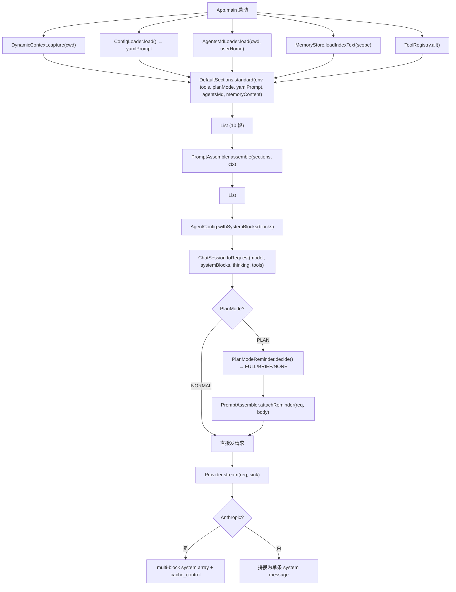
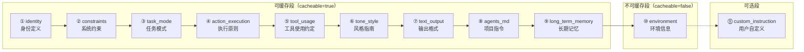
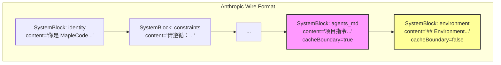
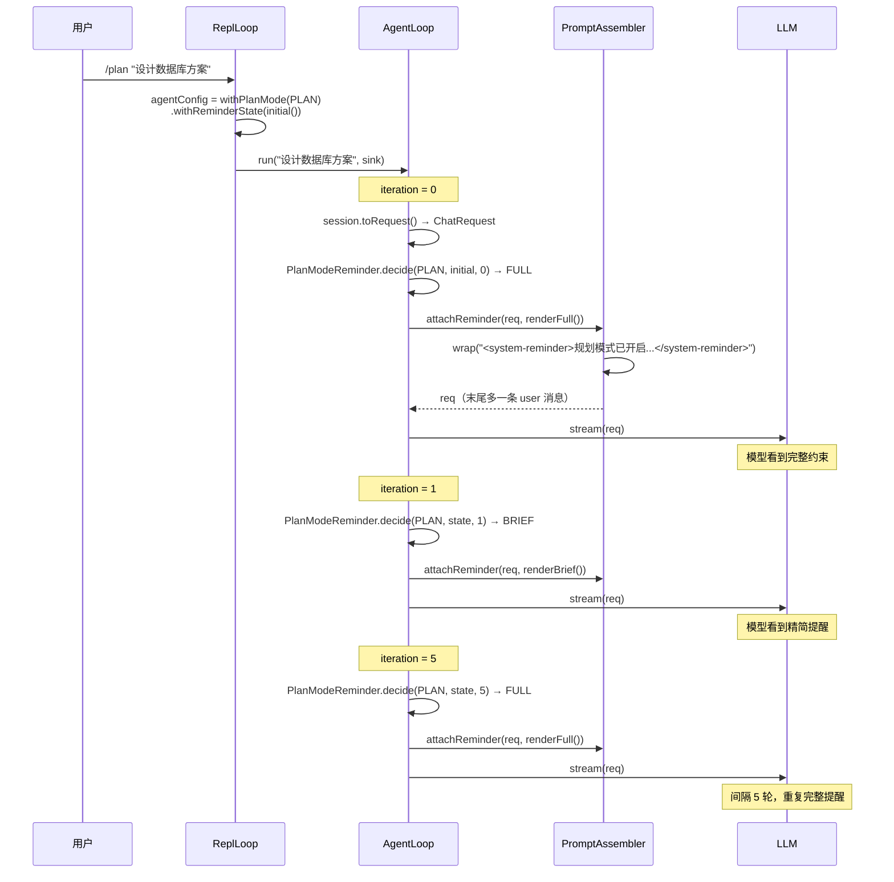

系统提示词是 AI 编程助手的"灵魂"——它决定了模型的角色定位、行为准则、工具使用策略和输出风格。MapleCode 采用**模块化、可缓存、可扩展**的系统提示词架构，将传统单一字符串拆解为 10 个职责明确的逻辑段（PromptSection），通过 `PromptAssembler` 在启动时动态装配，既保证了 Anthropic Prompt Cache 的高效命中，又为用户自定义、项目级指令和跨会话记忆提供了灵活的注入点。

## 架构总览

系统提示词的装配是一个从"静态模板"到"动态渲染"再到"请求注入"的三阶段流水线。在启动阶段，`App.main` 捕获运行时环境（工作目录、平台、日期等），结合已注册工具列表、AGENTS.md 内容和长期记忆，调用 `DefaultSections.standard()` 生成有序的 `PromptSection` 列表；`PromptAssembler` 遍历该列表，跳过禁用或空白段，将最后一段可缓存内容标记为缓存边界（`cacheBoundary=true`），最终产出 `List<SystemBlock>`。运行阶段，`AgentLoop` 在每轮请求前检查是否需要追加 PlanModeReminder，通过 `<system-reminder>` 标签注入临时用户消息（不写入 session 历史），保持缓存稳定性。

Sources: [App.java](src/main/java/com/maplecode/App.java#L138-L164), [PromptAssembler.java](src/main/java/com/maplecode/prompt/PromptAssembler.java#L1-L41), [DefaultSections.java](src/main/java/com/maplecode/prompt/DefaultSections.java#L57-L70), [AgentLoop.java](src/main/java/com/maplecode/agent/AgentLoop.java#L99-L122)

## 核心抽象

系统提示词架构由五个核心抽象组成，它们各司其职，共同构成了一条从"模板定义"到"网络请求"的完整管线。

**`PromptSection`** 是所有提示词段落的统一接口，定义了四个方法：`kind()` 返回类型标识符（如 `"identity"`、`"constraints"`），`render(SectionContext)` 根据上下文生成文本内容，`cacheable()` 指示该段是否可被 Anthropic Prompt Cache 缓存（默认 `true`），`enabled(SectionContext)` 允许根据上下文条件动态启用或禁用该段（默认 `true`）。这个接口是扩展系统提示词的唯一契约——要新增一个提示词段落，只需实现此接口并在 `DefaultSections.standard()` 中注册即可。

**`SystemBlock`** 是组装后的原子单元，一个不可变记录类型，包含三个字段：`content`（渲染后的纯文本）、`cacheBoundary`（是否标记为 Anthropic 缓存边界，即是否附加 `cache_control: {type: ephemeral}`）、`kind`（段落类型标识）。整个装配结果中**最多只有一个** `cacheBoundary=true` 的块——`PromptAssembler` 会自动将最后一个可缓存段标记为缓存边界，最大化缓存命中范围。

**`SectionContext`** 是传递给 `render()` 的上下文对象，包含当前可用的工具列表、动态环境信息和计划模式状态。这使得工具使用约定、环境信息、任务模式等段落能够根据运行时条件动态生成内容。

**`DynamicContext`** 封装了启动时捕获的运行时环境：工作目录、是否 Git 仓库、操作系统平台、Java 版本、Maven 版本、当前日期和时间。它通过 `DynamicContext.capture(cwd)` 在 `App.main` 启动时一次性构建（`detectMavenVersion()` 通过执行 `mvn -v` 获取版本号，失败时降级为 `"unknown"`），之后作为不可变对象在整次会话中复用。

**`PromptAssembler`** 是装配引擎，提供两个核心方法：`assemble(sections, ctx)` 遍历段落列表，跳过禁用或空白段，标记缓存边界；`attachReminder(req, reminderBody)` 将运行时提醒包装为 `<system-reminder>` 标签并追加到请求末尾（不修改原始 session）。

| 抽象 | 职责 | 关键特性 |
|------|------|----------|
| `PromptSection` | 提示词段落的统一接口 | `kind()` / `render()` / `cacheable()` / `enabled()` |
| `SystemBlock` | 装配后的原子单元 | 不可变 record，`cacheBoundary` 标记缓存边界 |
| `SectionContext` | 渲染上下文 | 包含工具列表、环境信息、计划模式 |
| `DynamicContext` | 运行时环境快照 | 启动时一次性捕获，不可变 |
| `PromptAssembler` | 装配引擎 | 自动标记缓存边界 + 运行时 reminder 注入 |

Sources: [PromptSection.java](src/main/java/com/maplecode/prompt/PromptSection.java#L1-L62), [SystemBlock.java](src/main/java/com/maplecode/prompt/SystemBlock.java#L1-L4), [SectionContext.java](src/main/java/com/maplecode/prompt/SectionContext.java#L1-L12), [DynamicContext.java](src/main/java/com/maplecode/prompt/DynamicContext.java#L1-L52), [PromptAssembler.java](src/main/java/com/maplecode/prompt/PromptAssembler.java#L1-L41)

## 默认提示词段落

`DefaultSections.standard()` 按固定顺序组装 10 个提示词段落。这个顺序经过精心设计——将稳定内容（身份、约束、工具约定等）放在前面，将动态内容（环境信息）放在最后，确保缓存命中率最大化。如果将 ENVIRONMENT 这样的动态内容放到 TEXT_OUTPUT 前面，会导致缓存命中率几乎为零。

各段落的详细说明如下：

**① Identity（身份定义）**：定义 AI 的基本角色——"你是 MapleCode，一个运行在终端的 AI 编程助手。"。这是模型行为的基础锚点。

**② System Constraints（系统约束）**：设定核心行为准则——不确定时先读文件再行动，不要凭空猜测 API、路径或代码内容；仅使用已注册的工具，不要伪造工具结果；引用文件路径时优先使用相对路径。

**③ Task Mode（任务模式）**：根据 `ctx.planMode()` 动态切换。执行模式下可以读写文件、执行命令；规划模式下仅可使用只读工具（read_file / glob / grep），输出可执行计划。这是一个 `PlanModeAwareSection`，其 `render()` 方法根据上下文实时生成不同内容。

**④ Action Execution（执行原则）**：指导多步任务的执行策略——先列出计划再按顺序执行，调用工具前说明目的，调用后说明关键结果，工具返回错误时先分析根因再决定是否重试。

**⑤ Tool Usage（工具使用约定）**：一个 `ToolAwareSection`，其 `render()` 方法会动态生成当前可用工具列表。核心约定包括优先使用专用工具（read_file / glob / grep / write_file / edit_file），edit_file 前必须先 read_file，exec 跑长命令加 timeout，不要用 exec 模拟 ls / find / grep。

**⑥ Tone Style（风格指南）**：中文短句优先，标点用中文全角，技术名词保留英文（如 cache、token、schema），段落用空行分隔。

**⑦ Text Output（输出格式）**：代码块包裹路径和命令，列表用 `- ` 不用数字编号（除非按步骤），不要把工具调用 JSON 完整回显只说结论。

**⑧ AgentsMd（项目指令）**：从三层 AGENTS.md 文件加载并拼接的项目级指令，支持 `{{include:path}}` 指令。内容为空时该段被跳过。

**⑨ Long-Term Memory（长期记忆）**：跨会话积累的用户/项目级记忆，由 `MemoryManager` 在每轮 Agent Loop 结束后异步提取。内容为空时该段被跳过（`enabled()=false`）。

**⑩ Environment（环境信息）**：唯一 `cacheable=false` 的段落，包含工作目录、Git 仓库状态、操作系统平台、Java/Maven 版本、当前日期和时间。因为这些信息每次启动都会变化，所以不能被缓存。

**⑪ Custom Instruction（用户自定义指令）**：来自 YAML 配置文件 `system_prompt` 字段的额外指令。仅在用户显式配置时才添加（`customInstruction != null && !customInstruction.isBlank()`）。如果有用户自定义指令，缓存边界会从 agents_md/long_term_memory 移动到此段（因为它排在更后面）。

| 段落 | kind 标识 | cacheable | 动态内容 | 条件启用 |
|------|-----------|-----------|----------|----------|
| Identity | `identity` | ✅ | 否 | 始终启用 |
| System Constraints | `constraints` | ✅ | 否 | 始终启用 |
| Task Mode | `task_mode` | ✅ | 是（根据 planMode） | 始终启用 |
| Action Execution | `action_execution` | ✅ | 否 | 始终启用 |
| Tool Usage | `tool_usage` | ✅ | 是（工具列表） | 始终启用 |
| Tone Style | `tone_style` | ✅ | 否 | 始终启用 |
| Text Output | `text_output` | ✅ | 否 | 始终启用 |
| AgentsMd | `agents_md` | ✅ | 否 | 有内容时启用 |
| Long-Term Memory | `long_term_memory` | ✅ | 否 | 有内容时启用 |
| Environment | `environment` | ❌ | 是（日期、时间） | 始终启用 |
| Custom Instruction | `custom_instruction` | ✅ | 否 | 配置了 system_prompt 时启用 |

Sources: [DefaultSections.java](src/main/java/com/maplecode/prompt/DefaultSections.java#L1-L138), [DefaultSectionsTest.java](src/test/java/com/maplecode/prompt/DefaultSectionsTest.java#L1-L76)

## 缓存优化策略

系统提示词缓存优化的核心思想是：**让稳定内容走 Anthropic Prompt Cache 通道，让动态内容走消息通道**。Prompt Cache 的原理是：如果连续请求的系统提示词前缀相同，Anthropic 服务端可以跳过该部分的计算，直接复用缓存的 KV 状态，从而节省输入 token 费用（缓存读取的价格仅为正常输入的 10%）。

MapleCode 的缓存策略体现在三个层面：

**顺序设计**：10 个段落按稳定性从高到低排列——身份定义、系统约束、执行原则、风格指南等几乎不变的内容排在前面；工具列表（可能因 MCP 动态增减）排在中间；AGENTS.md 和长期记忆排在后面；环境信息（每次启动都变化）排在最后。这种排列方式确保了只要前 N 段没有变化，后续所有段的缓存都能命中。

**单点缓存边界**：`PromptAssembler` 采用"最后一个 cacheable 段标记为缓存边界"的策略。对于 Anthropic API，这意味着在该段的 `system` block 中附加 `cache_control: {type: ephemeral}`，告诉服务端"从第一个 system block 到这个位置为止，缓存 KV 状态"。整个装配结果中**最多只有 1 个** `cacheBoundary=true` 的块——这与 Anthropic Prompt Cache 的 4 断点上限一致，当前设计只在 system 末尾写 1 处，把 tools 留给自动缓存。

**动态段隔离**：`EnvironmentSection` 的 `cacheable()` 返回 `false`，这意味着即使它排在最后，也不会被标记为缓存边界。如果有用户自定义指令（`custom_instruction`），缓存边界会移到它上面；如果没有，则落在 `agents_md` 或 `long_term_memory` 上（取决于哪个有内容且排在最后）。

测试用例 `PromptAssemblerAgentsTest` 验证了缓存边界的正确性：不带 `customInstruction` 时，缓存边界落在 `agents_md` 或 `long_term_memory` 上；带 `customInstruction` 时，缓存边界移动到 `custom_instruction` 上。

Sources: [PromptAssembler.java](src/main/java/com/maplecode/prompt/PromptAssembler.java#L12-L31), [DefaultSections.java](src/main/java/com/maplecode/prompt/DefaultSections.java#L98-L110), [PromptAssemblerAgentsTest.java](src/test/java/com/maplecode/prompt/PromptAssemblerAgentsTest.java#L1-L66), [PromptAssemblerTest.java](src/test/java/com/maplecode/prompt/PromptAssemblerTest.java#L30-L42)

## 用户自定义指令

MapleCode 支持三个层次的用户自定义指令，从全局到项目级再到运行时，优先级依次升高。

**YAML `system_prompt` 配置**：在 `maplecode.yaml`（或 `~/.maplecode/config.yaml`）的顶层 `system_prompt` 字段中填写的文本，会作为 `CustomInstructionSection` 追加到系统提示词末尾。这是最常见的自定义方式——例如，配置 `system_prompt: "做且只做单元测试"` 可以让模型在该会话中专注于测试编写。

**AGENTS.md 项目指令文件**：通过三层加载机制注入，优先级从低到高为：`~/.maplecode/AGENTS.md`（用户全局）→ `<项目>/.maplecode/AGENTS.md`（项目级）→ `<项目>/AGENTS.md`（项目根目录，最高优先级）。支持 `{{include:path}}` 指令递归展开嵌入文件（最大深度 3 层，总大小上限 64KB）。各层内容用 `---` 分隔符拼接。`AgentsMdLoader.load(cwd, userHome)` 在启动时一次性加载，跨整次会话复用。

**长期记忆**：由 `MemoryManager` 在每轮 Agent Loop 结束后异步调用 LLM 分析对话，自动新增/修改/删除记忆条目。记忆按 scope 分为 `user`（跨项目，存储在 `~/.maplecode/memory/`）和 `project`（当前项目，存储在 `<项目>/.maplecode/memory/`），每个记忆条目包含名称、分类、摘要和完整内容。下次启动时，`MemoryStore.loadIndexText()` 读取 MEMORY.md 索引文件，将内容注入 `MemorySection`。用户可通过 `/memory list` 查看所有记忆、`/memory clear` 清空、`/memory extract` 手动触发提取。

| 层次 | 来源 | 注入时机 | 持久性 | 配置方式 |
|------|------|----------|--------|----------|
| YAML system_prompt | `maplecode.yaml` | 启动时 | 跨会话（配置文件） | YAML 编辑 |
| AGENTS.md | 三层文件加载 | 启动时 | 跨会话（文件系统） | 编辑 AGENTS.md |
| 长期记忆 | LLM 自动提取 | 启动时注入 | 跨会话（自动积累） | `/memory` 命令 |
| PlanModeReminder | 运行时动态 | 每轮请求前 | 不持久 | `/plan` 命令触发 |

Sources: [ConfigLoader.java](src/main/java/com/maplecode/config/ConfigLoader.java#L60-L64), [AgentsMdLoader.java](src/main/java/com/maplecode/agents/AgentsMdLoader.java#L1-L43), [IncludeResolver.java](src/main/java/com/maplecode/agents/IncludeResolver.java#L1-L86), [Concatenator.java](src/main/java/com/maplecode/agents/Concatenator.java#L1-L30), [MemorySection.java](src/main/java/com/maplecode/prompt/MemorySection.java#L1-L34), [MemoryManager.java](src/main/java/com/maplecode/memory/MemoryManager.java#L1-L120), [MemoryStore.java](src/main/java/com/maplecode/memory/MemoryStore.java#L1-L370)

## 运行时提醒机制

除了启动时静态组装的系统提示词，MapleCode 还需要在运行时向模型注入临时指令——典型场景是 Plan Mode 的约束提醒。这些指令的注入必须满足两个矛盾的需求：让模型在每轮请求中都看到约束，同时不污染缓存和会话历史。

解决方案是 **`<system-reminder>` 标签机制**：通过 `PromptAssembler.attachReminder(req, reminderBody)` 将提醒包装为 `<system-reminder>...</system-reminder>` 标签，追加为一条临时的 user 消息发送给模型。这条消息**不写入 ChatSession**（仅存在于当次请求的 `ChatRequest.messages` 副本中），因此不会累积到后续请求的 token 消耗中，也不会干扰缓存。

**Plan Mode Reminder 的节流策略**：为避免每轮都重复完整提醒浪费 token，`PlanModeReminder` 实现了智能节流——第 0 轮发送完整版（列出所有禁止操作和预期行为），之后每 5 轮重复一次完整版，中间轮次发送精简版（"规划模式仍处于激活状态，仅可调用只读工具"）。状态通过 `PlanModeReminder.State` record 跟踪（`fullInserts` 计数和 `lastFullIteration` 上次完整提醒的迭代号），存储在 `AgentConfig.reminderState` 中，在 `/plan`、`/do`、`/cancel` 等命令时正确重置。

Sources: [PlanModeReminder.java](src/main/java/com/maplecode/prompt/PlanModeReminder.java#L1-L37), [ReminderMessage.java](src/main/java/com/maplecode/prompt/ReminderMessage.java#L1-L13), [PromptAssembler.java](src/main/java/com/maplecode/prompt/PromptAssembler.java#L33-L41), [AgentLoop.java](src/main/java/com/maplecode/agent/AgentLoop.java#L99-L122)

## Provider 差异化处理

系统提示词在发送到不同 LLM Provider 时有不同的序列化策略。**Anthropic 路径**采用 multi-block system array 格式——每个 `SystemBlock` 独立为一个 `{"type": "text", "text": "..."}` 对象，缓存边界块额外附加 `cache_control: {"type": "ephemeral"}`。这种格式原生支持 Prompt Cache。**OpenAI 路径**将所有 `SystemBlock` 的内容用 `\n\n` 拼接为一条 `role: system` 消息，忽略 `cacheBoundary` 标记（OpenAI 的自动缓存机制不需要显式标记）。

| 特性 | Anthropic | OpenAI |
|------|-----------|--------|
| 系统消息格式 | multi-block array | 单条 system message |
| 缓存控制 | `cache_control: ephemeral` 显式标记 | 服务端自动缓存（≥1024 token） |
| 缓存边界 | `SystemBlock.cacheBoundary=true` | 忽略 |
| Token 统计 | `cache_creation_input_tokens` + `cache_read_input_tokens` | 无区分 |

Sources: [AnthropicRequestMapper.java](src/main/java/com/maplecode/provider/anthropic/AnthropicRequestMapper.java), [OpenAiRequestMapper.java](src/main/java/com/maplecode/provider/openai/OpenAiRequestMapper.java)

## 优化实践指南

基于 MapleCode 的系统提示词架构，以下是一些实用的优化建议：

**选择合适的自定义层级**：团队共享的行为准则（如编码规范、技术栈约束）应放在 `AGENTS.md`（项目级，入 git），个人偏好（如输出风格、常用模式）应放在 YAML `system_prompt` 或 `~/.maplecode/AGENTS.md`（用户全局）。

**利用 AGENTS.md 的 include 指令**：对于大型项目，可以将不同维度的指令拆分为独立文件（如 `coding-standards.md`、`architecture-notes.md`），然后在 AGENTS.md 中通过 `{{include:coding-standards.md}}` 引入。这不仅提高了可维护性，还允许不同子项目共享公共指令。

**管理长期记忆**：长期记忆是跨会话积累的知识，但过多的记忆会增加每次请求的 token 消耗。定期通过 `/memory list` 审查记忆内容，使用 `/memory clear` 清理过时信息。记忆按分类（`MemoryCategory`）组织，每个分类有独立的目录和索引文件。

**合理使用 Plan Mode**：规划模式不仅是一个功能，也是一种系统提示词优化手段——在执行复杂任务前，先用 `/plan` 让模型生成计划，审查后再用 `/do` 执行。这避免了模型在执行过程中"迷路"，减少不必要的工具调用轮次。

**注意缓存失效条件**：以下操作会导致 Prompt Cache 失效，下一轮请求的 `cache_creation_input_tokens` 会增加：修改 YAML `system_prompt`、AGENTS.md 文件内容变化、新增或删除 MCP 工具（影响 `tool_usage` 段的工具列表）、Maven 版本变化（影响 `environment` 段）。环境信息本身不可缓存，但它排在最后不影响前面段落的缓存。

Sources: [DefaultSections.java](src/main/java/com/maplecode/prompt/DefaultSections.java#L57-L70), [AgentsMdLoader.java](src/main/java/com/maplecode/agents/AgentsMdLoader.java#L1-L43), [MemoryManager.java](src/main/java/com/maplecode/memory/MemoryManager.java#L1-L120), [PlanModeReminder.java](src/main/java/com/maplecode/prompt/PlanModeReminder.java#L1-L37)

## 阅读建议

本文档聚焦于系统提示词的**结构、装配和优化策略**。如需进一步了解相关模块，建议按以下路径阅读：[上下文管理与压缩](17-shang-xia-wen-guan-li-yu-ya-suo) 了解系统提示词如何与上下文窗口管理协作；[长期记忆系统](18-chang-qi-ji-yi-xi-tong) 了解记忆提取和注入的完整机制；[Agent Loop 实现](16-agent-loop-shi-xian) 了解 PlanModeReminder 在 Agent 循环中的具体注入时机；[配置文件详解](3-pei-zhi-wen-jian-xiang-jie) 了解 YAML 配置中 `system_prompt` 和相关选项的完整说明。