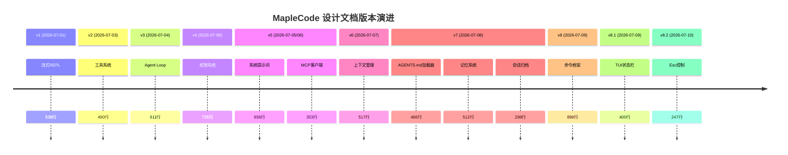
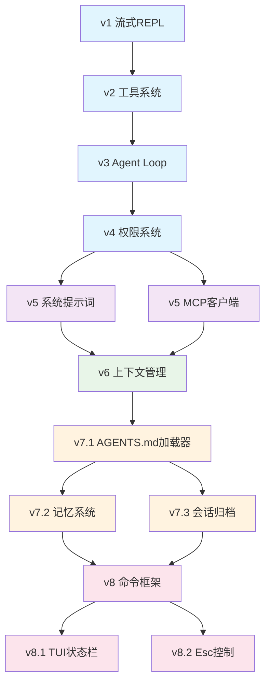

本页面提供 MapleCode 项目设计文档的完整索引，帮助开发者快速定位相关设计规格、实现计划和代码审查报告。设计文档是理解系统架构演进、实现细节和设计决策的关键资源。

## 设计文档体系概述

MapleCode 的设计文档采用**三层结构**组织，分别对应不同的使用场景和受众：

| 文档类型 | 目录 | 用途 | 目标受众 |
|----------|------|------|----------|
| **设计规格 (Specs)** | `docs/superpowers/specs/` | 系统架构设计、接口定义、技术决策 | 架构师、高级开发者 |
| **实现计划 (Plans)** | `docs/superpowers/plans/` | 详细的实现步骤、任务分解、代码结构 | 实现者、Agentic Workers |
| **代码审查 (Reviews)** | `docs/review/` | 实现质量评估、问题发现、修复验证 | 所有开发者、质量保证 |

Sources: [AGENTS.md](AGENTS.md#L1-L165) [README.md](README.md#L1-L229)

## 设计文档版本演进

MapleCode 按功能阶段逐步演进，每个阶段都有对应的设计规格和实现计划：

Sources: [AGENTS.md](AGENTS.md#L1-L165) [docs/superpowers/specs/](docs/superpowers/specs/)

## 设计规格文档索引

以下是所有设计规格文档的详细索引，按版本顺序排列：

### v1 流式REPL (2026-07-01)

**文档**: [2026-07-01-maple-code-design.md](docs/superpowers/specs/2026-07-01-maple-code-design.md)
**范围**: 命令行AI对话工具基础架构，支持TUI、多Provider流式聊天
**核心内容**:
- 统一的 `LlmProvider` 接口设计
- Anthropic Claude 与 OpenAI 双Provider实现
- SSE流式解析机制
- JLine 3 REPL基础框架
- 配置文件加载与验证

**对应代码包**: `provider/`, `http/`, `config/`, `ui/`

Sources: [2026-07-01-maple-code-design.md](docs/superpowers/specs/2026-07-01-maple-code-design.md#L1-L539)

### v2 工具系统 (2026-07-03)

**文档**: [2026-07-03-maple-code-tool-system-design.md](docs/superpowers/specs/2026-07-03-maple-code-tool-system-design.md)
**范围**: 6个核心工具实现，工具调用协议支持
**核心内容**:
- `Tool` 接口与 `ToolRegistry` 设计
- 6个内置工具：`read_file`, `write_file`, `edit_file`, `exec`, `glob`, `grep`
- `ContentBlock` sealed interface 支持多模态消息
- 双Provider工具协议实现
- 单轮工具调用流程

**对应代码包**: `tool/`, `provider/`

Sources: [2026-07-03-maple-code-tool-system-design.md](docs/superpowers/specs/2026-07-03-maple-code-tool-system-design.md#L1-L491)

### v3 Agent Loop (2026-07-04)

**文档**: [2026-07-04-maple-code-agent-loop-design.md](docs/superpowers/specs/2026-07-04-maple-code-agent-loop-design.md)
**范围**: ReAct循环实现，模型自主工具调用
**核心内容**:
- `AgentLoop` ReAct循环设计
- 五种停止条件
- 异步事件总线 (`AgentEvent` sealed interface)
- 安全分批并发执行
- Plan Mode两段式设计

**对应代码包**: `agent/`, `tool/`

Sources: [2026-07-04-maple-code-agent-loop-design.md](docs/superpowers/specs/2026-07-04-maple-code-agent-loop-design.md#L1-L812)

### v4 权限系统 (2026-07-06)

**文档**: [2026-07-06-maple-code-permission-system-design.md](docs/superpowers/specs/2026-07-06-maple-code-permission-system-design.md)
**范围**: 五层权限防御管道
**核心内容**:
- 五层 `PermissionCheck` 管道：黑名单 → 路径沙箱 → 规则引擎 → 模式 → 人在回路
- 三档权限模式：strict/default/permissive
- 三层规则YAML文件合并
- HITL (Human-In-The-Loop) 4选1机制
- 路径沙箱防symlink逃逸

**对应代码包**: `permission/`, `tool/`

Sources: [2026-07-06-maple-code-permission-system-design.md](docs/superpowers/specs/2026-07-06-maple-code-permission-system-design.md#L1-L726)

### v5 系统提示词 (2026-07-05)

**文档**: [2026-07-05-maple-code-system-prompt-design.md](docs/superpowers/specs/2026-07-05-maple-code-system-prompt-design.md)
**范围**: 模块化系统提示词结构
**核心内容**:
- 7个固定模块 + 可选模块按优先级拼装
- Anthropic prompt cache优化
- `<system-reminder>` 运行时指令注入
- Plan Mode reminder节流策略
- `SystemBlock` 与 `PromptAssembler` 设计

**对应代码包**: `prompt/`, `provider/`

Sources: [2026-07-05-maple-code-system-prompt-design.md](docs/superpowers/specs/2026-07-05-maple-code-system-prompt-design.md#L1-L857)

### v5 MCP客户端 (2026-07-06)

**文档**: [2026-07-06-maple-code-mcp-client-design.md](docs/superpowers/specs/2026-07-06-maple-code-mcp-client-design.md)
**范围**: Model Context Protocol客户端集成
**核心内容**:
- MCP工具发现与注册
- `mcp__<server>__<tool>` 命名空间
- Stdio与StreamableHttp两种传输层
- 三层配置文件合并
- 诊断与错误处理

**对应代码包**: `mcp/`, `tool/`

Sources: [2026-07-06-maple-code-mcp-client-design.md](docs/superpowers/specs/2026-07-06-maple-code-mcp-client-design.md#L1-L354)

### v6 上下文管理 (2026-07-07)

**文档**: [2026-07-07-maple-code-context-management-design.md](docs/superpowers/specs/2026-07-07-maple-code-context-management-design.md)
**范围**: 两层压缩策略
**核心内容**:
- 轻量预防：工具结果Offloader
- 重量兜底：LLM生成5段结构化摘要
- Token估算与预算管理
- 熔断器机制
- `/compact` 手动压缩命令

**对应代码包**: `compact/`, `session/`

Sources: [2026-07-07-maple-code-context-management-design.md](docs/superpowers/specs/2026-07-07-maple-code-context-management-design.md#L1-L518)

### v7.1 AGENTS.md加载器 (2026-07-08)

**文档**: [2026-07-08-maple-code-agents-md-loader-design.md](docs/superpowers/specs/2026-07-08-maple-code-agents-md-loader-design.md)
**范围**: 项目指令文件加载
**核心内容**:
- 3层加载：项目根 → .maplecode/ → ~/.maplecode/
- `{{include:path}}` 引用解析
- 拼接与截断策略
- `AgentsMdSection` 接入PromptSection
- 容错优先设计

**对应代码包**: `agents/`, `prompt/`

Sources: [2026-07-08-maple-code-agents-md-loader-design.md](docs/superpowers/specs/2026-07-08-maple-code-agents-md-loader-design.md#L1-L487)

### v7.2 记忆系统 (2026-07-08)

**文档**: [2026-07-08-maple-code-memory-design.md](docs/superpowers/specs/2026-07-08-maple-code-memory-design.md)
**范围**: 自动长期记忆提取与存储
**核心内容**:
- 四类记忆：用户偏好、纠正反馈、项目知识、参考信息
- 两个存储位置：用户级、项目级
- LLM驱动的记忆操作提取
- Markdown文件存储格式
- 启动时注入system prompt

**对应代码包**: `memory/`, `prompt/`

Sources: [2026-07-08-maple-code-memory-design.md](docs/superpowers/specs/2026-07-08-maple-code-memory-design.md#L1-L513)

### v7.3 会话归档 (2026-07-08)

**文档**: [2026-07-08-maple-code-session-archive-design.md](docs/superpowers/specs/2026-07-08-maple-code-session-archive-design.md)
**范围**: 会话持久化与恢复
**核心内容**:
- JSONL序列化格式
- `/resume` 命令实现
- 30天自动过期清理
- SessionMeta元数据管理
- 与ContentBlock序列化对齐

**对应代码包**: `session/archive/`

Sources: [2026-07-08-maple-code-session-archive-design.md](docs/superpowers/specs/2026-07-08-maple-code-session-archive-design.md#L1-L299)

### v8 命令框架 (2026-07-09)

**文档**: [2026-07-09-maple-code-command-framework-design.md](docs/superpowers/specs/2026-07-09-maple-code-command-framework-design.md)
**范围**: 斜杠命令注册与分发框架
**核心内容**:
- `Command` 接口与 `CommandRegistry` 设计
- 13个内置命令实现
- `CommandContext` 窄接口
- JLine Tab补全集成
- 从if-else链到分发器重构

**对应代码包**: `command/`, `ui/`

Sources: [2026-07-09-maple-code-command-framework-design.md](docs/superpowers/specs/2026-07-09-maple-code-command-framework-design.md#L1-L897)

### v8.1 TUI状态栏 (2026-07-09)

**文档**: [2026-07-09-maple-code-tui-status-bar-design.md](docs/superpowers/specs/2026-07-09-maple-code-tui-status-bar-design.md)
**范围**: 终端用户界面增强
**核心内容**:
- 底部固定状态栏设计
- 输入框上边框实现
- JLine Status类使用
- 终端resize支持
- dumb terminal降级策略

**对应代码包**: `ui/`, `command/`

Sources: [2026-07-09-maple-code-tui-status-bar-design.md](docs/superpowers/specs/2026-07-09-maple-code-tui-status-bar-design.md#L1-L401)

### v8.2 Esc控制 (2026-07-10)

**文档**: [2026-07-10-maple-code-escape-controls-design.md](docs/superpowers/specs/2026-07-10-maple-code-escape-controls-design.md)
**范围**: 键盘交互控制优化
**核心内容**:
- 移除 `/cancel` 命令
- Agent流式响应期间单击Esc取消
- 用户输入期间双击Esc清空
- 状态化Esc控制器设计
- 终端序列兼容性处理

**对应代码包**: `ui/`, `command/`

Sources: [2026-07-10-maple-code-escape-controls-design.md](docs/superpowers/specs/2026-07-10-maple-code-escape-controls-design.md#L1-L248)

## 实现计划文档索引

实现计划文档提供详细的实现步骤和任务分解，适合Agentic Workers和实现者使用：

| 版本 | 文档 | 任务数 | 行数 | 用途 |
|------|------|--------|------|------|
| v1 | [2026-07-01-maple-code-java.md](docs/superpowers/plans/2026-07-01-maple-code-java.md) | 24 | 2793 | 流式REPL基础实现 |
| v2 | [2026-07-03-maple-code-tool-system.md](docs/superpowers/plans/2026-07-03-maple-code-tool-system.md) | 24 | 3869 | 工具系统实现 |
| v3 | [2026-07-04-maple-code-agent-loop.md](docs/superpowers/plans/2026-07-04-maple-code-agent-loop.md) | 31 | 3014 | Agent Loop实现 |
| v4 | [2026-07-06-maple-code-permission-system.md](docs/superpowers/plans/2026-07-06-maple-code-permission-system.md) | 28 | 2964 | 权限系统实现 |
| v5 | [2026-07-05-maple-code-system-prompt.md](docs/superpowers/plans/2026-07-05-maple-code-system-prompt.md) | 24 | 2163 | 系统提示词实现 |
| v5 | [2026-07-06-maple-code-mcp-client.md](docs/superpowers/plans/2026-07-06-maple-code-mcp-client.md) | 27 | 2676 | MCP客户端实现 |
| v6 | [2026-07-07-context-management.md](docs/superpowers/plans/2026-07-07-context-management.md) | 26 | 2595 | 上下文管理实现 |
| v7.1 | [2026-07-08-maple-code-v7-1-agents-md-loader.md](docs/superpowers/plans/2026-07-08-maple-code-v7-1-agents-md-loader.md) | 14 | 1394 | AGENTS.md加载器实现 |
| v7.2 | [2026-07-08-maple-code-v7-2-session-archive.md](docs/superpowers/plans/2026-07-08-maple-code-v7-2-session-archive.md) | 13 | 1104 | 会话归档实现 |
| v7.3 | [2026-07-08-maple-code-v7-3-memory.md](docs/superpowers/plans/2026-07-08-maple-code-v7-3-memory.md) | 20 | 1944 | 记忆系统实现 |
| v8 | [2026-07-09-command-framework.md](docs/superpowers/plans/2026-07-09-command-framework.md) | 25 | 2379 | 命令框架实现 |
| v8.1 | [2026-07-09-tui-status-bar.md](docs/superpowers/plans/2026-07-09-tui-status-bar.md) | 10 | 867 | TUI状态栏实现 |
| v8.2 | [2026-07-10-maple-code-escape-controls.md](docs/superpowers/plans/2026-07-10-maple-code-escape-controls.md) | 12 | 1088 | Esc控制实现 |

Sources: [docs/superpowers/plans/](docs/superpowers/plans/)

## 代码审查报告索引

代码审查报告记录实现质量评估和问题发现：

| 日期 | 文档 | 审查范围 | 问题数量 | 修复状态 |
|------|------|----------|----------|----------|
| 2026-07-09 | [2026-07-09-auto-memory-review.md](docs/review/2026-07-09-auto-memory-review.md) | 自动记忆子系统 | 15 | 11修复/4未修复 |
| 2026-07-09 | [2026-07-09-slash-command-review.md](docs/review/2026-07-09-slash-command-review.md) | 斜杠命令框架 | - | - |

Sources: [docs/review/](docs/review/)

## 设计文档依赖关系图

设计文档之间存在明确的依赖关系，理解这些关系有助于把握系统演进脉络：

**依赖说明**:
- **v1-v4**: 核心基础架构，每个版本都依赖前一个
- **v5**: 两个独立模块，都依赖v4权限系统
- **v6**: 依赖v5的两个模块
- **v7.x**: 三个独立模块，都依赖v6上下文管理
- **v8.x**: 三个独立模块，都依赖v7.x系列

Sources: [AGENTS.md](AGENTS.md#L1-L165)

## 设计文档使用指南

### 阅读顺序建议

**新手开发者**:
1. 从 [v1 流式REPL](docs/superpowers/specs/2026-07-01-maple-code-design.md) 开始，了解基础架构
2. 阅读 [README.md](README.md) 了解整体功能和使用方式
3. 按版本顺序阅读后续设计文档

**架构师**:
1. 直接阅读 [AGENTS.md](AGENTS.md) 了解整体架构
2. 根据兴趣选择特定版本的设计规格
3. 参考 [设计文档依赖关系图](#设计文档依赖关系图) 理解演进脉络

**实现者**:
1. 阅读对应版本的设计规格文档
2. 参考对应的实现计划文档
3. 查看代码审查报告了解实现质量

### 文档结构说明

每个设计规格文档通常包含以下部分：
1. **目标与非目标**: 明确范围和边界
2. **技术选型**: 依赖库和工具选择
3. **架构设计**: 包结构、接口设计、数据流
4. **实现细节**: 关键算法、状态管理、错误处理
5. **测试策略**: 单元测试、集成测试、验证方法

Sources: [docs/superpowers/specs/](docs/superpowers/specs/) [docs/superpowers/plans/](docs/superpowers/plans/)

## 相关资源

- [项目概述与核心价值](1-xiang-mu-gai-shu-yu-he-xin-jie-zhi): 了解MapleCode的整体定位
- [整体架构与数据流](5-zheng-ti-jia-gou-yu-shu-ju-liu): 理解系统架构全景
- [版本演进与历史](32-ban-ben-yan-jin-yu-li-shi): 查看版本发布时间线
- [未来规划与路线图](33-wei-lai-gui-hua-yu-lu-xian-tu): 了解后续发展方向