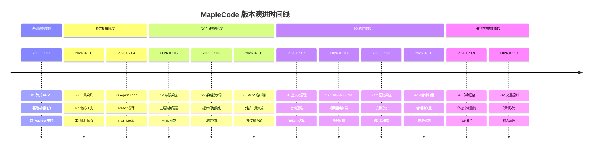
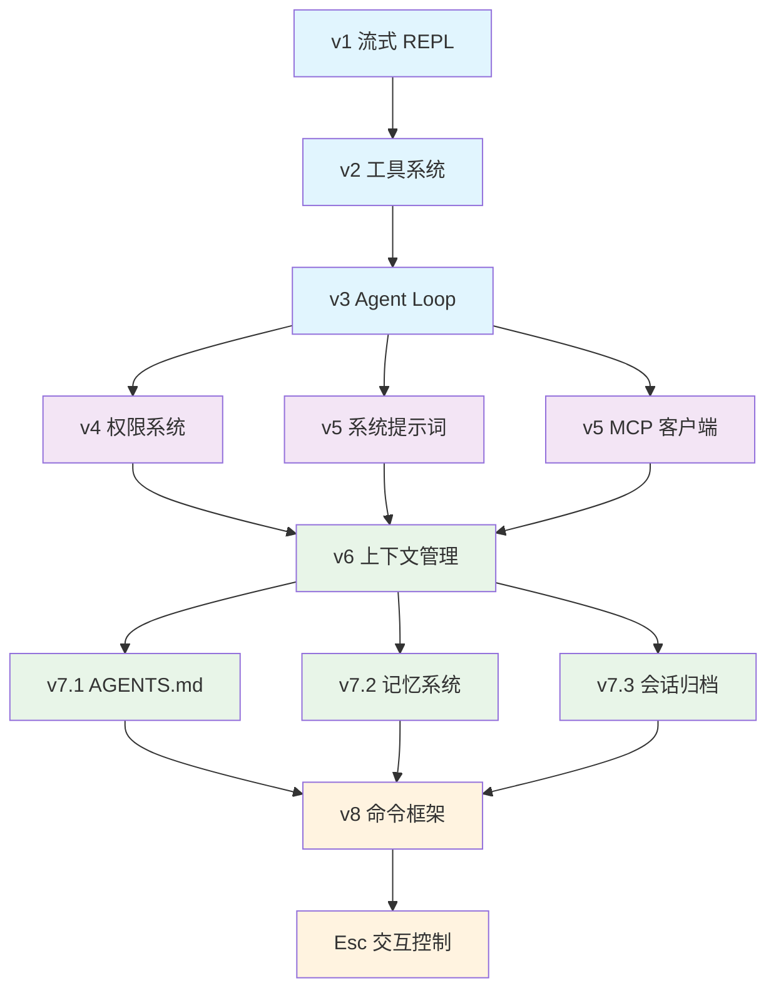

MapleCode 从一个极简的命令行 AI 对话工具演进为功能完整的智能编程助手，经历了 8 个主要版本迭代。本文档记录了项目的版本演进历程、架构决策过程和关键功能的实现时间线，帮助开发者理解系统的设计脉络和技术选型背景。

## 版本时间线概览

MapleCode 的开发采用阶段式推进策略，每个版本聚焦一个核心能力，通过 TDD（测试驱动开发）确保质量。从 2026 年 7 月 1 日到 7 月 10 日，项目在 10 天内完成了从基础架构到高级功能的完整构建。

## 架构演进历程

MapleCode 的架构演进遵循"简单 → 复杂 → 优雅"的路径。每个版本都在前一个版本的基础上添加新能力，同时保持代码的清晰和可维护性。

## 主要版本详情

### v1 流式 REPL（2026-07-01）

**设计目标**：构建一个极简的命令行 AI 对话工具，支持 Anthropic 和 OpenAI 两种后端，通过 SSE 流式响应提供实时交互体验。

**核心特性**：
- **双 Provider 支持**：统一 `LlmProvider` 接口，`ProviderRegistry` 根据配置选择具体实现
- **SSE 流式解析**：`SseStreamReader` 处理服务器发送事件，`StreamChunk` sealed 接口封装文本、思考、开始、结束、错误五种事件类型
- **多轮对话记忆**：`ChatSession` 在内存中维护对话历史，支持上下文传递
- **Extended Thinking**：Anthropic 的 `adaptive` 和 `enabled` 两种思考模式
- **JLine 3 REPL**：多行输入支持，ANSI 渲染的流式输出

**架构决策**：
- 选择 Java 21 LTS 版本，利用现代语言特性（records、sealed interfaces）
- 使用 JDK 内置 `HttpClient` 而非第三方 HTTP 库，减少依赖
- `ChatMessage` 从简单字符串演进为 `List<ContentBlock>`，为后续工具调用预留扩展点

**关键提交**：
- `a704856`：Maven 项目引导
- `da9ee29`：REPL 主循环实现
- `f95c49a`：StreamPrinter ANSI 渲染

Sources: [v1 流式 REPL 设计规格](docs/superpowers/specs/2026-07-01-maple-code-design.md#L1-L539)

### v2 工具系统（2026-07-03）

**设计目标**：在流式 REPL 基础上增加工具调用能力，让 AI 模型能够执行文件操作、代码搜索等实际任务。

**核心特性**：
- **6 个核心工具**：`read_file`、`write_file`、`edit_file`、`exec`、`glob`、`grep`
- **统一工具接口**：`Tool` 接口定义 `name()`、`description()`、`inputSchema()`、`execute()` 方法
- **工具注册中心**：`ToolRegistry` 管理所有工具，`ToolExecutor` 处理工具调用流程
- **双协议支持**：Anthropic 和 OpenAI 都支持工具调用，各自的 wire 格式适配
- **流式工具调用**：`ToolUseStart/Delta/End` 事件处理 JSON 碎片拼接

**架构决策**：
- `Tool` 接口从 sealed 改为非 sealed，支持测试中的 mock 工具实例
- `ChatMessage.content` 从 `String` 改为 `List<ContentBlock>`，支持 `ToolUseBlock` 和 `ToolResultBlock`
- 工具调用采用单轮模式：模型发 1 个 tool_use → 执行 → 回灌 tool_result → 模型发最终文本 → 结束

**关键提交**：
- `5cd99b9`：工具系统设计规格
- `765d14a`：ToolRegistry 实现
- `88a0252` - `271975a`：6 个核心工具实现

Sources: [工具系统设计规格](docs/superpowers/specs/2026-07-03-maple-code-tool-system-design.md#L1-L491)

### v3 Agent Loop（2026-07-04）

**设计目标**：实现 ReAct（Reasoning + Acting）循环，让模型能够自主决策调用哪些工具，并根据工具结果调整策略。

**核心特性**：
- **ReAct 循环**：`AgentLoop` 实现多轮迭代，模型发请求 → 收到 TOOL_USE → 执行工具 → 结果回灌 → 继续
- **安全分批执行**：`Batch.partition` 按工具安全性分为 safe（只读，并行）和 unsafe（有副作用，串行）
- **三种停止条件**：`MAX_ITERATIONS`、`CONSECUTIVE_UNKNOWN`、`PROVIDER_ERROR`
- **Plan Mode**：双层防御——ChatRequest 层只暴露只读工具，executor 层包装 readOnlyReg
- **AgentEvent 事件系统**：11 种变体，`StreamPrinter` 实现 `Consumer<AgentEvent>`

**架构决策**：
- 采用同步阻塞模型，通过 `isRunning()` 标志位支持取消操作
- `AgentConfig` 不可变记录，包含 model、systemBlocks、thinking、maxIterations 等配置
- `ResponseCollector` 双路收集：实时转发给 UI + 完整累加给 ChatSession

**关键提交**：
- `08cbbe1`：Agent Loop 设计规格
- `945dc01`：AgentLoop 完整循环实现
- `9eda014`：三种停止条件实现

Sources: [Agent Loop 设计规格](docs/superpowers/specs/2026-07-04-maple-code-agent-loop-design.md#L1-L?)

### v4 权限系统（2026-07-06）

**设计目标**：在 Agent Loop 基础上增加五层防御的权限系统，确保工具调用的安全性。

**核心特性**：
- **五层权限管道**：BlacklistCheck → SandboxCheck → RuleCheck → ModeCheck → HitlCheck
- **三档权限模式**：`strict`（未匹配拒绝）、`default`（未匹配走 HITL）、`permissive`（未匹配放行）
- **三层规则配置**：用户全局 → 项目级 → 项目本地，优先级 local > project > user
- **人在回路（HITL）**：4 选 1 交互——本次允许 / 本会话允许 / 本项目允许 / 拒绝
- **黑名单硬拦截**：12 条硬编码正则，拦截高危命令，不可配置

**架构决策**：
- `PermissionEngine` 使用 `AtomicReference<PermissionMode>` 支持运行时热切换
- `HitlCheck.setEngine()` 后置注入打破构造期循环
- 规则文件采用 YAML 格式，支持 shell glob 和 PathMatcher 模式匹配

**关键提交**：
- `03f9fcd`：五层防御权限系统设计规格
- `f63734b`：BlacklistCheck 实现
- `a55aacf`：ModeCheck 和 HitlCheck 实现

Sources: [权限系统设计规格](docs/superpowers/specs/2026-07-06-maple-code-permission-system-design.md#L1-L726)

### v5 系统提示词（2026-07-05）

**设计目标**：将系统提示词从简单字符串重构为结构化的多段内容，支持动态上下文注入和缓存优化。

**核心特性**：
- **结构化提示词**：`PromptAssembler` 装配 system prompt，由 `DefaultSections` 提供静态块
- **动态上下文**：`DynamicContext` 捕获 cwd、平台、当前时间等运行时信息
- **Plan Mode 提醒**：`PlanModeReminder` 在 PLAN 模式下追加只读约束
- **缓存优化**：`cache_control: ephemeral` 标记，利用 Anthropic 的 prompt caching

**架构决策**：
- `ChatRequest` 从简单字符串改为 `List<SystemBlock>` 结构
- `TokenUsage` 增加 `cacheCreationTokens` 和 `cacheReadTokens` 字段
- 系统提示词配置支持 YAML 中的 `system_prompt` 字段，与内嵌块叠加

**关键提交**：
- `438f467`：SystemBlock/PromptSection 基础类型
- `94f5816`：PromptAssembler 实现
- `4bc28de`：Anthropic mapper 加 cache_control

Sources: [系统提示词设计规格](docs/superpowers/specs/2026-07-05-maple-code-system-prompt-design.md#L1-L?)

### v5 MCP 客户端（2026-07-06）

**设计目标**：集成 Model Context Protocol，让 MapleCode 能够连接外部工具服务器，扩展工具生态。

**核心特性**：
- **双传输协议**：`stdio`（子进程 + 行分隔 JSON）和 `http`（StreamableHttp POST）
- **三层配置**：用户全局 → 项目级 → 项目本地，子 map deep-merge
- **自动工具注册**：MCP 工具自动注入 `ToolRegistry`，命名空间 `mcp__<server>__<tool>`
- **并发启动**：`McpClientBootstrap` 并发启动所有服务器，整体超时降级
- **JSON-RPC 通信**：异步配对 + per-call 超时清理

**架构决策**：
- MCP 工具走完整 `PermissionEngine` 管道，和内置工具一视同仁
- `McpToolAdapter` 包装远端工具，同名冲突在注册期报错
- 所有 MCP 内部日志走 stderr，前缀 `[mcp:<server>:stderr]`，不污染 stdout

**关键提交**：
- `8be398a`：MCP 客户端设计文档
- `fb5dd25`：McpServerConfigLoader 三层合并
- `8af30c9`：App.main 装配 MCP 客户端

Sources: [MCP 客户端设计规格](docs/superpowers/specs/2026-07-06-maple-code-mcp-client-design.md#L1-L?)

### v6 上下文管理（2026-07-07）

**设计目标**：实现自动上下文压缩，解决长对话中 token 超限的问题。

**核心特性**：
- **自动压缩触发**：当对话 token 数接近上下文窗口时，自动触发压缩
- **摘要生成**：`ConversationSummarizer` 生成 5 段摘要 + scratchpad 裁剪
- **Offload 机制**：`Offloader` 将已执行的工具结果写盘，用预览替换
- **Token 估算**：`TokenEstimator` 基于字符数/4 的启发式估算，锚点修正
- **熔断器**：`FailureCounter` 防止压缩失败时的无限重试

**架构决策**：
- `CompactCoordinator` 编排整个压缩流程，支持手动 `/compact` 和自动触发
- `CompressionStorage` 处理磁盘 I/O，使用原子写入防止崩溃时文件截断
- 压缩后重置 `TokenEstimator` 锚点，避免历史消息重复计数

**关键提交**：
- `27d3ce5`：上下文管理设计文档
- `fe519e0`：压缩基础类型
- `08140d4`：CompressionCoordinator 编排实现

Sources: [上下文管理设计规格](docs/superpowers/specs/2026-07-07-maple-code-context-management-design.md#L1-L?)

### v7.1 AGENTS.md 加载器（2026-07-08）

**设计目标**：让 MapleCode 在启动时自动加载项目指令文件，实现"一启动就懂这个项目"。

**核心特性**：
- **3 层加载**：项目根 `AGENTS.md` → `<cwd>/.maplecode/AGENTS.md` → `~/.maplecode/AGENTS.md`
- **`{{include:path}}` 引用**：支持嵌套展开，递归深度限 3 层，visited 集合防环路
- **容错优先**：任何加载错误都不阻塞 REPL 启动，缺哪层静默跳哪层
- **PromptSection 接入**：作为 `AgentsMdSection` 实现 `PromptSection` 接口

**架构决策**：
- 使用字节上限（64KB）近似截断，而非 token 估算
- 启动期读一次后永不变，不做基于文件 mtime 的"是否需要重读"判断
- `LayerReader` 提供 4 种降级策略：文件缺失、读取错误、编码错误、超限

**关键提交**：
- `a6c314d`：AGENTS.md 多层加载器设计
- `d96c997`：IncludeResolver 嵌套展开
- `7caaa62`：App.main 启动期注入

Sources: [AGENTS.md 加载器设计规格](docs/superpowers/specs/2026-07-08-maple-code-agents-md-loader-design.md#L1-L487)

### v7.2 记忆系统（2026-07-08）

**设计目标**：实现自动长期记忆，让 AI 助手能够跨会话积累知识。

**核心特性**：
- **四类记忆**：用户偏好、纠正反馈、项目知识、参考信息
- **两个存储位置**：用户级（`~/.maplecode/memory/`）和项目级（`<cwd>/.maplecode/memory/`）
- **异步提取**：每轮 Agent Loop 结束后异步调用 LLM 分析对话，自动新增/修改/删除记忆
- **熔断器**：`MemoryFailureCounter` 防止提取失败时的无限重试

**架构决策**：
- 记忆按 scope 分为 `user` 和 `project`，分别存储在不同位置
- `MemoryExtractor` 使用专用模型（可配置，默认复用主模型）
- 记忆注入系统提示词，在下次启动时生效

**关键提交**：
- `53b740e`：自动长期记忆设计
- `ae43f1f` - `2c4aa81`：8 个 TDD 任务实现
- `f217789`：ReentrantLock 串行化并发安全

Sources: [记忆系统设计规格](docs/superpowers/specs/2026-07-08-maple-code-memory-design.md#L1-L513)

### v7.3 会话归档（2026-07-08）

**设计目标**：实现会话持久化与恢复，支持用户查看和恢复历史对话。

**核心特性**：
- **JSONL 存储**：每个 session 对应一个 JSONL 文件，每行一条 JSON 记录
- **自动存档**：退出时自动保存当前对话
- **会话恢复**：`/resume` 命令列出历史会话，支持恢复
- **30 天过期**：自动清理过期会话

**架构决策**：
- `SessionWriter` 和 `SessionReader` 处理 JSONL 序列化/反序列化
- `SessionMeta.lastActivity` 从文件 mtime 获取，不存储每条消息的时间戳
- `/new`、`/resume`、`/clear` 命令重置 compact 熔断器

**关键提交**：
- `07cbfef`：会话存档与恢复设计文档
- `4bf375f`：SessionWriter JSONL 写入
- `3f5f829`：ReplLoop 集成 /new、/resume

Sources: [会话归档设计规格](docs/superpowers/specs/2026-07-08-maple-code-session-archive-design.md#L1-L299)

### v8 命令框架（2026-07-09）

**设计目标**：将现有斜杠命令从 ReplLoop 的 if-else 链中抽出，重构为可扩展的命令框架。

**核心特性**：
- **Command 接口**：定义命令契约——名称、别名、描述、用法、类型、隐藏标志、执行函数
- **CommandRegistry**：启动时注册所有命令，名称/别名冲突检测
- **CommandParser**：解析斜杠输入，命令名大小写不敏感
- **CommandCompleter**：集成 JLine 的 `Completer` 接口，Tab 补全仅在行首触发
- **13 个内置命令**：`/help`、`/clear`、`/new`、`/resume`、`/compact`、`/tools`、`/plan`、`/do`、`/mode`、`/memory`、`/status`、`/review`、`/exit`

**架构决策**：
- `CommandContext` 窄接口，命令只通过它与 UI/Agent/状态交互
- `ExitReplException` 控制流异常供 `/exit` 命令终止 REPL 主循环
- `ReplLoop.run()` 从 ~300 行 if-else 链瘦身到 ~50 行分发器

**关键提交**：
- `94f5bdc`：命令框架设计规格
- `f16ce7e`：Command、CommandType、CommandContext 基础类型
- `53b337e`：ReplLoop if-else 链重构为命令框架分发器

Sources: [命令框架设计规格](docs/superpowers/specs/2026-07-09-maple-code-command-framework-design.md#L1-L897)

### Esc 交互控制（2026-07-10）

**设计目标**：优化用户交互体验，通过 Esc 键实现即时取消和输入清理。

**核心特性**：
- **Agent 流式输出期间**：单击 Esc 立即取消当前流式响应和本轮 Agent Loop
- **用户输入期间**：500ms 内双击 Esc 清空输入区
- **多行输入模式**：双击 Esc 丢弃整段已累计内容并返回新的主提示符
- **状态化控制**：`EscapeController` 管理三个互斥状态——INPUT、AGENT、MULTILINE

**架构决策**：
- 移除 `/cancel` 命令，因为 REPL 在 Agent 执行期间不会读取新的命令
- 使用 JLine 的 `Widget` 机制拦截 Esc 键，避免干扰方向键等终端序列
- 取消操作不触发本轮长期记忆提取，避免部分对话被记忆

**关键提交**：
- `f413b13`：Esc 交互控制设计
- `420d3e4`：取消 Agent 流式响应
- `7e72aad`：双击 Esc 输入清理

Sources: [Esc 交互控制设计规格](docs/superpowers/specs/2026-07-10-maple-code-escape-controls-design.md#L1-L248)

## 版本演进趋势

### 功能演进路径

MapleCode 的功能演进遵循"基础能力 → 扩展能力 → 优化体验"的路径：

| 阶段 | 版本 | 核心主题 | 关键技术 |
|------|------|----------|----------|
| 基础架构 | v1 | 流式对话 | SSE、双 Provider、JLine REPL |
| 能力扩展 | v2-v3 | 工具调用 | Tool 接口、Agent Loop、ReAct 模式 |
| 安全控制 | v4-v5 | 权限与提示词 | 五层防御、结构化提示词、MCP 集成 |
| 上下文管理 | v6-v7 | 记忆与持久化 | 自动压缩、长期记忆、会话归档 |
| 用户体验 | v8+ | 交互优化 | 命令框架、Esc 控制、Tab 补全 |

### 架构演进特点

1. **接口先行**：每个版本都先定义清晰的接口（如 `LlmProvider`、`Tool`、`Command`），再实现具体类
2. **TDD 驱动**：所有核心功能都通过测试驱动开发，确保质量
3. **渐进增强**：每个版本都在前一个版本基础上添加新能力，保持向后兼容
4. **关注点分离**：每个包（`config`、`provider`、`agent`、`tool`、`permission`、`session`、`command`）职责单一
5. **可扩展性**：通过 sealed interfaces、registry 模式、配置文件等机制支持未来扩展

### 设计决策记录

每个版本的设计决策都记录在对应的设计文档中，包括：
- **目标与非目标**：明确每个版本要做什么、不做什么
- **架构图**：展示组件之间的依赖关系
- **接口设计**：定义清晰的契约
- **配置格式**：YAML 配置文件的结构和语义
- **测试策略**：如何验证功能正确性

## 当前状态

### 代码库统计

- **Maven 版本**：0.1.0（从 SNAPSHOT 演进而来）
- **Java 版本**：21（LTS）
- **核心依赖**：JLine 3.27.0、Jackson 2.17.2、SnakeYAML 2.3、JUnit 5.11.3
- **代码行数**：约 15,000 行（主代码 + 测试）
- **测试覆盖**：核心功能全覆盖，无集成测试（手工 smoke）

### 功能完整性

| 功能模块 | 状态 | 说明 |
|----------|------|------|
| 流式对话 | ✅ 完整 | Anthropic + OpenAI 双 Provider |
| 工具系统 | ✅ 完整 | 6 个内置工具 + MCP 外部工具 |
| Agent Loop | ✅ 完整 | ReAct 循环 + Plan Mode |
| 权限系统 | ✅ 完整 | 五层防御 + HITL |
| 系统提示词 | ✅ 完整 | 结构化 + 缓存优化 |
| 上下文管理 | ✅ 完整 | 自动压缩 + Token 估算 |
| 记忆系统 | ✅ 完整 | 长期记忆 + 跨会话积累 |
| 会话归档 | ✅ 完整 | 持久化 + 恢复 |
| 命令框架 | ✅ 完整 | 13 个内置命令 + Tab 补全 |
| 交互控制 | ✅ 完整 | Esc 键控制 |

### 技术债务

根据代码审查和设计文档，当前存在以下技术债务：

1. **集成测试缺失**：仓库里没有 `*IT.java` 集成测试，端到端 smoke 是手工跑
2. **错误处理不一致**：部分边界条件的处理可能不够完善
3. **性能优化空间**：Token 估算基于启发式算法，可能不够精确
4. **文档同步**：部分实现细节可能与设计文档不完全一致

## 未来展望

根据设计文档和代码注释，未来版本可能关注以下方向：

1. **异步 REPL**：将 `AgentLoop` 改为后台任务，支持真正的并发交互
2. **插件系统**：支持用户自定义命令和工具
3. **多模态输入**：支持图片、音频等非文本输入
4. **网络请求限制**：API key 配额管理、请求频率限制
5. **审计日志**：记录所有工具调用和权限决策
6. **规则 UI 编辑器**：可视化编辑权限规则

## 总结

MapleCode 的版本演进展示了如何从一个简单的命令行工具逐步构建为功能完整的智能编程助手。每个版本都聚焦于解决特定问题，通过清晰的架构设计和 TDD 实践确保质量。这种渐进式开发方法不仅降低了复杂性，也为未来的扩展奠定了坚实基础。

对于新开发者，建议按照版本顺序阅读设计文档，理解每个版本的设计决策和实现细节。对于维护者，建议参考版本演进路径规划新功能，保持架构的一致性和可维护性。