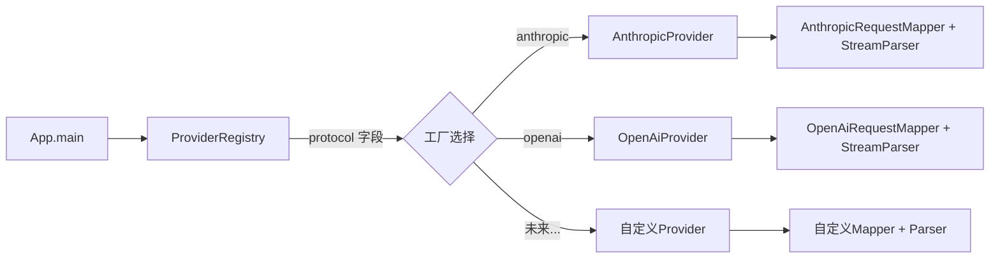
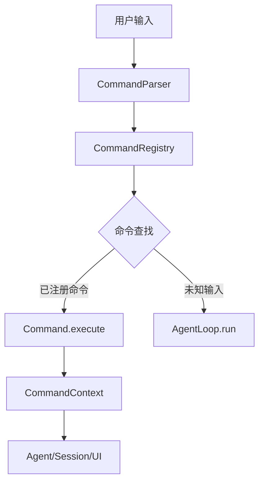

本文档综合梳理 MapleCode 项目的当前状态、已明确但尚未实现的技术方向，以及架构演进的潜在路径。所有规划均源自项目各阶段设计文档中**明确记录的"非目标"声明**、MCP 协议的未实现能力、以及现有架构中预留的扩展点。本文档不包含推测性内容——每一项规划均有对应的代码或设计文档作为依据。

## 当前状态总览

截至 2026 年 7 月 10 日，MapleCode 已完成 **8 个主要版本**（v1 至 v8.2），从一个极简的流式 REPL 演进为功能完整的智能编程助手。当前版本号为 **0.1.0**，核心能力矩阵如下：

| 维度 | 已实现 | 版本 |
|------|--------|------|
| 流式对话 | SSE 流式、双 Provider（Anthropic + OpenAI）、Extended Thinking | v1 |
| 工具系统 | 6 个内置工具、Tool 接口、ToolRegistry | v2 |
| Agent Loop | ReAct 循环、安全分批执行、Plan Mode | v3 |
| 权限系统 | 五层防御管道、HITL、三层规则 YAML | v4 |
| 系统提示词 | 结构化 PromptAssembler、动态上下文、缓存优化 | v5 |
| MCP 集成 | Stdio + StreamableHttp 双传输、工具自动注册 | v5 |
| 上下文管理 | 两层压缩策略、自动/手动触发、Token 估算 | v6 |
| 项目指令 | AGENTS.md 三层加载、`{{include}}` 嵌套展开 | v7.1 |
| 长期记忆 | LLM 驱动的记忆提取、四类记忆、跨会话积累 | v7.2 |
| 会话归档 | JSONL 持久化、`/resume` 恢复、30 天过期 | v7.3 |
| 命令框架 | 13 个内置命令、Tab 补全、可扩展 Command 接口 | v8 |
| TUI 交互 | 状态栏、Esc 即时取消、双击 Esc 输入清理 | v8.1-8.2 |

Sources: [版本演进与历史](32-ban-ben-yan-jin-yu-li-shi) [AGENTS.md](AGENTS.md#L145-L165)

## 明确规划的技术方向

以下功能在各阶段设计文档的"非目标"章节中被**显式标记为"后续阶段"或"明确不做"**，构成项目未来演进的官方路线图。按技术领域分类如下：

### 多模态输入支持

在 v1 设计规格和 v2 工具系统设计中，**多模态输入**被反复列为非目标。当前 `ChatMessage.content` 使用 `List<ContentBlock>` 结构，其中 `ContentBlock` 是 sealed interface，目前仅支持 `TextBlock`、`ToolUseBlock`、`ToolResultBlock` 三种变体。这意味着架构已经为多模态预留了扩展点——新增 `ImageBlock` 等变体只需扩展 sealed permits 列表。

Anthropic Claude API 原生支持图像输入（base64 或 URL），OpenAI GPT-4o 同样支持视觉能力。实现路径涉及三个层面：`ContentBlock` 层新增图像变体、`ChatRequest` / request mapper 层传递图像数据、REPL 层支持文件拖放或路径引用。当前 `ReadFileTool` 已支持二进制文件检测（虽然后续被精简），可作为图像读取的参考模式。

Sources: [v1 设计规格](docs/superpowers/specs/2026-07-01-maple-code-design.md#L1-L14) [工具系统设计规格](docs/superpowers/specs/2026-07-03-maple-code-tool-system-design.md#L22-L26)

### 运行时切换 Provider

在 v1、v3、v4 设计规格中，**运行时切换 provider** 均被列为非目标。当前系统在 `App.main` 启动时通过 `ProviderRegistry.create(config)` 一次性装配 `LlmProvider` 实例，之后整个会话生命周期内不可变更。

运行时切换的挑战在于：`ChatSession` 中累积的消息格式需要与新 provider 的 wire format 兼容（例如 Anthropic 的 `system` 字段与 OpenAI 的 `system` role 消息结构不同）、`ThinkingConfig` 在不同 provider 间语义不一致（OpenAI 静默忽略 thinking）、以及 `StreamParser` 的状态重置。实现路径可能涉及 `/provider <name>` 命令 + `ChatSession` 迁移适配器。

Sources: [v1 设计规格](docs/superpowers/specs/2026-07-01-maple-code-design.md#L12-L14) [Agent Loop 设计规格](docs/superpowers/specs/2026-07-04-maple-code-agent-loop-design.md#L22-L24)

### 插件系统

在 v1、v2、v3、v4 设计规格中，**插件系统**均被列为非目标。当前系统的扩展机制依赖于源码级别的接口实现——新增 LLM Provider 需要实现 `LlmProvider` 接口并在 `ProviderRegistry.factories` 中注册工厂，新增工具需要实现 `Tool` 接口并在 `App.main` 中注册。

插件系统需要解决的核心问题包括：动态类加载（JAR 文件发现与加载）、类路径隔离（避免依赖冲突）、生命周期管理（初始化/销毁钩子）、以及安全沙箱（不受信任的代码执行）。`Command` 接口的引入（v8）已经为命令级插件提供了扩展点，但工具级和 provider 级的插件化仍需更深层的架构改造。

Sources: [扩展性设计与插件机制](21-kuo-zhan-xing-she-ji-yu-cha-jian-ji-zhi) [v1 设计规格](docs/superpowers/specs/2026-07-01-maple-code-design.md#L14)

### MCP 协议扩展

在 MCP 客户端设计规格（v5）中，以下能力被明确列为非目标：

| 未实现的 MCP 能力 | 当前状态 | 实现复杂度 |
|-------------------|----------|-----------|
| `resources` 能力 | 不支持 | 中等——需要资源发现、订阅、缓存机制 |
| `prompts` 能力 | 不支持 | 低——类似工具发现，注册为 system prompt 片段 |
| `sampling` 能力 | 不支持 | 高——需要 server 端回调 client 的 LLM，架构反转 |
| `roots` 能力 | 不支持 | 低——声明项目根目录，供 server 感知工作空间 |
| server→client notifications | 不处理 | 中等——需要事件循环或回调分发 |
| 健康检查与自动重连 | 不支持 | 中等——需要心跳机制 + 指数退避 |
| OAuth / Dynamic Client Registration | 不支持 | 高——需要浏览器交互或 device flow |
| Streamable HTTP 断点续传 | 不支持 | 中等——需要 event-id 跟踪和重放 |

当前 `McpClientBootstrap` 在启动时并发初始化所有 server，单个 server 失败时打印 WARN 并降级继续。这种"启动时一次性装配"的模式天然不支持运行时动态添加/移除 server，这是实现 notifications 和自动重连的架构前提。

Sources: [MCP 客户端设计规格](docs/superpowers/specs/2026-07-06-maple-code-mcp-client-design.md#L14-L28)

### 记忆系统增强

在记忆系统设计规格（v7.2）中，以下能力被明确列为非目标：

| 未实现的记忆能力 | 当前状态 | 价值 |
|-----------------|----------|------|
| 语义搜索 / 向量化 | 纯文本存储，无向量索引 | 当记忆条目增多后，线性注入 system prompt 的方式将面临 token 预算压力 |
| 自动过期 / 衰减 | 记忆永久保留，手动 `/memory` 管理 | 长期使用后可能积累过时或矛盾的记忆 |
| 运行时动态刷新 | 仅启动时加载一次 | 新增的记忆在当前会话中不可见 |
| 多用户 / 团队共享 | 单用户设计 | 团队协作场景需要共享项目知识 |
| 记忆加密 / 脱敏 | 明文 Markdown 存储 | 敏感信息（API key、密码）可能被记忆 |

当前记忆存储在 `~/.maplecode/memory/` 下的 Markdown 文件中，分为 `user`（跨项目）和 `project`（当前项目）两个 scope。`MemoryExtractor` 在每轮 Agent Loop 结束后异步调用 LLM 分析对话，执行新增/修改/删除操作。

Sources: [记忆系统设计规格](docs/superpowers/specs/2026-07-08-maple-code-memory-design.md#L11-L16)

### 会话管理增强

在会话归档设计规格（v7.3）中，以下能力被明确列为非目标：

| 未实现的会话能力 | 当前状态 | 价值 |
|-----------------|----------|------|
| 持久化到数据库 | JSONL 文件存储 | 查询能力受限，无法支持复杂检索 |
| 跨设备同步 | 本地文件系统 | 多设备工作场景需要云端同步 |
| 会话搜索 / 全文检索 | 仅按时间顺序列出 | 需要在大量历史会话中定位特定对话 |
| 会话标签 / 分类 | 无分类机制 | 长期使用后需要组织和归类历史对话 |
| 增量追加 | 退出时全量写入 | 异常退出可能丢失当前会话数据 |

当前 `SessionWriter` 在退出时将整个 `ChatSession` 序列化为 JSONL 文件，`SessionReader` 通过 `/resume` 命令恢复。`SessionMeta.lastActivity` 从文件 mtime 获取，30 天自动过期清理。

Sources: [会话归档设计规格](docs/superpowers/specs/2026-07-08-maple-code-session-archive-design.md#L11-L17)

### 安全与治理能力

在权限系统设计规格（v4）中，以下能力被明确列为非目标：

| 未实现的安全能力 | 当前状态 | 价值 |
|-----------------|----------|------|
| 网络请求限制 | 无限制 | 防止 LLM 驱动的大量 API 调用 |
| 资源配额（CPU/内存/磁盘） | 无限制 | 防止 `exec` 工具消耗过多系统资源 |
| 审计日志 | 不记录工具调用历史 | 合规要求、安全事件追溯 |
| 规则 UI 编辑器 | 只能手改 YAML | 降低权限配置门槛 |

当前权限系统通过五层防御管道（BlacklistCheck → SandboxCheck → RuleCheck → ModeCheck → HitlCheck）保护工具调用安全。`BlacklistCheck` 的 12 条硬编码正则拦截高危命令（如 `rm -rf /`、`sudo`、fork bomb），`SandboxCheck` 通过 `toRealPath()` 防止 symlink 逃逸。但这些保护仅限于文件系统和命令执行层面，不覆盖网络和资源层面。

Sources: [权限系统设计规格](docs/superpowers/specs/2026-07-06-maple-code-permission-system-design.md#L21-L27)

### 上下文管理精度提升

在上下文管理设计规格（v6）中，以下能力被明确列为非目标：

| 未实现的精度能力 | 当前状态 | 价值 |
|-----------------|----------|------|
| 精确 Tokenizer | `chars / 4` 启发式估算 | 估算误差可能导致过早或过晚触发压缩 |
| 摘要策略 ML 优化 | 固定 5 段结构化摘要 | 不同对话类型可能需要不同的摘要策略 |
| 并行压缩 | 单线程触发，单 coordinator | 多会话场景下的压缩效率 |
| 摘要中启用 thinking | 故意关闭 | thinking 会将 prompt token 翻倍，成本过高 |

当前 `TokenEstimator` 使用 `max(anchor, chars/4)` 策略，其中 anchor 来自上次 API 返回的 `usage.inputTokens`。这种估算在大多数场景下足够，但在包含大量代码块或多语言内容时误差可能达到 20-30%。

Sources: [上下文管理设计规格](docs/superpowers/specs/2026-07-07-maple-code-context-management-design.md#L19-L28)

## 架构扩展点分析

MapleCode 的架构设计遵循开闭原则，通过接口抽象和工厂模式为未来扩展预留了标准化的扩展点。以下是当前架构中已识别的扩展机制：

### LLM Provider 扩展

`LlmProvider` 接口是系统中最核心的扩展点。新增一个 LLM 后端只需三步：实现 `LlmProvider.stream()` 方法、创建对应的 request mapper 和 stream parser、在 `ProviderRegistry.factories` 中注册工厂。当前 `StreamChunk` 是 sealed interface，新增 chunk 变体时需要更新所有 switch 表达式——这是有意为之的编译期安全保证。

Sources: [LLM Provider 抽象层](7-tong-jie-kou-llmprovider) [Anthropic 与 OpenAI 实现](8-anthropic-yu-openai-shi-xian)

### 工具系统扩展

`Tool` 接口是非 sealed 的（原计划 sealed permits，但因测试需要 mock 工具实例而改为非 sealed）。新增工具只需实现 `Tool` 接口的四个方法（`name()`、`description()`、`inputSchema()`、`execute()`），并在 `App.main` 中注册到 `ToolRegistry`。MCP 工具通过 `McpToolAdapter` 自动适配，走完整权限管道。

Sources: [Tool 接口与内置工具](10-tool-jie-kou-yu-nei-zhi-gong-ju) [MCP 客户端集成](12-mcp-ke-hu-duan-ji-cheng)

### 命令框架扩展

v8 引入的 `Command` 接口为 REPL 命令提供了标准化扩展点。新增命令只需实现 `Command` 接口并在 `CommandRegistry` 中注册，自动获得 Tab 补全和帮助文档支持。`CommandContext` 窄接口确保命令只通过它与 UI/Agent/状态交互，降低耦合。

Sources: [命令框架与 REPL](20-ming-ling-kuang-jia-yu-repl)

### 权限规则扩展

权限系统通过 `PermissionCheck` 接口和管道模式支持新增检查层。当前五层检查（Blacklist → Sandbox → Rule → Mode → HITL）按顺序短路执行，每层返回 `Optional<Decision>`。新增检查层只需实现 `PermissionCheck` 接口并插入管道的适当位置。规则文件支持三层 YAML 合并（用户全局 → 项目级 → 项目本地），优先级 local > project > user。

Sources: [五层权限防御管道](13-wu-ceng-quan-xian-fang-yu-guan-dao) [权限配置与规则引擎](14-quan-xian-pei-zhi-yu-gui-ze-yin-qing)

## 技术债务与改进空间

基于代码库分析和设计文档审查，以下是当前已识别的技术债务和改进方向：

### Agent Loop 异步化

当前 `AgentLoop.run()` 是同步阻塞调用，这导致 `/cancel` 命令在 Agent 执行期间无法生效（已被 Esc 键替代）。将 Agent Loop 重构为后台任务（`CompletableFuture` 或虚拟线程）可以支持更灵活的取消语义、并行任务执行、以及非阻塞的用户交互。v8.2 的 Esc 控制设计明确将"不重构 AgentLoop 为后台任务"列为非目标，说明团队已经意识到这个方向但有意推迟。

Sources: [Esc 交互控制设计](docs/superpowers/specs/2026-07-10-maple-code-escape-controls-design.md#L24)

### 精确 Token 估算

当前 `TokenEstimator` 使用 `chars/4` 的启发式估算，依赖 API 返回的 `usage.inputTokens` 作为锚点修正。引入精确 tokenizer（如 Anthropic 的 `anthropic-tokenizer` 或 OpenAI 的 `tiktoken`）可以将估算误差从 20-30% 降低到 5% 以内，从而更精确地控制压缩触发时机和 token 预算管理。

Sources: [上下文管理设计规格](docs/superpowers/specs/2026-07-07-maple-code-context-management-design.md#L21)

### 工具并发执行优化

v3 已实现只读工具的并行执行（`Batch.partition` 按 `ToolRegistry.isReadOnly()` 分成 safe 和 unsafe），但有副作用的工具仍然是串行执行。未来可以考虑引入工具依赖图分析，允许无依赖关系的写操作并行执行。

Sources: [Agent Loop 设计规格](docs/superpowers/specs/2026-07-04-maple-code-agent-loop-design.md#L10-L14)

## 优先级评估矩阵

基于技术影响、实现复杂度和用户价值三个维度，以下是各规划方向的优先级评估：

| 规划方向 | 用户价值 | 技术影响 | 实现复杂度 | 建议优先级 |
|----------|----------|----------|-----------|-----------|
| 多模态输入 | 高 | 中 | 中 | P1 |
| MCP resources/prompts | 中 | 低 | 低 | P1 |
| 精确 Tokenizer | 中 | 中 | 低 | P2 |
| 记忆语义搜索 | 高 | 高 | 高 | P2 |
| 运行时切换 Provider | 中 | 高 | 高 | P3 |
| Agent Loop 异步化 | 中 | 高 | 高 | P3 |
| 插件系统 | 高 | 高 | 高 | P4 |
| 审计日志 | 低 | 低 | 低 | P2 |
| 网络/资源配额 | 中 | 中 | 中 | P2 |
| 会话全文检索 | 中 | 中 | 中 | P3 |
| 跨设备同步 | 高 | 高 | 高 | P4 |
| MCP OAuth | 低 | 中 | 高 | P4 |

**P1**（近期可行）：技术债务低、用户价值高、可利用现有扩展点。
**P2**（中期规划）：需要一定架构改动，但路径清晰。
**P3**（长期目标）：需要较大架构重构，涉及核心流程变更。
**P4**（探索方向）：技术不确定性高，需要原型验证。

## 设计文档交叉参考

每项规划的详细技术背景和非目标声明，请参阅对应版本的设计文档：

| 规划方向 | 来源设计文档 |
|----------|-------------|
| 多模态输入 | [v1 设计规格](docs/superpowers/specs/2026-07-01-maple-code-design.md#L12-L14) |
| 运行时切换 Provider | [v1 设计规格](docs/superpowers/specs/2026-07-01-maple-code-design.md#L13)、[Agent Loop 设计](docs/superpowers/specs/2026-07-04-maple-code-agent-loop-design.md#L23) |
| 插件系统 | [v1 设计规格](docs/superpowers/specs/2026-07-01-maple-code-design.md#L14)、[工具系统设计](docs/superpowers/specs/2026-07-03-maple-code-tool-system-design.md#L25) |
| MCP 扩展 | [MCP 客户端设计](docs/superpowers/specs/2026-07-06-maple-code-mcp-client-design.md#L14-L28) |
| 记忆增强 | [记忆系统设计](docs/superpowers/specs/2026-07-08-maple-code-memory-design.md#L11-L16) |
| 会话增强 | [会话归档设计](docs/superpowers/specs/2026-07-08-maple-code-session-archive-design.md#L11-L17) |
| 安全治理 | [权限系统设计](docs/superpowers/specs/2026-07-06-maple-code-permission-system-design.md#L21-L27) |
| 上下文精度 | [上下文管理设计](docs/superpowers/specs/2026-07-07-maple-code-context-management-design.md#L19-L28) |
| Agent 异步化 | [Esc 控制设计](docs/superpowers/specs/2026-07-10-maple-code-escape-controls-design.md#L24) |

Sources: [设计文档索引](31-she-ji-wen-dang-suo-yin) [版本演进与历史](32-ban-ben-yan-jin-yu-li-shi)

## 阅读建议

了解项目的完整演进历程后，建议按以下顺序深入相关技术领域：

- 若关注**扩展性架构设计**：阅读 [扩展性设计与插件机制](21-kuo-zhan-xing-she-ji-yu-cha-jian-ji-zhi)，理解四个核心扩展点的接口设计
- 若关注**新增 LLM Provider**：阅读 [新增 LLM Provider 指南](27-xin-zeng-llm-provider-zhi-nan)，掌握 `LlmProvider` 接口实现模式
- 若关注**自定义工具开发**：阅读 [自定义工具开发](28-zi-ding-yi-gong-ju-kai-fa)，学习 `Tool` 接口和权限管道集成
- 若关注**性能优化**：阅读 [性能优化与资源管理](22-xing-neng-you-hua-yu-zi-yuan-guan-li)，了解 Token 估算和压缩策略的优化空间
- 若关注**版本演进决策**：阅读 [版本演进与历史](32-ban-ben-yan-jin-yu-li-shi)，理解每个版本的架构决策和取舍