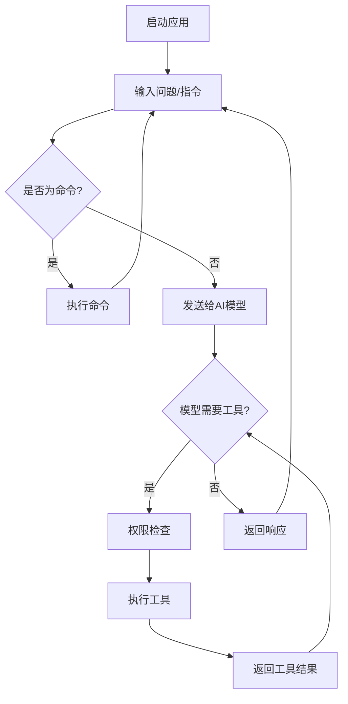
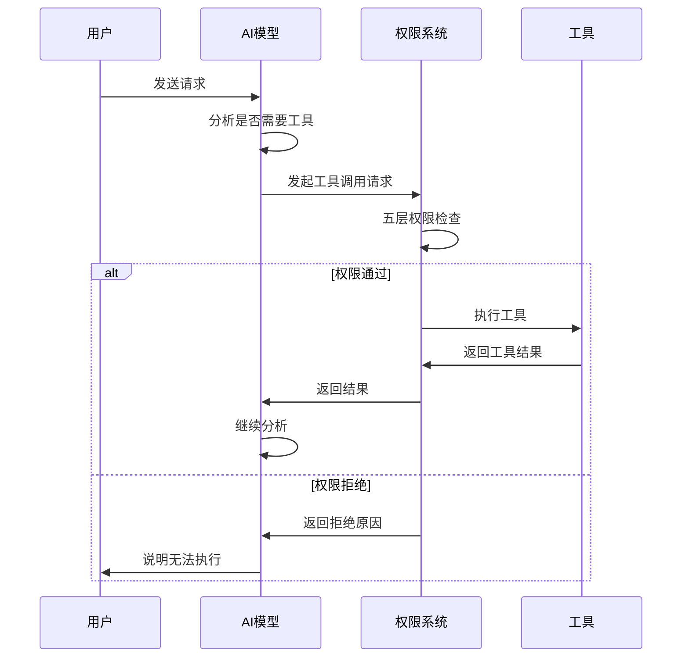
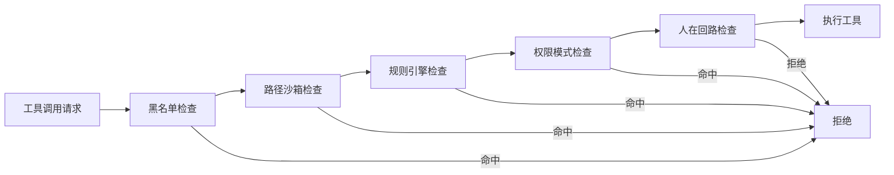

本文档介绍 MapleCode 的基本使用流程，涵盖从安装启动到日常交互的核心操作。作为命令行 AI 对话工具，MapleCode 提供了直观的 REPL 交互界面、多轮对话记忆、工具自动调用和 Agent Loop 等功能，帮助开发者高效完成编码任务。

## 快速开始

### 环境要求

MapleCode 基于 Java 21 构建，使用 Maven 作为项目管理工具。在开始之前，请确保系统已安装：

- **Java 21** 或更高版本
- **Maven 3.9+** 或更高版本

Sources: [pom.xml](pom.xml#L12-L13)

### 构建项目

在项目根目录执行以下命令构建可执行 JAR 包：

```bash
mvn package
```

构建成功后，将在 `target` 目录下生成 `maple-code-java-0.1.0.jar` 文件，这是一个包含所有依赖的可执行 JAR 包（已通过 maven-shade-plugin 打包）。

Sources: [README.md](README.md#L12-L17)

### 配置文件

MapleCode 使用 YAML 格式的配置文件。项目提供了配置模板 `maplecode.yaml.example`，复制并修改即可：

```bash
cp maplecode.yaml.example maplecode.yaml
```

配置文件查找顺序（命中即用）：
1. `--config <path>` 命令行参数指定
2. 当前目录下的 `./maplecode.yaml`
3. 用户主目录下的 `~/.maplecode/config.yaml`

Sources: [App.java](src/main/java/com/maplecode/App.java#L240-L255)

### 基础配置示例

以下是配置文件的核心字段说明：

| 字段 | 类型 | 必填 | 说明 |
|------|------|------|------|
| `protocol` | string | 是 | 协议类型：`anthropic` 或 `openai` |
| `model` | string | 是 | 模型名称，如 `claude-sonnet-4-6` |
| `base_url` | string | 是 | API 端点 URL |
| `api_key` | string | 是 | API 密钥，支持 `${ENV_VAR}` 环境变量占位符 |
| `system_prompt` | string | 否 | 自定义系统提示词 |
| `permission_mode` | string | 否 | 权限模式：`strict`、`default`、`permissive` |

以下是一个典型的 Anthropic 配置示例：

```yaml
protocol: anthropic
model: claude-sonnet-4-6
base_url: https://api.anthropic.com
api_key: ${ANTHROPIC_API_KEY}
system_prompt: |
  You are MapleCode, a helpful coding assistant. Be concise.
permission_mode: default
```

OpenAI 配置示例：

```yaml
protocol: openai
model: gpt-4o
base_url: https://api.openai.com/v1
api_key: ${OPENAI_API_KEY}
```

Sources: [maplecode.yaml.example](maplecode.yaml.example#L1-L15), [ConfigLoader.java](src/main/java/com/maplecode/config/ConfigLoader.java#L30-L55)

### 设置环境变量

在运行前，需要设置对应的 API 密钥环境变量：

```bash
# Anthropic
export ANTHROPIC_API_KEY=sk-ant-...

# 或 OpenAI
export OPENAI_API_KEY=sk-...
```

配置文件中的 `${ENV_VAR}` 占位符会在运行时自动从环境变量解析。

Sources: [ConfigLoader.java](src/main/java/com/maplecode/config/ConfigLoader.java#L130-L145)

## 启动与运行

### 启动应用程序

使用以下命令启动 MapleCode：

```bash
java -jar target/maple-code-java-0.1.0.jar
```

或指定配置文件：

```bash
java -jar target/maple-code-java-0.1.0.jar --config /path/to/config.yaml
```

启动成功后，将看到欢迎提示：

```
MapleCode — 输入 /help 查看可用命令
```

Sources: [README.md](README.md#L41-L45), [ReplLoop.java](src/main/java/com/maplecode/ui/ReplLoop.java#L120-L125)

### 基本交互流程

MapleCode 的交互遵循以下流程：



## REPL 命令系统

MapleCode 提供了丰富的 REPL 命令，用于控制交互流程和系统状态。所有命令以 `/` 开头。

### 本地命令

这些命令在本地执行，不涉及 AI 交互：

| 命令 | 说明 | 示例 |
|------|------|------|
| `/help [command]` | 显示帮助信息 | `/help` 或 `/help tools` |
| `/clear` | 清空消息历史 | `/clear` |
| `/tools` | 列出所有可用工具 | `/tools` |
| `/status` | 显示当前状态 | `/status` |
| `/exit` 或 `Ctrl+D` | 退出程序 | `/exit` |

Sources: [HelpCommand.java](src/main/java/com/maplecode/command/HelpCommand.java#L1-L50), [ClearCommand.java](src/main/java/com/maplecode/command/ClearCommand.java), [ToolsCommand.java](src/main/java/com/maplecode/command/ToolsCommand.java)

### 会话管理命令

这些命令用于管理对话会话：

| 命令 | 说明 | 示例 |
|------|------|------|
| `/new` | 归档当前会话并清空 | `/new` |
| `/resume [id]` | 加载历史会话 | `/resume` 或 `/resume session-xxx` |
| `/compact` | 手动压缩上下文 | `/compact` |

Sources: [NewCommand.java](src/main/java/com/maplecode/command/NewCommand.java), [ResumeCommand.java](src/main/java/com/maplecode/command/ResumeCommand.java), [CompactCommand.java](src/main/java/com/maplecode/command/CompactCommand.java)

### AI 交互命令

这些命令会影响 AI 模型的行为：

| 命令 | 说明 | 示例 |
|------|------|------|
| `/plan <query>` | 规划模式（只读工具，模型只分析不执行） | `/plan 分析这个项目的架构` |
| `/do` | 执行上一条规划 | `/do` |
| `/cancel` | 取消当前执行 | `/cancel` |
| `/mode [strict\|default\|permissive]` | 查看或切换权限模式 | `/mode strict` |
| `/memory <list\|clear\|extract>` | 记忆管理 | `/memory list` |

Sources: [PlanCommand.java](src/main/java/com/maplecode/command/PlanCommand.java), [DoCommand.java](src/main/java/com/maplecode/command/DoCommand.java), [ModeCommand.java](src/main/java/com/maplecode/command/ModeCommand.java), [MemoryCommand.java](src/main/java/com/maplecode/command/MemoryCommand.java)

### 多行输入

MapleCode 支持多行输入模式，方便输入复杂的代码或指令：

1. 输入 `"""` 开启多行模式
2. 输入多行内容
3. 单独一行输入 `"""` 结束并发送

示例：
```
"""
请帮我分析这段代码的逻辑：
def fibonacci(n):
    if n <= 1:
        return n
    return fibonacci(n-1) + fibonacci(n-2)
"""
```

Sources: [README.md](README.md#L52-L55)

## 工具系统

MapleCode 内置了 6 个核心工具，模型可以根据需要自动调用。使用 `/tools` 命令可以查看所有可用工具。

### 内置工具列表

| 工具名称 | 功能描述 | 主要用途 |
|----------|----------|----------|
| `read_file` | 读取文件内容，支持行号显示和分页 | 查看代码、配置文件 |
| `write_file` | 写入文件（覆盖），父目录必须存在 | 创建或覆盖文件 |
| `edit_file` | 精确替换文件中的文本（严格唯一匹配） | 修改代码片段 |
| `exec` | 执行 shell 命令，支持超时控制 | 运行命令、编译、测试 |
| `glob` | 按模式查找文件（支持通配符） | 查找特定文件 |
| `grep` | 按正则表达式搜索代码内容 | 搜索代码模式 |

Sources: [Tool.java](src/main/java/com/maplecode/tool/Tool.java), [ReadFileTool.java](src/main/java/com/maplecode/tool/ReadFileTool.java), [WriteFileTool.java](src/main/java/com/maplecode/tool/WriteFileTool.java)

### 工具调用流程

当模型识别到需要使用工具时，会自动执行以下流程：



### 工具错误处理

工具执行失败时，错误信息会返回给模型，让模型可以调整策略。权限拒绝时，`权限拒绝: <原因>` 返回给模型，Agent Loop 不会中断。所有工具错误都不会中断 REPL，用户可以继续对话。

Sources: [README.md](README.md#L82-L93)

## 权限系统

MapleCode 采用五层防御机制，确保工具调用的安全性。所有工具调用都必须通过权限检查。

### 权限模式

系统支持三种权限模式：

| 模式 | 说明 | 适用场景 |
|------|------|----------|
| `strict` | 未匹配规则直接拒绝 | 生产环境、严格安全要求 |
| `default` | 未匹配规则走人在回路 | 日常开发、平衡安全与便利 |
| `permissive` | 未匹配规则直接放行 | 快速原型开发 |

运行时可通过 `/mode` 命令热切换，重启后回到配置文件中的设置。

Sources: [PermissionMode.java](src/main/java/com/maplecode/permission/PermissionMode.java), [README.md](README.md#L112-L120)

### 五层防御管道



1. **黑名单检查**：12 条硬编码正则拦截高危命令（rm -rf /、sudo、fork bomb 等），不可配置
2. **路径沙箱检查**：文件操作必须在项目目录内，解析符号链接防逃逸
3. **规则引擎检查**：三层 YAML 规则（用户全局 / 项目 / 项目本地），first-match-wins
4. **权限模式检查**：根据当前模式处理未匹配的规则
5. **人在回路检查**：default 模式下弹出选择：本次允许 / 本会话允许 / 本项目允许 / 拒绝

Sources: [PermissionEngine.java](src/main/java/com/maplecode/permission/PermissionEngine.java), [README.md](README.md#L123-L138)

### 权限规则配置

权限规则文件优先级从低到高：
1. `~/.maplecode/permissions.yaml` - 用户全局规则
2. `<项目>/.maplecode/permissions.yaml` - 项目级规则（应入 git）
3. `<项目>/.maplecode/permissions.local.yaml` - 项目本地规则（应入 .gitignore）

规则格式示例：

```yaml
rules:
  - tool: exec
    pattern: "git *"
    action: allow
  - tool: read_file
    pattern: "**/.env"
    action: deny
```

`exec` 工具的 pattern 使用 shell glob（`*` = 任意非空格序列），其他工具使用标准 glob（`**/*.java`）。

Sources: [PermissionFileLoader.java](src/main/java/com/maplecode/permission/PermissionFileLoader.java), [.maplecode/permissions.local.yaml](.maplecode/permissions.local.yaml)

## MCP 客户端集成

MapleCode 支持 Model Context Protocol (MCP)，可连接外部工具服务器。MCP 工具走完整权限管道，和内置工具一视同仁。

### MCP 配置

MCP 配置采用三层结构，优先级从低到高（子 map deep-merge）：

| 文件 | 说明 |
|------|------|
| `~/.maplecode/mcp_servers.yaml` | 用户全局（跨项目共享） |
| `<项目>/.maplecode/mcp_servers.yaml` | 项目级（应入 git） |
| `<项目>/.maplecode/mcp_servers.local.yaml` | 项目本地（应入 .gitignore） |

### Transport 类型

| 类型 | 说明 | 配置示例 |
|------|------|----------|
| `stdio` | 子进程 + 行分隔 JSON，默认超时 30s | `command: npx`, `args: [...]` |
| `http` | StreamableHttp POST，支持 `${ENV}` 展开 headers | `url: https://...`, `headers: {...}` |

### MCP 配置示例

```yaml
servers:
  github:
    type: stdio
    command: npx
    args: ["-y", "@modelcontextprotocol/server-github"]
    env:
      GITHUB_TOKEN: ${GITHUB_TOKEN}
  notion:
    type: http
    url: https://mcp.notion.example.com/mcp
    headers:
      Authorization: "Bearer ${NOTION_TOKEN}"
```

MCP 工具命名空间为 `mcp__<server>__<tool>`，在 `/tools` 中可见。

Sources: [McpServerConfigLoader.java](src/main/java/com/maplecode/mcp/config/McpServerConfigLoader.java), [.maplecode/mcp_servers.yaml](.maplecode/mcp_servers.yaml), [README.md](README.md#L96-L118)

## 上下文管理

MapleCode 提供自动上下文管理功能，当对话 token 数接近上下文窗口时，自动触发压缩：摘要旧消息 + offload 已执行的工具结果。

### 配置选项

```yaml
context_window: 200000          # 输入预算（默认 200000，覆盖 Sonnet 4.6 / Opus 4.7）
summarizer_model: claude-haiku-4-5  # 摘要专用模型（可选，默认复用主模型）
```

### 手动压缩

使用 `/compact` 命令可以手动触发上下文压缩。压缩过程包括：
1. 对旧消息进行摘要
2. offload 已执行的工具结果
3. 保留最近消息的完整性

Sources: [CompactConfig.java](src/main/java/com/maplecode/compact/CompactConfig.java), [README.md](README.md#L121-L128)

## 记忆系统

每轮 Agent Loop 结束后，系统会异步调用 LLM 分析对话，自动新增/修改/删除长期记忆。记忆在下次启动时注入系统提示词，实现跨会话知识积累。

### 配置选项

```yaml
memory:
  enabled: true
  memory_model: claude-haiku-4-5    # 记忆提取用模型（可选，默认复用主模型）
  max_context_messages: 10          # 提取时看最近几条消息（默认 10）
```

### 记忆管理命令

| 命令 | 说明 |
|------|------|
| `/memory list` | 列出所有记忆 |
| `/memory clear` | 清空所有记忆 |
| `/memory extract` | 手动触发记忆提取 |

记忆按 scope 分为 `user`（跨项目）和 `project`（当前项目），存储在 `~/.maplecode/memory/` 下。

Sources: [MemoryConfig.java](src/main/java/com/maplecode/memory/MemoryConfig.java), [MemoryManager.java](src/main/java/com/maplecode/memory/MemoryManager.java), [README.md](README.md#L130-L145)

## 常见使用场景

### 场景 1：代码审查

```
请审查 src/main/java/com/maplecode/App.java 文件，检查潜在的代码质量问题。
```

模型会自动调用 `read_file` 工具读取文件，然后进行分析。

### 场景 2：代码修改

```
在 src/main/java/com/maplecode/App.java 的 main 方法开头添加日志输出。
```

模型会调用 `read_file` 读取文件，然后使用 `edit_file` 进行精确修改。

### 场景 3：执行测试

```
运行项目的单元测试并显示结果。
```

模型会调用 `exec` 工具执行 `mvn test` 命令。

### 场景 4：规划模式

使用 `/plan` 命令进入规划模式，模型只分析不执行：

```
/plan 分析这个项目的架构设计，给出改进建议
```

规划完成后，使用 `/do` 命令执行规划。

## 故障排除

### 常见问题

| 问题 | 可能原因 | 解决方案 |
|------|----------|----------|
| 启动失败：no config found | 配置文件不存在 | 检查配置文件路径或创建配置文件 |
| API 调用失败 | API 密钥错误或环境变量未设置 | 检查环境变量设置 |
| 工具调用被拒绝 | 权限规则限制 | 使用 `/mode permissive` 或配置权限规则 |
| 上下文压缩失败 | 模型配置错误 | 检查 `summarizer_model` 配置 |

### 调试技巧

1. 使用 `/status` 查看当前状态
2. 使用 `/tools` 查看可用工具
3. 使用 `/memory list` 查看记忆状态
4. 检查控制台输出的错误信息

## 下一步

掌握基础使用后，建议继续阅读以下文档深入学习：

- [配置文件详解](3-pei-zhi-wen-jian-xiang-jie) - 了解所有配置选项的详细说明
- [整体架构与数据流](5-zheng-ti-jia-gou-yu-shu-ju-liu) - 理解 MapleCode 的内部工作原理
- [Tool 接口与内置工具](10-tool-jie-kou-yu-nei-zhi-gong-ju) - 深入了解工具系统的设计
- [五层权限防御管道](13-wu-ceng-quan-xian-fang-yu-guan-dao) - 理解权限系统的完整机制
- [Agent Loop 实现](16-agent-loop-shi-xian) - 了解 Agent 循环的工作原理
- [自定义工具开发](28-zi-ding-yi-gong-ju-kai-fa) - 学习如何扩展工具系统