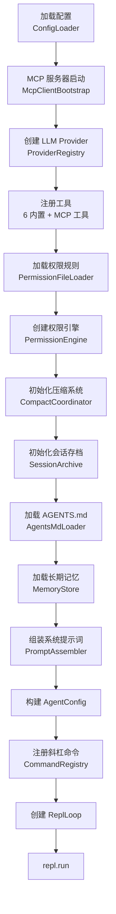
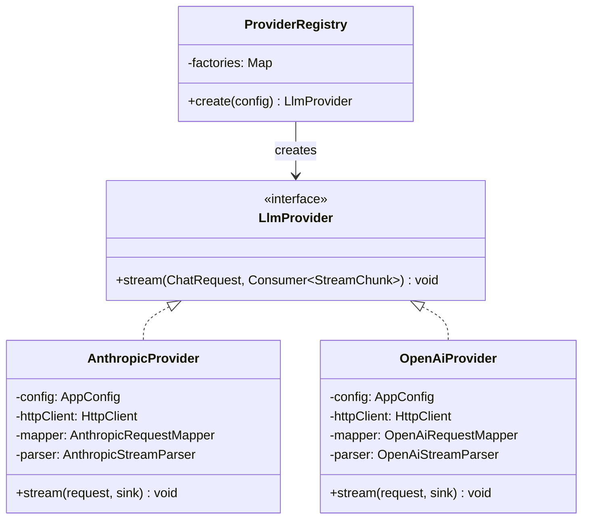
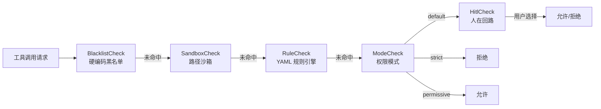
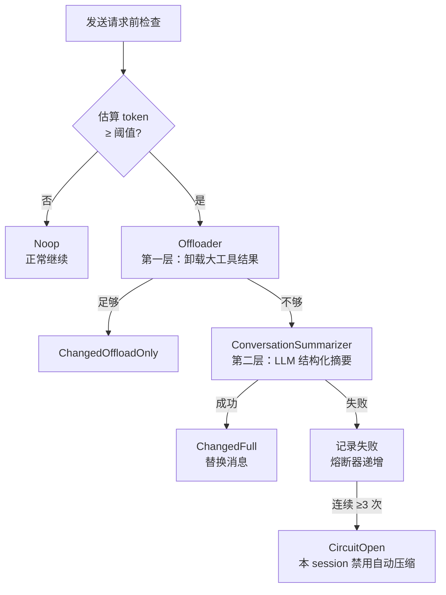
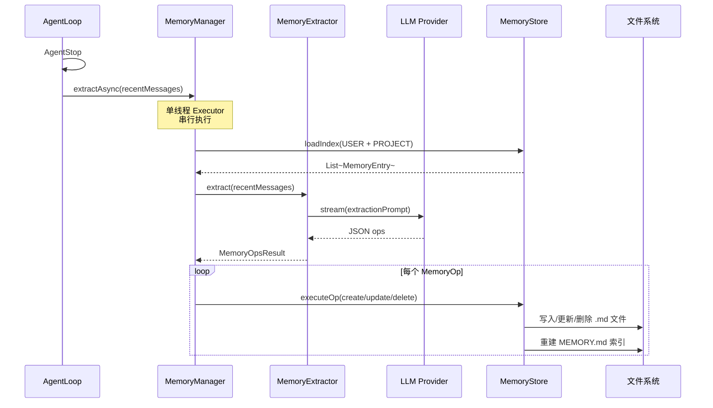

本页描绘 MapleCode 从用户键入到模型响应的完整数据流，以及各子系统如何协同工作形成一个可扩展的命令行 AI 编程助手。理解全局架构是深入任何单一模块的前提。

## 架构总览

MapleCode 采用**手动依赖组装**（Manual DI）的方式在启动入口 `App.main()` 中将各子系统连接在一起，运行时形成一个以 **REPL 循环** 为外壳、**Agent Loop** 为内核的分层架构。整体可划分为五个逻辑层次：

```mermaid
graph TB
    subgraph UI Layer
        REPL[ReplLoop<br/>JLine REPL]
        SP[StreamPrinter<br/>终端输出]
        SB[StatusBar<br/>底部状态栏]
        EC[EscapeController<br/>ESC/Ctrl+C]
    end

    subgraph Command Layer
        CR[CommandRegistry]
        CMD[Command 实现<br/>/clear /compact /mode ...]
    end

    subgraph Agent Core
        AL[AgentLoop<br/>迭代循环]
        RC[ResponseCollector<br/>流式累加]
        B[Batch<br/>安全/非安全分批]
    end

    subgraph Provider Layer
        PR[ProviderRegistry]
        AP[AnthropicProvider]
        OP[OpenAiProvider]
        SSE[SseStreamReader]
    end

    subgraph Tool Layer
        TR[ToolRegistry]
        TE[ToolExecutor]
        T1[ReadFileTool]
        T2[WriteFileTool]
        T3[EditFileTool]
        T4[ExecTool]
        T5[GlobTool]
        T6[GrepTool]
        MCP_ADAPTER[McpToolAdapter]
    end

    subgraph Permission Pipeline
        PE[PermissionEngine]
        BC[BlacklistCheck]
        SB2[SandboxCheck]
        RC2[RuleCheck]
        MC[ModeCheck]
        HC[HitlCheck]
    end

    subgraph Context Management
        CC[CompactCoordinator]
        OF[Offloader<br/>Layer 1]
        CS[ConversationSummarizer<br/>Layer 2]
        TC[TokenEstimator]
    end

    subgraph Memory System
        MM[MemoryManager]
        ME[MemoryExtractor]
        MS[MemoryStore]
    end

    subgraph Session Layer
        CS2[ChatSession<br/>内存消息]
        SA[SessionArchive<br/>磁盘存档]
    end

    subgraph Prompt Assembly
        PA[PromptAssembler]
        DS[DefaultSections]
        DC[DynamicContext]
    end

    REPL --> CR
    REPL --> AL
    AL --> RC
    AL --> B
    AL --> PR
    AL --> CC
    AL --> CS2
    RC --> SP
    PR --> AP
    PR --> OP
    AP --> SSE
    OP --> SSE
    B --> TE
    TE --> TR
    TE --> PE
    PE --> BC
    PE --> SB2
    PE --> RC2
    PE --> MC
    PE --> HC
    TR --> T1
    TR --> T2
    TR --> T3
    TR --> T4
    TR --> T5
    TR --> T6
    TR --> MCP_ADAPTER
    CC --> OF
    CC --> CS
    PA --> DS
    PA --> DC
    REPL --> MM
    MM --> ME
    MM --> MS
    REPL --> SA
```



该架构的核心设计原则是**接口隔离**与**管道式处理**。`LlmProvider` 接口屏蔽了 Anthropic/OpenAI 的协议差异；`Tool` 接口统一了内置工具与 MCP 外部工具；`PermissionCheck` 接口让五层权限防御可独立替换和测试。

Sources: [App.java](src/main/java/com/maplecode/App.java#L1-L265), [AgentLoop.java](src/main/java/com/maplecode/agent/AgentLoop.java#L1-L282), [ReplLoop.java](src/main/java/com/maplecode/ui/ReplLoop.java#L1-L306)

## 核心数据流：从用户输入到模型响应

一次完整的用户交互经历以下阶段。下面以用户输入一段普通文本（非斜杠命令）为例：

```mermaid
sequenceDiagram
    participant U as 用户终端
    participant R as ReplLoop
    participant A as AgentLoop
    participant C as CompactCoordinator
    participant S as ChatSession
    participant P as LlmProvider
    participant RC as ResponseCollector
    participant T as ToolExecutor
    participant PE as PermissionEngine
    participant Tool as Tool 实现

    U->>R: 输入文本
    R->>R: 判断是否 /command
    R->>A: agent.run(text, sink)
    A->>S: session.appendUserText(text)
    
    loop 迭代（最多 maxIterations 轮）
        A->>C: beforeRequest(session, AUTO)
        C-->>A: CompactOutcome（可能压缩消息）
        
        A->>S: session.toRequest(model, sysBlocks, thinking, tools)
        S-->>A: ChatRequest
        
        A->>P: provider.stream(request, chunk→)
        P-->>RC: StreamChunk 流
        
        RC-->>R: AgentEvent.TextDelta（实时输出）
        
        alt StopReason == TOOL_USE
            A->>A: Batch.partition(toolUses, registry)
            
            par 安全工具并行
                A->>T: executor.run(name, args)
                T->>PE: engine.check(request)
                PE-->>T: Decision
                T->>Tool: tool.execute(args, ctx)
                Tool-->>T: ToolResult
                T-->>A: ToolResult
            end
            
            A->>S: session.appendUser(toolResultBlocks)
        else StopReason == END_TURN
            A->>S: session.appendAssistant(textBlocks)
            break
        end
    end
    
    A-->>R: AgentEvent.AgentStop
    R->>R: memoryManager.extractAsync(recentMessages)
```

**阶段一：输入分发。** `ReplLoop` 通过 JLine 的 `LineReader` 读取用户输入。若以 `/` 开头则交由 `CommandRegistry` 查找并执行对应 `Command`；否则将文本送入 `AgentLoop.run()`。

**阶段二：Agent 迭代。** `AgentLoop` 是整个系统的心脏。它首先将用户文本追加到 `ChatSession`，然后进入一个最多 `maxIterations` 轮的循环。每轮迭代中：（1）调用 `CompactCoordinator.beforeRequest()` 检查是否需要自动压缩；（2）从 `ChatSession` 构建 `ChatRequest`（包含系统提示词块、消息历史、可用工具列表）；（3）调用 `LlmProvider.stream()` 获取流式响应。

**阶段三：流式响应收集。** `ResponseCollector` 作为 `Consumer<StreamChunk>` 接收每一个流式事件。它同时做两件事：将事件转发为 `AgentEvent` 推送给 `StreamPrinter`（实时显示），以及将文本片段、工具调用等状态累加到内部字段供 Agent 循环决策。

**阶段四：工具执行。** 当模型以 `TOOL_USE` 停止时，`AgentLoop` 收集所有 `ToolUse` 并通过 `Batch.partition()` 按安全性分为两组——只读工具（`read_file`、`glob`、`grep`）**并行执行**，有副作用的工具**串行执行**。每个工具调用都经过 `ToolExecutor` → `PermissionEngine` 的五层权限管道，通过后才真正调用 `Tool.execute()`。工具结果作为用户消息追加回 `ChatSession`，循环继续。

**阶段五：完成与记忆。** 当模型以 `END_TURN` 停止（或触发最大迭代/熔断条件），Agent 循环结束。`ReplLoop` 在后台异步调用 `MemoryManager.extractAsync()`，由 LLM 分析本轮对话并提取值得长期记忆的知识。

Sources: [AgentLoop.java](src/main/java/com/maplecode/agent/AgentLoop.java#L80-L282), [ReplLoop.java](src/main/java/com/maplecode/ui/ReplLoop.java#L65-L306), [ResponseCollector.java](src/main/java/com/maplecode/agent/ResponseCollector.java#L1-L115)

## 启动装配流程

`App.main()` 是所有子系统的装配点。它按照严格的依赖顺序初始化各组件，最终将控制权交给 `ReplLoop.run()`：



配置查找优先级为 `--config <path>` → `./maplecode.yaml` → `~/.maplecode/config.yaml`。MCP 服务器配置支持三层合并（用户全局 → 项目级 → 项目本地），权限规则同样三层合并。

值得注意的是，系统提示词的组装发生在**启动期**而非每轮对话。`PromptAssembler.assemble()` 将 `DefaultSections` 中的各段按顺序渲染为 `SystemBlock` 列表，其中最后一个可缓存块会被标记为 `cacheBoundary=true` 以优化 Anthropic 的 prompt caching。

Sources: [App.java](src/main/java/com/maplecode/App.java#L20-L230), [ConfigLoader.java](src/main/java/com/maplecode/config/ConfigLoader.java), [PromptAssembler.java](src/main/java/com/maplecode/prompt/PromptAssembler.java#L1-L41)

## 子系统架构详解

### LLM Provider 抽象层

`LlmProvider` 是整个系统中最简洁的接口——只有一个 `stream(ChatRequest, Consumer<StreamChunk>)` 方法。这种极简设计使得 Anthropic 和 OpenAI 的实现可以完全独立演化。



两个 Provider 的内部结构对称：**RequestMapper** 将统一的 `ChatRequest` 转换为各自的 HTTP 请求体，**StreamParser** 将 SSE 事件流解析为统一的 `StreamChunk` 序列。SSE 流式解析共享同一个 `SseStreamReader` 基础设施。

`StreamChunk` 是一个 sealed interface，其变体覆盖了流式响应的全部生命周期：`MessageStart` → `TextDelta` / `ThinkingDelta` / `ToolUseStart` → `ToolUseDelta` → `ToolUseEnd` → `MessageEnd`。这种设计使得消费端可以通过 switch 穷尽匹配，编译器会确保不遗漏任何事件类型。

Sources: [LlmProvider.java](src/main/java/com/maplecode/provider/LlmProvider.java#L1-L12), [AnthropicProvider.java](src/main/java/com/maplecode/provider/anthropic/AnthropicProvider.java#L1-L60), [OpenAiProvider.java](src/main/java/com/maplecode/provider/openai/OpenAiProvider.java#L1-L60), [StreamChunk.java](src/main/java/com/maplecode/provider/StreamChunk.java#L1-L50)

### 工具系统

工具系统由三个核心角色组成：**Tool 接口**定义工具契约，**ToolRegistry** 管理工具发现，**ToolExecutor** 负责权限检查与执行。

| 组件 | 职责 | 关键方法 |
|---|---|---|
| `Tool` | 定义工具的名称、描述、输入 Schema 和执行逻辑 | `name()`, `description()`, `inputSchema()`, `execute()` |
| `ToolRegistry` | 管理所有已注册工具，提供名称查找和只读分类 | `all()`, `get(name)`, `isReadOnly(name)`, `readOnly()` |
| `ToolExecutor` | 将权限检查与工具执行串联，所有错误包裹为 `ToolResult.error` | `run(name, args)` |

内置 6 个工具按只读性分类：

| 工具 | 只读 | 并行安全 | 说明 |
|---|---|---|---|
| `read_file` | ✓ | ✓ | 读取文件内容 |
| `glob` | ✓ | ✓ | 按模式查找文件 |
| `grep` | ✓ | ✓ | 按正则搜索内容 |
| `write_file` | ✗ | ✗ | 写入文件（覆盖） |
| `edit_file` | ✗ | ✗ | 精确替换文件内容 |
| `exec` | ✗ | ✗ | 执行 shell 命令 |

MCP 外部工具通过 `McpToolAdapter.of()` 适配为 `Tool` 接口，命名空间为 `mcp__<server>__<tool>`，与内置工具在权限管道中一视同仁。

`Batch.partition()` 在每轮迭代中将模型请求的工具调用按 `isReadOnly` 分为安全组和非安全组。安全工具通过 `parallelStream()` 并行执行，非安全工具串行执行，兼顾效率与副作用可控性。

Sources: [Tool.java](src/main/java/com/maplecode/tool/Tool.java#L1-L33), [ToolRegistry.java](src/main/java/com/maplecode/tool/ToolRegistry.java#L1-L48), [ToolExecutor.java](src/main/java/com/maplecode/tool/ToolExecutor.java#L1-L57), [Batch.java](src/main/java/com/maplecode/agent/Batch.java#L1-L29), [McpToolAdapter.java](src/main/java/com/maplecode/mcp/adapter/McpToolAdapter.java#L1-L70)

### 五层权限防御管道

所有工具调用（包括 MCP 工具）都必须通过 `PermissionEngine` 的五层检查。每一层都是一个 `PermissionCheck` 实现，返回 `Optional<Decision>`——有决策则终止管道，无决策则传递到下一层：



| 层 | 检查方式 | 可配置 |
|---|---|---|
| **黑名单** | 12 条硬编码正则（`rm -rf /`、`sudo`、fork bomb 等） | ✗ |
| **路径沙箱** | 文件操作必须在项目目录内，解析符号链接防逃逸 | ✗ |
| **规则引擎** | 三层 YAML 规则文件，first-match-wins | ✓ |
| **权限模式** | strict / default / permissive | ✓ |
| **人在回路** | default 模式下弹出 4 选 1 交互 | 部分 |

`PermissionEngine` 还维护 `sessionAllow` 和 `sessionDeny` 两个 `ConcurrentHashMap` 集合，支持用户在 HITL 中选择"本会话允许"或"本项目允许"。后者会通过 `persistProjectAllow()` 写入 `.maplecode/permissions.local.yaml` 文件。

Sources: [PermissionEngine.java](src/main/java/com/maplecode/permission/PermissionEngine.java#L1-L69), [PermissionCheck.java](src/main/java/com/maplecode/permission/PermissionCheck.java#L1-L8), [App.java](src/main/java/com/maplecode/App.java#L145-L165)

### 上下文管理与压缩

当对话 token 数接近上下文窗口上限时，`CompactCoordinator` 自动触发两层压缩机制：



**第一层（Offloader）**：将单条超过 `singleToolResultOffloadTokens`（默认 8000）的工具结果写入磁盘文件，原位置替换为预览文本。若多条工具结果的聚合值超过 `messageToolResultAggregateTokens`（默认 30000），则按大小降序逐个卸载直到低于阈值。

**第二层（ConversationSummarizer）**：调用 LLM（默认使用摘要专用模型 `summarizer_model`）生成包含 5 个标准章节的结构化摘要：Intent、Decisions、Open Questions、State、Next Step。摘要替换旧消息后附加边界消息，提醒模型"需要精确内容请重新读取磁盘文件"。

**熔断器**：`FailureCounter` 连续 3 次摘要失败后触发熔断，本会话禁用自动压缩。`/clear` 命令可重置熔断器。手动 `/compact` 不受熔断限制。

Sources: [CompactCoordinator.java](src/main/java/com/maplecode/compact/CompactCoordinator.java#L1-L128), [Offloader.java](src/main/java/com/maplecode/compact/Offloader.java#L1-L102), [ConversationSummarizer.java](src/main/java/com/maplecode/compact/ConversationSummarizer.java#L1-L100), [FailureCounter.java](src/main/java/com/maplecode/compact/FailureCounter.java#L1-L38)

### 长期记忆系统

记忆系统在每轮 Agent Loop 结束后**异步**运行，实现跨会话知识积累：



记忆按 scope 分为 `user`（跨项目，存储于 `~/.maplecode/memory/user/`）和 `project`（当前项目，存储于 `~/.maplecode/memory/project/`），按 category 分为 `user`、`feedback`、`project`、`reference` 四类。每条记忆以 Markdown 文件形式存储，`MEMORY.md` 作为索引文件。下次启动时，`MemoryStore.loadIndexText()` 加载索引内容注入系统提示词。

`MemoryManager` 内部使用 `ReentrantLock` 保护文件 I/O 的线程安全，`MemoryFailureCounter` 提供独立的熔断语义（连续 3 次失败后停止提取）。

Sources: [MemoryManager.java](src/main/java/com/maplecode/memory/MemoryManager.java#L1-L100), [MemoryExtractor.java](src/main/java/com/maplecode/memory/MemoryExtractor.java#L1-L100), [MemoryStore.java](src/main/java/com/maplecode/memory/MemoryStore.java#L1-L100)

### 会话管理

会话管理分为两层：**内存层**和**持久层**。

**内存层** `ChatSession` 是一个简单的 append-only 消息列表，提供 `appendUser()`、`appendAssistant()`、`replaceAll()`（供压缩系统批量替换）等方法。`toRequest()` 将消息列表与系统提示词、工具列表组装为 `ChatRequest` 发送给 LLM。

**持久层** `SessionArchive` 将会话序列化为 JSONL 格式存储在 `~/.maplecode/sessions/` 目录下。支持通过 `/new` 保存当前会话并创建新会话，通过 `/resume` 恢复历史会话。过期存档（超过 30 天）在启动时自动清理。

Sources: [ChatSession.java](src/main/java/com/maplecode/session/ChatSession.java#L1-L90), [SessionArchive.java](src/main/java/com/maplecode/session/archive/SessionArchive.java#L1-L129)

### 提示词组装

系统提示词由 `PromptAssembler` 在启动期一次性组装，结构如下：

| 段落 | 类型标识 | 可缓存 | 内容说明 |
|---|---|---|---|
| 身份 | `identity` | ✓ | "你是 MapleCode，一个运行在终端的 AI 编程助手" |
| 系统约束 | `constraints` | ✓ | 不确定先读文件、仅用已注册工具等 |
| 任务模式 | `task_mode` | ✓ | 根据 PlanMode 动态生成 |
| 执行原则 | `action_execution` | ✓ | 多步先列计划、调工具前说明目的等 |
| 工具约定 | `tool_usage` | ✓ | 根据已注册工具动态生成可用工具列表 |
| 风格 | `tone_style` | ✓ | 中文短句、技术名词保留英文 |
| 输出格式 | `text_output` | ✓ | 代码块包裹路径、列表用 `- ` 等 |
| AGENTS.md | `agents_md` | ✓ | 项目级指令文件 |
| 长期记忆 | `memory` | ✓ | 跨会话知识（user + project） |
| 环境信息 | `environment` | ✗ | 工作目录、Git 状态、日期时间等 |
| 自定义指令 | `custom_instruction` | ✓ | 来自配置文件 `system_prompt` 字段 |

`cacheable` 标记用于 Anthropic 的 prompt caching 优化——最后一个可缓存块的 `cacheBoundary` 被设为 `true`，使得相同前缀的系统提示词可被缓存复用。动态内容（如环境信息中的时间）必须标记为 `cacheable=false` 并放在末尾。

Sources: [DefaultSections.java](src/main/java/com/maplecode/prompt/DefaultSections.java#L1-L138), [PromptAssembler.java](src/main/java/com/maplecode/prompt/PromptAssembler.java#L1-L41), [SystemBlock.java](src/main/java/com/maplecode/prompt/SystemBlock.java#L1-L4)

## 关键设计模式

本项目在多个层面体现了一致的设计理念：

**Sealed Interface 驱动的类型安全。** `StreamChunk`、`ContentBlock`、`AgentEvent`、`CompactResult` 等核心数据类型均采用 sealed interface，编译器强制 switch 穷尽检查。新增变体时所有消费端会编译失败，消除了运行时遗漏分支的风险。

**双路事件流。** `ResponseCollector` 同时将 StreamChunk 转发给 UI（实时显示）和累加到内部状态（决策依据），实现了"边展示边收集"的零延迟响应。`AgentEvent` 的 sealed 层次覆盖了从文本增量到压缩应用的全部可观测事件。

**熔断器模式。** 压缩系统（`FailureCounter`）和记忆系统（`MemoryFailureCounter`）都采用熔断器模式：连续失败达到阈值后自动停止，防止级联故障。压缩的熔断器可通过 `/clear` 重置，记忆的熔断器在下次启动时重置。

**防御式设计。** `ToolExecutor.run()` 承诺永不抛出异常——所有失败（包括内部 bug）都包裹为 `ToolResult.error` 返回给模型。`ChatSession` 的 `appendUser()`/`appendAssistant()` 对入参做防御性拷贝。`CompactCoordinator.beforeRequest()` 对每种失败路径都有对应的 `CompactResult` 变体。

Sources: [StreamChunk.java](src/main/java/com/maplecode/provider/StreamChunk.java#L1-L50), [AgentEvent.java](src/main/java/com/maplecode/agent/AgentEvent.java#L1-L49), [ContentBlock.java](src/main/java/com/maplecode/provider/ContentBlock.java#L1-L26), [ToolExecutor.java](src/main/java/com/maplecode/tool/ToolExecutor.java#L26-L57)

## 项目包结构一览

```
com.maplecode
├── App.java                    # 启动入口，手动 DI 装配
├── agent/                      # Agent Loop 核心
│   ├── AgentLoop.java          #   迭代循环引擎
│   ├── AgentConfig.java        #   Agent 配置（模型、迭代上限等）
│   ├── AgentEvent.java         #   事件类型（sealed）
│   ├── Batch.java              #   安全/非安全工具分批
│   └── ResponseCollector.java  #   流式响应累加器
├── provider/                   # LLM Provider 抽象
│   ├── LlmProvider.java        #   统一接口
│   ├── ChatRequest.java        #   请求结构
│   ├── ChatMessage.java        #   消息结构
│   ├── ContentBlock.java       #   内容块（sealed）
│   ├── StreamChunk.java        #   流式事件（sealed）
│   ├── anthropic/              #   Anthropic 实现
│   └── openai/                 #   OpenAI 实现
├── tool/                       # 工具系统
│   ├── Tool.java               #   工具接口
│   ├── ToolRegistry.java       #   工具注册表
│   ├── ToolExecutor.java       #   工具执行器（权限 + 执行）
│   └── {Read,Write,Edit,Exec,Glob,Grep}Tool.java
├── permission/                 # 权限系统
│   ├── PermissionEngine.java   #   五层管道引擎
│   ├── BlacklistCheck.java     #   黑名单
│   ├── SandboxCheck.java       #   路径沙箱
│   ├── RuleCheck.java          #   规则引擎
│   ├── ModeCheck.java          #   权限模式
│   └── HitlCheck.java          #   人在回路
├── compact/                    # 上下文压缩
│   ├── CompactCoordinator.java #   压缩协调器
│   ├── Offloader.java          #   第一层：卸载
│   ├── ConversationSummarizer.java # 第二层：摘要
│   └── FailureCounter.java     #   熔断器
├── memory/                     # 长期记忆
│   ├── MemoryManager.java      #   记忆管理门面
│   ├── MemoryExtractor.java    #   LLM 提取
│   └── MemoryStore.java        #   文件存储
├── prompt/                     # 提示词组装
│   ├── PromptAssembler.java    #   组装器
│   ├── DefaultSections.java    #   默认段落定义
│   └── SystemBlock.java        #   系统提示词块
├── session/                    # 会话管理
│   ├── ChatSession.java        #   内存会话
│   └── archive/                #   磁盘存档
├── mcp/                        # MCP 客户端
│   ├── client/McpClient.java   #   MCP 客户端
│   ├── adapter/McpToolAdapter.java # MCP 工具适配
│   └── transport/              #   stdio / http 传输
├── command/                    # 斜杠命令框架
│   ├── Command.java            #   命令接口
│   ├── CommandRegistry.java    #   命令注册表
│   └── {Clear,Compact,Help,...}Command.java
├── config/                     # 配置
│   ├── AppConfig.java          #   应用配置 record
│   └── ConfigLoader.java       #   YAML 加载器
├── ui/                         # 用户界面
│   ├── ReplLoop.java           #   REPL 主循环
│   ├── StreamPrinter.java      #   流式输出
│   ├── StatusBar.java          #   底部状态栏
│   └── EscapeController.java   #   ESC 键处理
├── agents/                     # AGENTS.md 加载
├── error/                      # 异常层次
└── util/                       # 工具类
```

Sources: [目录结构](src/main/java/com/maplecode)

## 推荐阅读顺序

理解整体架构后，建议按以下路径深入各子系统：

1. **[核心抽象与接口设计](6-he-xin-chou-xiang-yu-jie-kou-she-ji)** — 理解 LlmProvider、Tool、PermissionCheck 三大接口的设计哲学
2. **[Agent Loop 实现](16-agent-loop-shi-xian)** — 深入迭代循环的每一步细节
3. **[统一接口 LlmProvider](7-tong-jie-kou-llmprovider)** → **[SSE 流式解析机制](9-sse-liu-shi-jie-xi-ji-zhi)** — 理解模型通信全链路
4. **[五层权限防御管道](13-wu-ceng-quan-xian-fang-yu-guan-dao)** — 安全机制的完整剖析
5. **[上下文管理与压缩](17-shang-xia-wen-guan-li-yu-ya-suo)** — 两层压缩的协同工作
6. **[长期记忆系统](18-chang-qi-ji-yi-xi-tong)** — 跨会话知识积累的实现