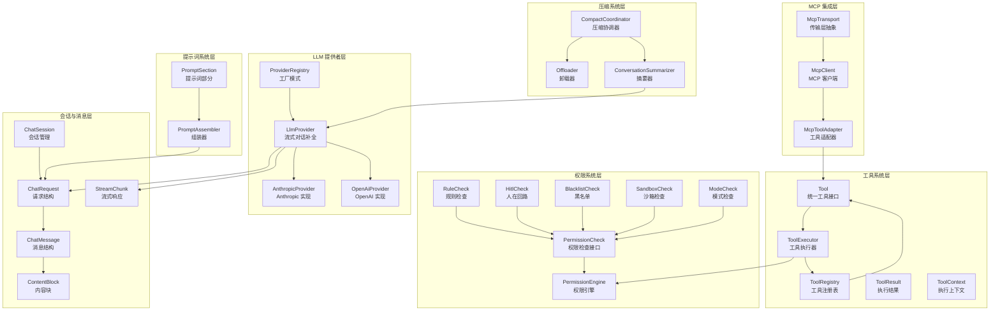
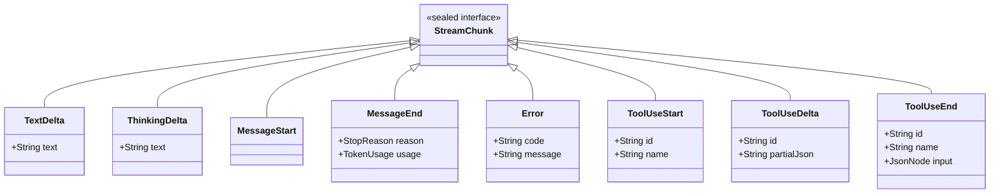
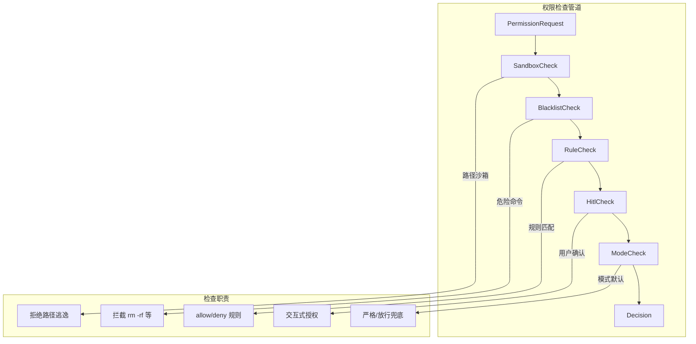
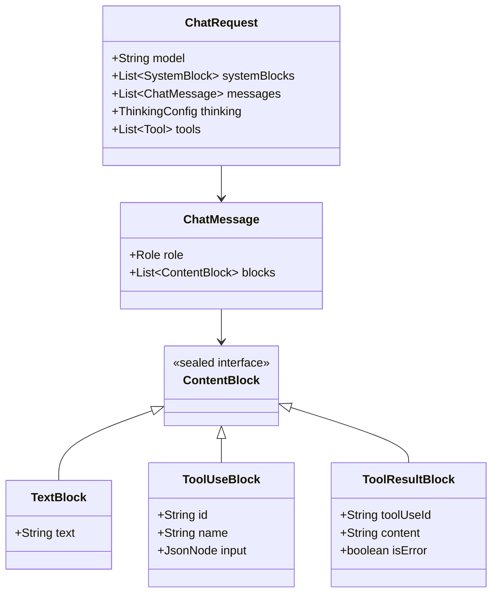
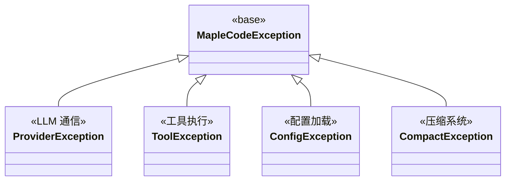

本文档深入剖析 MapleCode 的核心抽象层与接口设计，揭示其如何通过精心设计的接口层次实现模块化、可扩展的架构。文档将系统性地解析各个核心接口的设计理念、交互模式以及它们在整体架构中的定位，为开发者理解系统行为和扩展功能提供清晰的路线图。

## 1. 设计哲学与架构目标

MapleCode 的核心抽象层遵循 **"接口优先、契约明确"** 的设计哲学。系统通过定义清晰的接口契约来解耦各个子系统，使得每个模块都能独立演进而不影响整体架构。这种设计带来了三个关键优势：**可测试性**（通过接口模拟实现单元测试）、**可扩展性**（通过接口实现支持新功能）和**可维护性**（接口边界清晰，职责分离明确）。

从架构层面看，系统采用了**分层抽象**模式：最底层是基础设施抽象（HTTP、文件系统），中间层是核心业务抽象（LLM 提供者、工具执行、权限控制），最上层是应用层逻辑（Agent 循环、会话管理）。每一层都通过接口与上层交互，实现了**依赖倒置**原则。

Sources: [App.java](src/main/java/com/maplecode/App.java#L60-L200)

## 2. 核心接口层次结构

MapleCode 的接口设计形成了清晰的层次结构，各个接口之间通过组合而非继承的方式协作。下图展示了核心接口的关系网络：



Sources: [LlmProvider.java](src/main/java/com/maplecode/provider/LlmProvider.java#L5-L11), [Tool.java](src/main/java/com/maplecode/tool/Tool.java#L15-L32), [PermissionCheck.java](src/main/java/com/maplecode/permission/PermissionCheck.java#L5-L7), [ChatSession.java](src/main/java/com/maplecode/session/ChatSession.java#L15-L90), [PromptSection.java](src/main/java/com/maplecode/prompt/PromptSection.java#L9-L61), [CompactCoordinator.java](src/main/java/com/maplecode/compact/CompactCoordinator.java#L12-L127), [McpTransport.java](src/main/java/com/maplecode/mcp/transport/McpTransport.java#L12-L22)

## 3. LLM Provider 抽象层

LLM Provider 抽象层是系统与外部大语言模型交互的核心接口。其设计遵循**单一职责原则**，将复杂的 HTTP 通信、SSE 流式解析、协议差异封装在统一的接口之后。

### 3.1 LlmProvider 接口

`LlmProvider` 是系统中最核心的接口之一，定义了与 LLM 交互的契约。它采用**流式回调模式**，通过 `Consumer<StreamChunk>` 回调逐步推送响应数据，避免了阻塞式调用带来的内存压力。

```java
public interface LlmProvider {
    /**
     * 流式输出对话补全。每个 chunk 同步推送到 sink。
     * 传输 / 协议 / HTTP 错误抛出 ProviderException。
     */
    void stream(ChatRequest request, Consumer<StreamChunk> sink);
}
```

这个设计的关键优势在于：
1. **流式处理**：避免一次性加载完整响应，支持实时输出
2. **回调模式**：调用方可以灵活处理每个 chunk，实现增量渲染
3. **异常统一**：所有底层异常统一转换为 `ProviderException`

Sources: [LlmProvider.java](src/main/java/com/maplecode/provider/LlmProvider.java#L5-L11)

### 3.2 ProviderRegistry 工厂

`ProviderRegistry` 采用**工厂模式**创建 `LlmProvider` 实例，实现了**配置驱动的实现选择**。通过配置中的 `protocol` 字段，系统可以在运行时选择不同的 LLM 提供者实现。

```java
public final class ProviderRegistry {
    private final Map<String, Function<AppConfig, LlmProvider>> factories = Map.of(
        "anthropic", AnthropicProvider::new,
        "openai",    OpenAiProvider::new
    );
    
    public LlmProvider create(AppConfig config) {
        // 根据 config.protocol() 选择对应工厂
    }
}
```

这种设计使得添加新的 LLM 提供者变得极其简单：只需实现 `LlmProvider` 接口并在工厂中注册即可，无需修改现有代码。

Sources: [ProviderRegistry.java](src/main/java/com/maplecode/provider/ProviderRegistry.java#L12-L32)

### 3.3 流式响应模型

流式响应通过 `StreamChunk` 密封接口建模，采用**代数数据类型**模式，确保所有可能的响应类型都被显式处理：



`StopReason` 枚举定义了对话结束的所有可能原因，为 Agent 循环提供了决策依据。`ToolUse` 相关的三个 chunk 实现了工具调用的**增量组装**模式：先声明工具名，再逐步传递参数，最后组装完整调用。

Sources: [StreamChunk.java](src/main/java/com/maplecode/provider/StreamChunk.java#L13-L49)

## 4. 工具系统抽象

工具系统是 MapleCode 实现"AI 代理"能力的核心，通过抽象的工具接口，系统可以安全地执行文件操作、代码执行等任务。

### 4.1 Tool 接口设计

`Tool` 接口定义了工具的**四要素**：名称、描述、输入模式、执行逻辑。这种设计使得工具对 LLM 透明（通过 JSON Schema 描述），同时对执行环境透明（通过统一的执行接口）。

```java
public interface Tool {
    String name();          // 工具标识符，如 "read_file"
    String description();   // 人类可读描述，供 LLM 理解
    JsonNode inputSchema(); // JSON Schema，供 LLM 生成参数
    ToolResult execute(JsonNode args, ToolContext ctx); // 执行逻辑
}
```

关键设计决策包括：
1. **JSON Schema 描述**：利用 JSON Schema 标准，使工具描述既对人类友好，也对 LLM 友好
2. **异常分类**：`ToolException` 表示已知错误，其他异常表示内部 bug
3. **上下文传递**：`ToolContext` 包含工作目录、限制参数等，避免全局状态

Sources: [Tool.java](src/main/java/com/maplecode/tool/Tool.java#L15-L32)

### 4.2 ToolExecutor 执行器

`ToolExecutor` 是工具系统的**执行引擎**，负责工具查找、权限检查、异常捕获等横切关注点。它采用了**装饰器模式**，在不修改工具实现的情况下添加了统一的执行逻辑。

```java
public final class ToolExecutor {
    public ToolResult run(String name, JsonNode args) {
        // 1. 工具查找
        // 2. 权限检查
        // 3. 执行工具
        // 4. 异常捕获与转换
    }
}
```

执行器的关键职责包括：
1. **工具查找**：通过 `ToolRegistry` 按名称查找工具
2. **权限集成**：与 `PermissionEngine` 集成，执行前检查权限
3. **异常兜底**：将所有异常转换为 `ToolResult.error`，确保工具调用永不抛出异常

Sources: [ToolExecutor.java](src/main/java/com/maplecode/tool/ToolExecutor.java#L12-L56)

### 4.3 ToolRegistry 注册表

`ToolRegistry` 管理所有可用工具，提供**只读工具**与**全工具**的区分能力，支持 PLAN 模式下的安全执行：

```java
public final class ToolRegistry {
    private static final Set<String> READ_ONLY_DEFAULT = Set.of("read_file", "glob", "grep");
    
    public List<Tool> all();      // 所有工具
    public List<Tool> readOnly(); // 只读工具
    public boolean isReadOnly(String name);
}
```

这种设计使得 Agent 循环可以轻松实现**只读模式**，通过只暴露只读工具给 LLM，实现安全的代码分析能力。

Sources: [ToolRegistry.java](src/main/java/com/maplecode/tool/ToolRegistry.java#L9-L48)

### 4.4 工具上下文与结果

工具执行通过 `ToolContext` 传递上下文参数，通过 `ToolResult` 返回结果，形成了完整的**输入-输出**契约：

```java
public record ToolContext(
    Path cwd,                   // 工作目录
    int readMaxBytes,           // 读取限制
    int execDefaultTimeoutSec,  // 执行超时
    int grepMaxResults,         // grep 结果限制
    int globMaxResults          // glob 结果限制
) {
    public static ToolContext defaults(Path cwd) { ... }
}

public record ToolResult(String content, boolean isError) {
    public static ToolResult ok(String content) { ... }
    public static ToolResult error(String content) { ... }
}
```

这种设计使得工具实现可以专注于业务逻辑，而无需关心上下文管理和结果格式化。

Sources: [ToolContext.java](src/main/java/com/maplecode/tool/ToolContext.java#L8-L18), [ToolResult.java](src/main/java/com/maplecode/tool/ToolResult.java#L7-L10)

## 5. 权限系统抽象

权限系统是 MapleCode 安全架构的核心，通过**分层管道**模式实现了细粒度的权限控制。

### 5.1 PermissionCheck 接口

`PermissionCheck` 是权限系统的基础接口，采用**策略模式**，允许不同的检查策略独立工作：

```java
public interface PermissionCheck {
    Optional<Decision> check(PermissionRequest req, PermissionContext ctx);
}
```

返回 `Optional<Decision>` 的设计体现了**优先级管道**模式：
- `Optional.empty()` 表示该检查无法做出决策，传递给下一个检查
- `Optional.of(Decision)` 表示做出最终决策，终止检查链

Sources: [PermissionCheck.java](src/main/java/com/maplecode/permission/PermissionCheck.java#L5-L7)

### 5.2 PermissionEngine 引擎

`PermissionEngine` 是权限系统的**协调者**，管理多个 `PermissionCheck` 实例，并维护会话级的临时权限：

```java
public final class PermissionEngine {
    private final List<PermissionCheck> checks;
    private final Set<ToolCall> sessionAllow;  // 会话级允许
    private final Set<ToolCall> sessionDeny;   // 会话级拒绝
    private final AtomicReference<PermissionMode> mode;
    
    public Decision check(PermissionRequest req) {
        var ctx = new PermissionContext(mode.get(), sessionAllow, sessionDeny);
        for (PermissionCheck c : checks) {
            Optional<Decision> d = c.check(req, ctx);
            if (d.isPresent()) return d.get();
        }
        return Decision.deny("未达成决策");
    }
}
```

引擎的关键设计包括：
1. **检查链**：按顺序执行所有检查，第一个做出决策的检查生效
2. **会话状态**：维护会话级的临时允许/拒绝，支持动态授权
3. **模式管理**：支持严格、放行、默认三种模式

Sources: [PermissionEngine.java](src/main/java/com/maplecode/permission/PermissionEngine.java#L13-L68)

### 5.3 五层检查管道

系统实现了五层权限检查管道，每一层专注于特定的安全关注点：



1. **SandboxCheck**：路径沙箱，防止文件系统逃逸
2. **BlacklistCheck**：硬编码黑名单，拦截危险命令
3. **RuleCheck**：规则引擎，支持 glob 模式匹配
4. **HitlCheck**：人在回路，交互式用户确认
5. **ModeCheck**：模式兜底，根据全局模式决策

Sources: [SandboxCheck.java](src/main/java/com/maplecode/permission/SandboxCheck.java#L20-L74), [BlacklistCheck.java](src/main/java/com/maplecode/permission/BlacklistCheck.java#L11-L46), [RuleCheck.java](src/main/java/com/maplecode/permission/RuleCheck.java#L7-L80), [HitlCheck.java](src/main/java/com/maplecode/permission/HitlCheck.java#L10-L105), [ModeCheck.java](src/main/java/com/maplecode/permission/ModeCheck.java#L5-L14)

## 6. 会话与消息抽象

会话与消息抽象是系统与 LLM 交互的数据模型基础，采用**不可变记录**模式确保数据一致性。

### 6.1 消息层次结构

消息系统采用**代数数据类型**模式，通过密封接口和记录实现类型安全：



关键设计决策：
1. **密封接口**：`ContentBlock` 使用 `sealed` 关键字，确保所有可能的内容类型都被处理
2. **不可变记录**：所有消息类都是 `record`，确保线程安全和数据一致性
3. **防御性拷贝**：`ChatSession` 在添加消息时进行拷贝，防止外部修改

Sources: [ContentBlock.java](src/main/java/com/maplecode/provider/ContentBlock.java#L12-L25), [ChatMessage.java](src/main/java/com/maplecode/provider/ChatMessage.java#L11-L13), [ChatRequest.java](src/main/java/com/maplecode/provider/ChatRequest.java#L8-L14)

### 6.2 ChatSession 会话管理

`ChatSession` 是会话状态的**唯一真相源**，管理着整个对话历史：

```java
public final class ChatSession {
    private final List<ChatMessage> messages = new ArrayList<>();
    
    public void appendUserText(String text) { ... }
    public void appendUser(List<ContentBlock> blocks) { ... }
    public void appendAssistant(List<ContentBlock> blocks) { ... }
    public List<ChatMessage> messages() { ... }
    public void replaceAll(List<ChatMessage> messages) { ... } // 压缩系统使用
    public ChatRequest toRequest(String model, ...) { ... }
}
```

会话管理的关键特性包括：
1. **防御性拷贝**：防止外部修改内部状态
2. **不可变视图**：`messages()` 返回不可变列表
3. **压缩支持**：`replaceAll()` 支持压缩系统替换整个历史
4. **请求转换**：`toRequest()` 将会话转换为 LLM 请求

Sources: [ChatSession.java](src/main/java/com/maplecode/session/ChatSession.java#L15-L90)

## 7. 提示词系统抽象

提示词系统负责构建发送给 LLM 的系统提示，采用**可组合的段落模式**。

### 7.1 PromptSection 接口

`PromptSection` 是提示词构建的基础接口，每个实现代表系统提示的一个逻辑部分：

```java
public interface PromptSection {
    String kind();                          // 类型标识符
    String render(SectionContext ctx);      // 渲染内容
    default boolean cacheable() { return true; }  // 是否可缓存
    default boolean enabled(SectionContext ctx) { return true; } // 是否启用
}
```

这种设计的关键优势：
1. **动态生成**：根据上下文动态生成内容，如工具列表、环境信息
2. **缓存控制**：通过 `cacheable()` 控制缓存策略
3. **条件启用**：通过 `enabled()` 动态启用/禁用部分

Sources: [PromptSection.java](src/main/java/com/maplecode/prompt/PromptSection.java#L9-L61)

### 7.2 PromptAssembler 组装器

`PromptAssembler` 负责将多个 `PromptSection` 组装成最终的系统提示：

```java
public final class PromptAssembler {
    public List<SystemBlock> assemble(List<PromptSection> sections, SectionContext ctx) {
        // 1. 遍历所有 section
        // 2. 过滤禁用的 section
        // 3. 渲染每个 section
        // 4. 标记最后一个可缓存的 section
        // 5. 返回 SystemBlock 列表
    }
}
```

组装器的关键特性包括：
1. **缓存优化**：标记最后一个可缓存的 section，支持 API 级别的缓存
2. **动态组装**：根据上下文动态组装提示词
3. **提醒附加**：支持附加提醒消息到请求中

Sources: [PromptAssembler.java](src/main/java/com/maplecode/prompt/PromptAssembler.java#L11-L40)

## 8. 压缩系统抽象

压缩系统是 MapleCode 处理长对话的关键机制，通过**分层压缩**策略保持上下文窗口的有效利用。

### 8.1 CompactCoordinator 协调器

`CompactCoordinator` 是压缩系统的**唯一入口点**，协调卸载器和摘要器的工作：

```java
public final class CompactCoordinator {
    public CompactOutcome beforeRequest(ChatSession session, CompactTrigger trigger,
                                        TokenUsage anchorOverride) {
        // 1. 熔断器检查
        // 2. Token 估算
        // 3. 运行 offloader（第一层）
        // 4. 运行 summarizer（第二层）
    }
}
```

压缩系统的分层策略：
1. **第一层：卸载** - 将大型工具结果写入磁盘，只保留预览
2. **第二层：摘要** - 使用 LLM 生成结构化摘要，保留关键信息

Sources: [CompactCoordinator.java](src/main/java/com/maplecode/compact/CompactCoordinator.java#L12-L127)

### 8.2 Offloader 卸载器

`Offloader` 负责将大型工具结果卸载到磁盘，通过**阈值控制**决定哪些结果需要卸载：

```java
public final class Offloader {
    public List<ChatMessage> apply(List<ChatMessage> messages, CompactConfig config) {
        // 1. 识别超阈值的 tool result
        // 2. 检查聚合阈值
        // 3. 按大小降序卸载
        // 4. 构建预览
    }
}
```

卸载器的关键特性：
1. **单条阈值**：单个工具结果超过阈值时卸载
2. **聚合阈值**：多个工具结果总和超过阈值时卸载
3. **预览生成**：保留文件头尾，生成预览

Sources: [Offloader.java](src/main/java/com/maplecode/compact/Offloader.java#L11-L101)

### 8.3 ConversationSummarizer 摘要器

`ConversationSummarizer` 使用 LLM 生成结构化摘要，保留对话的关键信息：

```java
public final class ConversationSummarizer {
    private static final String[] REQUIRED_SECTIONS = {
        "## Intent", "## Decisions", "## Open Questions", "## State", "## Next Step"
    };
    
    public List<ChatMessage> apply(List<ChatMessage> messages, CompactConfig config) {
        // 1. 调用 LLM 生成摘要
        // 2. 移除 scratchpad
        // 3. 验证必需章节
        // 4. 计算近期分割点
        // 5. 组装摘要 + 近期尾部
    }
}
```

摘要器的关键特性：
1. **结构化输出**：强制输出 5 个必需章节
2. **scratchpad 机制**：LLM 先进行私有分析，再输出正式摘要
3. **近期保留**：保留最近的对话作为上下文
4. **边界消息**：添加明确的压缩边界说明

Sources: [ConversationSummarizer.java](src/main/java/com/maplecode/compact/ConversationSummarizer.java#L17-L208)

## 9. MCP 集成抽象

MCP (Model Context Protocol) 集成使得 MapleCode 可以连接外部工具服务器，扩展工具能力。

### 9.1 McpTransport 传输层

`McpTransport` 是 MCP 传输层的抽象接口，定义了底层通信的契约：

```java
public interface McpTransport extends AutoCloseable {
    CompletableFuture<Void> send(JsonNode frame);  // 发送帧
    void onInbound(Consumer<JsonNode> inbound);    // 注册接收回调
    void close(Throwable cause);                   // 关闭连接
}
```

传输层抽象的关键设计：
1. **异步发送**：使用 `CompletableFuture` 支持异步操作
2. **回调接收**：通过 `Consumer` 回调处理接收的帧
3. **资源管理**：实现 `AutoCloseable` 支持 try-with-resources

Sources: [McpTransport.java](src/main/java/com/maplecode/mcp/transport/McpTransport.java#L12-L22)

### 9.2 McpClient 客户端

`McpClient` 是 MCP 协议的客户端实现，负责协议握手、工具发现、工具调用：

```java
public final class McpClient {
    public void initialize() { ... }                    // 协议握手
    public List<McpToolDesc> cachedTools() { ... }      // 获取工具列表
    public CompletableFuture<McpCallResult> callToolFuture(String name, JsonNode arguments) { ... }
}
```

客户端的关键特性：
1. **协议版本管理**：支持多个协议版本
2. **工具缓存**：缓存工具列表避免重复请求
3. **异步调用**：工具调用返回 `CompletableFuture`

Sources: [McpClient.java](src/main/java/com/maplecode/mcp/client/McpClient.java#L17-L147)

### 9.3 McpToolAdapter 适配器

`McpToolAdapter` 将 MCP 工具适配为系统 `Tool` 接口，实现了**适配器模式**：

```java
public final class McpToolAdapter implements Tool {
    public static McpToolAdapter of(McpClient client, McpToolDesc desc) { ... }
    
    @Override
    public ToolResult execute(JsonNode args, ToolContext ctx) {
        // 将 MCP 调用转换为系统 ToolResult
    }
}
```

适配器的关键作用：
1. **接口转换**：将 MCP 工具转换为系统 `Tool` 接口
2. **命名空间隔离**：为 MCP 工具添加前缀避免冲突
3. **结果转换**：将 MCP 结果转换为 `ToolResult`

Sources: [McpToolAdapter.java](src/main/java/com/maplecode/mcp/adapter/McpToolAdapter.java)

## 10. 配置与异常抽象

### 10.1 AppConfig 配置模型

`AppConfig` 是系统配置的**单一真相源**，采用**不可变记录**模式：

```java
public record AppConfig(
    String protocol,
    String model,
    String baseUrl,
    String apiKey,
    // ... 其他配置
    PermissionMode permissionMode,
    AgentLimits agentLimits,
    McpConfig mcpConfig,
    MemoryConfig memoryConfig
) {
    public record Timeouts(int connectSeconds, int readSeconds) { ... }
    public record AgentLimits(int maxIterations, int maxConsecutiveUnknown) { ... }
    public record McpConfig(boolean enabled, int startupTimeoutMs) { ... }
}
```

配置模型的关键特性：
1. **嵌套记录**：通过嵌套记录组织相关配置
2. **验证逻辑**：在构造器中进行参数验证
3. **默认值**：提供静态工厂方法创建默认配置

Sources: [AppConfig.java](src/main/java/com/maplecode/config/AppConfig.java#L11-L67)

### 10.2 异常层次结构

系统采用**分层异常**设计，每种异常类型对应特定的错误场景：



异常层次的关键设计：
1. **统一基类**：所有自定义异常继承自 `MapleCodeException`
2. **领域分类**：每种异常对应一个业务领域
3. **上下文传递**：异常携带足够的上下文信息

Sources: [MapleCodeException.java](src/main/java/com/maplecode/error/MapleCodeException.java#L3-L10), [ProviderException.java](src/main/java/com/maplecode/error/ProviderException.java), [ToolException.java](src/main/java/com/maplecode/error/ToolException.java), [ConfigException.java](src/main/java/com/maplecode/error/ConfigException.java)

## 11. 设计模式与架构决策

MapleCode 的接口设计综合运用了多种设计模式，形成了清晰的架构风格。

### 11.1 核心设计模式

| 模式 | 应用位置 | 设计意图 |
|------|----------|----------|
| **工厂模式** | `ProviderRegistry` | 配置驱动的实现选择 |
| **策略模式** | `PermissionCheck` 实现 | 可插拔的权限检查策略 |
| **装饰器模式** | `ToolExecutor` | 添加横切关注点 |
| **适配器模式** | `McpToolAdapter` | 接口转换与兼容 |
| **观察者模式** | `StreamChunk` 回调 | 流式事件通知 |
| **组合模式** | `PromptSection` | 可组合的提示词构建 |
| **管道模式** | 权限检查链 | 分层处理请求 |

### 11.2 关键架构决策

1. **接口优先**：所有核心组件都通过接口定义契约，实现类通过依赖注入组装
2. **不可变数据**：记录类和不可变集合确保线程安全和数据一致性
3. **防御性编程**：防御性拷贝、异常兜底、权限检查等机制确保系统稳定性
4. **分层抽象**：清晰的层次结构使得每一层都可以独立测试和演进
5. **配置驱动**：通过配置文件控制行为，避免硬编码

## 12. 总结

MapleCode 的核心抽象层通过精心设计的接口层次，实现了**模块化、可扩展、可测试**的架构。各个抽象层之间通过清晰的契约交互，形成了**高内聚、低耦合**的系统结构。

关键设计成果包括：
1. **统一的 LLM 交互层**：通过 `LlmProvider` 接口屏蔽了不同 LLM 提供者的差异
2. **安全的工具执行机制**：通过 `Tool` 接口和权限管道实现了安全的工具调用
3. **灵活的会话管理**：通过 `ChatSession` 和消息抽象支持复杂的对话场景
4. **智能的上下文压缩**：通过分层压缩策略保持长对话的有效性
5. **可扩展的集成能力**：通过 MCP 抽象支持外部工具扩展

这种架构设计为系统的长期演进奠定了坚实基础，无论是添加新的 LLM 提供者、实现新的工具类型，还是扩展权限策略，都可以通过实现相应的接口轻松完成，而无需修改核心架构。

Sources: [App.java](src/main/java/com/maplecode/App.java#L60-L265)

## 下一步建议

理解了核心抽象与接口设计后，建议按以下顺序深入学习：
- **[统一接口 LlmProvider](7-tong-jie-kou-llmprovider)**：深入理解 LLM 提供者接口的设计细节
- **[Tool 接口与内置工具](10-tool-jie-kou-yu-nei-zhi-gong-ju)**：了解工具系统的具体实现
- **[五层权限防御管道](13-wu-ceng-quan-xian-fang-yu-guan-dao)**：理解安全架构的完整实现
- **[Agent Loop 实现](16-agent-loop-shi-xian)**：查看这些抽象如何协同工作