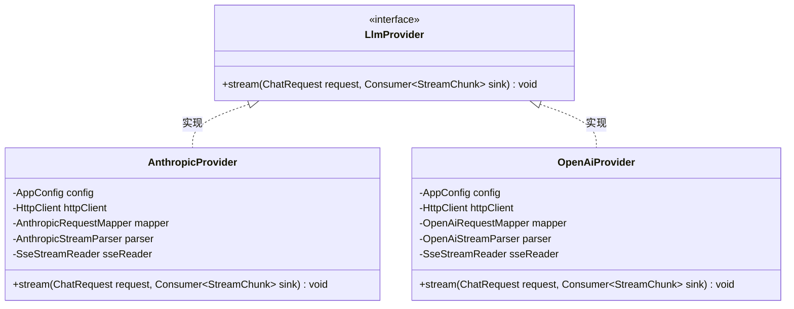
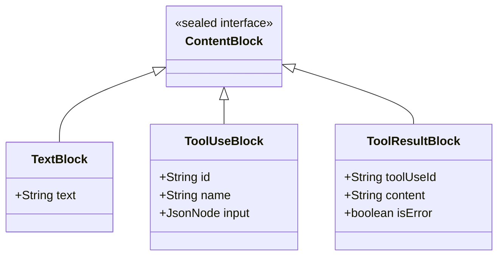
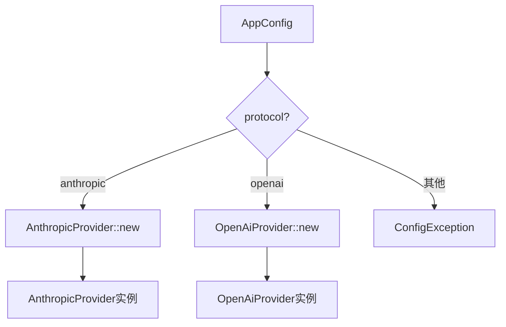
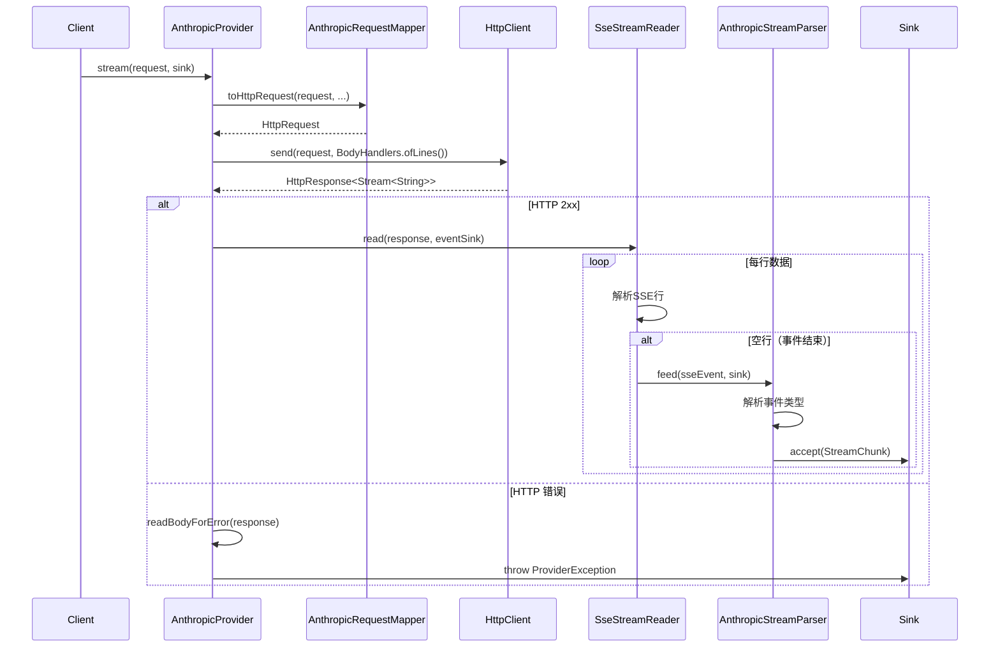

LlmProvider 是 MapleCode 项目中 LLM（大语言模型）服务调用的核心抽象接口。它采用**极简主义设计哲学**，通过单一的流式方法 `stream()` 统一了 Anthropic Claude 和 OpenAI Chat Completions 两种不同的 API 协议，为上层业务逻辑（如 Agent Loop、上下文管理）提供了透明的多模型支持。

## 接口设计哲学

LlmProvider 接口的设计遵循了几个关键原则：

**单一职责**：接口只定义一个方法 `stream(ChatRequest request, Consumer<StreamChunk> sink)`，专注于流式对话补全的核心功能。这种设计避免了接口膨胀，使得实现类可以专注于特定协议的细节。

**流式优先**：所有响应都通过 `Consumer<StreamChunk>` 回调同步推送，而不是返回完整的响应对象。这种设计支持实时流式输出，提升了用户体验，同时也便于处理长时间运行的推理请求。

**错误隔离**：接口明确约定只抛出 `ProviderException`，将传输/协议/HTTP 错误与业务逻辑错误清晰分离。



Sources: [LlmProvider.java](src/main/java/com/maplecode/provider/LlmProvider.java#L1-L12)

## 核心数据模型

LlmProvider 的流式交互基于三个核心数据模型，它们共同构成了一个类型安全、可扩展的数据流管道。

**ChatRequest** 是请求的统一表示，它是一个 Java 16+ 的 record 类型，包含以下字段：

| 字段 | 类型 | 说明 |
|------|------|------|
| `model` | `String` | 模型标识符，如 "claude-sonnet-4-6" 或 "gpt-4o" |
| `systemBlocks` | `List<SystemBlock>` | 系统提示块列表，支持结构化系统提示 |
| `messages` | `List<ChatMessage>` | 对话历史消息列表 |
| `thinking` | `ThinkingConfig` | 扩展思考配置（可选），支持自适应和启用两种模式 |
| `tools` | `List<Tool>` | 可用工具列表（可选），用于函数调用 |

**ChatMessage** 表示一条对话消息，包含角色（USER 或 ASSISTANT）和内容块列表。这种设计允许单条消息包含多种类型的内容（文本、工具调用、工具结果）。

**ContentBlock** 是一个 sealed interface，定义了消息内容的原子单元：



Sources: [ChatRequest.java](src/main/java/com/maplecode/provider/ChatRequest.java#L1-L15), [ChatMessage.java](src/main/java/com/maplecode/provider/ChatMessage.java#L1-L13), [ContentBlock.java](src/main/java/com/maplecode/provider/ContentBlock.java#L1-L26)

## 流式响应事件体系

StreamChunk 是 LlmProvider 响应流的核心抽象，它是一个 sealed interface，确保了所有可能的事件类型在编译时已知。这种设计带来了两个关键优势：

1. **类型安全**：编译器可以穷尽检查 switch 表达式，避免运行时遗漏处理
2. **模式匹配**：支持 Java 17+ 的 pattern matching，简化事件处理逻辑

StreamChunk 定义了以下事件类型：

| 事件类型 | 说明 | 数据字段 |
|----------|------|----------|
| `TextDelta` | 文本内容增量 | `text: String` |
| `ThinkingDelta` | 思考过程增量（仅 Anthropic） | `text: String` |
| `MessageStart` | 消息开始 | 无 |
| `MessageEnd` | 消息结束 | `reason: StopReason`, `usage: TokenUsage` |
| `Error` | 错误事件 | `code: String`, `message: String` |
| `ToolUseStart` | 工具调用开始 | `id: String`, `name: String` |
| `ToolUseDelta` | 工具参数增量 | `id: String`, `partialJson: String` |
| `ToolUseEnd` | 工具调用结束 | `id: String`, `name: String`, `input: JsonNode` |

**StopReason** 枚举定义了消息结束的可能原因：

| 枚举值 | 说明 |
|--------|------|
| `END_TURN` | 正常结束 |
| `MAX_TOKENS` | 达到最大 token 限制 |
| `STOP` | 遇到停止序列 |
| `ERROR` | 发生错误 |
| `TOOL_USE` | 需要调用工具 |
| `MAX_ITERATIONS` | 达到最大迭代次数（v3 新增） |
| `CONSECUTIVE_UNKNOWN` | 连续调用未知工具（v3 新增） |
| `PROVIDER_ERROR` | 提供商错误（v3 新增） |
| `USER_CANCELLED` | 用户取消（v3 新增） |

**TokenUsage** 记录了 token 使用统计，支持 Anthropic 和 OpenAI 两种格式：

```java
public record TokenUsage(
    int inputTokens,
    int outputTokens,
    int cacheCreationTokens,
    int cacheReadTokens
)
```

Sources: [StreamChunk.java](src/main/java/com/maplecode/provider/StreamChunk.java#L1-L50), [TokenUsage.java](src/main/java/com/maplecode/provider/TokenUsage.java#L1-L14)

## 提供商注册与工厂模式

ProviderRegistry 采用了工厂模式来管理不同的 LlmProvider 实现。它维护了一个协议到工厂函数的映射表，根据配置中的 `protocol` 字段动态创建相应的提供商实例。



ProviderRegistry 的核心实现：

```java
private final Map<String, Function<AppConfig, LlmProvider>> factories = Map.of(
    "anthropic", AnthropicProvider::new,
    "openai",    OpenAiProvider::new
);

public LlmProvider create(AppConfig config) {
    // 验证协议不为空
    if (config.protocol() == null) {
        throw new ConfigException("missing required field: protocol");
    }
    // 查找工厂函数
    Function<AppConfig, LlmProvider> factory = factories.get(config.protocol());
    if (factory == null) {
        throw new ConfigException("unknown protocol: " + config.protocol()
            + " (supported: " + String.join(", ", SUPPORTED) + ")");
    }
    // 创建提供商实例
    return factory.apply(config);
}
```

这种设计具有以下优势：
- **开闭原则**：新增提供商只需添加新的映射条目，无需修改现有代码
- **配置驱动**：通过配置文件选择提供商，无需硬编码
- **依赖注入**：工厂函数接收 AppConfig，支持测试时注入模拟配置

Sources: [ProviderRegistry.java](src/main/java/com/maplecode/provider/ProviderRegistry.java#L1-L32)

## 流式处理管道

LlmProvider 的流式处理遵循一个清晰的管道模式，每个提供商实现都包含三个核心组件：

1. **RequestMapper**：将 ChatRequest 转换为特定协议的 HTTP 请求
2. **SseStreamReader**：读取 Server-Sent Events 流
3. **StreamParser**：将 SSE 事件解析为 StreamChunk 并推送到 sink

以 Anthropic 为例，完整的流式处理流程如下：



**SseStreamReader** 的核心职责是解析 SSE 协议，它处理：
- 事件类型解析（`event:` 字段）
- 数据累积（多行 `data:` 字段）
- 注释和心跳忽略（`:` 开头的行）
- 流结束处理

**AnthropicStreamParser** 维护状态机来跟踪：
- 当前内容块类型（THINKING, TEXT, TOOL_USE）
- 工具调用的 JSON 累积
- Token 使用统计
- 错误状态

Sources: [AnthropicProvider.java](src/main/java/com/maplecode/provider/anthropic/AnthropicProvider.java#L1-L60), [AnthropicRequestMapper.java](src/main/java/com/maplecode/provider/anthropic/AnthropicRequestMapper.java#L1-L118), [AnthropicStreamParser.java](src/main/java/com/maplecode/provider/anthropic/AnthropicStreamParser.java#L1-L166), [SseStreamReader.java](src/main/java/com/maplecode/http/SseStreamReader.java#L1-L64)

## 协议适配差异

虽然 LlmProvider 接口统一了两种协议，但 Anthropic 和 OpenAI 在请求和响应格式上存在显著差异。下表总结了关键差异点：

| 特性 | Anthropic | OpenAI | 适配策略 |
|------|-----------|--------|----------|
| **API 端点** | `/v1/messages` | `/chat/completions` | RequestMapper 中硬编码 |
| **认证方式** | `x-api-key` 头 | `Authorization: Bearer` 头 | RequestMapper 中处理 |
| **系统提示** | `system` 数组（支持结构化块） | `system` 消息（拼接字符串） | OpenAiRequestMapper 拼接处理 |
| **扩展思考** | `thinking` 对象 | 不支持（静默丢弃） | OpenAiRequestMapper 忽略 |
| **工具调用** | `tool_use` 内容块 | `tool_calls` 数组 | StreamParser 统一映射 |
| **流式结束** | `message_stop` 事件 | `[DONE]` 标记 | StreamParser 分别处理 |
| **Token 统计** | `message_start` 和 `message_delta` | 最后一个 chunk 的 `usage` | StreamParser 分别提取 |

**工具调用的流式处理差异**：

Anthropic 使用三段式工具调用：
1. `content_block_start` (type=tool_use) → ToolUseStart
2. `content_block_delta` (input_json_delta) → ToolUseDelta
3. `content_block_stop` → ToolUseEnd

OpenAI 使用累积式工具调用：
1. `delta.tool_calls[0].id` → ToolUseStart
2. `delta.tool_calls[0].function.arguments` → ToolUseDelta
3. `finish_reason=tool_calls` 或 `[DONE]` → ToolUseEnd

Sources: [OpenAiRequestMapper.java](src/main/java/com/maplecode/provider/openai/OpenAiRequestMapper.java#L1-L135), [OpenAiStreamParser.java](src/main/java/com/maplecode/provider/openai/OpenAiStreamParser.java#L1-L177)

## 错误处理机制

LlmProvider 采用分层错误处理策略，确保错误信息清晰且可操作：

**第一层：ProviderException**
所有传输、协议、HTTP 错误都包装为 `ProviderException`，这是 LlmProvider 接口唯一允许抛出的异常类型。

```java
// HTTP 请求失败
throw new ProviderException("HTTP request failed: " + e.getMessage(), e);

// HTTP 状态码错误
throw new ProviderException("Anthropic returned HTTP " + resp.statusCode() + ": " + body);
```

**第二层：StreamChunk.Error**
流式过程中的错误通过 `StreamChunk.Error` 事件传递，不会中断整个流：

```java
// 工具输入 JSON 解析错误
sink.accept(new StreamChunk.Error("tool_input_invalid",
    "工具输入不是有效的 JSON: " + e.getMessage()));
```

**第三层：StopReason**
消息结束时通过 `StopReason` 枚举指示结束原因，上层可以根据原因决定后续行为。

这种分层设计确保了：
- 严重错误（网络、认证）立即抛出异常
- 非严重错误（工具输入格式）通过事件流传递
- 结束原因明确，便于上层决策

Sources: [ProviderException.java](src/main/java/com/maplecode/error/ProviderException.java#L1-L11), [AnthropicStreamParser.java](src/main/java/com/maplecode/provider/anthropic/AnthropicStreamParser.java#L140-L150)

## 配置与初始化

LlmProvider 的实例化通过 `AppConfig` 配置对象驱动，关键配置项包括：

| 配置路径 | 类型 | 说明 | 默认值 |
|----------|------|------|--------|
| `protocol` | String | 协议类型：anthropic 或 openai | 必填 |
| `model` | String | 模型标识符 | 必填 |
| `base_url` | String | API 基础 URL | 必填 |
| `api_key` | String | API 密钥（支持 `${ENV_VAR}` 占位符） | 必填 |
| `timeouts.connect_seconds` | int | 连接超时（秒） | 10 |
| `timeouts.read_seconds` | int | 读取超时（秒） | 60 |

**配置示例**：

```yaml
# Anthropic 配置
protocol: anthropic
model: claude-sonnet-4-6
base_url: https://api.anthropic.com
api_key: ${ANTHROPIC_API_KEY}

# OpenAI 配置
protocol: openai
model: gpt-4o
base_url: https://api.openai.com/v1
api_key: ${OPENAI_API_KEY}
```

**初始化流程**：
1. 从配置文件加载 `AppConfig`
2. 创建 `ProviderRegistry` 实例
3. 调用 `registry.create(config)` 获取 `LlmProvider` 实例
4. 将实例注入到 `AgentLoop` 等上层组件

Sources: [AppConfig.java](src/main/java/com/maplecode/config/AppConfig.java#L1-L68), [maplecode.yaml.example](maplecode.yaml.example#L1-L79)

## 测试策略

LlmProvider 的测试采用了分层策略，确保接口行为正确且易于模拟：

**单元测试**：
- `ProviderRegistryTest`：验证协议到提供商的映射关系
- `ThinkingConfigTest`：验证思考配置的验证逻辑
- `TokenUsageTest`：验证 token 使用统计的计算

**集成测试**：
- `SseStreamReaderTest`：验证 SSE 流解析的正确性
- `AnthropicStreamParserTest`：验证 Anthropic 流式事件解析
- `OpenAiStreamParserTest`：验证 OpenAI 流式事件解析

**模拟测试**：
- `FakeLlmProvider`：测试用的假实现，按脚本返回预定义的 StreamChunk 序列

```java
public final class FakeLlmProvider implements LlmProvider {
    private final Deque<List<StreamChunk>> scripts = new ArrayDeque<>();

    public FakeLlmProvider(List<List<StreamChunk>> scripts) {
        this.scripts.addAll(scripts);
    }

    @Override
    public void stream(ChatRequest request, Consumer<StreamChunk> sink) {
        var script = scripts.poll();
        if (script == null) {
            throw new NoSuchElementException("FakeLlmProvider: no more scripts");
        }
        for (StreamChunk chunk : script) {
            sink.accept(chunk);
        }
    }
}
```

这种测试策略确保了：
- 接口契约的正确性
- 协议适配的准确性
- 错误处理的完整性
- 上层组件的可测试性

Sources: [FakeLlmProvider.java](src/test/java/com/maplecode/fake/FakeLlmProvider.java#L1-L38), [ProviderRegistryTest.java](src/test/java/com/maplecode/provider/ProviderRegistryTest.java#L1-L54)

## 扩展点与最佳实践

**新增 LLM 提供商**：
1. 在 `provider` 包下创建新的子包（如 `provider/google`）
2. 实现 `LlmProvider` 接口
3. 创建对应的 `RequestMapper` 和 `StreamParser`
4. 在 `ProviderRegistry.factories` 中添加映射
5. 更新 `SUPPORTED` 列表和配置文档

**最佳实践**：
- **保持接口简洁**：不要向 LlmProvider 接口添加新方法，而是通过 ChatRequest 的扩展字段传递新功能
- **统一错误处理**：所有协议特定错误都包装为 ProviderException
- **流式优先**：即使最终需要完整响应，也应先实现流式处理，然后在上层累积
- **类型安全**：充分利用 sealed interface 和 pattern matching 确保事件处理的完整性

**性能考虑**：
- 使用连接池复用 HttpClient 实例
- 合理设置超时时间，避免长时间阻塞
- 对于长时间运行的推理，考虑实现心跳机制
- 监控 Token 使用，避免意外的高成本调用

## 总结

LlmProvider 接口通过极简设计统一了 Anthropic 和 OpenAI 两种主流 LLM 服务的调用方式。其核心优势在于：

1. **接口简洁**：单一方法，职责清晰
2. **类型安全**：sealed interface 确保事件处理的完整性
3. **协议透明**：上层代码无需关心底层协议差异
4. **可扩展性**：通过工厂模式支持新增提供商
5. **错误清晰**：分层错误处理，便于调试和监控

这种设计使得 MapleCode 能够轻松支持多种 LLM 服务，同时保持代码的简洁性和可维护性。对于开发者而言，理解 LlmProvider 接口是掌握整个系统架构的关键第一步。