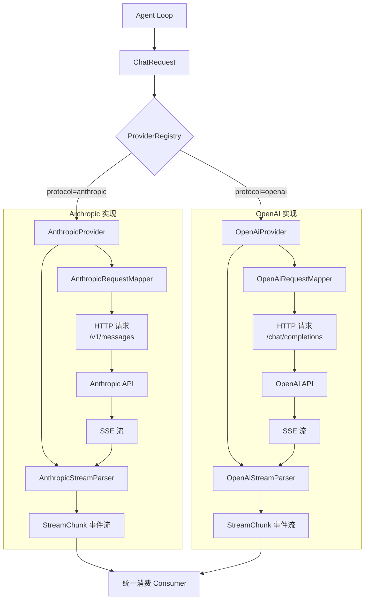

本页深入剖析 MapleCode 中 **LLM Provider 抽象层** 的两个具体实现：`AnthropicProvider` 和 `OpenAiProvider`。它们共同遵循统一的 `LlmProvider` 接口，但在请求构造、SSE 流式解析、工具调用编码等细节上存在显著差异。理解这些实现是掌握系统如何与不同大模型服务交互、以及如何扩展新 Provider 的关键。

Sources: [LlmProvider.java](src/main/java/com/maplecode/provider/LlmProvider.java#L1-L12), [AnthropicProvider.java](src/main/java/com/maplecode/provider/anthropic/AnthropicProvider.java#L1-L60), [OpenAiProvider.java](src/main/java/com/maplecode/provider/openai/OpenAiProvider.java#L1-L60)

## 整体架构：统一接口与双实现

系统通过 **策略模式** 将不同 LLM 服务商的差异封装在 `LlmProvider` 接口之后。`ProviderRegistry` 充当工厂角色，根据配置中的 `protocol` 字段（`"anthropic"` 或 `"openai"`）实例化对应的 Provider。每个 Provider 内部均由三个核心组件协作完成一次完整的流式调用：

1.  **`*Provider`**：主控类，负责 HTTP 客户端生命周期、错误处理和组件协调。
2.  **`*RequestMapper`**：将平台无关的 `ChatRequest` 转换为特定服务商的 HTTP 请求体（JSON）和请求头。
3.  **`*StreamParser`**：解析服务商返回的 SSE 流，将其转换为平台无关的 `StreamChunk` 事件序列。


*图示：两个独立的实现实现相同的流式输出契约，对上层透明。*

Sources: [ProviderRegistry.java](src/main/java/com/maplecode/provider/ProviderRegistry.java#L1-L32), [AnthropicProvider.java](src/main/java/com/maplecode/provider/anthropic/AnthropicProvider.java#L15-L30), [OpenAiProvider.java](src/main/java/com/maplecode/provider/openai/OpenAiProvider.java#L15-L30)

## 核心组件剖析

### 1. LlmProvider 接口

接口极其简洁，仅定义了一个核心方法：

```java
public interface LlmProvider {
    void stream(ChatRequest request, Consumer<StreamChunk> sink);
}
```
*   **入参**：`ChatRequest` 是一个平台无关的请求记录，封装了模型、消息、系统提示、工具列表和思考配置。
*   **出参**：无返回值。所有响应数据通过 `Consumer<StreamChunk>` **回调** 逐步推送。这是一种典型的 **推送式流式处理** 模型，上层代码（如 Agent Loop）通过实现 `Consumer` 来异步处理每个文本块、工具调用或错误。

Sources: [LlmProvider.java](src/main/java/com/maplecode/provider/LlmProvider.java#L5-L11)

### 2. ProviderRegistry：工厂与路由

`ProviderRegistry` 是一个简单的工厂，使用 `Map<String, Function<AppConfig, LlmProvider>>` 存储 `protocol` 到构造函数的映射。其 `create(AppConfig config)` 方法执行以下逻辑：

1.  校验 `config.protocol()` 非空。
2.  从 `factories` 映射中查找对应的工厂函数。
3.  若未找到，抛出 `ConfigException`，提示支持的 `protocol` 列表（当前为 `"anthropic"`, `"openai"`）。
4.  调用工厂函数，传入 `AppConfig` 创建 Provider 实例。

这种设计使得添加新 Provider 只需：1) 实现 `LlmProvider`；2) 在 `factories` 映射中注册一行。

Sources: [ProviderRegistry.java](src/main/java/com/maplecode/provider/ProviderRegistry.java#L10-L25)

### 3. AnthropicProvider 与 OpenAiProvider

两个 Provider 的骨架高度相似，核心流程如下：

```java
public void stream(ChatRequest request, Consumer<StreamChunk> sink) {
    // 1. 构建特定于服务商的 HTTP 请求
    HttpRequest httpReq = mapper.toHttpRequest(request, config.baseUrl(), config.apiKey(), config.timeouts().readDuration());
    
    // 2. 发送 HTTP 请求并获取响应流
    HttpResponse<java.util.stream.Stream<String>> resp;
    try {
        resp = httpClient.send(httpReq, HttpResponse.BodyHandlers.ofLines());
    } catch (Exception e) {
        throw new ProviderException("HTTP request failed: " + e.getMessage(), e);
    }
    
    // 3. 检查 HTTP 状态码（非 2xx 视为错误）
    if (resp.statusCode() / 100 != 2) {
        String body = readBodyForError(resp);
        throw new ProviderException("[ProviderName] returned HTTP " + resp.statusCode() + ": " + body);
    }
    
    // 4. 重置流解析器状态
    parser.reset();
    
    // 5. 使用 SSE 阅读器处理响应流，将每个 SSE 事件喂给解析器
    sseReader.read(resp, ev -> parser.feed(ev, sink));
}
```
**关键差异点**：
*   **错误信息**：`AnthropicProvider` 抛出 “Anthropic returned HTTP...”，`OpenAiProvider` 抛出 “OpenAI returned HTTP...”。
*   **结束信号**：`OpenAiProvider` 在 `sseReader.read` 之后额外调用了 `parser.finish(sink)`。这是因为 OpenAI 的 `[DONE]` 事件可能缺失，`finish` 方法作为兜底，确保即使流被截断，累积的工具调用和 `MessageEnd` 事件也能被发出。

Sources: [AnthropicProvider.java](src/main/java/com/maplecode/provider/anthropic/AnthropicProvider.java#L35-L58), [OpenAiProvider.java](src/main/java/com/maplecode/provider/openai/OpenAiProvider.java#L35-L60)

## 请求映射机制：`*RequestMapper`

`RequestMapper` 负责将平台无关的 `ChatRequest` 转换为服务商特定的 JSON 请求体。这是实现差异最大的部分之一。

### 共同点
*   都使用 `ObjectMapper` (Jackson) 构建 JSON。
*   都将 `stream: true` 写入请求体，启用流式输出。
*   都支持将 `ChatRequest.tools()` 映射为服务商要求的 `tools`/`functions` 数组。

### 差异对比表

| 特性 | Anthropic (`AnthropicRequestMapper`) | OpenAI (`OpenAiRequestMapper`) | 设计考量 |
| :--- | :--- | :--- | :--- |
| **API 端点** | `/v1/messages` | `/chat/completions` | 遵循各自官方 API 路径。 |
| **认证方式** | `x-api-key: <apiKey>` 头 | `Authorization: Bearer <apiKey>` 头 | 标准 OAuth2 Bearer vs. 自定义头。 |
| **系统提示** | `system` 数组，每个 `SystemBlock` 一个对象，支持 `cache_control`。 | 合并为单个 `system` 消息 (`role: "system"`)。 | Anthropic 支持提示词缓存，OpenAI 不支持。 |
| **消息编码** | 消息是 `content` 数组，元素可为 `text`, `tool_use`, `tool_result`。 | 消息是扁平结构，`content` 为字符串，工具调用在独立的 `tool_calls` 数组。 | 反映了两家 API 的数据模型根本差异。 |
| **工具调用参数** | `input` 是一个嵌套的 JSON 对象 (`JsonNode`)。 | `arguments` 是一个 **JSON 字符串**。 | 需要对 `input` 进行 `toString()` 转换。 |
| **思考/推理** | 支持 `thinking` 对象（`type: adaptive/enabled`）。 | **静默丢弃**（注释：“v1 的 Chat Completions 没有这个字段”）。 | 功能支持差异，OpenAI 后续可能通过 `reasoning_effort` 支持。 |
| **`max_tokens`** | 必填字段，硬编码为 `16384`。 | 未设置（使用模型默认值）。 | Anthropic API 要求，OpenAI 可选。 |
| **`stream_options`** | 无。 | 设置 `include_usage: true`，请求在流末尾返回 `usage`。 | 用于获取 OpenAI 的 token 用量统计。 |
| **`anthropic-version`** | 必需，硬编码为 `"2023-06-01"`。 | 无。 | Anthropic API 版本控制头。 |

Sources: [AnthropicRequestMapper.java](src/main/java/com/maplecode/provider/anthropic/AnthropicRequestMapper.java#L23-L33), [OpenAiRequestMapper.java](src/main/java/com/maplecode/provider/openai/OpenAiRequestMapper.java#L23-L33)

## 流式解析机制：`*StreamParser`

`StreamParser` 负责将服务商返回的 SSE 流解析为平台无关的 `StreamChunk` 事件。这是处理异步、增量数据的核心。

### 共同点
*   都实现为**有状态机**，通过 `reset()` 方法在每次调用开始时重置。
*   都使用 `Consumer<StreamChunk> sink` 将解析出的事件推送给上层。
*   都支持三种工具调用事件：`ToolUseStart`、`ToolUseDelta`、`ToolUseEnd`。

### 差异对比表

| 事件类型 | Anthropic SSE 事件 | OpenAI SSE 数据结构 | 解析行为 |
| :--- | :--- | :--- | :--- |
| **开始** | `message_start` | 第一个 `choices[0].delta` chunk | Anthropic 显式发出 `MessageStart`；OpenAI 隐式开始。 |
| **文本增量** | `content_block_delta` (type: `text_delta`) | `choices[0].delta.content` | 都映射为 `StreamChunk.TextDelta`。 |
| **思考增量** | `content_block_delta` (type: `thinking_delta`) | 无 | Anthropic 特有，映射为 `StreamChunk.ThinkingDelta`。 |
| **工具开始** | `content_block_start` (type: `tool_use`) | `choices[0].delta.tool_calls[0]` 首次出现 `id` 和 `name` | 都映射为 `StreamChunk.ToolUseStart`。 |
| **工具参数增量** | `content_block_delta` (type: `input_json_delta`) | `choices[0].delta.tool_calls[n].function.arguments` | 都映射为 `StreamChunk.ToolUseDelta`。 |
| **工具结束** | `content_block_stop` (且 currentBlock 是 TOOL_USE) | `finish_reason == "tool_calls"` 或 `[DONE]` 时 flush | Anthropic 在块结束时立即组装完整 JSON 并发出 `ToolUseEnd`。OpenAI 需要**累积**所有 `arguments` 碎片，在流结束或 `finish_reason` 时统一组装。 |
| **结束** | `message_stop` | `[DONE]` 事件或最后一个 `usage` chunk | Anthropic 显式发出 `MessageEnd`。OpenAI 在 `[DONE]` 或 `finish_reason` 存在时发出。 |
| **错误** | `error` 事件 | `error` 对象 | 都映射为 `StreamChunk.Error`。 |
| **用量统计** | 在 `message_start` 和 `message_delta` 中的 `usage` | 在最后一个 `choices:[]` 的 chunk 中的 `usage` 对象 | 都提取 `inputTokens`, `outputTokens` 等，填充 `TokenUsage`。 |
| **停止原因映射** | `end_turn`, `max_tokens`, `stop_sequence`, `tool_use` | `stop`, `length`, `error`, `tool_calls` | 映射到统一的 `StreamChunk.StopReason` 枚举。 |

**关键设计差异**：
*   **状态管理**：`AnthropicStreamParser` 使用枚举 `BlockType` (`NONE`, `THINKING`, `TEXT`, `TOOL_USE`) 跟踪当前内容块类型。`OpenAiStreamParser` 使用 `Map<Integer, ToolAcc>` 按 `tool_calls` 数组的 `index` 跟踪多个并发的工具调用累积器。
*   **工具调用拼装**：Anthropic 的工具调用是**顺序**的，一个块结束后才开始下一个。OpenAI 的工具调用可能是**并行**的（多个 `tool_calls` 在同一个 `delta` 中），因此需要按 `index` 区分和累积。
*   **结束信号**：OpenAI 的 `[DONE]` 事件是明确的结束信号，而 Anthropic 的 `message_stop` 事件承载了最终的 `usage` 统计。OpenAI 的 `usage` 可能在 `finish_reason` 之后单独到达，因此解析器需要在 `finish_reason` 和 `[DONE]` 之间保持状态。

Sources: [AnthropicStreamParser.java](src/main/java/com/maplecode/provider/anthropic/AnthropicStreamParser.java#L30-L90), [OpenAiStreamParser.java](src/main/java/com/maplecode/provider/openai/OpenAiStreamParser.java#L30-L90)

## 数据模型：平台无关的契约

所有 Provider 实现共享一套平台无关的数据模型，这是抽象层的核心。

*   **`ChatRequest`**：请求记录，包含 `model`, `systemBlocks`, `messages`, `thinking`, `tools`。
*   **`ChatMessage`**：消息记录，包含 `role` (`USER`, `ASSISTANT`) 和 `blocks` (`List<ContentBlock>`)。
*   **`ContentBlock`**：密封接口，三种实现：
    *   `TextBlock`：纯文本。
    *   `ToolUseBlock`：工具调用请求（`id`, `name`, `input`）。
    *   `ToolResultBlock`：工具执行结果（`toolUseId`, `content`, `isError`）。
*   **`StreamChunk`**：密封接口，定义了所有可能的流式事件类型（`TextDelta`, `ThinkingDelta`, `ToolUseStart/Delta/End`, `MessageStart/End`, `Error`）。
*   **`TokenUsage`**：用量统计记录，包含 `inputTokens`, `outputTokens`, `cacheCreationTokens`, `cacheReadTokens`。
*   **`ThinkingConfig`**：思考配置记录，支持 `ADAPTIVE` (带 `effort`) 和 `ENABLED` (带 `budgetTokens`) 两种模式。

**关键设计**：`ContentBlock` 和 `StreamChunk` 都使用了 Java 17 的 `sealed interface`，确保类型层次是封闭的，编译器可以进行穷尽检查。这大大增强了代码的健壮性和可维护性。

Sources: [ChatRequest.java](src/main/java/com/maplecode/provider/ChatRequest.java#L1-L15), [ChatMessage.java](src/main/java/com/maplecode/provider/ChatMessage.java#L1-L13), [ContentBlock.java](src/main/java/com/maplecode/provider/ContentBlock.java#L1-L26), [StreamChunk.java](src/main/java/com/maplecode/provider/StreamChunk.java#L1-L50), [TokenUsage.java](src/main/java/com/maplecode/provider/TokenUsage.java#L1-L14), [ThinkingConfig.java](src/main/java/com/maplecode/provider/ThinkingConfig.java#L1-L35)

## 配置与注册

Provider 的行为由 `AppConfig` 控制，关键配置项包括：

*   `protocol` (`String`): `"anthropic"` 或 `"openai"`，决定使用哪个 Provider。
*   `model` (`String`): 具体的模型名称，如 `"claude-3-5-sonnet-20241022"` 或 `"gpt-4o"`。
*   `baseUrl` (`String`): API 基础 URL，支持自定义端点（如代理）。
*   `apiKey` (`String`): API 密钥。
*   `timeouts` (`Timeouts`): 连接和读取超时配置。
*   `thinking` (`ThinkingConfig`): 思考/推理配置，仅对支持的模型有效。
*   `systemBlocks` (`List<SystemBlock>`): 系统提示词块。

`ProviderRegistry.create(config)` 方法读取 `config.protocol()`，从内部工厂映射中获取对应的构造函数，并传入整个 `AppConfig` 实例。Provider 内部会使用 `config` 中的相关字段。

Sources: [AppConfig.java](src/main/java/com/maplecode/config/AppConfig.java#L1-L68), [ProviderRegistry.java](src/main/java/com/maplecode/provider/ProviderRegistry.java#L10-L25)

## 扩展新 Provider 的指南

基于当前架构，添加一个新的 LLM Provider（例如 Google Gemini）需要以下步骤：

1.  **实现 `LlmProvider` 接口**：创建 `GeminiProvider` 类，实现 `stream` 方法。
2.  **创建请求映射器**：创建 `GeminiRequestMapper`，实现 `toHttpRequest` 方法，将 `ChatRequest` 转换为 Gemini API 的请求格式。
3.  **创建流解析器**：创建 `GeminiStreamParser`，实现 `feed` 方法，解析 Gemini 的 SSE 流并生成 `StreamChunk` 事件。
4.  **注册到工厂**：在 `ProviderRegistry` 的 `factories` 映射中添加一行：`"gemini", GeminiProvider::new`。
5.  **更新 `SUPPORTED` 列表**：在 `ProviderRegistry` 的 `SUPPORTED` 列表中添加 `"gemini"`。
6.  **处理差异**：根据 Gemini API 的特点，可能需要：
    *   在 `ChatRequest` 或 `AppConfig` 中添加新的配置字段。
    *   在 `StreamChunk` 中添加新的事件类型（如果 Gemini 有独特的流式事件）。
    *   在 `ContentBlock` 中添加新的内容块类型（如果 Gemini 有独特的内容结构）。

**最佳实践**：
*   遵循现有的三组件分离模式（Provider, Mapper, Parser）。
*   复用 `SseStreamReader` 处理 SSE 流。
*   尽可能将平台特定逻辑封装在 Mapper 和 Parser 中，保持 Provider 主类简洁。
*   为新的 Mapper 和 Parser 编写充分的单元测试。

Sources: [ProviderRegistry.java](src/main/java/com/maplecode/provider/ProviderRegistry.java#L10-L25), [AnthropicProvider.java](src/main/java/com/maplecode/provider/anthropic/AnthropicProvider.java#L1-L60), [OpenAiProvider.java](src/main/java/com/maplecode/provider/openai/OpenAiProvider.java#L1-L60)

## 总结

Anthropic 和 OpenAI 的实现展示了 MapleCode 如何通过**抽象工厂模式**和**策略模式**优雅地处理多 LLM 服务商的集成。统一的数据模型 (`ChatRequest`, `StreamChunk`) 和清晰的组件边界 (`Provider`, `Mapper`, `Parser`) 使得系统既能充分利用各服务商的特性（如 Anthropic 的思考链、缓存控制），又能保持上层业务逻辑的简洁和可移植性。这种架构为未来的扩展奠定了坚实的基础。