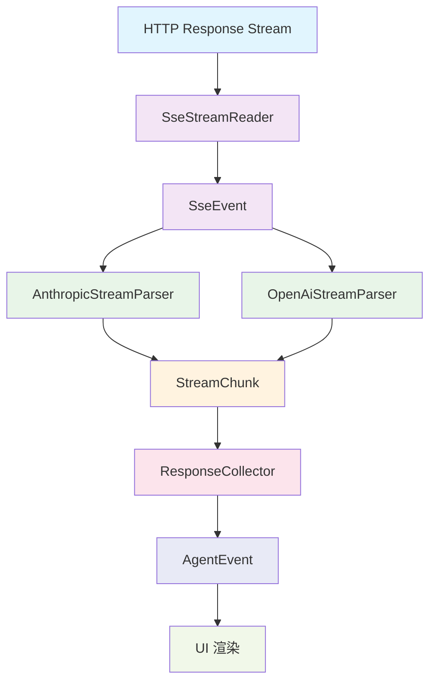

SSE（Server-Sent Events）流式解析机制是 MapleCode 与 LLM 服务提供商进行实时通信的核心基础设施。该机制负责将 HTTP 响应流解析为结构化的流式事件，为后续的协议特定解析和 UI 渲染提供统一的数据基础。

## 核心架构与组件层次

SSE 流式解析采用分层架构设计，从底层 HTTP 流读取到高层协议特定解析，形成清晰的职责分离。



**分层架构说明**：
- **传输层**：SseStreamReader 负责原始 HTTP 流解析
- **协议层**：AnthropicStreamParser / OpenAiStreamParser 处理特定协议格式
- **抽象层**：StreamChunk 统一表示所有流式事件
- **业务层**：ResponseCollector 累积响应并生成 AgentEvent

## SseStreamReader：通用 SSE 解析器

SseStreamReader 是整个流式解析的基础组件，实现了 SSE 规范的完整解析逻辑。它将原始的 HTTP 行流转换为结构化的 SseEvent 对象。

**核心设计原则**：
1. **状态机驱动**：通过 currentEvent、data、hasData 三个状态变量管理解析过程
2. **事件边界识别**：空行表示事件结束，符合 SSE 规范
3. **容错处理**：忽略注释行（以冒号开头）、心跳消息和未知字段

```java
// SSE 规范解析状态机
if (line.isEmpty()) {
    // 空行表示事件边界
    if (hasData) {
        eventSink.accept(new SseEvent(currentEvent, data.toString()));
    }
    // 重置状态
    currentEvent = DEFAULT_EVENT;
    data.setLength(0);
    hasData = false;
}
```

Sources: [SseStreamReader.java](src/main/java/com/maplecode/http/SseStreamReader.java#L16-L62)

**SseEvent 数据结构**：
```java
public record SseEvent(String eventType, String data) {}
```

SseEvent 是一个不可变记录，包含：
- **eventType**：事件类型（如 "message_start"、"content_block_delta"）
- **data**：事件数据（通常是 JSON 字符串）

**关键特性**：
- 支持多行数据合并（多个 data: 行合并为单个事件）
- 默认事件类型为 "message"
- 流结束时自动刷新剩余数据
- 异常处理区分 CancellationException（传播）和 RuntimeException（包装为 ProviderException）

## StreamChunk：统一流式事件抽象

StreamChunk 是一个密封接口（sealed interface），定义了所有可能的流式事件类型。使用 Java 17 的密封特性确保类型安全和编译时穷尽检查。

```mermaid
classDiagram
    class StreamChunk <<sealed interface>>
    class TextDelta {
        +String text
    }
    class ThinkingDelta {
        +String text
    }
    class MessageStart
    class MessageEnd {
        +StopReason reason
        +TokenUsage usage
    }
    class Error {
        +String code
        +String message
    }
    class ToolUseStart {
        +String id
        +String name
    }
    class ToolUseDelta {
        +String id
        +String partialJson
    }
    class ToolUseEnd {
        +String id
        +String name
        +JsonNode input
    }
    
    StreamChunk <|-- TextDelta
    StreamChunk <|-- ThinkingDelta
    StreamChunk <|-- MessageStart
    StreamChunk <|-- MessageEnd
    StreamChunk <|-- Error
    StreamChunk <|-- ToolUseStart
    StreamChunk <|-- ToolUseDelta
    StreamChunk <|-- ToolUseEnd
```

Sources: [StreamChunk.java](src/main/java/com/maplecode/provider/StreamChunk.java#L13-L49)

**工具调用的三段式流式处理**：
1. **ToolUseStart**：工具声明（id + name）
2. **ToolUseDelta**：参数 JSON 碎片（partialJson）
3. **ToolUseEnd**：参数完整，解析后的 JsonNode

这种设计支持流式工具调用，允许在参数完全接收前开始显示工具名称。

**StopReason 枚举**：
```java
enum StopReason {
    END_TURN, MAX_TOKENS, STOP, ERROR, TOOL_USE,
    MAX_ITERATIONS, CONSECUTIVE_UNKNOWN, PROVIDER_ERROR, USER_CANCELLED
}
```

StopReason 枚举了所有可能的停止原因，包括 v3 版本新增的错误类型。

## AnthropicStreamParser：Anthropic 协议解析

AnthropicStreamParser 负责解析 Anthropic 特有的 SSE 事件格式，将其转换为统一的 StreamChunk 事件流。

**状态管理**：
- **currentBlock**：当前内容块类型（NONE、THINKING、TEXT、TOOL_USE）
- **pendingTool***：累积工具调用信息
- **usage***：Token 用量统计

**事件处理流程**：
1. **message_start**：重置解析器状态，提取初始 token 用量
2. **content_block_start**：根据 blockType 设置当前块类型
3. **content_block_delta**：根据 delta 类型生成相应 StreamChunk
4. **content_block_stop**：完成工具调用解析，生成 ToolUseEnd
5. **message_delta**：提取 stop_reason 和 output_tokens
6. **message_stop**：生成 MessageEnd 事件

```java
// 工具调用参数累积与解析
if (currentBlock == BlockType.TOOL_USE && currentToolUseId != null) {
    JsonNode input;
    try {
        input = JSON.readTree(currentToolJson.toString());
    } catch (Exception e) {
        sink.accept(new StreamChunk.Error("tool_input_invalid",
            "工具输入不是有效的 JSON: " + e.getMessage()));
        input = JSON.createObjectNode();
    }
    sink.accept(new StreamChunk.ToolUseEnd(currentToolUseId, currentToolName, input));
}
```

Sources: [AnthropicStreamParser.java](src/main/java/com/maplecode/provider/anthropic/AnthropicStreamParser.java#L41-L164)

**关键特性**：
- 支持 Extended Thinking（思考过程）流式输出
- 处理 Anthropic 特有的缓存 token 用量（cache_creation、cache_read）
- 工具输入 JSON 验证与错误恢复
- 未知事件类型静默忽略

## OpenAiStreamParser：OpenAI 协议解析

OpenAiStreamParser 处理 OpenAI Chat Completions API 的流式响应格式，与 Anthropic 解析器形成对称设计。

**关键差异**：
1. **工具调用累积**：使用 Map<Integer, ToolAcc> 按 index 跟踪多个并行工具调用
2. **结束信号**：处理 "[DONE]" 标记而非 message_stop 事件
3. **Usage 处理**：usage 信息可能在最后一个 chunk 或单独的 usage chunk 中

```java
// OpenAI 工具调用累积
private static class ToolAcc {
    String id;
    String name;
    boolean started;
    StringBuilder args = new StringBuilder();
}
```

**工具调用处理流程**：
1. 首次获得 id + name 时发送 ToolUseStart
2. 后续 arguments 碎片累积到 args 并发送 ToolUseDelta
3. 流结束时（finish_reason 或 [DONE]）调用 flushTools 生成 ToolUseEnd

Sources: [OpenAiStreamParser.java](src/main/java/com/maplecode/provider/openai/OpenAiStreamParser.java#L36-L175)

**容错机制**：
- 流截断时自动 flush 工具调用
- 无效 JSON 输入生成 Error 事件
- 重复 [DONE] 信号静默忽略
- finish_reason 与 usage 分离处理（支持 OpenAI 的异步 usage 响应）

## Provider 集成与数据流

LlmProvider 接口定义了统一的流式输出方法，具体实现通过组合 SseStreamReader 和协议特定解析器完成。

**AnthropicProvider 数据流**：
```java
// 核心流式处理链
parser.reset();
sseReader.read(resp, ev -> parser.feed(ev, sink));
```

**OpenAiProvider 数据流**：
```java
// 包含 finish 方法确保完整性
parser.reset();
sseReader.read(resp, ev -> parser.feed(ev, sink));
parser.finish(sink);  // 兜底 flush
```

Sources: [AnthropicProvider.java](src/main/java/com/maplecode/provider/anthropic/AnthropicProvider.java#L36-L51), [OpenAiProvider.java](src/main/java/com/maplecode/provider/openai/OpenAiProvider.java#L35-L51)

**MCP Transport 集成**：
StreamableHttp 类展示了 SSE 解析器在 MCP 协议中的复用：
```java
// MCP SSE 处理
reader.read(resp, ev -> {
    JsonNode parsed = M.readTree(ev.data());
    Consumer<JsonNode> cb = inbound;
    if (cb != null) cb.accept(parsed);
});
```

Sources: [StreamableHttp.java](src/main/java/com/maplecode/mcp/transport/StreamableHttp.java#L102-L113)

## ResponseCollector：双路事件分发

ResponseCollector 实现了"双路"设计模式：一边将 StreamChunk 转换为 AgentEvent 供 UI 实时显示，一边累积完整状态供 AgentLoop 决策。

**状态累积**：
- **text**：文本内容累积
- **toolUses**：工具调用列表
- **stopReason**：停止原因
- **usage**：Token 用量
- **pendingJson**：工具参数 JSON 碎片

**事件转换**：
```java
switch (chunk) {
    case StreamChunk.TextDelta d -> {
        text.append(d.text());
        sink.accept(new AgentEvent.TextDelta(d.text()));
    }
    case StreamChunk.ToolUseStart d -> {
        pendingId = d.id();
        pendingName = d.name();
        pendingJson.setLength(0);
        sink.accept(new AgentEvent.ToolCallStart(d.id(), d.name(), argSummary(d.name())));
    }
    // ... 其他事件类型
}
```

Sources: [ResponseCollector.java](src/main/java/com/maplecode/agent/ResponseCollector.java#L50-L86)

**智能参数摘要**：
argSummary 方法尝试从部分 JSON 中提取关键信息（如 path、command、pattern），否则截取前 40 字符：
```java
String argSummary(String toolName) {
    String partial = pendingJson.toString();
    if (partial.isEmpty()) return "";
    try {
        JsonNode node = JSON.readTree(partial);
        var path = node.path("path");
        if (!path.isMissingNode()) return path.asText();
        // ... 其他字段
    } catch (Exception ignored) {}
    return partial.length() > 40 ? partial.substring(0, 40) + "..." : partial;
}
```

## 错误处理与恢复机制

SSE 流式解析实现了多层次的错误处理策略，确保系统在异常情况下保持稳定。

**传输层错误**：
- HTTP 状态码检查（非 2xx 抛出 ProviderException）
- 连接超时配置
- 流读取异常包装

**协议层错误**：
- JSON 解析失败处理
- 无效工具输入恢复
- 未知事件类型静默忽略
- 流截断自动恢复

**业务层错误**：
- 用户取消支持（CancellationException）
- Agent 循环异常捕获
- Token 用量缺失处理

**错误传播机制**：
```java
// SseStreamReader 错误处理
try (Stream<String> lines = response.body()) {
    // ... 解析逻辑
} catch (CancellationException e) {
    throw e;  // 用户取消直接传播
} catch (RuntimeException e) {
    throw new ProviderException("SSE stream read failed", e);  // 其他运行时异常包装
}
```

Sources: [SseStreamReader.java](src/main/java/com/maplecode/http/SseStreamReader.java#L57-L62)

## 性能优化策略

SSE 流式解析在设计时考虑了多项性能优化措施：

**内存优化**：
- StringBuilder 复用（data、currentToolJson）
- 及时清空累积缓冲区
- 不可变对象减少状态共享

**处理优化**：
- 流式处理避免完整响应缓存
- 早期事件过滤（ping/unknown 忽略）
- 状态机高效分支

**并发优化**：
- 单线程流式解析（避免锁竞争）
- 工具调用并行执行（在 AgentLoop 层）
- 异步工具结果收集

**资源管理**：
- try-with-resources 确保流关闭
- 连接超时配置
- 取消信号及时响应

## 测试验证策略

SSE 流式解析的测试覆盖了各个层次的边界条件和异常场景。

**单元测试重点**：
1. **SseStreamReader 测试**：
   - 单行/多行数据解析
   - 事件类型识别
   - 注释和心跳忽略
   - 异常传播验证

2. **协议解析器测试**：
   - 完整消息生命周期
   - 思考过程流式输出
   - 工具调用累积与解析
   - 错误事件处理
   - 未知事件忽略

3. **集成测试**：
   - Provider 与解析器协作
   - ResponseCollector 状态累积
   - 端到端流式处理

**测试模式**：
- 使用 Mockito 模拟 HTTP 响应
- 基于字符串的流式输入
- 状态断言和事件序列验证
- 边界条件覆盖（空数据、无效 JSON、流截断）

## 扩展性与维护性

SSE 流式解析机制的设计考虑了良好的扩展性和维护性：

**新增 LLM Provider**：
1. 实现 LlmProvider 接口
2. 创建协议特定解析器（实现 SseEvent → StreamChunk 转换）
3. 注册到 ProviderRegistry

**协议演进**：
- StreamChunk 密封接口确保编译时穷尽检查
- 新增事件类型需要更新所有消费者
- 向后兼容通过默认处理实现

**监控与调试**：
- 详细日志记录（错误、警告、调试信息）
- Token 用量统计
- 流式性能指标
- 错误率监控

## 最佳实践与使用建议

**配置优化**：
```yaml
# 超时配置
timeouts:
  connect: 10s
  read: 120s
```

**错误处理**：
- 实现重试机制（网络不稳定时）
- 监控 ProviderException 频率
- 记录失败请求上下文

**性能调优**：
- 根据网络延迟调整超时
- 监控流式解析延迟
- 优化工具调用批处理策略

**调试技巧**：
- 启用详细日志（DEBUG 级别）
- 记录原始 SSE 事件
- 监控 StreamChunk 生成速率
- 分析 Token 用量分布

SSE 流式解析机制作为 MapleCode 的核心基础设施，通过精心设计的分层架构、完善的错误处理和优秀的扩展性，为实时 AI 对话提供了可靠、高效的通信基础。该机制不仅支持当前的 Anthropic 和 OpenAI 协议，也为未来集成更多 LLM 服务提供商奠定了坚实基础。